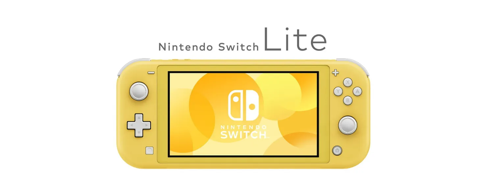
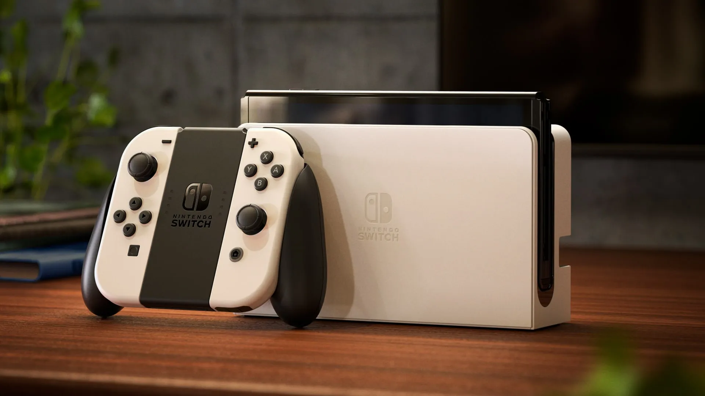

Nintendo logró algo verdaderamente increíble con el lanzamiento de la Switch. Logró disrumpirse a sí misma y a toda la industria del gaming mientras se salvaba de la ruina. ¿Cómo exactamente pudo Nintendo hacerlo y qué viene después en esta historia?

## Un Poco de Historia...

Nintendo es una multinacional japonesa de electrónica de consumo y videojuegos con sede en Kioto, Japón. En su informe anual de 2021, la empresa reportó ingresos de 16 mil millones de dólares (¥1,759 billones) y actualmente emplea a unas seis mil personas en todo el mundo en varias unidades de negocio diferentes.

Nintendo fue fundada en 1889 como una empresa que producía y distribuía hanafuda, un juego de cartas tradicional japonés. Durante la primera mitad de 1900, la empresa intentó diversificarse en varios mercados diferentes con poco o ningún éxito (por ejemplo, arroz instantáneo, love hotels y un servicio de taxis). Durante los años 60 a 80, Nintendo comenzó a invertir en juegos, juguetes electrónicos y entretenimiento de gaming.

Todas estas inversiones culminaron en los años 90 con el lanzamiento del Super Nintendo Entertainment System que vendió alrededor de 50 millones de unidades en todo el mundo y ayudó a la empresa a entrar en el mercado estadounidense. Para entonces, Nintendo había construido varios activos valiosos en hardware, software y propiedad intelectual (incluyendo al fontanero más famoso que jamás haya existido, Mario).

Después del Super Nintendo, la empresa continuó lanzando nuevos juegos y dispositivos de gaming durante los años 90 y 2000, incluyendo el Gameboy, Nintendo 64, GameCube y la Wii en 2006, que contribuyó a hacer de Nintendo una fuerza a tener en cuenta en la industria del gaming con ventas netas que alcanzaron un pico de 18 mil millones de dólares en 2009.

En 2010, la generación anterior de hardware Wii se acercaba al final de su ciclo de vida y coincidentemente las ventas netas anuales de la empresa comenzaron a caer. A finales de 2012, la empresa lanzó su consola de juegos de próxima generación que reemplazaría a la Wii, la Wii U. Sin embargo, la Wii U fue un fracaso comercial y nunca logró establecerse realmente en el mercado de consolas, vendiendo menos de 15 millones de unidades en todo el mundo. La plataforma fue descrita como cara, confusa y nunca logró atraer apoyo ni de clientes hardcore ni casual, llevando a que las ventas de Nintendo eventualmente se desplomaran a solo 4 mil millones de dólares en 2017.

2017 fue también el año en que la empresa logró disrumpirse a sí misma y a toda la industria del gaming con el lanzamiento de la Nintendo Switch que hasta hoy ha vendido más de 89 millones de unidades en todo el mundo, llevó a ventas netas reportadas de 16 mil millones de dólares en 2021, y en última instancia contribuyó a salvar a Nintendo y establecerla una vez más como uno de los mayores players en la industria del gaming.

## La Disrupción de la Switch

La Switch entró al mercado como la primera consola que fue construida desde cero para proporcionar una experiencia híbrida entre gaming móvil y de sala de estar (o al menos la primera que realmente pudo entregar esa experiencia). Esta configuración híbrida permitió a Nintendo crear diferentes modos de juego, desde conectar la Switch a una TV usando un dock, hasta conectar los controles a la unidad principal y llevarla para jugar en movimiento. Adicionalmente, el control remoto de la consola puede usarse como dos dispositivos de control separados, lo que permite a dos jugadores disfrutar de un juego a la vez. Todos estos diferentes modos y combinaciones hicieron de la Switch una consola súper atractiva para familias y jugadores casual, ya que era una opción accesible y flexible en comparación con el resto del hardware disponible.

Un problema que Nintendo tenía que resolver era el hecho de que lanzar una consola de juegos implica una interdependencia entre el hardware real y sus juegos. En otras palabras, una consola solo es tan valiosa como el catálogo de juegos disponibles para ella. Para resolver este problema, Nintendo adoptó una estrategia integrada para lanzar la Switch con un excelente catálogo de juegos enfocándose en el mismo segmento que las características de hardware de la consola estaban apuntando. Nintendo desarrolló varios de los juegos iniciales y aprovechó su valiosa propiedad intelectual de personajes e historias para vender la Switch, es decir, Mario, Zelda, etc.

La Switch es un ejemplo tradicional de una disrupción de nuevo mercado. Nintendo estaba apuntando a jugadores casual (no-consumo para la industria tradicional del gaming) al ofrecer un producto que era inferior comparado con las otras consolas en el mercado usando las métricas de la época (poder gráfico, almacenamiento, etc.) pero superior usando el nuevo conjunto de métricas importantes para el nuevo segmento (diversión, flexible, casual, accesible, etc.). El hecho de que la Switch no fuera un dispositivo súper poderoso llevó a Sony y Microsoft a no ver a Nintendo como un competidor real, ya que sus métricas de rendimiento estaban enfocadas en jugadores high-end y títulos AAA. Esto creó una motivación asimétrica, lo que significa que las empresas incumbentes simplemente cedieron ese mercado a Nintendo porque no era interesante para ellas. En última instancia, Nintendo ganó cuota de mercado con la Switch vendiendo más de 80 millones de unidades en todo el mundo. En este momento, otros players aún no tienen los incentivos para competir en ese mercado e incluso si los tuvieran, no podrían porque ninguno de ellos está compitiendo en las mismas métricas de rendimiento que la Switch ni con la misma organización y estructura de negocio que les permitiría tener éxito.

En julio de 2019, Nintendo decidió lanzar una versión más barata del producto llamada Switch Lite, esto fue un ejemplo claro de la empresa disrumpiéndose a sí misma. Es decir, Nintendo creó una disrupción low-end sobre su propio producto al crear un producto más barato "suficientemente bueno" que apunta a clientes sobre-servidos de la Switch original. Esto creó una posición fuerte en el mercado low-end para videojuegos que es difícil de competir.

Actualmente, Nintendo y la Switch están en una fase de innovación sostenida donde mejoras incrementales de rendimiento en atributos se proporcionan a los clientes más valiosos/exigentes del mercado. La prueba de esto es la próxima versión de la consola, programada para lanzarse en octubre de 2021, la Nintendo Switch OLED, que es básicamente la misma que la Switch actual con una pantalla más grande, mayor batería y más almacenamiento interno. Esto tiene total sentido desde un punto de vista estratégico: después de definir e implementar un producto tan exitoso, Nintendo se está enfocando en una estrategia deliberada para hacer crecer su cuota de mercado y satisfacer las necesidades de sus mejores clientes para vencer a la competencia, no es que realmente haya una en este momento.

## ¿Qué Sigue para Nintendo y la Switch?

Actualmente, la Switch ya es la 7ª consola más vendida de todos los tiempos y el 2º dispositivo de gaming portátil más vendido de todos los tiempos con 89 millones de unidades vendidas en todo el mundo. Considerando solo las consolas aún en el mercado, la Switch ya se ha convertido en el dispositivo número 2 en solo 4 años.

Se espera que, por el momento, Nintendo mantenga su posición en el mercado y siga evolucionando la Switch y su ecosistema con nuevas mejoras incrementales. Empresas como Sony y Microsoft que apuntan al segmento de jugadores high-end no podrán competir con Nintendo debido a las enormes diferencias en las estructuras de sus negocios y organización. Además, las otras organizaciones tampoco tienen ningún incentivo para intentar competir en el mismo mercado que Nintendo porque, desde su punto de vista, es un mercado de menor margen que el que ya tienen, lo que crea una motivación asimétrica para huir hacia arriba, cediendo el low-end sin pelear por él. Finalmente, Nintendo tendrá una enorme ventaja sobre nuevos competidores que ataquen su segmento y tiene toda la motivación para combatir la entrada de nuevos players en su espacio.

Sin embargo, todavía hay puntos que pueden requerir corrección de rumbo para evitar potenciales problemas futuros. El primero es la falta de tracción de otros desarrolladores y editores de juegos con respecto a la Switch. Mirando la lista de los 10 juegos más vendidos para la plataforma, solo 2 no fueron desarrollados por Nintendo o una de sus subsidiarias. La experiencia de desarrollador de la Switch tiene una baja barrera de entrada (cada kit de desarrollo costando alrededor de 450$) pero hay un "impuesto" del 30% sobre cada juego vendido que Nintendo toma de los desarrolladores/editores. La empresa podría potencialmente revisar sus relaciones con desarrolladores y explorar formas de mejorar el modelo de negocio para obtener un catálogo de juegos más grande más rápido. Un par de ejemplos serían ayudar a promover juegos a través de sus canales, o la creación de un programa de juegos indie para ayudar y promover empresas más pequeñas. En última instancia, esto significa que para crecer Nintendo necesita pasar de su estrategia integrada a una especializada donde se enfoca en las partes más importantes del sistema y en entregarlas perfectamente, es decir, la consola, la tienda y su PI. Pero para eso, necesita asegurar el nivel correcto de modularidad para que otros desarrolladores y editores puedan prosperar en ese espacio.

Otro problema con la Switch es la falta de aplicaciones no-gaming disponibles en el dispositivo que lleva a un choque con el principal Job-To-Be-Done para el producto, "Quiero entretenimiento para mí y mi familia". La Switch tiene el potencial de ser el hub central para entretenimiento familiar, sin embargo, solo tres aplicaciones de streaming de video están disponibles en la plataforma: Hulu, Youtube y Funimation. Trabajar con empresas que proporcionan otros tipos de entretenimiento como Netflix y Disney y ayudarlas a lanzar esos servicios en la Switch sería una gran oportunidad para Nintendo de mejorar el conjunto de características del dispositivo y servir mejor a sus usuarios.

En cuanto al futuro, Nintendo está claramente apostando por el streaming de juegos como una forma de subir en el mercado y disrumpir una vez más a los otros players. Esta sería una gran tecnología para impulsar la próxima ronda de disrupción low-end al ofrecer una forma más barata de jugar juegos AAA sin tener que poseer hardware costoso y actualizarlo cada uno o dos años. Sin embargo, crear su propio servicio de streaming puede no ser la mejor estrategia; Nintendo debería considerar hacer su sistema más modular y potencialmente asociarse con otras empresas como Google Stadia para obtener acceso a capacidades de streaming y un catálogo de juegos existente de inmediato.

En última instancia, el factor común en todas las decisiones y acciones de Nintendo ha sido la capacidad de enfocarse en entender y entregar contra el Job-To-Be-Done subyacente para sus clientes. La empresa fue capaz de entender que la experiencia de gaming podía resolver el problema (o "job") de entretenimiento familiar o de fiesta así como los problemas estándar para los que los clientes contratan un dispositivo de gaming (es decir, jugar juegos). Al organizar toda la empresa alrededor de estos jobs, Nintendo creó la capacidad de apuntar al no-consumo y atraer a un segmento completamente diferente de usuarios a sus productos. Además, al implementar una estrategia integrada que entregó nuevo hardware, desarrolló nuevos juegos y aprovechó personajes amigables para familias conocidos en todo el mundo, Nintendo fue capaz de entregar una solución perfecta para el job y disrumpir completamente la industria del gaming. En mi opinión, este enfoque implacable en el cliente y en cómo resolver mejor su problema es la razón por la que Nintendo se ha convertido en una Purpose Brand que se enfoca en proporcionar gran diversión familiar y entretenimiento usando tecnología.

## Referencias

[Henderson, Rik. "What is Nintendo Switch Cloud Streaming, how does it work and what Cloud Version games are there?" Pocket-Lint](https://www.pocket-lint.com/games/news/nintendo/155391-nintendo-switch-cloud-version-streaming-explained-games-list)

[Herold, Charles. "10 Reasons the Wii U Was a Failure." Lifewire.](https://www.lifewire.com/reasons-the-wii-u-is-a-failure-2498588)

[Nintendo. "Nintendo Annual Report FY 2021."](https://www.nintendo.co.jp/ir/pdf/2021/annual2103e.pdf)

[Orland, Kyle. "What the "OLED Model" means for the future of Nintendo Switch." ARS Technica.](https://arstechnica.com/gaming/2021/07/what-the-oled-model-means-for-the-future-of-nintendo-switch/)

[Peckham, Matt. "19 Things Nintendo's President Told Us About Switch and More." Time.](https://time.com/4662446/nintendo-president-switch-interview/)

[Statista. "Nintendo's net sales from fiscal 2008 to 2021."](https://www.statista.com/statistics/216622/net-sales-of-nintendo-since-2008/)

[Wikipedia. "List of best-selling game consoles."](https://en.wikipedia.org/wiki/List_of_best-selling_game_consoles)

[Wikipedia. "List of best-selling Nintendo Switch video games."](https://en.wikipedia.org/wiki/List_of_best-selling_Nintendo_Switch_video_games)
