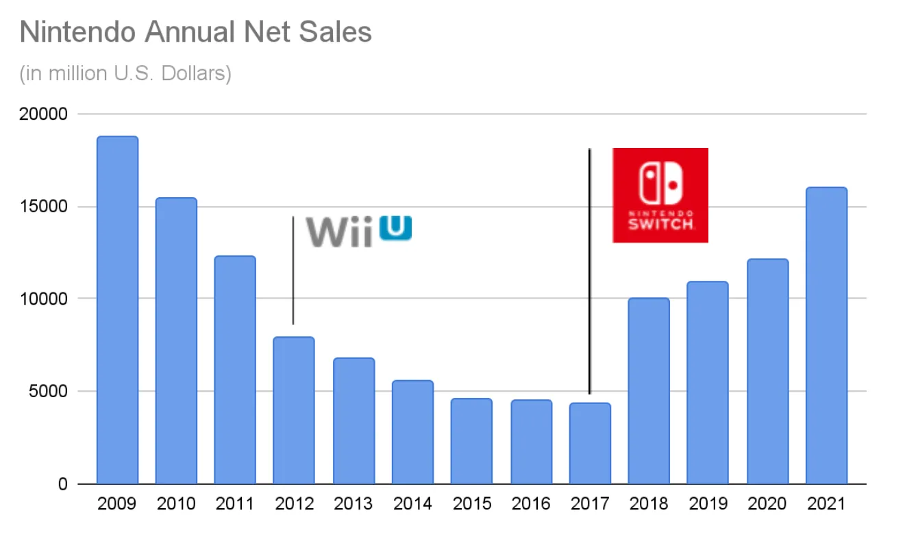
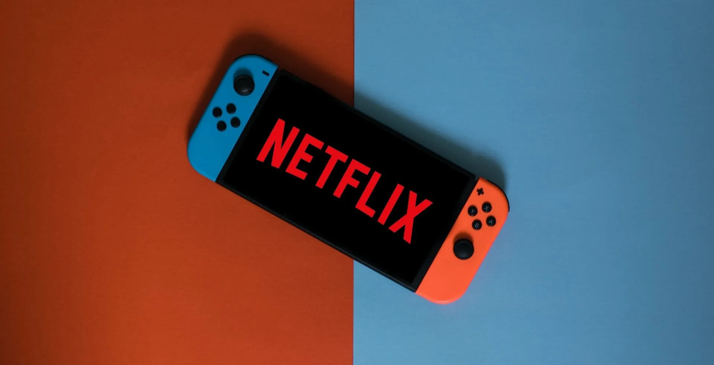

Nintendo a accompli quelque chose de vraiment extraordinaire avec le lancement de la Switch. L'entreprise a réussi à se disrupter elle-même et toute l'industrie du jeu vidéo tout en se sauvant de la ruine. Comment exactement Nintendo a-t-elle pu le faire et quelle est la suite de cette histoire ?

## Un Peu d'Histoire...

Nintendo est une multinationale japonaise d'électronique grand public et de jeux vidéo dont le siège est à Kyoto, au Japon. Dans son rapport annuel 2021, l'entreprise a déclaré un chiffre d'affaires de 16 milliards de dollars (1 759 milliards de yens) et emploie actuellement environ six mille personnes dans le monde à travers plusieurs unités commerciales différentes.

Nintendo a été fondée en 1889 comme une entreprise qui produisait et distribuait des hanafuda, un jeu de cartes traditionnel japonais. Durant la première moitié des années 1900, l'entreprise a essayé de se diversifier dans plusieurs marchés différents avec peu ou pas de succès (par exemple le riz instantané, les love hotels et un service de taxi). Durant les années 60 à 80, Nintendo a commencé à investir dans les jeux, les jouets électroniques et le divertissement vidéoludique.

Tous ces investissements ont culminé dans les années 90 avec le lancement du Super Nintendo Entertainment System qui s'est vendu à environ 50 millions d'unités dans le monde et a aidé l'entreprise à entrer sur le marché américain. À cette époque, Nintendo avait construit plusieurs actifs précieux en matériel, logiciel et propriété intellectuelle (y compris le plombier le plus célèbre ayant jamais existé, Mario).

Après le Super Nintendo, l'entreprise a continué à sortir de nouveaux jeux et appareils de jeu tout au long des années 90 et 2000, notamment le Gameboy, la Nintendo 64, le GameCube et la Wii en 2006, qui a contribué à faire de Nintendo une force avec laquelle il faut compter dans l'industrie du jeu vidéo, avec des ventes nettes qui ont atteint un pic de 18 milliards de dollars en 2009.

En 2010, la génération précédente de matériel Wii approchait de la fin de son cycle de vie et, par coïncidence, les ventes nettes annuelles de l'entreprise ont commencé à baisser. Fin 2012, l'entreprise a lancé sa console de jeu de nouvelle génération destinée à remplacer la Wii, la Wii U. Cependant, la Wii U a été un échec commercial et n'a jamais vraiment réussi à s'implanter sur le marché des consoles, se vendant à moins de 15 millions d'unités dans le monde. La plateforme a été décrite comme chère, confuse et n'a jamais réussi à attirer le soutien des clients hardcore ni des clients casual, conduisant les ventes de Nintendo à s'effondrer à seulement 4 milliards de dollars en 2017.

2017 a également été l'année où l'entreprise a réussi à se disrupter elle-même et toute l'industrie du jeu vidéo avec le lancement de la Nintendo Switch qui, jusqu'à aujourd'hui, s'est vendue à plus de 89 millions d'unités dans le monde, a conduit à des ventes nettes déclarées de 16 milliards de dollars en 2021, et a finalement contribué à sauver Nintendo et à l'établir une fois de plus comme l'un des plus grands acteurs de l'industrie du jeu vidéo.

## La Disruption de la Switch

La Switch est entrée sur le marché comme la première console construite de A à Z pour offrir une expérience hybride entre le jeu mobile et le jeu de salon (ou du moins la première qui a été réellement capable de délivrer cette expérience). Cette configuration hybride a permis à Nintendo de créer différents modes de jeu, de la connexion de la Switch à une TV via un dock, à la connexion des contrôles à l'unité principale pour jouer en déplacement. De plus, la télécommande de la console peut être utilisée comme deux appareils de contrôle séparés, permettant à deux joueurs de profiter d'un jeu en même temps. Tous ces différents modes et combinaisons ont fait de la Switch une console super attractive pour les familles et les joueurs casual car c'était une option abordable et flexible par rapport au reste du matériel disponible.

Un problème que Nintendo devait résoudre était le fait que lancer une console de jeu implique une interdépendance entre le matériel réel et ses jeux. En d'autres termes, une console n'a de valeur qu'en fonction du catalogue de jeux disponibles pour elle. Pour résoudre ce problème, Nintendo a adopté une stratégie intégrée afin de lancer la Switch avec un excellent catalogue de jeux se concentrant sur le même segment que les caractéristiques matérielles de la console ciblaient. Nintendo a développé plusieurs des jeux initiaux et a exploité sa précieuse propriété intellectuelle de personnages et d'histoires pour vendre la Switch, c'est-à-dire Mario, Zelda, etc.

La Switch est un exemple classique de disruption de nouveau marché. Nintendo ciblait les joueurs casual (non-consommation pour l'industrie du jeu vidéo traditionnelle) en offrant un produit qui était inférieur comparé aux autres consoles sur le marché en utilisant les métriques de l'époque (puissance graphique, stockage, etc.) mais supérieur en utilisant le nouvel ensemble de métriques important pour le nouveau segment (fun, flexible, casual, abordable, etc.). Le fait que la Switch n'était pas un appareil super puissant a conduit Sony et Microsoft à ne pas voir Nintendo comme un vrai concurrent puisque leurs métriques de performance étaient axées sur les joueurs haut de gamme et les titres AAA. Cela a créé une motivation asymétrique, ce qui signifie que les entreprises en place ont simplement concédé ce marché à Nintendo car il n'était pas intéressant pour elles. Au final, Nintendo a gagné des parts de marché avec la Switch en vendant plus de 80 millions d'unités dans le monde. Pour le moment, les autres acteurs n'ont toujours pas les incitations pour concurrencer sur ce marché et même s'ils en avaient, ils ne pourraient pas car aucun d'entre eux ne concurrence sur les mêmes métriques de performance que la Switch ni avec la même organisation et structure d'entreprise qui leur permettrait de réussir.

En juillet 2019, Nintendo a décidé de lancer une version moins chère du produit appelée Switch Lite, c'était un exemple clair de l'entreprise se disruptant elle-même. À savoir, Nintendo a créé une disruption bas de gamme sur son propre produit en créant un produit moins cher "suffisamment bon" qui cible les clients sur-servis de la Switch originale. Cela a créé une position forte sur le marché bas de gamme des jeux vidéo qui est difficile à concurrencer.

Actuellement, Nintendo et la Switch sont dans une phase d'innovation de sustentation où des améliorations de performance incrémentales dans les attributs sont fournies aux clients les plus précieux/exigeants du marché. La preuve en est la prochaine version de la console, prévue pour octobre 2021, la Nintendo Switch OLED, qui est fondamentalement la même que la Switch actuelle avec un écran plus grand, une batterie plus grande et plus de stockage interne. Cela a parfaitement sens d'un point de vue stratégique : après avoir défini et déployé un produit aussi réussi, Nintendo se concentre sur une stratégie délibérée pour accroître sa part de marché et répondre aux besoins de ses meilleurs clients afin de battre la concurrence, pas qu'il y en ait vraiment une pour le moment.

## Quelle Suite pour Nintendo et la Switch ?

Actuellement, la Switch est déjà la 7e console la plus vendue de tous les temps et le 2e appareil de jeu portable le plus vendu de tous les temps avec 89 millions d'unités vendues dans le monde. En considérant uniquement les consoles encore sur le marché, la Switch est déjà devenue l'appareil numéro 2 en seulement 4 ans.

On s'attend à ce que, pour le moment, Nintendo conserve sa position sur le marché et continue à faire évoluer la Switch et son écosystème avec de nouvelles améliorations incrémentales. Des entreprises comme Sony et Microsoft qui ciblent le segment des joueurs haut de gamme ne seront pas en mesure de concurrencer Nintendo en raison des énormes différences dans les structures de leurs entreprises et organisations. De plus, les autres organisations n'ont pas non plus d'incitation à essayer de concurrencer sur le même marché que Nintendo car, de leur point de vue, c'est un marché à marge plus faible que celui qu'elles ont déjà, ce qui crée une motivation asymétrique pour fuir vers le haut, concédant le bas de gamme sans se battre pour lui. Enfin, Nintendo aura un énorme avantage sur les nouveaux concurrents qui s'attaquent à son segment et a toutes les motivations pour combattre l'entrée de nouveaux acteurs dans son espace.

Cependant, il y a encore des points qui pourraient nécessiter une correction de trajectoire pour éviter de potentiels problèmes futurs. Le premier est le manque de traction des autres développeurs et éditeurs de jeux concernant la Switch. En regardant la liste des 10 jeux les plus vendus pour la plateforme, seuls 2 n'ont pas été développés par Nintendo ou l'une de ses filiales. L'expérience développeur Switch a une faible barrière à l'entrée (chaque kit de développement coûtant environ 450$) mais il y a une "taxe" de 30% sur chaque jeu vendu prélevée sur les développeurs/éditeurs par Nintendo. L'entreprise pourrait potentiellement examiner ses relations avec les développeurs et explorer des moyens d'améliorer le modèle économique pour obtenir un plus grand catalogue de jeux plus rapidement. Quelques exemples seraient d'aider à promouvoir les jeux via leurs canaux, ou la création d'un programme de jeux indépendants pour aider et promouvoir les plus petites entreprises. Au final, cela signifie que pour croître, Nintendo doit passer de sa stratégie intégrée à une stratégie spécialisée où elle se concentre sur les parties les plus importantes du système et sur leur livraison parfaite, c'est-à-dire la console, le store et sa PI. Mais pour cela, elle doit assurer le bon niveau de modularité pour que d'autres développeurs et éditeurs puissent prospérer dans cet espace.

Un autre problème avec la Switch est le manque d'applications non-gaming disponibles sur l'appareil qui conduit à un conflit avec le principal Job-To-Be-Done pour le produit, "Je veux du divertissement pour moi et ma famille". La Switch a le potentiel d'être le hub central pour le divertissement familial, cependant seules trois applications de streaming vidéo sont disponibles sur la plateforme : Hulu, Youtube et Funimation. Travailler avec des entreprises qui fournissent d'autres types de divertissement comme Netflix et Disney et les aider à lancer ces services sur la Switch serait une excellente opportunité pour Nintendo d'améliorer l'ensemble des fonctionnalités de l'appareil et de mieux servir ses utilisateurs.

Concernant l'avenir, Nintendo mise clairement sur le streaming de jeux comme moyen de monter en gamme sur le marché et de disrupter une fois de plus les autres acteurs. Ce serait une excellente technologie pour conduire la prochaine vague de disruption bas de gamme en offrant un moyen moins cher de jouer à des jeux AAA sans avoir à posséder du matériel coûteux et à le mettre à niveau tous les un ou deux ans. Cependant, créer son propre service de streaming pourrait ne pas être la meilleure stratégie ; Nintendo devrait envisager de rendre son système plus modulaire et potentiellement s'associer avec d'autres entreprises comme Google Stadia pour obtenir immédiatement l'accès aux capacités de streaming et à un catalogue de jeux existant.

Au final, le facteur commun à travers toutes les décisions et actions de Nintendo a été la capacité de se concentrer sur la compréhension et la réponse au Job-To-Be-Done sous-jacent pour ses clients. L'entreprise a pu comprendre que l'expérience de jeu pouvait résoudre le problème (ou "job") du divertissement familial ou festif ainsi que les problèmes standards pour lesquels les clients engagent un appareil de jeu (c'est-à-dire jouer à des jeux). En organisant toute l'entreprise autour de ces jobs, Nintendo a créé la capacité de cibler la non-consommation et d'attirer un segment d'utilisateurs complètement différent vers ses produits. De plus, en mettant en œuvre une stratégie intégrée qui a fourni du nouveau matériel, développé de nouveaux jeux et exploité des personnages familiaux connus dans le monde entier, Nintendo a pu livrer une solution parfaite pour le job et complètement disrupter l'industrie du jeu vidéo. À mon avis, cette focalisation implacable sur le client et comment résoudre au mieux son problème est la raison pour laquelle Nintendo est devenue une Purpose Brand qui se concentre sur la fourniture d'un excellent divertissement familial en utilisant la technologie.

## Références

[Henderson, Rik. "What is Nintendo Switch Cloud Streaming, how does it work and what Cloud Version games are there?" Pocket-Lint](https://www.pocket-lint.com/games/news/nintendo/155391-nintendo-switch-cloud-version-streaming-explained-games-list)

[Herold, Charles. "10 Reasons the Wii U Was a Failure." Lifewire.](https://www.lifewire.com/reasons-the-wii-u-is-a-failure-2498588)

[Nintendo. "Nintendo Annual Report FY 2021."](https://www.nintendo.co.jp/ir/pdf/2021/annual2103e.pdf)

[Orland, Kyle. "What the "OLED Model" means for the future of Nintendo Switch." ARS Technica.](https://arstechnica.com/gaming/2021/07/what-the-oled-model-means-for-the-future-of-nintendo-switch/)

[Peckham, Matt. "19 Things Nintendo's President Told Us About Switch and More." Time.](https://time.com/4662446/nintendo-president-switch-interview/)

[Statista. "Nintendo's net sales from fiscal 2008 to 2021."](https://www.statista.com/statistics/216622/net-sales-of-nintendo-since-2008/)

[Wikipedia. "List of best-selling game consoles."](https://en.wikipedia.org/wiki/List_of_best-selling_game_consoles)

[Wikipedia. "List of best-selling Nintendo Switch video games."](https://en.wikipedia.org/wiki/List_of_best-selling_Nintendo_Switch_video_games)
