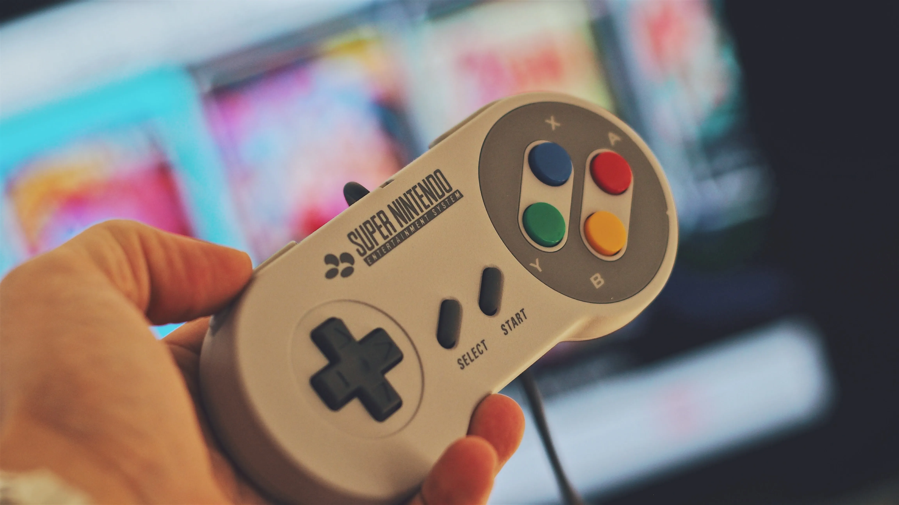
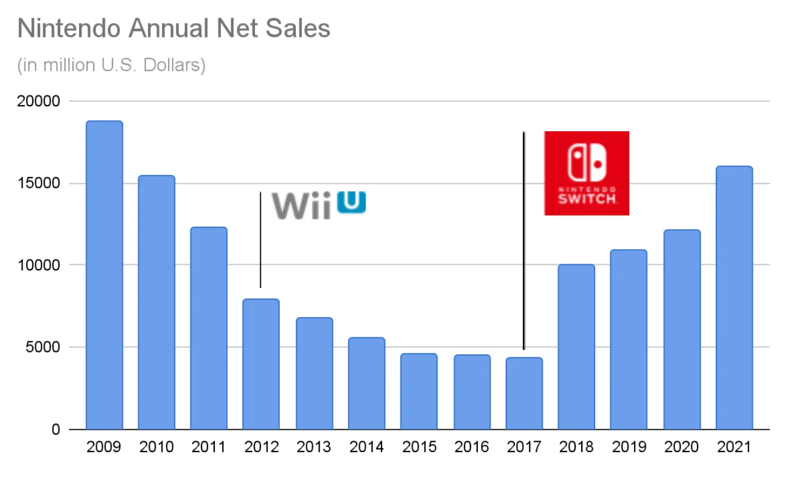
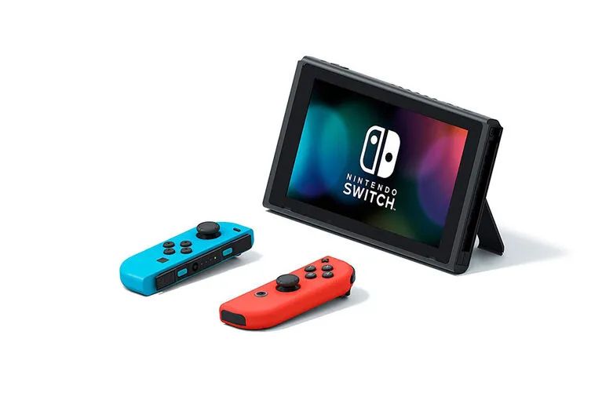
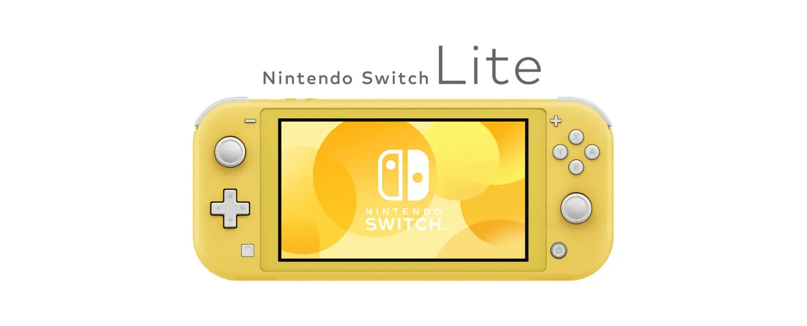
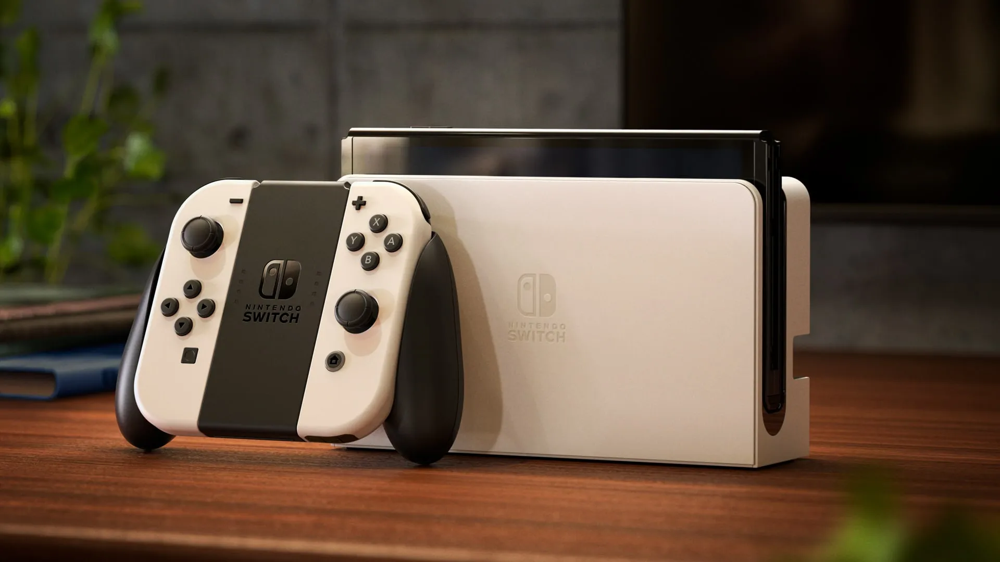
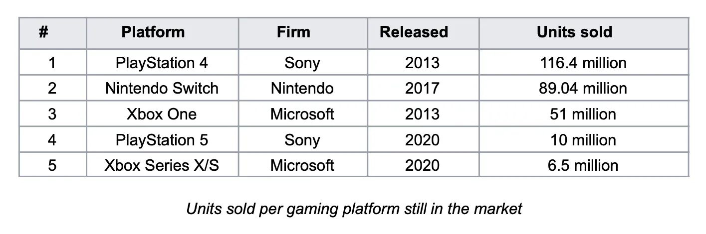
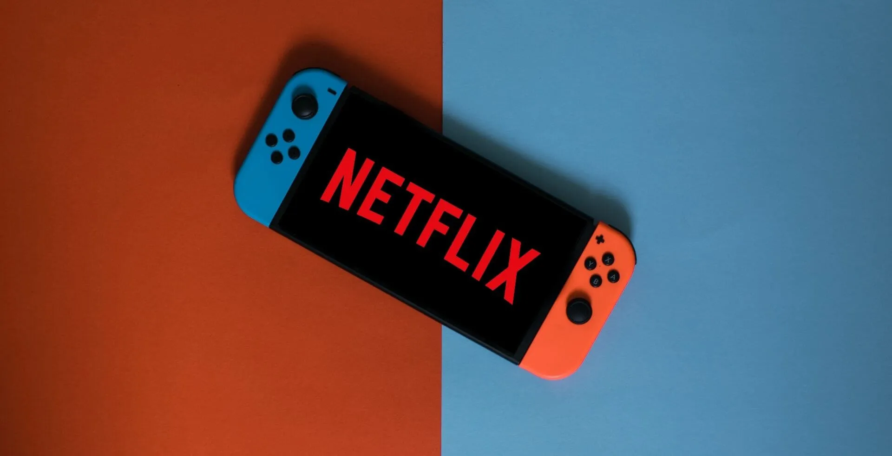
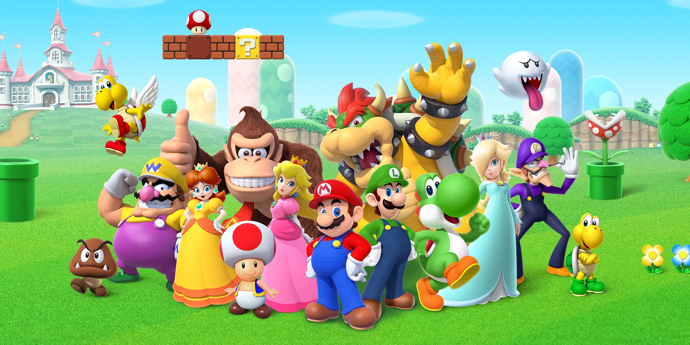

Nintendo ha ottenuto qualcosa di veramente straordinario con il lancio dello Switch. È riuscita a disrumpere se stessa e l'intera industria del gaming salvandosi dalla rovina. Come ha fatto esattamente Nintendo e cosa succederà dopo in questa storia?

## Un Po' di Storia...

Nintendo è una multinazionale giapponese di elettronica di consumo e videogiochi con sede a Kyoto, Giappone. Nel suo rapporto annuale del 2021, l'azienda ha riportato un fatturato di 16 miliardi di dollari (¥1.759 trilioni) e attualmente impiega circa seimila persone in tutto il mondo in diverse unità aziendali.

Nintendo è stata fondata nel 1889 come azienda che produceva e distribuiva hanafuda, un tradizionale gioco di carte giapponese. Durante la prima metà del 1900, l'azienda ha cercato di diversificarsi in diversi mercati con poco o nessun successo (ad es. riso istantaneo, love hotel e un servizio taxi). Durante gli anni '60-'80, Nintendo ha iniziato a investire in giochi, giocattoli elettronici e intrattenimento videoludico.

Tutti questi investimenti sono culminati negli anni '90 con il lancio del Super Nintendo Entertainment System che ha venduto circa 50 milioni di unità in tutto il mondo e ha aiutato l'azienda a entrare nel mercato statunitense. A quel punto Nintendo aveva costruito diversi asset preziosi in hardware, software e proprietà intellettuale (incluso il più famoso idraulico mai esistito, Mario).

Dopo il Super Nintendo, l'azienda ha continuato a rilasciare nuovi giochi e dispositivi di gioco durante gli anni '90 e 2000, inclusi il Gameboy, Nintendo 64, GameCube e il Wii nel 2006, che ha contribuito a rendere Nintendo una forza da non sottovalutare nell'industria del gaming con vendite nette che hanno raggiunto il picco di 18 miliardi di dollari nel 2009.

Nel 2010, la precedente generazione di hardware Wii si stava avvicinando alla fine del suo ciclo di vita e contemporaneamente le vendite nette annuali dell'azienda hanno iniziato a calare. Alla fine del 2012 l'azienda ha lanciato la sua console di gioco di nuova generazione che avrebbe sostituito il Wii, il Wii U. Tuttavia, il Wii U è stato un fallimento commerciale e non ha mai ottenuto un vero punto d'appoggio nel mercato delle console, vendendo meno di 15 milioni di unità in tutto il mondo. La piattaforma è stata descritta come costosa, confusa e non è mai riuscita ad attrarre supporto né dai clienti hardcore né da quelli casual, portando le vendite di Nintendo a crollare fino a soli 4 miliardi di dollari nel 2017.

Il 2017 è stato anche l'anno in cui l'azienda è riuscita a disrumpere se stessa e l'intera industria del gaming con il lancio del Nintendo Switch che fino ad oggi ha venduto più di 89 milioni di unità in tutto il mondo, ha portato a vendite nette riportate di 16 miliardi di dollari nel 2021 e alla fine ha contribuito a salvare Nintendo e a stabilirla ancora una volta come uno dei più grandi player nell'industria del gaming.

## La Disruption dello Switch

Lo Switch è entrato nel mercato come la prima console costruita da zero per fornire un'esperienza ibrida tra gaming mobile e da salotto (o almeno la prima che è stata effettivamente in grado di offrire quell'esperienza). Questa configurazione ibrida ha permesso a Nintendo di creare diverse modalità di gioco: dal collegare lo Switch a una TV usando un dock, al collegare i controlli all'unità principale e portarlo in giro per giocare. Inoltre, il telecomando della console può essere usato come due dispositivi di controllo separati, permettendo a due giocatori di godersi un gioco contemporaneamente. Tutte queste diverse modalità e combinazioni hanno reso lo Switch una console super attraente per famiglie e giocatori casual, essendo un'opzione conveniente e flessibile rispetto al resto dell'hardware disponibile.

Un problema che Nintendo doveva risolvere era il fatto che lanciare una console di gioco comporta un'interdipendenza tra l'hardware effettivo e i suoi giochi. In altre parole, una console ha valore solo quanto il catalogo di giochi disponibili per essa. Per risolvere questo problema, Nintendo ha adottato una strategia integrata per lanciare lo Switch con un grande catalogo di giochi focalizzato sullo stesso segmento che le caratteristiche hardware della console stavano prendendo di mira. Nintendo ha sviluppato diversi giochi iniziali e ha sfruttato la sua preziosa proprietà intellettuale di personaggi e storie per vendere lo Switch, cioè Mario, Zelda, ecc.

Lo Switch è un esempio tradizionale di disruption di nuovo mercato. Nintendo stava prendendo di mira i giocatori casual (non-consumo per l'industria del gaming tradizionale) offrendo un prodotto che era inferiore rispetto alle altre console sul mercato usando le metriche dell'epoca (potenza grafica, storage, ecc.) ma superiore usando il nuovo set di metriche importanti per il nuovo segmento (divertimento, flessibilità, casualità, accessibilità, ecc.). Il fatto che lo Switch non fosse un dispositivo super potente ha portato Sony e Microsoft a non vedere Nintendo come un vero concorrente, dato che le loro metriche di performance erano focalizzate sui giocatori high-end e i titoli AAA. Questo ha creato una motivazione asimmetrica, il che significa che le aziende incumbent hanno semplicemente concesso quel mercato a Nintendo perché non era interessante per loro. Alla fine, Nintendo ha guadagnato quote di mercato con lo Switch vendendo oltre 80 milioni di unità in tutto il mondo. Al momento gli altri player non hanno ancora gli incentivi per competere in quel mercato e anche se li avessero, non potrebbero perché nessuno di loro sta competendo sulle stesse metriche di performance dello Switch né con la stessa organizzazione e struttura aziendale che permetterebbe loro di avere successo.

Nel luglio 2019, Nintendo ha deciso di lanciare una versione più economica del prodotto chiamata Switch Lite, questo è stato un chiaro esempio dell'azienda che disrumpe se stessa. In particolare, Nintendo ha creato una disruption low-end sul proprio prodotto creando un prodotto più economico "abbastanza buono" che prende di mira i clienti sovraserviti dello Switch originale. Questo ha creato una forte posizione nel mercato low-end per i videogiochi che è difficile da contrastare.

Attualmente, Nintendo e lo Switch sono in una fase di innovazione sostenuta dove miglioramenti incrementali delle prestazioni negli attributi vengono forniti ai clienti più preziosi/esigenti del mercato. La prova di questo è la prossima versione della console, prevista per il lancio in ottobre 2021, il Nintendo Switch OLED, che è fondamentalmente lo stesso dell'attuale Switch con uno schermo più grande, una batteria più grande e più storage interno. Questo ha perfettamente senso da un punto di vista strategico: dopo aver definito e distribuito un prodotto così di successo, Nintendo si sta concentrando su una strategia deliberata per far crescere la sua quota di mercato e soddisfare le esigenze dei suoi migliori clienti per battere la concorrenza, non che ce ne sia una al momento.

## Cosa C'è Dopo per Nintendo e lo Switch?

Attualmente, lo Switch è già la 7ª console più venduta di tutti i tempi e il 2° dispositivo di gioco portatile più venduto di tutti i tempi con 89 milioni di unità vendute in tutto il mondo. Considerando solo le console ancora sul mercato, lo Switch è già diventato il dispositivo numero 2 in soli 4 anni.

Si prevede che, per il momento, Nintendo manterrà la sua posizione sul mercato e continuerà a evolvere lo Switch e il suo ecosistema con nuovi miglioramenti incrementali. Aziende come Sony e Microsoft che prendono di mira il segmento dei giocatori high-end non saranno in grado di competere con Nintendo a causa delle enormi differenze nelle strutture delle loro attività e organizzazione. Inoltre, le altre organizzazioni non hanno alcun incentivo a provare a competere nello stesso mercato di Nintendo perché, dal loro punto di vista, è un mercato a margine più basso di quello che già hanno, il che crea una motivazione asimmetrica per fuggire verso l'alto, concedendo il low-end senza combatterci. Infine, Nintendo avrà un enorme vantaggio sui nuovi concorrenti che affrontano il suo segmento e ha ogni motivazione per combattere l'ingresso di nuovi player nel suo spazio.

Tuttavia, ci sono ancora punti che potrebbero richiedere una correzione di rotta per evitare potenziali problemi futuri. Il primo è la mancanza di trazione da parte di altri sviluppatori e publisher di giochi riguardo allo Switch. Guardando la lista dei 10 giochi più venduti per la piattaforma, solo 2 non sono stati sviluppati da Nintendo o da una delle sue sussidiarie. L'esperienza degli sviluppatori Switch ha una bassa barriera all'ingresso (ogni dev kit costa circa 450$) ma c'è una "tassa" del 30% su ogni gioco venduto prelevata dagli sviluppatori/publisher da Nintendo. L'azienda potrebbe potenzialmente esaminare le sue relazioni con gli sviluppatori ed esplorare modi per migliorare il modello di business per ottenere un catalogo di giochi più grande più velocemente. Un paio di esempi sarebbero aiutare a promuovere i giochi attraverso i loro canali, o la creazione di un programma per giochi indie per aiutare e promuovere le aziende più piccole. In definitiva, questo significa che per crescere Nintendo deve passare dalla sua strategia integrata a una specializzata dove si concentra sulle parti più importanti del sistema e nel consegnarle perfettamente, cioè la console, lo store e la sua IP. Ma per questo deve assicurare il giusto livello di modularità in modo che altri sviluppatori e publisher possano prosperare in quello spazio.

Un altro problema con lo Switch è la mancanza di applicazioni non-gaming disponibili sul dispositivo, che porta a uno scontro con il principale Job-To-Be-Done per il prodotto, "Voglio intrattenimento per me e la mia famiglia". Lo Switch ha il potenziale per essere l'hub centrale per l'intrattenimento familiare, tuttavia solo tre applicazioni di video streaming sono disponibili sulla piattaforma: Hulu, Youtube e Funimation. Lavorare con aziende che forniscono altri tipi di intrattenimento come Netflix e Disney e aiutarle a lanciare quei servizi sullo Switch sarebbe una grande opportunità per Nintendo di migliorare il set di funzionalità del dispositivo e servire meglio i suoi utenti.

Per quanto riguarda il futuro, Nintendo sta chiaramente puntando sullo streaming di giochi come modo per salire nel mercato e disrumpere ancora una volta gli altri player. Questa sarebbe una grande tecnologia per guidare il prossimo round di disruption low-end offrendo un modo più economico per giocare ai giochi AAA senza dover possedere hardware costoso e aggiornarlo ogni uno o due anni. Tuttavia, creare il proprio servizio di streaming potrebbe non essere la strategia migliore; Nintendo dovrebbe considerare di rendere il suo sistema più modulare e potenzialmente collaborare con altre aziende come Google Stadia per ottenere accesso alle capacità di streaming e a un catalogo di giochi esistente immediatamente.

In definitiva, il fattore comune in tutte le decisioni e azioni di Nintendo è stata la capacità di concentrarsi sulla comprensione e sulla risposta al Job-To-Be-Done sottostante per i suoi clienti. L'azienda è stata in grado di capire che l'esperienza di gioco poteva risolvere il problema (o "lavoro") dell'intrattenimento familiare o delle feste così come i problemi standard per cui i clienti assumono un dispositivo di gioco (cioè giocare ai giochi). Organizzando l'intera azienda attorno a questi lavori, Nintendo ha creato la capacità di mirare al non-consumo e attrarre un segmento completamente diverso di utenti ai suoi prodotti. Inoltre, implementando una strategia integrata che ha fornito nuovo hardware, sviluppato nuovi giochi e sfruttato personaggi family-friendly conosciuti in tutto il mondo, Nintendo è stata in grado di fornire una soluzione perfetta per il lavoro e disrumpere completamente l'industria del gaming. A mio avviso, questa focalizzazione incessante sul cliente e su come risolvere al meglio il suo problema è il motivo per cui Nintendo è diventata un Purpose Brand che si concentra sul fornire grande divertimento familiare e intrattenimento usando la tecnologia.

## Riferimenti

[Henderson, Rik. "What is Nintendo Switch Cloud Streaming, how does it work and what Cloud Version games are there?" Pocket-Lint](https://www.pocket-lint.com/games/news/nintendo/155391-nintendo-switch-cloud-version-streaming-explained-games-list)

[Herold, Charles. "10 Reasons the Wii U Was a Failure." Lifewire.](https://www.lifewire.com/reasons-the-wii-u-is-a-failure-2498588)

[Nintendo. "Nintendo Annual Report FY 2021."](https://www.nintendo.co.jp/ir/pdf/2021/annual2103e.pdf)

[Orland, Kyle. "What the "OLED Model" means for the future of Nintendo Switch." ARS Technica.](https://arstechnica.com/gaming/2021/07/what-the-oled-model-means-for-the-future-of-nintendo-switch/)

[Peckham, Matt. "19 Things Nintendo's President Told Us About Switch and More." Time.](https://time.com/4662446/nintendo-president-switch-interview/)

[Statista. "Nintendo's net sales from fiscal 2008 to 2021."](https://www.statista.com/statistics/216622/net-sales-of-nintendo-since-2008/)

[Wikipedia. "List of best-selling game consoles."](https://en.wikipedia.org/wiki/List_of_best-selling_game_consoles)

[Wikipedia. "List of best-selling Nintendo Switch video games."](https://en.wikipedia.org/wiki/List_of_best-selling_Nintendo_Switch_video_games)
