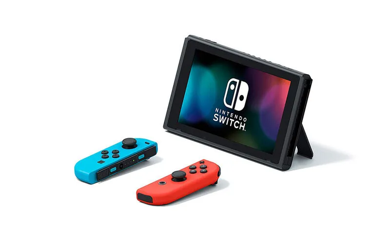
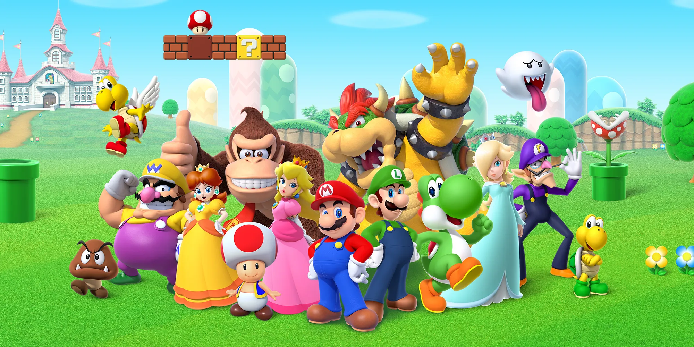

任天堂はSwitchの発売で本当に素晴らしいことを成し遂げました。自社と全ゲーム業界を破壊しながら、滅亡から自らを救ったのです。任天堂はどのようにしてそれを成し遂げたのか、そしてその物語の次は何でしょうか？

## 少しの歴史...

任天堂は京都に本社を置く日本の多国籍消費者向け電子機器・ビデオゲーム企業です。2021年の年次報告書で、同社は160億ドル（1兆7,590億円）の収益を報告し、現在世界中の複数の事業部門で約6,000人を雇用しています。

任天堂は1889年に花札（日本の伝統的なカードゲーム）を製造・販売する会社として設立されました。1900年代前半、同社はほとんど成功することなく、いくつかの異なる市場（インスタント米、ラブホテル、タクシーサービスなど）への多角化を試みました。60年代から80年代にかけて、任天堂はゲーム、電子玩具、ゲームエンターテインメントへの投資を始めました。

これらすべての投資は、90年代にスーパーファミコンの発売で頂点に達し、世界中で約5,000万台を売り上げ、同社が米国市場に参入するのを助けました。その頃までに任天堂はハードウェア、ソフトウェア、知的財産（史上最も有名な配管工マリオを含む）において、いくつかの貴重な資産を構築していました。

スーパーファミコンの後、同社は90年代から2000年代にかけて、ゲームボーイ、ニンテンドー64、ゲームキューブ、そして2006年のWiiを含む新しいゲームやゲーム機をリリースし続け、任天堂はゲーム業界で無視できない存在となり、純売上高は2009年に180億ドルでピークに達しました。

2010年、前世代のハードウェアWiiはライフサイクルの終わりに近づいており、同時に同社の年間純売上高は減少し始めました。2012年末、同社はWiiに代わる次世代ゲーム機、Wii Uを発売しました。しかし、Wii Uは商業的に失敗し、世界で1,500万台未満しか売れず、コンソール市場で本当の足場を築くことができませんでした。このプラットフォームは高価で分かりにくいと評され、ハードコアゲーマーにもカジュアル顧客にもサポートを集めることができず、任天堂の売上は最終的に2017年にはわずか40億ドルにまで落ち込みました。

2017年はまた、任天堂がNintendo Switchの発売で自社と全ゲーム業界を破壊することができた年でもありました。Switchは今日まで世界中で8,900万台以上を売り上げ、2021年には160億ドルの純売上高を報告し、最終的に任天堂を救い、再びゲーム業界の最大のプレイヤーの1つとして確立することに貢献しました。

## Switchの破壊

Switchは、モバイルとリビングルームゲームのハイブリッド体験を提供するためにゼロから構築された最初のコンソールとして市場に参入しました（少なくとも実際にその体験を提供できた最初のもの）。このハイブリッドセットアップにより、任天堂はドックを使用してSwitchをテレビに接続することから、コントローラーをメインユニットに接続して外出先でプレイすることまで、さまざまなゲームモードを作成することができました。さらに、コンソールの実際のリモコンは2つの別々の制御デバイスとして使用でき、2人のプレイヤーが同時にゲームを楽しむことができます。これらすべての異なるモードと組み合わせにより、Switchはファミリーやカジュアルゲーマーにとって非常に魅力的なコンソールとなりました。利用可能な他のハードウェアと比較して手頃で柔軟なオプションだったからです。

任天堂が解決しなければならなかった問題は、ゲーム機を発売するには実際のハードウェアとそのゲームの間に相互依存関係があるという事実でした。言い換えれば、コンソールはそれに利用可能なゲームのカタログと同じくらいの価値しかありません。この問題を解決するために、任天堂は統合戦略を採用し、コンソールのハードウェア機能がターゲットとしていたのと同じセグメントに焦点を当てた素晴らしいゲームカタログでSwitchを発売しました。任天堂は初期のゲームのいくつかを開発し、マリオやゼルダなど、キャラクターやストーリーの貴重な知的財産を活用してSwitchを販売しました。

Switchは新市場型破壊の典型的な例です。任天堂はカジュアルゲーマー（従来のゲーム業界にとっては非消費者）をターゲットにし、当時の指標（グラフィックパワー、ストレージなど）では市場の他のコンソールに比べて劣るが、新しいセグメントにとって重要な新しい指標（楽しさ、柔軟性、カジュアル、手頃な価格など）では優れた製品を提供しました。Switchが超強力なデバイスではなかったという事実により、ソニーとマイクロソフトはパフォーマンス指標がハイエンドゲーマーとAAAタイトルに焦点を当てていたため、任天堂を本当の競合相手として見ませんでした。これは非対称的な動機を生み出し、既存の企業は任天堂に対して興味がないためその市場を譲歩しました。最終的に、任天堂はSwitchで世界中で8,000万台以上を売り上げ、市場シェアを獲得しました。現在、他のプレイヤーはその市場で競争するインセンティブがなく、たとえあったとしても、Switchと同じパフォーマンス指標で競争しておらず、成功を可能にする同じ組織とビジネス構造を持っていないため、できないでしょう。

2019年7月、任天堂はSwitch Liteと呼ばれる安価なバージョンの製品を発売することを決定しました。これは同社が自社を破壊する明確な例でした。すなわち、任天堂はオリジナルのSwitchの過剰サービス顧客をターゲットにした、より安価な「十分に良い」製品を作成することで、自社製品に対するローエンド破壊を作成しました。これはビデオゲームのローエンド市場に強い足場を築き、競争するのが難しくなりました。

現在、任天堂とSwitchは、市場のより価値のある/要求の厳しい顧客に属性の漸進的なパフォーマンス改善が提供される持続的イノベーションの段階にあります。これの証拠は、2021年10月に発売予定のコンソールの次のバージョン、Nintendo Switch OLEDです。これは基本的に現在のSwitchと同じで、より大きな画面、より大きなバッテリー、より多くの内部ストレージを備えています。これは戦略的な観点から完全に理にかなっています。このような成功した製品を定義し展開した後、任天堂は市場シェアを拡大し、競争に勝つために最高の顧客のニーズを満たすための意図的な戦略に焦点を当てています。実際には現時点では競争相手はいませんが。

## 任天堂とSwitchの次は何？

現在、Switchはすでに史上7番目に売れたコンソールであり、世界中で8,900万台を売り上げた史上2番目に売れた携帯ゲーム機です。まだ市場にあるコンソールだけを考えると、Switchはわずか4年で2位のデバイスになりました。

当面の間、任天堂は市場での地位を維持し、新しい漸進的な改善でSwitchとそのエコシステムを進化させ続けると予想されています。ハイエンドゲーマーセグメントをターゲットにしているソニーやマイクロソフトのような企業は、ビジネスと組織の構造に巨大な違いがあるため、任天堂と競争することができないでしょう。さらに、他の組織は任天堂と同じ市場で競争しようとするインセンティブもありません。なぜなら、彼らの観点からは、すでに持っている市場よりも低マージンの市場であり、これは彼らが戦うことなくローエンドを譲歩して上に逃げる非対称的な動機を作り出すからです。最後に、任天堂はそのセグメントに取り組む新しい競合他社に対して巨大な優位性を持ち、その空間への新しいプレイヤーの参入と戦う動機を持っています。

しかし、潜在的な将来の問題を回避するために軌道修正が必要なポイントはまだあります。最初のものは、Switchに関する他のゲーム開発者や出版社からのトラクションの欠如です。プラットフォームのベストセラーゲームトップ10のリストを見ると、任天堂またはその子会社が開発したものでないのはわずか2つです。Switch開発者体験は参入障壁が低く（各開発キットは約450ドル）、開発者/出版社から任天堂が徴収する各ゲーム販売に対する30％の「税金」があります。同社は開発者との関係を潜在的に見直し、より大きなゲームカタログをより速く得るためにビジネスモデルを改善する方法を探ることができるでしょう。いくつかの例としては、チャネルを通じてゲームを宣伝するのを手伝ったり、小さな企業を支援・宣伝するためのインディーゲームプログラムを作成したりすることが挙げられます。最終的に、これは成長するために任天堂はシステムの最も重要な部分に焦点を当て、それを完璧に提供する専門化された戦略に統合戦略から移行する必要があることを意味します。つまり、コンソール、ストア、およびそのIPです。しかしそのためには、他の開発者や出版社がその空間で繁栄できるように、適切なレベルのモジュール性を確保する必要があります。

Switchのもう1つの問題は、デバイスで利用可能な非ゲームアプリケーションの欠如であり、これは製品の主なジョブ・トゥ・ビー・ダン「私と家族のためにエンターテインメントが欲しい」との衝突につながります。Switchはファミリーエンターテインメントの中央ハブになる可能性を秘めていますが、プラットフォームではHulu、YouTube、Funimationの3つのビデオストリーミングアプリケーションしか利用できません。NetflixやDisneyなど他の種類のエンターテインメントを提供する企業と協力し、Switchでそれらのサービスを立ち上げるのを支援することは、任天堂がデバイスの機能セットを改善し、ユーザーにより良いサービスを提供する素晴らしい機会となるでしょう。

将来に関しては、任天堂は明らかに市場で上に移動し、再び他のプレイヤーを破壊する方法としてゲームストリーミングに賭けています。これは、高価なハードウェアを所有し、1〜2年ごとにアップグレードすることなく、AAAゲームをプレイするより安価な方法を提供することで、次のローエンド破壊のラウンドを推進する素晴らしい技術となるでしょう。しかし、独自のストリーミングサービスを作成することは最善の戦略ではないかもしれません。任天堂はシステムをよりモジュール化し、Google Stadiaなどの他の企業と提携してストリーミング機能と既存のゲームカタログにすぐにアクセスできるようにすることを検討すべきです。

最終的に、任天堂のすべての決定と行動に共通する要因は、顧客の根底にあるジョブ・トゥ・ビー・ダンを理解し、それに対応することに焦点を当てる能力でした。同社は、ゲーム体験がファミリーやパーティーエンターテインメントの問題（または「ジョブ」）を解決できるだけでなく、顧客がゲーム機を雇って解決する標準的な問題（つまり、ゲームをプレイする）も解決できることを理解することができました。これらのジョブを中心に会社全体を組織することで、任天堂は非消費をターゲットにし、完全に異なるセグメントのユーザーを製品に引き付ける能力を作り出しました。さらに、新しいハードウェアを提供し、新しいゲームを開発し、世界中で知られている家族向けのキャラクターを活用する統合戦略を実装することで、任天堂はジョブに対する完璧なソリューションを提供し、ゲーム業界を完全に破壊することができました。私の見解では、顧客とその問題を最もよく解決する方法に対するこの執拗な焦点が、任天堂がテクノロジーを使用して素晴らしいファミリーファンとエンターテインメントを提供することに焦点を当てたパーパスブランドになった理由です。

## 参考文献

[Henderson, Rik. "What is Nintendo Switch Cloud Streaming, how does it work and what Cloud Version games are there?" Pocket-Lint](https://www.pocket-lint.com/games/news/nintendo/155391-nintendo-switch-cloud-version-streaming-explained-games-list)

[Herold, Charles. "10 Reasons the Wii U Was a Failure." Lifewire.](https://www.lifewire.com/reasons-the-wii-u-is-a-failure-2498588)

[Nintendo. "Nintendo Annual Report FY 2021."](https://www.nintendo.co.jp/ir/pdf/2021/annual2103e.pdf)

[Orland, Kyle. "What the "OLED Model" means for the future of Nintendo Switch." ARS Technica.](https://arstechnica.com/gaming/2021/07/what-the-oled-model-means-for-the-future-of-nintendo-switch/)

[Peckham, Matt. "19 Things Nintendo's President Told Us About Switch and More." Time.](https://time.com/4662446/nintendo-president-switch-interview/)

[Statista. "Nintendo's net sales from fiscal 2008 to 2021."](https://www.statista.com/statistics/216622/net-sales-of-nintendo-since-2008/)

[Wikipedia. "List of best-selling game consoles."](https://en.wikipedia.org/wiki/List_of_best-selling_game_consoles)

[Wikipedia. "List of best-selling Nintendo Switch video games."](https://en.wikipedia.org/wiki/List_of_best-selling_Nintendo_Switch_video_games)
