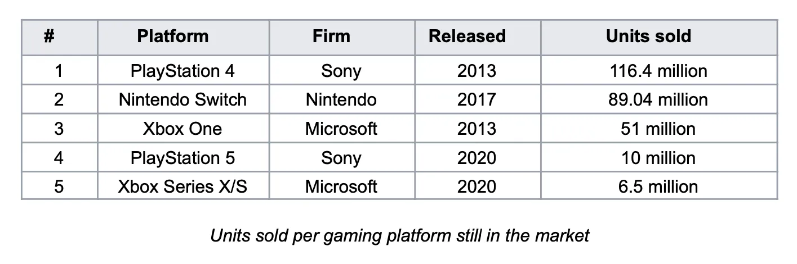

A Nintendo alcançou algo verdadeiramente incrível com o lançamento da Switch. Conseguiu disruptar-se a si própria e a toda a indústria de jogos enquanto se salvava da ruína. Como é que a Nintendo conseguiu fazer isso e o que vem a seguir nesta história?

## Um Pouco de História...

A Nintendo é uma multinacional japonesa de eletrónica de consumo e videojogos com sede em Quioto, Japão. No seu relatório anual de 2021, a empresa reportou receitas de 16 mil milhões de dólares (¥1,759 biliões) e emprega atualmente cerca de seis mil pessoas em todo o mundo em várias unidades de negócio diferentes.

A Nintendo foi fundada em 1889 como uma empresa que produzia e distribuía hanafuda, um jogo de cartas tradicional japonês. Durante a primeira metade de 1900, a empresa tentou diversificar-se em vários mercados diferentes com pouco ou nenhum sucesso (por exemplo, arroz instantâneo, love hotels e um serviço de táxis). Durante os anos 60 a 80, a Nintendo começou a investir em jogos, brinquedos eletrónicos e entretenimento de gaming.

Todos estes investimentos culminaram nos anos 90 com o lançamento do Super Nintendo Entertainment System que vendeu cerca de 50 milhões de unidades em todo o mundo e ajudou a empresa a entrar no mercado americano. Até então, a Nintendo tinha construído vários ativos valiosos em hardware, software e propriedade intelectual (incluindo o canalizador mais famoso de sempre, o Mario).

Depois do Super Nintendo, a empresa continuou a lançar novos jogos e dispositivos de gaming ao longo dos anos 90 e 2000, incluindo o Gameboy, Nintendo 64, GameCube e a Wii em 2006, que contribuiu para fazer da Nintendo uma força a ter em conta na indústria de gaming com vendas líquidas que atingiram o pico de 18 mil milhões de dólares em 2009.

Em 2010, a geração anterior de hardware Wii estava a aproximar-se do fim do seu ciclo de vida e coincidentemente as vendas líquidas anuais da empresa começaram a cair. No final de 2012, a empresa lançou a sua consola de jogos de próxima geração que substituiria a Wii, a Wii U. No entanto, a Wii U foi um fracasso comercial e nunca conseguiu ganhar uma posição real no mercado de consolas, vendendo menos de 15 milhões de unidades em todo o mundo. A plataforma foi descrita como cara, confusa e nunca conseguiu atrair apoio de clientes hardcore nem casual, levando as vendas da Nintendo a eventualmente despenhar para apenas 4 mil milhões de dólares em 2017.

2017 foi também o ano em que a empresa conseguiu disruptar-se a si própria e a toda a indústria de gaming com o lançamento da Nintendo Switch que até hoje vendeu mais de 89 milhões de unidades em todo o mundo, levou a vendas líquidas reportadas de 16 mil milhões de dólares em 2021, e em última análise contribuiu para salvar a Nintendo e estabelecê-la uma vez mais como um dos maiores players na indústria de jogos.

## A Disrupção da Switch

A Switch entrou no mercado como a primeira consola que foi construída de raiz para proporcionar uma experiência híbrida entre gaming móvel e de sala de estar (ou pelo menos a primeira que foi realmente capaz de entregar essa experiência). Esta configuração híbrida permitiu à Nintendo criar diferentes modos de jogo, desde ligar a Switch a uma TV usando um dock, até ligar os controlos à unidade principal e levá-la para jogar em movimento. Adicionalmente, o comando da consola pode ser usado como dois dispositivos de controlo separados, o que permite a dois jogadores desfrutar de um jogo ao mesmo tempo. Todos estes diferentes modos e combinações fizeram da Switch uma consola super atrativa para famílias e jogadores casual, uma vez que era uma opção acessível e flexível quando comparada com o resto do hardware disponível.

Um problema que a Nintendo tinha de resolver era o facto de que lançar uma consola de jogos implica uma interdependência entre o hardware real e os seus jogos. Ou seja, uma consola só é tão valiosa quanto o catálogo de jogos disponíveis para ela. Para resolver este problema, a Nintendo adotou uma estratégia integrada para lançar a Switch com um excelente catálogo de jogos focando-se no mesmo segmento que as características de hardware da consola estavam a visar. A Nintendo desenvolveu vários dos jogos iniciais e alavancou a sua valiosa propriedade intelectual de personagens e histórias para vender a Switch, ou seja, Mario, Zelda, etc.

A Switch é um exemplo tradicional de uma disrupção de novo mercado. A Nintendo estava a visar jogadores casual (não-consumo para a indústria de gaming tradicional) ao oferecer um produto que era inferior quando comparado às outras consolas no mercado usando as métricas da época (poder gráfico, armazenamento, etc.) mas superior usando o novo conjunto de métricas importantes para o novo segmento (diversão, flexível, casual, acessível, etc.). O facto de a Switch não ser um dispositivo super poderoso levou a Sony e a Microsoft a não verem a Nintendo como um concorrente real, uma vez que as suas métricas de desempenho estavam focadas em jogadores high-end e títulos AAA. Isto criou uma motivação assimétrica, o que significa que as empresas incumbentes simplesmente cederam esse mercado à Nintendo porque não era interessante para elas. Em última análise, a Nintendo ganhou quota de mercado com a Switch vendendo mais de 80 milhões de unidades em todo o mundo. Neste momento, outros players ainda não têm os incentivos para competir nesse mercado e mesmo que tivessem, não conseguiriam porque nenhum deles está a competir nas mesmas métricas de desempenho que a Switch nem com a mesma organização e estrutura de negócio que lhes permitiria ter sucesso.

Em julho de 2019, a Nintendo decidiu lançar uma versão mais barata do produto chamada Switch Lite, este foi um exemplo claro da empresa a disruptar-se a si própria. Nomeadamente, a Nintendo criou uma disrupção low-end sobre o seu próprio produto ao criar um produto mais barato "suficientemente bom" que visa clientes sobre-servidos da Switch original. Isto criou uma posição forte no mercado low-end para videojogos que é difícil de competir.

Atualmente, a Nintendo e a Switch estão numa fase de inovação sustentadora onde melhorias incrementais de desempenho em atributos são fornecidas aos clientes mais valiosos/exigentes do mercado. A prova disto é a próxima versão da consola, prevista para lançar em outubro de 2021, a Nintendo Switch OLED, que é basicamente a mesma que a Switch atual com um ecrã maior, maior bateria e mais armazenamento interno. Isto faz total sentido do ponto de vista estratégico: depois de definir e implementar um produto tão bem-sucedido, a Nintendo está a focar-se numa estratégia deliberada para crescer a sua quota de mercado e satisfazer as necessidades dos seus melhores clientes para vencer a concorrência, não que realmente exista uma neste momento.

## O Que Vem a Seguir para a Nintendo e a Switch?

Atualmente, a Switch já é a 7ª consola mais vendida de todos os tempos e o 2º dispositivo de gaming portátil mais vendido de todos os tempos com 89 milhões de unidades vendidas em todo o mundo. Considerando apenas as consolas ainda no mercado, a Switch já se tornou o dispositivo número 2 em apenas 4 anos.

É esperado que, por enquanto, a Nintendo mantenha a sua posição no mercado e continue a evoluir a Switch e o seu ecossistema com novas melhorias incrementais. Empresas como a Sony e a Microsoft que visam o segmento de jogadores high-end não serão capazes de competir com a Nintendo devido às enormes diferenças nas estruturas dos seus negócios e organização. Além disso, as outras organizações também não têm qualquer incentivo para tentar competir no mesmo mercado que a Nintendo porque, do seu ponto de vista, é um mercado de margem mais baixa do que o que já têm, o que cria uma motivação assimétrica para fugirem para cima, cedendo o low-end sem lutar por ele. Finalmente, a Nintendo terá uma enorme vantagem sobre novos concorrentes que ataquem o seu segmento e tem toda a motivação para combater a entrada de novos players no seu espaço.

No entanto, ainda existem pontos que podem requerer correção de rumo para evitar potenciais problemas futuros. O primeiro é a falta de tração de outros desenvolvedores e editores de jogos em relação à Switch. Olhando para a lista dos 10 jogos mais vendidos para a plataforma, apenas 2 não foram desenvolvidos pela Nintendo ou uma das suas subsidiárias. A experiência de desenvolvedor da Switch tem uma barreira de entrada baixa (cada kit de desenvolvimento custando cerca de 450$) mas há um "imposto" de 30% sobre cada jogo vendido retirado dos desenvolvedores/editores pela Nintendo. A empresa poderia potencialmente olhar para as suas relações com desenvolvedores e explorar formas de melhorar o modelo de negócio para obter um catálogo de jogos maior mais rapidamente. Alguns exemplos seriam ajudar a promover jogos através dos seus canais, ou a criação de um programa de jogos indie para ajudar e promover empresas mais pequenas. Em última análise, isto significa que para crescer a Nintendo precisa de passar da sua estratégia integrada para uma especializada onde se foca nas partes mais importantes do sistema e em entregá-las perfeitamente, ou seja, a consola, a loja e a sua PI. Mas para isso, precisa de garantir o nível certo de modularidade para que outros desenvolvedores e editores possam prosperar nesse espaço.

Outra questão com a Switch é a falta de aplicações não-gaming disponíveis no dispositivo que leva a um confronto com o principal Job-To-Be-Done para o produto, "Quero entretenimento para mim e para a minha família". A Switch tem o potencial de ser o hub central para entretenimento familiar, no entanto, apenas três aplicações de streaming de vídeo estão disponíveis na plataforma: Hulu, Youtube e Funimation. Trabalhar com empresas que fornecem outros tipos de entretenimento como Netflix e Disney e ajudá-las a lançar esses serviços na Switch seria uma grande oportunidade para a Nintendo melhorar o conjunto de funcionalidades do dispositivo e servir melhor os seus utilizadores.

Em relação ao futuro, a Nintendo está claramente a apostar no streaming de jogos como forma de subir no mercado e disruptar mais uma vez os outros players. Esta seria uma excelente tecnologia para impulsionar a próxima ronda de disrupção low-end ao oferecer uma forma mais barata de jogar jogos AAA sem ter de possuir hardware caro e atualizá-lo a cada um ou dois anos. No entanto, criar o seu próprio serviço de streaming pode não ser a melhor estratégia; a Nintendo deveria considerar tornar o seu sistema mais modular e potencialmente fazer parceria com outras empresas como o Google Stadia para obter acesso a capacidades de streaming e um catálogo de jogos existente de imediato.

Em última análise, o fator comum em todas as decisões e ações da Nintendo tem sido a capacidade de se focar em compreender e entregar contra o Job-To-Be-Done subjacente para os seus clientes. A empresa foi capaz de compreender que a experiência de gaming podia resolver o problema (ou "job") de entretenimento familiar ou de festa assim como os problemas padrão para os quais os clientes contratam um dispositivo de gaming (ou seja, jogar jogos). Ao organizar toda a empresa em torno destes jobs, a Nintendo criou a capacidade de visar não-consumo e atrair um segmento completamente diferente de utilizadores para os seus produtos. Além disso, ao implementar uma estratégia integrada que entregou novo hardware, desenvolveu novos jogos e alavancou personagens amigáveis para famílias conhecidos em todo o mundo, a Nintendo foi capaz de entregar uma solução perfeita para o job e disruptar completamente a indústria de gaming. Na minha opinião, este foco implacável no cliente e em como melhor resolver o seu problema é a razão pela qual a Nintendo se tornou uma Purpose Brand que se foca em proporcionar grande diversão familiar e entretenimento usando tecnologia.

## Referências

[Henderson, Rik. "What is Nintendo Switch Cloud Streaming, how does it work and what Cloud Version games are there?" Pocket-Lint](https://www.pocket-lint.com/games/news/nintendo/155391-nintendo-switch-cloud-version-streaming-explained-games-list)

[Herold, Charles. "10 Reasons the Wii U Was a Failure." Lifewire.](https://www.lifewire.com/reasons-the-wii-u-is-a-failure-2498588)

[Nintendo. "Nintendo Annual Report FY 2021."](https://www.nintendo.co.jp/ir/pdf/2021/annual2103e.pdf)

[Orland, Kyle. "What the "OLED Model" means for the future of Nintendo Switch." ARS Technica.](https://arstechnica.com/gaming/2021/07/what-the-oled-model-means-for-the-future-of-nintendo-switch/)

[Peckham, Matt. "19 Things Nintendo's President Told Us About Switch and More." Time.](https://time.com/4662446/nintendo-president-switch-interview/)

[Statista. "Nintendo's net sales from fiscal 2008 to 2021."](https://www.statista.com/statistics/216622/net-sales-of-nintendo-since-2008/)

[Wikipedia. "List of best-selling game consoles."](https://en.wikipedia.org/wiki/List_of_best-selling_game_consoles)

[Wikipedia. "List of best-selling Nintendo Switch video games."](https://en.wikipedia.org/wiki/List_of_best-selling_Nintendo_Switch_video_games)
