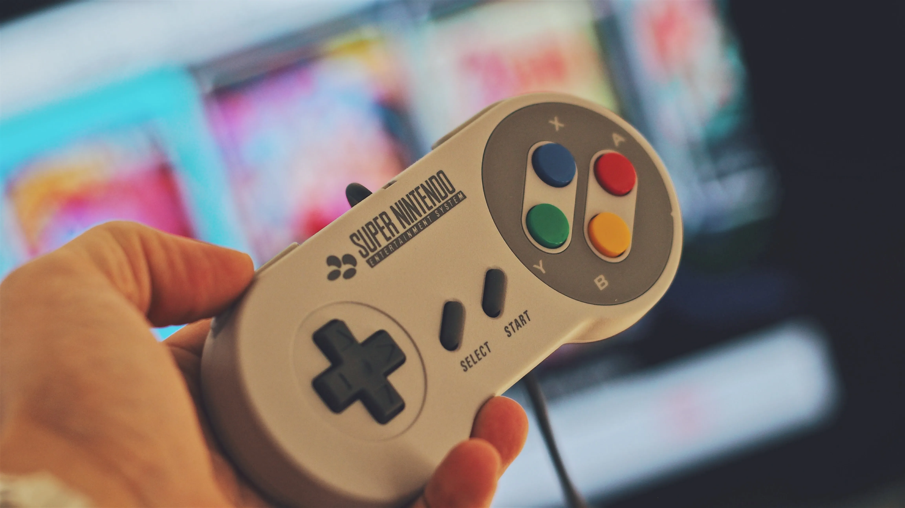

任天堂通过推出Switch实现了真正了不起的成就。它成功地颠覆了自己和整个游戏行业，同时将自己从灭亡中拯救出来。任天堂究竟是如何做到的，这个故事的下一步是什么？

## 一点历史...

任天堂是一家总部位于日本京都的跨国消费电子和视频游戏公司。在2021年年度报告中，该公司报告收入为160亿美元（1.759万亿日元），目前在全球多个不同业务部门雇用约6000人。

任天堂成立于1889年，是一家生产和销售花札（日本传统纸牌游戏）的公司。在20世纪上半叶，该公司尝试进入几个不同的市场，但几乎没有成功（例如即食米饭、情人旅馆和出租车服务）。在60年代到80年代期间，任天堂开始投资游戏、电子玩具和游戏娱乐。

所有这些投资在90年代随着超级任天堂娱乐系统的推出达到顶峰，该系统在全球销售了约5000万台，并帮助公司进入美国市场。到那时，任天堂已经在硬件、软件和知识产权方面建立了几项宝贵的资产（包括有史以来最著名的水管工马里奥）。

在超级任天堂之后，该公司在90年代到2000年代继续发布新游戏和游戏设备，包括Game Boy、任天堂64、GameCube和2006年的Wii，这帮助任天堂成为游戏行业中不可忽视的力量，净销售额在2009年达到180亿美元的峰值。

2010年，前一代硬件Wii接近其生命周期的尾声，同时该公司的年度净销售额开始下降。2012年底，该公司推出了将取代Wii的下一代游戏主机Wii U。然而，Wii U在商业上是失败的，从未在主机市场真正站稳脚跟，全球销量不到1500万台。该平台被描述为昂贵、令人困惑，从未能够吸引硬核玩家或休闲客户的支持，导致任天堂的销售额最终在2017年暴跌至仅40亿美元。

2017年也是该公司能够通过推出Nintendo Switch颠覆自己和整个游戏行业的一年，Switch至今在全球销售超过8900万台，2021年报告净销售额达160亿美元，最终帮助拯救任天堂并再次将其确立为游戏行业最大的参与者之一。

## Switch的颠覆

Switch作为第一款从头开始构建以提供移动和客厅游戏混合体验的主机进入市场（或者至少是第一款真正能够提供这种体验的主机）。这种混合设置使任天堂能够创建不同的游戏模式：从使用底座将Switch连接到电视，到将控制器连接到主机并随身携带游戏。此外，主机的实际遥控器可以用作两个独立的控制设备，允许两名玩家同时享受游戏。所有这些不同的模式和组合使Switch成为家庭和休闲玩家非常有吸引力的主机，因为与其他可用硬件相比，它是一个价格实惠且灵活的选择。

任天堂必须解决的一个问题是，推出游戏主机涉及实际硬件与其游戏之间的相互依赖关系。换句话说，主机的价值取决于其可用游戏目录的丰富程度。为了解决这个问题，任天堂采用了集成战略，以优秀的游戏目录推出Switch，专注于主机硬件特性所针对的同一细分市场。任天堂开发了几款初始游戏，并利用其宝贵的角色和故事知识产权来销售Switch，即马里奥、塞尔达等。

Switch是新市场颠覆的典型例子。任天堂针对休闲玩家（传统游戏行业的非消费者），提供的产品在当时的指标（图形能力、存储等）方面与市场上其他主机相比较差，但在对新细分市场重要的新指标（乐趣、灵活性、休闲、价格实惠等）方面更优越。Switch不是超级强大的设备这一事实导致索尼和微软不将任天堂视为真正的竞争对手，因为他们的性能指标专注于高端玩家和AAA级游戏。这创造了不对称的动机，意味着现有公司简单地将该市场让给任天堂，因为对他们来说不感兴趣。最终，任天堂通过Switch在全球销售超过8000万台获得了市场份额。目前，其他参与者仍然没有在该市场竞争的动力，即使有，他们也无法做到，因为他们都没有在与Switch相同的性能指标上竞争，也没有能够让他们成功的相同组织和业务结构。

2019年7月，任天堂决定推出名为Switch Lite的更便宜版本产品，这是该公司颠覆自己的明显例子。即任天堂通过创建更便宜的"足够好"的产品，针对原版Switch的过度服务客户，在自己的产品上创造了低端颠覆。这在视频游戏的低端市场创造了强大的立足点，很难与之竞争。

目前，任天堂和Switch处于持续创新阶段，向市场上更有价值/更苛刻的客户提供属性的渐进性能改进。这一点的证明是主机的下一个版本，计划于2021年10月推出的Nintendo Switch OLED，它基本上与当前Switch相同，但有更大的屏幕、更大的电池和更多的内部存储。从战略角度来看，这完全合理：在定义和部署如此成功的产品之后，任天堂专注于深思熟虑的战略，以增加其市场份额并满足其最佳客户的需求，以击败竞争对手——尽管目前实际上没有竞争对手。

## 任天堂和Switch的下一步是什么？

目前，Switch已经是有史以来第七畅销的主机，也是有史以来第二畅销的便携式游戏设备，全球销量达8900万台。仅考虑仍在市场上的主机，Switch在短短4年内已成为第二名的设备。

预计目前任天堂将保持其市场地位，并继续以新的渐进改进发展Switch及其生态系统。像索尼和微软这样针对高端玩家细分市场的公司将无法与任天堂竞争，因为他们的业务和组织结构存在巨大差异。此外，其他组织也没有任何动力尝试在与任天堂相同的市场竞争，因为从他们的角度来看，这是一个比他们已有市场利润率更低的市场，这为他们创造了向上逃离的不对称动机，在没有竞争的情况下让出低端市场。最后，任天堂将对进入其细分市场的新竞争对手拥有巨大优势，并有充分的动力与新参与者进入其空间作斗争。

然而，仍有一些点可能需要纠正以避免潜在的未来问题。第一个是其他游戏开发商和发行商对Switch缺乏吸引力。查看该平台前10款最畅销游戏的列表，只有2款不是由任天堂或其子公司开发的。Switch开发者体验的进入门槛很低（每个开发套件成本约450美元），但任天堂对每款销售的游戏向开发商/发行商收取30%的"税"。该公司可能会审视其与开发商的关系，并探索改善商业模式的方法，以更快地获得更大的游戏目录。一些例子包括帮助通过他们的渠道推广游戏，或创建一个独立游戏计划来帮助和推广较小的公司。最终，这意味着为了增长，任天堂需要从其集成战略转向专业化战略，专注于系统最重要的部分并完美交付，即主机、商店和其知识产权。但为此，它需要确保适当的模块化水平，以便其他开发商和发行商能够在该空间蓬勃发展。

Switch的另一个问题是设备上缺乏非游戏应用程序，这与产品的主要待完成工作"我想要为我和我的家人提供娱乐"产生冲突。Switch有潜力成为家庭娱乐的中央枢纽，然而平台上只有三个视频流应用程序可用：Hulu、YouTube和Funimation。与Netflix和Disney等提供其他类型娱乐的公司合作，并帮助他们在Switch上推出这些服务，将是任天堂改善设备功能集并更好地服务其用户的绝佳机会。

关于未来，任天堂显然押注于游戏流媒体作为在市场上向上移动并再次颠覆其他参与者的方式。这将是推动下一轮低端颠覆的绝佳技术，通过提供更便宜的方式来玩AAA游戏，而无需拥有昂贵的硬件并每一两年升级一次。然而，创建自己的流媒体服务可能不是最佳策略；任天堂应该考虑使其系统更加模块化，并可能与Google Stadia等其他公司合作，以立即获得流媒体功能和现有游戏目录的访问权限。

最终，任天堂所有决策和行动的共同因素是专注于理解和满足客户潜在待完成工作的能力。该公司能够理解游戏体验可以解决家庭或派对娱乐的问题（或"工作"），以及客户雇用游戏设备解决的标准问题（即玩游戏）。通过围绕这些工作组织整个公司，任天堂创造了针对非消费并吸引完全不同用户群体到其产品的能力。此外，通过实施提供新硬件、开发新游戏并利用全球知名的家庭友好角色的集成战略，任天堂能够为该工作提供完美的解决方案并完全颠覆游戏行业。在我看来，对客户以及如何最好地解决其问题的这种不懈关注是任天堂成为专注于使用技术提供出色家庭乐趣和娱乐的目的品牌的原因。

## 参考文献

[Henderson, Rik. "What is Nintendo Switch Cloud Streaming, how does it work and what Cloud Version games are there?" Pocket-Lint](https://www.pocket-lint.com/games/news/nintendo/155391-nintendo-switch-cloud-version-streaming-explained-games-list)

[Herold, Charles. "10 Reasons the Wii U Was a Failure." Lifewire.](https://www.lifewire.com/reasons-the-wii-u-is-a-failure-2498588)

[Nintendo. "Nintendo Annual Report FY 2021."](https://www.nintendo.co.jp/ir/pdf/2021/annual2103e.pdf)

[Orland, Kyle. "What the "OLED Model" means for the future of Nintendo Switch." ARS Technica.](https://arstechnica.com/gaming/2021/07/what-the-oled-model-means-for-the-future-of-nintendo-switch/)

[Peckham, Matt. "19 Things Nintendo's President Told Us About Switch and More." Time.](https://time.com/4662446/nintendo-president-switch-interview/)

[Statista. "Nintendo's net sales from fiscal 2008 to 2021."](https://www.statista.com/statistics/216622/net-sales-of-nintendo-since-2008/)

[Wikipedia. "List of best-selling game consoles."](https://en.wikipedia.org/wiki/List_of_best-selling_game_consoles)

[Wikipedia. "List of best-selling Nintendo Switch video games."](https://en.wikipedia.org/wiki/List_of_best-selling_Nintendo_Switch_video_games)
