## TL;DR

Derzeit gibt es mehrere Lösungen, um Ihre persönliche Website zu erstellen und zu hosten. Ich wollte mich selbst herausfordern und sehen, ob ich es mit denselben Funktionen wie einige der kostenpflichtigen Lösungen schaffen kann – und zwar kostenlos. Hier sind die Ergebnisse.

## Warum sollte ein PM seine eigene Homepage von Grund auf bauen…

Vor ein paar Monaten habe ich beschlossen, dass ich mehr schreiben möchte, um a) meine Schreibfähigkeiten zu trainieren und b) Feedback zu einigen meiner Ideen zu bekommen. Mit diesem Ziel vor Augen begann ich, Tools/Plattformen zu recherchieren, die mir helfen würden zu veröffentlichen, ohne zu viel Reibung für mich oder die Leser zu erzeugen, z.B. ohne dass sie bezahlen müssen. Letztendlich entschied ich mich dafür, meine eigene Website zu erstellen.

Ich hatte ein paar Gründe, dies auszuprobieren:

- Mich selbst herauszufordern, um zu sehen, ob ich als ehemaliger Software-Engineering-Student noch etwas zusammenbasteln kann, das funktioniert, und mich gut dabei zu fühlen, nicht alles vergessen zu haben, was ich jemals über Programmierung gelernt habe,

- Eine flexible kostenlose Lösung zu finden, die es mir ermöglicht, meine Website zu starten, ohne sofort Geld zu investieren, also Betriebskosten mit Plattformen und Diensten zu vermeiden, die mich in Zukunft binden würden,

- Meine Inhalte an einem Ort zu hosten, der keine Bezahlung für das Lesen erfordert,

- Mit <a target="_blank" href="https://docs.docker.com/desktop/dev-environments/">Dockers Entwicklerumgebungen</a> und <a target="_blank" href="https://github.com/microsoft/vscode-dev-containers">Microsofts Entwicklercontainern</a> herumzuspielen, um mich mit beiden Lösungen vertraut zu machen.

## Fangen wir an…

Nach einiger Recherche entschied ich mich für ein Website-Generator-Framework und einen kostenlosen Hosting-Service. Für das Website-Framework wählte ich <a target="_blank" href="https://gohugo.io">Hugo</a> mit <a target="_blank" href="https://github.com/jpanther/congoand">Congo</a> als Theme, und für den Hosting-Service <a target="_blank" href="https://firebase.google.com">Firebase</a>. Und aus offensichtlichen Gründen entschied ich mich, meine Entwicklungsumgebung mit <a target="_blank" href="https://www.docker.com">Docker</a> einzurichten, um mich für dieses Experiment in die Lage des Benutzers zu versetzen.

Ich habe keine tiefgreifende Analyse durchgeführt, welches Framework für mein Problem am besten geeignet ist, da ich schnell ein MVP herausbringen wollte. Also ging ich ein paar Optionen durch und wählte die erste, die mir gefiel. Es gibt mehrere andere Optionen mit unterschiedlichen Funktionen und Ansätzen. Wenn Sie andere Optionen erkunden möchten, können Sie folgende in Betracht ziehen: <a target="_blank" href="https://docusaurus.io/">Docusaurus</a>, <a target="_blank" href="https://www.gatsbyjs.com/">Gatsby</a>, <a target="_blank" href="https://jekyllrb.com/">Jekyll</a>, <a target="_blank" href="https://ghost.org/">Ghost</a> und sogar <a target="_blank" href="https://wordpress.com/">WordPress</a>. Das Gleiche gilt für den Hosting-Teil: Obwohl ich <a target="_blank" href="https://firebase.google.com/">Firebase</a> gewählt habe, gibt es andere Lösungen wie <a target="_blank" href="https://pages.cloudflare.com/">Cloudflare Pages</a>, <a target="_blank" href="https://pages.github.com/">GitHub Pages</a>, <a target="_blank" href="https://www.digitalocean.com/">Digital Ocean</a>, <a target="_blank" href="https://www.netlify.com/">Netlify</a>, <a target="_blank" href="https://vercel.com/">Vercel</a> und andere, die Sie erkunden könnten. Wenn Sie Vorschläge für diesen Leitfaden haben, können Sie sich gerne melden – ich freue mich immer über Gespräche und neue Erkenntnisse.


## Werkzeuge

Für diesen Leitfaden werde ich die folgenden Tools verwenden, die auf Ihrem Computer installiert sein sollten. Hier ist eine kurze Erklärung, wofür jede Komponente verwendet wird, und ein Link zu den Installationsanweisungen.

- **Docker** - Ich werde Docker verwenden, um eine Entwicklungsumgebung für dieses Projekt zu konfigurieren, damit wir die Installation der gesamten Software überspringen können, die für Hugo und Firebase CLI erforderlich ist, d.h. cURL, Go, Hugo, Node, NPM usw. Dies ermöglicht es Ihnen, von einem Git-Repository zu starten, die Umgebung zu starten und direkt mit dem Schreiben von Code zu beginnen, anstatt Stunden damit zu verbringen, herauszufinden, wie Sie einen bestimmten Compiler für Ihre CPU-Architektur installieren. <a target="_blank" href="https://www.docker.com/get-started/">Docker installieren</a>

- **Visual Studio Code** - Ich verwende derzeit Visual Studio Code als meinen Code-Editor, und das gesamte Material in diesem Leitfaden geht davon aus, dass Sie dies auch verwenden. Wenn Sie eine andere Präferenz haben, müssen Sie einige Teile dieses Leitfadens anpassen, um die gleichen Ergebnisse zu erzielen. <a target="_blank" href="https://code.visualstudio.com/">Visual Studio Code installieren</a>

## Einrichten der Entwicklungsumgebung

Beginnen wir mit der Konfiguration Ihrer Entwicklungsumgebung mit <a target="_blank" href="https://www.docker.com">Docker</a>. Damit können Sie einen Container mit allen benötigten Tools erstellen, ohne Ihre Systemkonfigurationen ändern zu müssen. Außerdem wird es einfacher, den Container einfach zu löschen und bei Bedarf neu zu erstellen, anstatt alte Softwareversionen auf Ihrem persönlichen Computer zu behalten, die Sie nicht täglich benötigen.


Hinweis: Wenn Sie nur ein Repository mit dem fertigen Grundgerüst klonen möchten, können Sie <a target="_blank" href="https://github.com/nunocoracao/homepage-hugo-congo">dieses Repository</a> klonen und zum Abschnitt "Deployment" springen




Ich werde zwei Möglichkeiten zur Einrichtung Ihrer Entwicklungsumgebung anbieten – wählen Sie die, die Sie bevorzugen, oder probieren Sie beide aus, um die Unterschiede zu erkunden. Beide Optionen basieren auf einem von mir erstellten `Dockerfile`, das `klakegg/hugo:0.93.2-ubuntu` als Basis-Image verwendet. Obwohl dies nicht Hugos offizielles Image ist (da es derzeit keines gibt), ist es das <a target="_blank" href="https://gohugo.io/getting-started/installing/#docker">auf ihrer Website empfohlene</a>.

### Mit Docker

Um eine Entwicklungsumgebung zu starten, öffnen Sie das Docker Dashboard und wählen Sie den Tab "Dev Environments" auf der linken Seite. Wenn Sie keine Entwicklungsumgebungen eingerichtet haben, wählen Sie "Create New Environment", andernfalls verwenden Sie den Button "Create" oben rechts. Fahren Sie mit dem Setup-Schritt fort.

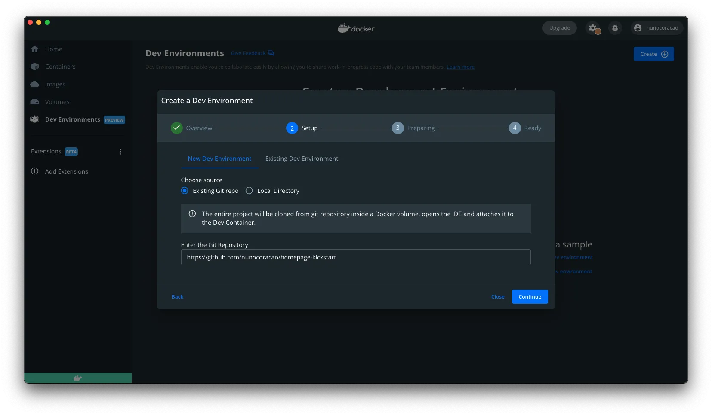


Wählen Sie hier die Option "Existing Git repo" und verwenden Sie die folgende GitHub-URL:

```
https://github.com/nunocoracao/homepage-kickstart
```


**Hinweis:** Wenn Sie das Repository lokal klonen, können Sie auch vom lokalen Ordner aus starten


Sobald der Container läuft, sollten Sie etwas Ähnliches wie die unten stehenden Bilder sehen.

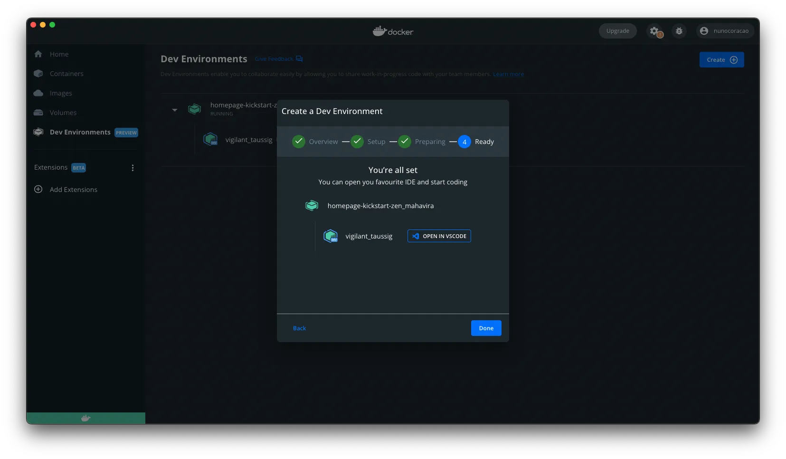
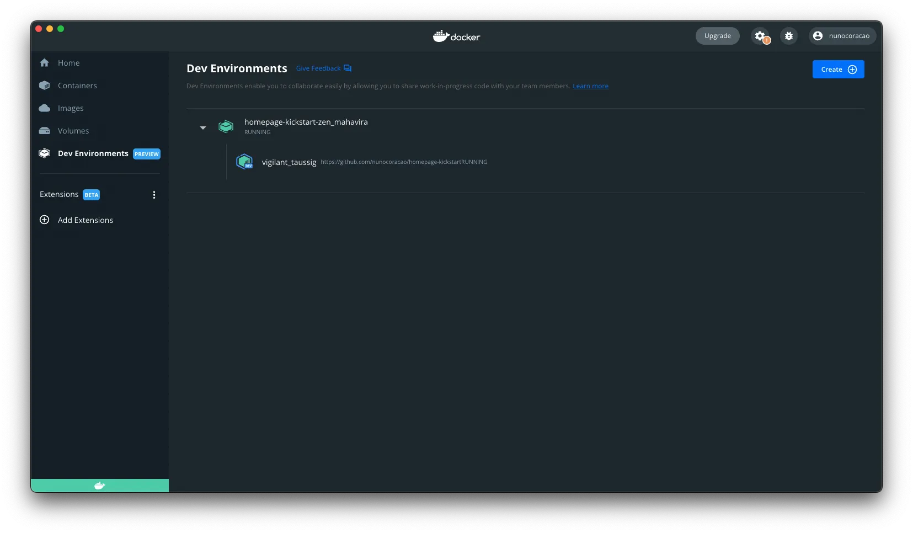

In beiden Situationen können Sie den Button "Open in VSCode" sehen und anklicken, der den Editor öffnet und es Ihnen ermöglicht, mit der Arbeit zu beginnen. Öffnen Sie von dort aus ein Terminal und fahren Sie mit [Erstellen des Site-Skeletts](#create-site-skeleton) fort.

### Mit Visual Studio Code

Beginnen Sie damit, das GitHub-Repository mit den Entwicklungsumgebungskonfigurationen zu klonen.

```
git clone https://github.com/nunocoracao/homepage-kickstart
```

Diese Methode erfordert die Installation einer zusätzlichen VSCode-Erweiterung, um die Container zu starten. Bitte suchen Sie nach **Remote - Containers** und installieren Sie die Erweiterung, um diesen Leitfaden fortzusetzen.

Nach erfolgreicher Installation der Erweiterung öffnen Sie Ihren Quellordner in VSCode und öffnen Sie das Panel der "Remote - Containers"-Erweiterung auf der linken Seite. Wählen Sie "Open Folder in Container", um einen Container mit der Entwicklungsumgebung zu starten.

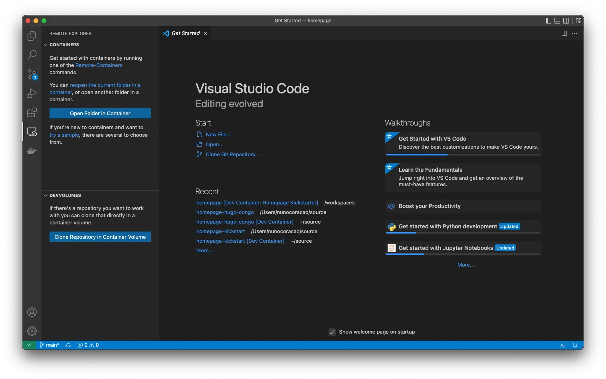

Warten Sie ein paar Minuten, während das Image erstellt wird. Docker erstellt ein Image mit der gesamten erforderlichen Software für die Website-Entwicklung. Dies geschieht nur beim ersten Start der Umgebung.

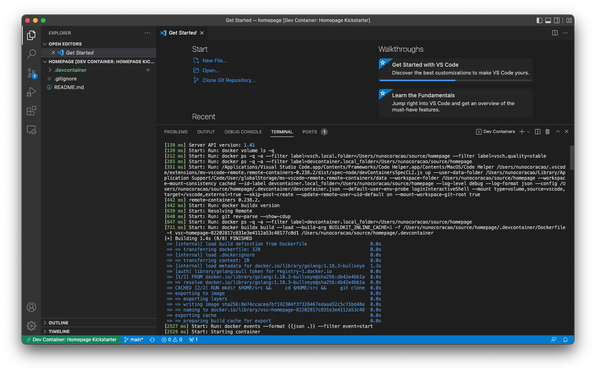


Sobald das Image erstellt ist, wird VSCode den Container starten und Ihre Arbeitsumgebung darin platzieren (Informationen verfügbar in der unteren linken Ecke des Fensters). Sie haben jetzt eine Entwicklungsumgebung mit Go, Hugo, Firebase CLI und allen Tools, die Sie für diesen Leitfaden benötigen. Öffnen Sie einfach ein neues Terminal und Sie sind bereit, mit der Erstellung Ihrer Website zu beginnen.

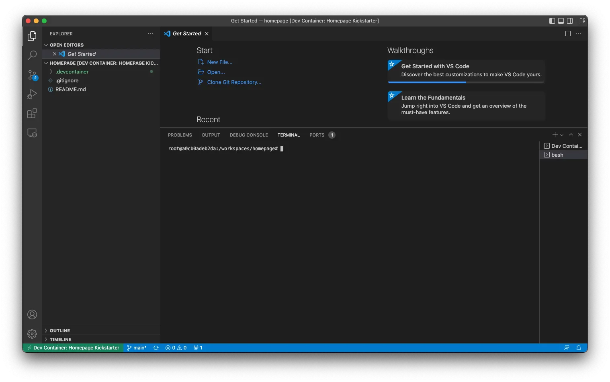

### ...aber ich möchte wirklich alles lokal ausführen

Wenn Sie es vorziehen oder müssen, Ihre Umgebung lokal auszuführen, folgen Sie den folgenden Anleitungen, um alles zu installieren, was Sie für Ihr Setup benötigen:

- **Homebrew** - <a target="_blank" href="https://brew.sh/">Homebrew installieren</a>
- **Hugo** - <a target="_blank" href="https://gohugo.io/getting-started/installing/">Hugo installieren</a>
- **Node.js und NPM** - <a target="_blank" href="https://nodejs.org/en/download/">Node.js & NPM installieren</a> (einfacher für die Installation von Firebase CLI)
- **Firebase CLI** - <a target="_blank" href="https://firebase.google.com/docs/cli#install_the_firebase_cli">Firebase CLI installieren</a>

## Erstellen des Site-Skeletts

Nachdem wir nun eine laufende Entwicklungsumgebung haben, ist der erste Schritt, die Basisversion Ihrer Website zu erstellen. Lassen Sie uns dazu **Hugo** verwenden, um die Ordnervorlage und Konfigurationsdateien zu generieren, die wir brauchen, indem wir den folgenden Befehl ausführen (der `--force`-Parameter ist erforderlich, um Hugo in einem nicht-leeren Verzeichnis auszuführen):

```
hugo new site . --force
```
Dies sollte eine Reihe von Ordnern in Ihrem Arbeitsbereich erstellt haben, um die Sie sich vorerst nicht kümmern müssen. Der nächste Schritt ist die Installation eines Themes für Hugo. Ich habe <a target="_blank" href="https://github.com/jpanther/congo">Congo</a> gewählt, da es alle Funktionen hatte, die ich für meine Website benötigte, und es schien einfach zu ändern zu sein, falls ich es jemals brauche. Wenn Sie ein anderes Theme ausprobieren möchten, gibt es mehrere in Hugos Dokumentation verfügbar, jedes mit Dokumentation und Beispielen.

Installieren Sie Congo mit Git-Submodulen, indem Sie den folgenden Befehl ausführen:

```
git submodule add -b stable https://github.com/jpanther/congo.git themes/congo
```

Jetzt müssen wir einige Änderungen an der Verzeichnis- und Dateistruktur vornehmen, damit Congo ordnungsgemäß funktioniert. Ich werde in diesem Leitfaden nicht auf die Details eingehen (Sie können Congos Dokumentation konsultieren, wenn Sie mehr erfahren möchten). Die Haupterkenntnis ist, dass wir einen Ordner in <code>config/_default/</code> erstellen und konfigurieren, der alle wichtigen Konfigurationsdateien für Hugo und Congo enthalten wird.

Bitte führen Sie die folgenden Befehle der Reihe nach aus:

```
mkdir -p config/_default
rm config.toml
cp themes/congo/config/_default/*.toml config/_default/
echo 'theme = "congo"' | cat - config/_default/config.toml > temp && mv temp config/_default/config.toml
```

Herzlichen Glückwunsch, Ihre Website sollte jetzt laufen. Probieren wir es aus, indem wir Hugos Debug-Server starten:

```
hugo server -D
```

Bitte öffnen Sie Ihren bevorzugten Browser und navigieren Sie zu <a target="_blank" href="http://localhost:1313">localhost:1313</a>, um Ihre Seite zu sehen.

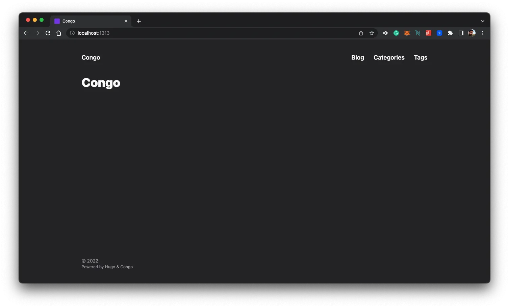

Sie sollten etwas Ähnliches wie das obige Bild sehen. Sieht nicht so aufregend aus, oder? Lassen Sie uns das Theme in den nächsten Abschnitten konfigurieren und lernen, wie Sie Ihren ersten Artikel erstellen.


## Theme konfigurieren

Jetzt werde ich erklären, wie Sie das Aussehen Ihrer Website ändern, persönliche Informationen hinzufügen und den Dunkel-Modus-Umschalter aktivieren (auch bekannt als die wichtigste Funktion auf jeder Website heutzutage).


Ein Hinweis: Ich behandle hier eine sehr einfache Konfiguration für dieses Theme. Bitte schauen Sie in die <a target="_blank" href="https://jpanther.github.io/congo/docs/">Dokumentation des Congo-Themes</a>, um zu verstehen, was Sie alles mit diesem Theme machen können.


### Profilbild

Beginnen wir damit, Ihrer Website ein Profilbild hinzuzufügen. Erstellen Sie einen Ordner namens "assets" im Stammverzeichnis Ihres Projekts. Wählen Sie ein Profilbild und legen Sie es im Assets-Ordner ab. Der Rest des Leitfadens geht davon aus, dass das endgültige Bild "profile.webp" heißt, also benennen Sie Ihr Bild entsprechend um oder berücksichtigen Sie dies bei der Konfiguration einiger anderer Dateien.

<figure>
 	
  <figcaption>Wenn Sie noch ein passendes tolles Foto dafür machen müssen, können Sie dieses herunterladen, um mit dem Tutorial fortzufahren.</figcaption>
</figure>


### Konfigurationsdateien

Öffnen wir ein paar Konfigurationsdateien und beginnen wir mit der Aktualisierung. Alle Dateien, die wir ändern werden, befinden sich im Ordner <code>config/_default/</code>.

#### config.toml

Entkommentieren Sie den <code>baseURL</code>-Parameter und ersetzen Sie ihn durch die endgültige Domain Ihrer Website. Dieser Wert wird verwendet, um die robots.txt-Datei zu erstellen, damit Suchmaschinen Ihre Website erfolgreich crawlen und indexieren können.

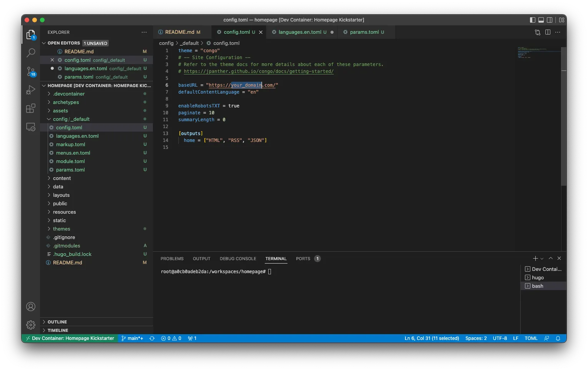


Hinweis: Wenn Sie Google Analytics konfigurieren möchten, fügen Sie bitte die folgende Zeile mit Ihrer ID zu dieser Datei hinzu: `googleAnalytics = "G-XXXXXX"`



#### languages.en.toml

Diese Datei steuert die Hauptinformationen für die Website und den Autor der Seite (Sie). Ersetzen Sie <code>title</code> und <code>description</code> durch die gewünschten Werte für Ihre Seite – diese Werte steuern die HTML-Title- und Description-Tags.

Im <code>[author]</code>-Block können Sie die Details aktualisieren, die Sie in Ihrem Profil hervorheben möchten. Das Minimum wäre <code>name</code>, <code>image</code>, <code>headline</code> und <code>links</code>. Für den <code>links</code>-Parameter vergessen Sie nicht, die letzte Zeile der Datei zu entkommentieren, da dies ein JSON-Array ist. Aktualisieren Sie jeden Eintrag mit Ihren persönlichen Links.

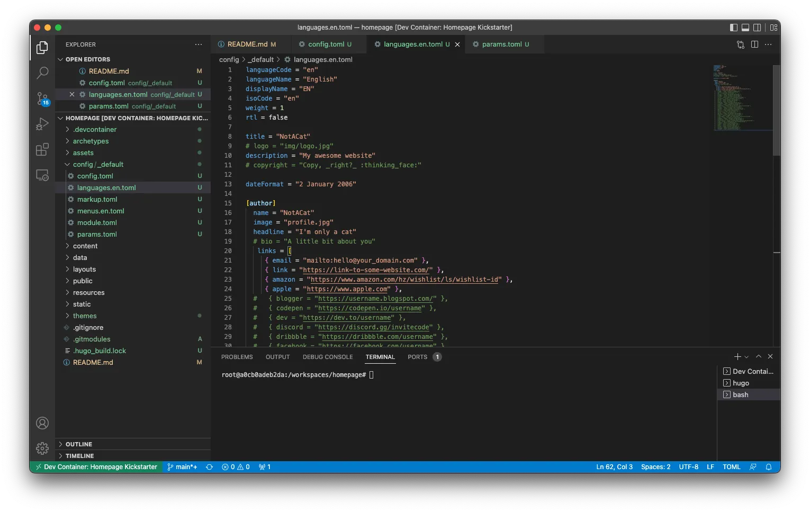

#### params.toml

Diese Datei definiert einen Großteil des allgemeinen Verhaltens im gesamten Framework. Für dieses Tutorial habe ich einige der allgemeinen Werte und einen für die Homepage geändert. Wenn Sie mehr über die anderen verfügbaren Konfigurationen erfahren möchten, konsultieren Sie bitte die <a target="_blank" href="https://jpanther.github.io/congo/docs/">Dokumentation des Congo-Themes</a>.

Ich habe <code>colorScheme</code> auf "ocean" geändert, was das globale UI-Theme ändert. Congo definiert eine Drei-Farben-Palette, die im gesamten Theme verwendet wird. Gültige Werte sind congo (Standard), avocado, ocean, fire und slate. Obwohl dies die Standard-Schemata sind, können Sie auch Ihre eigenen erstellen. Sehen Sie in der Hauptdokumentation des Themes nach, um zu erfahren, wie.

<code>showAppearanceSwitcher</code> aktiviert, um den Hell/Dunkel-Modus-Umschalter zu aktivieren. <code>enableSearch</code> aktiviert, das alle zukünftigen Beiträge jedes Mal indexiert, wenn Sie die Website erstellen, und eine einfache Suchfunktion bietet. Ich habe auch den Wert von <code>layout</code> innerhalb von <code>[homepage]</code> auf "profile" geändert, was die Art und Weise ändert, wie die Landingpage gerendert wird. Schließlich ist der letzte interessante Wert hier <code>showRecent</code>, der, wenn aktiviert, die neuesten Beiträge auf der Homepage anzeigt.


### Fertig

Schauen wir, wie es aussieht. Führen Sie Hugo erneut aus:

```
hugo server -D
```

Und navigieren Sie zu <a target="_blank" href="http://localhost:1313">localhost:1313</a> – Sie sollten etwas Ähnliches wie die untenstehende Seite sehen.

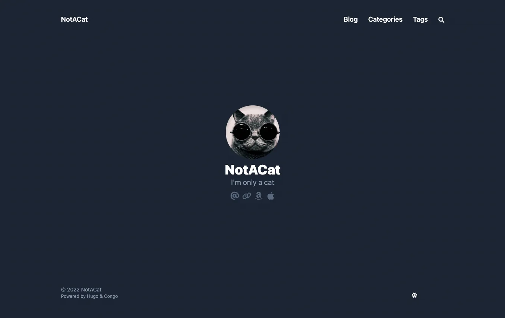

Glückwunsch, es sieht großartig aus. Lassen Sie uns lernen, wie Sie Ihre ersten Artikel generieren.

## Wie man Artikel generiert

Hugo bietet einige Tools zum Generieren Ihrer Artikel (<a target="_blank" href="https://www.markdownguide.org/">Markdown</a>-Dateien) mit einem Basis-Set von Tags bereits darin. Führen Sie den folgenden Befehl aus, um Ihren ersten Beitrag zu erstellen:

```
hugo new posts/my-first-post.md
```

Ersetzen Sie den Inhalt der Datei durch Folgendes:

```
---
title: "My Published Post"
date: 2022-06-19T20:10:29Z
draft: false
categories: ["published", "test"]
tags: ["first", "awesome"]
---

This is my first blog post
```

Dies hat gerade Ihren ersten Blogbeitrag erstellt. Wir haben ein paar Kategorien und Tags hinzugefügt, die von Hugo während der Build-Zeit indexiert werden. Diese Tags werden verwendet, um den Kategorie- und Tag-Bereich der Website automatisch für Sie zu erstellen. Beachten Sie, dass ich <code>draft</code> auf false geändert habe, um einen veröffentlichten Beitrag zu simulieren.

Führen Sie den folgenden Befehl aus, um Ihren zweiten Beitrag zu erstellen:

```
hugo new posts/my-draft-post.md
```
und ersetzen Sie den Inhalt dieser Datei durch Folgendes:

```markdown
---
title: "My Draft Post"
date: 2022-06-19T20:20:39Z
draft: true
categories: ["draft", "test"]
tags: ["second", "awesome"]
---

This is my second blog post
```
Für den zweiten Beitrag habe ich den <code>draft</code>-Parameter auf true gelassen, um einen Entwurfsbeitrag zu simulieren.

Hugo versteckt Entwurfsbeiträge automatisch aus der endgültigen Website-Generierung. Sie können weiter an Artikeln arbeiten und das Draft-Label auf true lassen – sie werden von der Engine ignoriert. Wenn Sie im DEBUG-Modus ausführen möchten, verwenden Sie einfach den Befehl:

```
hugo server -D
```

Wenn Sie zu den Beiträgen auf der Website gehen, sollten Sie beide Einträge sehen können. Wenn Sie dann den Server im normalen Modus ausführen, verschwinden die Entwurfsartikel. Sie können den folgenden Befehl verwenden:


```
hugo server
```

Sie können diesen Befehl verwenden, um die endgültige Version der Website oder eines Artikels zu testen, bevor Sie den endgültigen Build generieren. Wenn Sie bereit sind, verwenden Sie einfach den Befehl 'hugo', um die endgültige Website im /public-Ordner zu generieren.

```
hugo
```

Alle Dateien werden in <a target="_blank" href="https://en.wikipedia.org/wiki/Markdown">Markdown</a> geschrieben, das Hugo dann verwendet, um die endgültigen Seiten zu generieren. Ich werde Ihnen in diesem Leitfaden nicht beibringen, wie man Markdown-Dateien schreibt, aber ich kann dieses <a target="_blank" href="https://www.markdownguide.org/getting-started/">"Erste Schritte"</a>-Tutorial und dieses <a target="_blank" href="https://www.markdownguide.org/cheat-sheet/">"Cheat Sheet"</a> empfehlen, um Ihnen den Einstieg zu erleichtern.

## Deployment

Ok, Sie haben Ihre Website konfiguriert und ein paar Artikel erstellt, aber wir müssen sie noch irgendwo deployen. Wie bereits erwähnt, habe ich Firebase für diesen Leitfaden gewählt. Obwohl ich weiß, dass es viel mehr als nur einen einfachen Hosting-Service bietet, ermöglicht es mir, meine Website kostenlos und ohne großen Aufwand zu hosten.

### Firebase-Projekt erstellen

Beginnen wir damit, zu <a target="_blank" href="https://firebase.google.com">https://firebase.google.com</a> zu gehen und ein Konto zu erstellen. Sobald das erledigt ist, können Sie kostenlos ein Projekt erstellen. Der Prozess sollte unkompliziert sein, und wenn Sie fertig sind, sollten Sie sich im Firebase-Projekt-Dashboard befinden.

### Firebase einrichten

Jetzt können Sie zu Ihrer Umgebung zurückkehren, die bereits Firebase CLI-Tools installiert und einsatzbereit hat. Beginnen wir mit der Authentifizierung:

```
firebase login
```
Sobald Sie erfolgreich angemeldet sind, müssen Sie die Projektkonfigurationen für Firebase initiieren. Verwenden Sie dazu bitte:

```
firebase init
```

Das Tool bietet Ihnen eine Vielzahl verschiedener Optionen zur Konfiguration Ihres Firebase-Projekts. Im Moment möchten wir nur das Hosting konfigurieren. Wenn Sie GitHub verwenden, sollten Sie in Erwägung ziehen, GitHub Action Deploys zu konfigurieren, die Ihre Website automatisch jedes Mal erstellen und deployen können, wenn es einen Push zu einem bestimmten Branch oder einen gemergten Pull Request gibt.

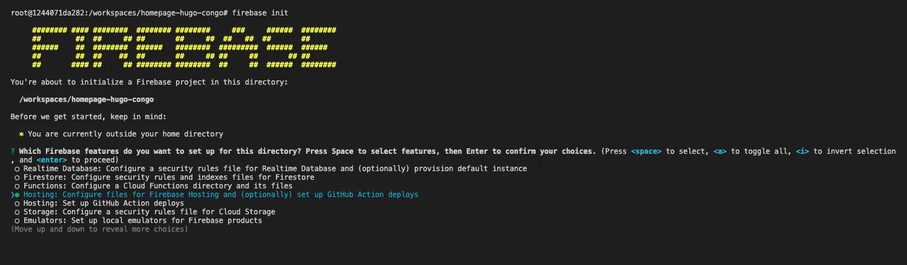

Wählen Sie das zuvor erstellte Firebase-Projekt als Hosting-Ziel. Und wählen Sie die Konfigurationen, die Sie für den Deployment-Prozess wünschen. Die wichtige hier ist der Ordner, in dem die endgültigen Dateien für den Server platziert werden – dies ist der <code>public</code>-Ordner. Für die anderen Parameter können Sie experimentieren, was am besten zu Ihrem Anwendungsfall passt. Das Bild unten zeigt, was ich gewählt habe (*Hinweis: Für dieses Tutorial habe ich keine GitHub Actions konfiguriert, aber in meinem echten Setup verwende ich das*).

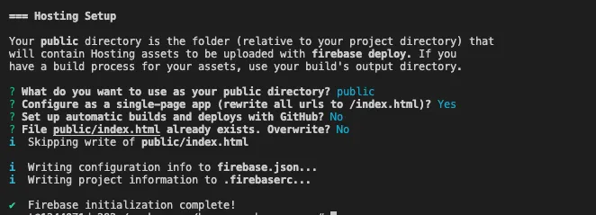

### Deployment

Ok, jetzt zum langen und langweiligen Deployment-Prozess… Scherz! Sobald Sie bereit sind und alle Ihre Dateien vom <code>hugo</code>-Befehl im public-Ordner generiert wurden, verwenden Sie einfach den folgenden Befehl zum Deployen:

```
firebase deploy
```

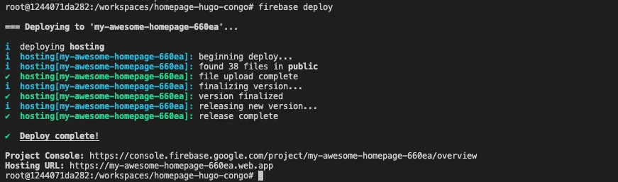

Der Prozess sollte ein paar Sekunden dauern und schon ist Ihre Website deployed. Die letzte Zeile des CLI-Tools gibt Ihnen eine URL, um es selbst zu sehen. Andernfalls können Sie Ihren Firebase-Dashboard-Hosting-Bereich erkunden, der mehr Informationen zum Deployment enthält.

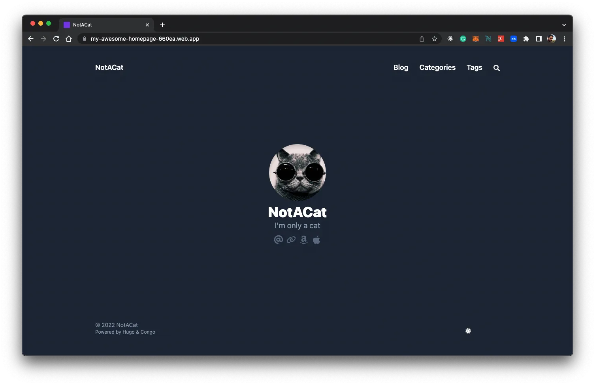

## Fazit

Bis jetzt sollten Sie eine einfache Version Ihrer Website haben, die Sie nach Ihren Bedürfnissen konfigurieren können. Der Hauptvorteil dieser Lösung ist, dass sie flexibel und auf eine Vielzahl verschiedener Bedürfnisse erweiterbar ist, besonders wenn Sie sich die Zeit nehmen, Hugos Theme-Katalog zu erkunden. Es stimmt, dass möglicherweise etwas Programmierung erforderlich ist, um komplexe Dinge zu implementieren, aber ich würde vermuten, dass dies das Problem für fast jeden löst.

Vor allem ist es eine völlig kostenlose Lösung, wenn Sie anfangen möchten und kein Geld ausgeben können (oder wollen). Ich hoffe, dieser Leitfaden hilft Ihnen. Teilen Sie ihn gerne mit Ihrem Netzwerk und geben Sie mir Feedback, damit ich ihn im Laufe der Zeit verbessern kann.

## Ressourcen

- <a target="_blank" href="https://github.com/nunocoracao/homepage-kickstart">GitHub-Repository für Entwicklungsumgebung</a>
- <a target="_blank" href="https://github.com/nunocoracao/homepage-hugo-congo">GitHub-Repository für Hugo- und Congo-Basiskonfiguration</a>
- <a target="_blank" href="https://github.com/nunocoracao/homepage-dockerimage">GitHub-Repository für Basis-Image</a>
- <a target="_blank" href="https://hub.docker.com/r/nunocoracao/homepage-dockerimage">Docker Hub Image-URL</a>
- <a target="_blank" href="https://gohugo.io/documentation/">Hugos Dokumentation</a>
- <a target="_blank" href="https://github.com/jpanther/congo">Congos Dokumentation</a>
- <a target="_blank" href="https://firebase.google.com/docs">Firebase-Dokumentation</a>
- <a target="_blank" href="https://www.markdownguide.org/">Markdown-Leitfaden</a>
- <a target="_blank" href="https://www.markdownguide.org/getting-started/">Markdown Erste Schritte</a>
- <a target="_blank" href="https://www.markdownguide.org/cheat-sheet/">Markdown Cheat Sheet</a>
