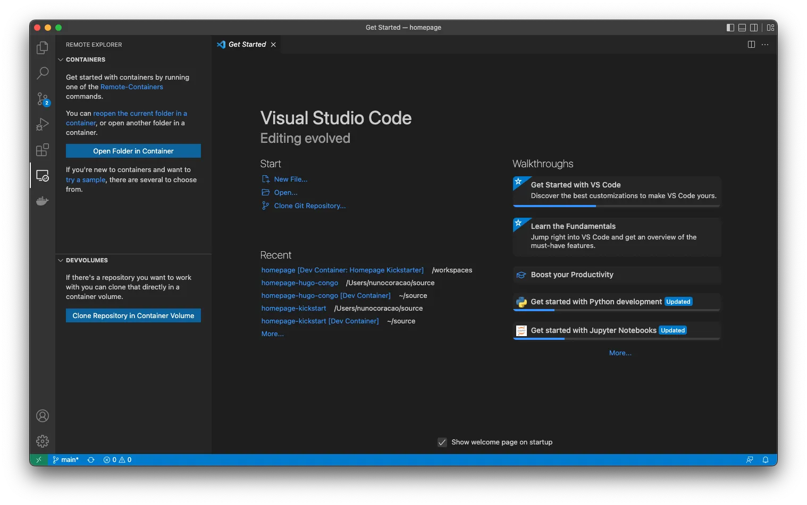
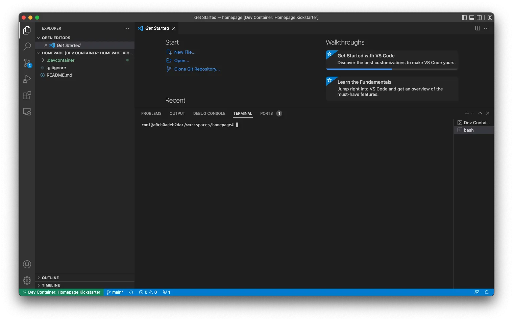
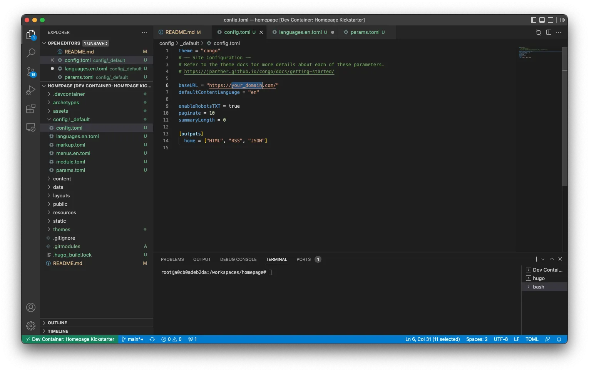
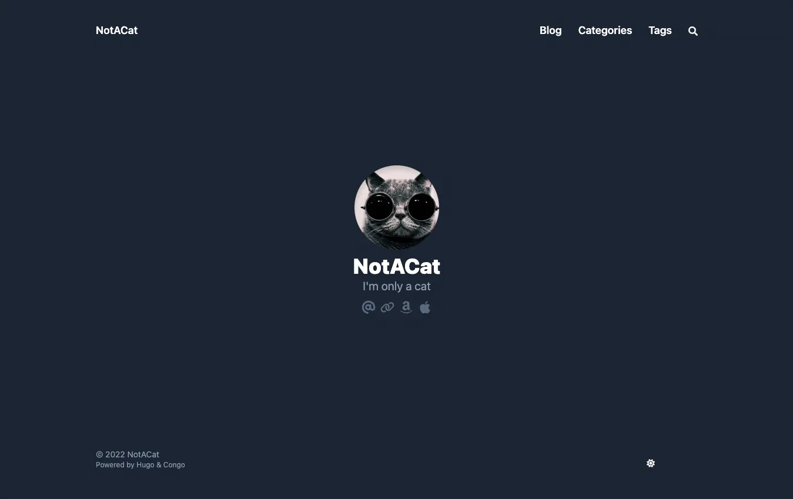
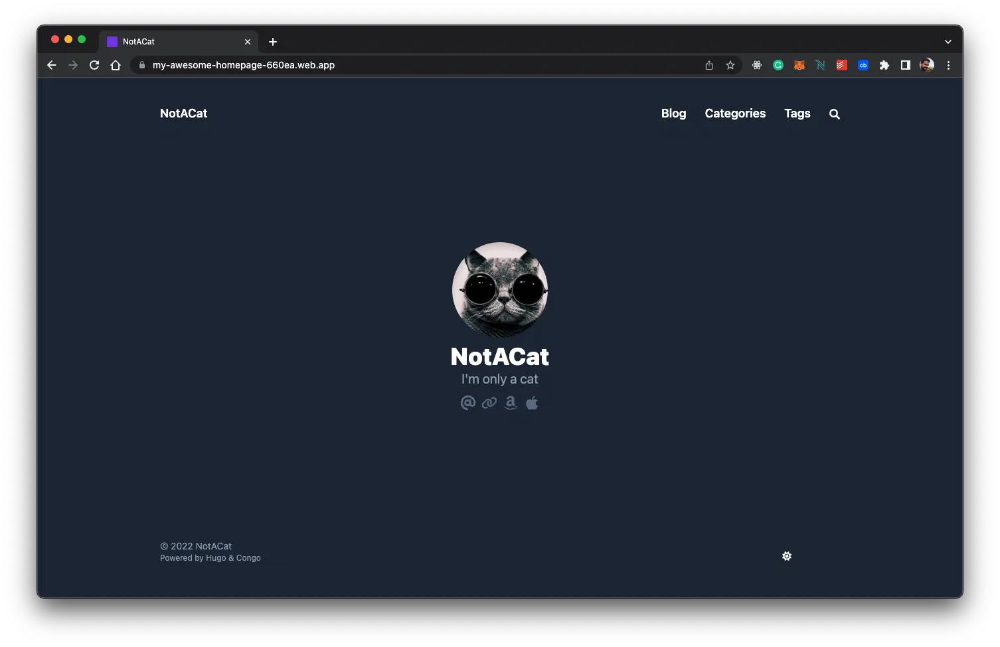

## TL;DR

Actuellement, il existe plusieurs solutions pour créer et héberger votre site web personnel. J'ai voulu me lancer le défi de le faire avec les mêmes fonctionnalités que certaines solutions payantes, mais gratuitement. Voici les résultats.

## Pourquoi un PM construirait-il sa propre page d'accueil à partir de zéro…

Il y a quelques mois, j'ai décidé que je voulais écrire davantage pour a) exercer mes compétences rédactionnelles et b) obtenir des retours sur certaines de mes idées. Avec cet objectif en tête, j'ai commencé à rechercher des outils/plateformes qui m'aideraient à publier sans créer trop de friction pour moi ou pour les lecteurs, par exemple sans avoir à payer. Finalement, j'ai décidé de créer mon propre site web.

J'avais plusieurs raisons de vouloir essayer cela :

- Me mettre au défi pour voir si moi, ancien étudiant en génie logiciel, je pouvais encore bricoler quelque chose qui fonctionne et me sentir bien de ne pas avoir oublié tout ce que j'ai appris sur la programmation,

- Trouver une solution gratuite et flexible qui me permettrait de lancer mon site web sans investir d'argent immédiatement, c'est-à-dire éviter les coûts opérationnels avec des plateformes et services qui me lieraient à l'avenir,

- Héberger mon contenu dans un endroit qui n'exigerait pas que les gens paient pour le lire,

- Jouer avec les <a target="_blank" href="https://docs.docker.com/desktop/dev-environments/">environnements de développement Docker</a> et les <a target="_blank" href="https://github.com/microsoft/vscode-dev-containers">conteneurs de développement Microsoft</a> pour me familiariser avec les deux solutions.

## Commençons…

Après quelques recherches, j'ai décidé de choisir un framework générateur de site web et un service d'hébergement gratuit. Pour le framework du site web, j'ai choisi <a target="_blank" href="https://gohugo.io">Hugo</a> avec <a target="_blank" href="https://github.com/jpanther/congoand">Congo</a> comme thème, et pour le service d'hébergement <a target="_blank" href="https://firebase.google.com">Firebase</a>. Et pour des raisons évidentes, j'ai décidé de configurer mon environnement de développement en utilisant <a target="_blank" href="https://www.docker.com">Docker</a> afin de me mettre dans la peau de l'utilisateur pour cette expérience.

Je n'ai pas fait d'analyse approfondie de quel framework était le meilleur pour mon problème car je voulais sortir un MVP rapidement, donc j'ai parcouru quelques options et j'ai choisi la première qui me plaisait. Il existe plusieurs autres options avec des fonctionnalités et des approches différentes. Si vous voulez explorer d'autres options, voici quelques-unes que vous pouvez considérer : <a target="_blank" href="https://docusaurus.io/">Docusaurus</a>, <a target="_blank" href="https://www.gatsbyjs.com/">Gatsby</a>, <a target="_blank" href="https://jekyllrb.com/">Jekyll</a>, <a target="_blank" href="https://ghost.org/">Ghost</a>, et même <a target="_blank" href="https://wordpress.com/">WordPress</a>. La même chose s'applique à la partie hébergement : même si j'ai choisi <a target="_blank" href="https://firebase.google.com/">Firebase</a>, il existe d'autres solutions comme <a target="_blank" href="https://pages.cloudflare.com/">Cloudflare Pages</a>, <a target="_blank" href="https://pages.github.com/">GitHub Pages</a>, <a target="_blank" href="https://www.digitalocean.com/">Digital Ocean</a>, <a target="_blank" href="https://www.netlify.com/">Netlify</a>, <a target="_blank" href="https://vercel.com/">Vercel</a>, et d'autres que vous pourriez envisager d'explorer. Si vous avez des suggestions pour ce guide, n'hésitez pas à me contacter, je suis toujours heureux de discuter et d'apprendre.


## Outils

Pour ce guide, j'utiliserai les outils suivants, qui doivent être installés sur votre machine. Voici une brève explication de ce à quoi chaque composant va servir et un lien vers les instructions d'installation.

- **Docker** - J'utiliserai Docker pour configurer un environnement de développement pour ce projet afin de pouvoir éviter d'installer tous les logiciels nécessaires pour exécuter Hugo et Firebase CLI, c'est-à-dire cURL, Go, Hugo, Node, NPM, etc. Cela vous permettra de partir d'un dépôt git, de démarrer l'environnement et d'aller directement à l'écriture de code au lieu de passer des heures à comprendre comment installer un compilateur spécifique pour votre architecture CPU. <a target="_blank" href="https://www.docker.com/get-started/">Installer Docker</a>

- **Visual Studio Code** - J'utilise Visual Studio Code comme éditeur de code actuellement, et tout le matériel du guide suppose que c'est ce que vous utilisez. Si vous avez une préférence différente, vous devrez adapter certaines parties de ce guide pour obtenir les mêmes résultats. <a target="_blank" href="https://code.visualstudio.com/">Installer Visual Studio Code</a>

## Configurer l'Environnement de Développement

Commençons par configurer votre environnement de développement en utilisant <a target="_blank" href="https://www.docker.com">Docker</a>. Cela vous permettra de créer un conteneur avec tous les outils dont vous avez besoin sans avoir à modifier vos configurations système. De plus, il sera également plus facile de simplement supprimer le conteneur et de le reconstruire quand vous en avez besoin au lieu de garder d'anciennes versions de logiciels dont vous n'avez pas besoin quotidiennement sur votre machine personnelle.


Note : Si vous voulez simplement cloner un repo avec le squelette final, n'hésitez pas à cloner <a target="_blank" href="https://github.com/nunocoracao/homepage-hugo-congo">ce repo</a> et passez à la section déploiement




Je fournirai deux façons de configurer votre environnement de développement : choisissez celle que vous préférez ou essayez les deux pour explorer les différences. Les deux options reposent sur un `Dockerfile` créé par moi qui utilise `klakegg/hugo:0.93.2-ubuntu` comme image de base. Bien que ce ne soit pas l'image officielle de Hugo (car il n'y en a pas pour le moment), c'est celle <a target="_blank" href="https://gohugo.io/getting-started/installing/#docker">recommandée sur leur site web</a>.

### Utiliser Docker

Pour lancer un Dev Environment, ouvrez le Docker Dashboard et sélectionnez l'onglet "Dev Environments" à gauche. Si vous n'avez pas d'environnements de développement configurés, sélectionnez "Create New Environment", sinon utilisez le bouton "Create" en haut à droite. Passez à l'étape de configuration.


Ici, choisissez l'option "Existing Git repo" et utilisez l'URL GitHub suivante :

```
https://github.com/nunocoracao/homepage-kickstart
```


**Note :** Si vous clonez le repo localement, vous pouvez également démarrer depuis le dossier local


Une fois le conteneur en cours d'exécution, vous devriez voir quelque chose de similaire aux images ci-dessous.


Dans les deux situations, vous pourrez voir et cliquer sur le bouton "Open in VSCode" qui ouvrira l'éditeur et vous permettra de commencer à travailler. De là, ouvrez un terminal et procédez à [créer le squelette du site](#create-site-skeleton)

### Utiliser Visual Studio Code

Commencez par cloner le dépôt GitHub avec les configurations de l'environnement de développement.

```
git clone https://github.com/nunocoracao/homepage-kickstart
```

Cette méthode nécessite l'installation d'une extension VSCode supplémentaire pour lancer les conteneurs. Veuillez rechercher **Remote - Containers** et installer l'extension pour continuer ce guide.

Après avoir installé l'extension avec succès, ouvrez votre dossier source dans VSCode et ouvrez le panneau de l'extension "Remote - Containers" à gauche. Sélectionnez "Open Folder in Container" pour lancer un conteneur avec l'environnement de développement.



Attendez quelques minutes pendant que l'image est construite. Docker crée une image avec tous les logiciels requis pour le développement du site web. Cela ne se produira que la première fois que vous lancez l'environnement.


Une fois l'image construite, VSCode lancera le conteneur et placera votre environnement de travail à l'intérieur (informations disponibles dans le coin inférieur gauche de la fenêtre). Vous avez maintenant un environnement de développement avec Go, Hugo, Firebase CLI et tous les outils dont vous aurez besoin pour ce guide. Ouvrez simplement un nouveau terminal et vous êtes prêt à commencer à créer votre site.



### ...mais je veux vraiment tout exécuter localement

Si vous préférez ou avez besoin d'exécuter votre environnement localement, suivez les guides ci-dessous pour installer tout ce dont vous avez besoin :

- **Homebrew** - <a target="_blank" href="https://brew.sh/">Installer homebrew</a>
- **Hugo** - <a target="_blank" href="https://gohugo.io/getting-started/installing/">Installer Hugo</a>
- **Node.js et NPM** - <a target="_blank" href="https://nodejs.org/en/download/">Installer node.js & NPM</a> (plus facile pour installer Firebase CLI)
- **Firebase CLI** - <a target="_blank" href="https://firebase.google.com/docs/cli#install_the_firebase_cli">Installer Firebase CLI</a>

## Créer le Squelette du Site

Maintenant que nous avons un environnement de développement en cours d'exécution, la première étape est de créer la version de base de votre site web. Pour cela, utilisons **Hugo** pour générer le modèle de dossier et les fichiers de configuration dont nous avons besoin en exécutant la commande suivante (le paramètre `--force` est requis pour exécuter Hugo sur un répertoire non vide) :

```
hugo new site . --force
```
Cela devrait avoir créé un ensemble de dossiers dans votre espace de travail dont vous n'avez pas à vous soucier pour le moment. L'étape suivante est d'installer un thème pour Hugo. J'ai choisi <a target="_blank" href="https://github.com/jpanther/congo">Congo</a> car il avait toutes les fonctionnalités dont j'avais besoin pour mon site web et il semblait facile à modifier si j'en avais besoin. Si vous voulez essayer un thème différent, il y en a plusieurs disponibles dans la documentation de Hugo, chacun avec sa documentation et des exemples.

Installez Congo en utilisant les git submodules en exécutant la commande suivante :

```
git submodule add -b stable https://github.com/jpanther/congo.git themes/congo
```

Maintenant nous devons faire quelques changements à la structure des répertoires et fichiers pour que Congo puisse fonctionner correctement. Je n'entrerai pas dans les détails de ce qui se passe dans ce guide (vous pouvez consulter la documentation de Congo si vous voulez en savoir plus). Le point principal est que nous créons et configurons un dossier dans <code>config/_default/</code> qui contiendra tous les fichiers de configuration importants pour Hugo et Congo.

Veuillez exécuter les commandes suivantes dans l'ordre :

```
mkdir -p config/_default
rm config.toml
cp themes/congo/config/_default/*.toml config/_default/
echo 'theme = "congo"' | cat - config/_default/config.toml > temp && mv temp config/_default/config.toml
```

Félicitations, votre site devrait être opérationnel maintenant. Essayons-le en exécutant le serveur de débogage de Hugo :

```
hugo server -D
```

Veuillez ouvrir votre navigateur préféré et naviguez vers <a target="_blank" href="http://localhost:1313">localhost:1313</a> pour voir votre page.


Vous devriez voir quelque chose de similaire à l'image ci-dessus. Ça n'a pas l'air très excitant, n'est-ce pas ? Configurons le thème dans les sections suivantes et apprenons comment créer votre premier article.


## Configurer le Thème

Maintenant, je vais expliquer comment changer l'apparence de votre site web, ajouter des informations personnelles et activer le basculement du mode sombre (aussi connu comme la fonctionnalité la plus importante de tout site web de nos jours).


Une note : je couvre une configuration très simple pour ce thème. Veuillez consulter la <a target="_blank" href="https://jpanther.github.io/congo/docs/">documentation du thème Congo</a> pour comprendre tout ce que vous pouvez faire avec ce thème.


### Photo de Profil

Commençons par ajouter une photo de profil à votre site. Créez un dossier appelé "assets" à la racine de votre projet. Choisissez une photo de profil et placez-la dans le dossier assets. Le reste du guide suppose que l'image finale s'appelle "profile.webp", donc renommez votre image ou prenez cela en compte lors de la configuration de certains autres fichiers.

<figure>
 	
  <figcaption>Si vous devez encore prendre une bonne photo pour cela, n'hésitez pas à télécharger celle-ci pour continuer le tutoriel.</figcaption>
</figure>


### Fichiers de Configuration

Ouvrons quelques fichiers de configuration et commençons à les mettre à jour. Tous les fichiers que nous allons modifier sont dans le dossier <code>config/_default/</code>.

#### config.toml

Décommentez le paramètre <code>baseURL</code> et remplacez-le par le domaine final de votre site web. Cette valeur sera utilisée pour créer le fichier robots.txt pour que les moteurs de recherche puissent explorer et indexer votre site web avec succès.




Note : si vous voulez configurer Google Analytics, veuillez ajouter la ligne suivante avec votre id à ce fichier `googleAnalytics = "G-XXXXXX"`



#### languages.en.toml

Ce fichier pilotera les informations principales du site web et de l'auteur de la page (vous). Remplacez <code>title</code> et <code>description</code> par ceux que vous voulez pour votre page, ces valeurs piloteront les balises HTML title et description.

Dans le bloc <code>[author]</code>, vous pouvez mettre à jour les détails que vous souhaitez mettre en évidence dans votre profil. Le minimum serait <code>name</code>, <code>image</code>, <code>headline</code> et <code>links</code>. Pour le paramètre <code>links</code>, n'oubliez pas de décommenter la dernière ligne du fichier car c'est un tableau json. Mettez à jour chaque entrée avec vos liens personnels.


#### params.toml

Ce fichier définit une grande partie du comportement global dans tout le framework. Pour ce tutoriel, j'ai changé certaines valeurs générales et une pour la page d'accueil. Si vous voulez en savoir plus sur les autres configurations disponibles, veuillez consulter la <a target="_blank" href="https://jpanther.github.io/congo/docs/">documentation du thème Congo</a>.

J'ai changé <code>colorScheme</code> en "ocean" ce qui change le thème UI global. Congo définit une palette de trois couleurs qui est utilisée dans tout le thème. Les valeurs valides sont congo (par défaut), avocado, ocean, fire et slate. Bien que ce soient les schémas par défaut, vous pouvez également créer les vôtres. Référez-vous à la documentation principale du thème pour apprendre comment.

J'ai activé <code>showAppearanceSwitcher</code> pour activer le basculement mode clair/sombre. J'ai activé <code>enableSearch</code> qui indexe tous les futurs articles chaque fois que vous construisez le site et fournit une fonction de recherche simple. J'ai également changé la valeur de <code>layout</code>, à l'intérieur de <code>[homepage]</code>, en "profile" ce qui change la façon dont la page d'accueil est rendue. Enfin, la dernière valeur intéressante ici est <code>showRecent</code>, qui lorsqu'elle est activée affiche les articles récents sur la page d'accueil.


### Final

Voyons à quoi ça ressemble, exécutez Hugo à nouveau :

```
hugo server -D
```

Et naviguez vers <a target="_blank" href="http://localhost:1313">localhost:1313</a>, vous devriez voir quelque chose de similaire à la page ci-dessous.



Félicitations, ça a l'air super. Apprenons comment générer vos premiers articles.

## Comment Générer des Articles

Hugo fournit des outils pour générer vos articles (fichiers <a target="_blank" href="https://www.markdownguide.org/">markdown</a>) avec un ensemble de balises de base déjà incluses. Exécutez la commande suivante pour créer votre premier article

```
hugo new posts/my-first-post.md
```

remplacez le contenu du fichier par ce qui suit :

```
---
title: "My Published Post"
date: 2022-06-19T20:10:29Z
draft: false
categories: ["published", "test"]
tags: ["first", "awesome"]
---

This is my first blog post
```

Cela vient de créer votre premier article de blog. Nous avons ajouté quelques catégories et tags, qui seront indexés par Hugo lors de la construction. Ces tags seront utilisés pour créer automatiquement la section Catégories et Tags du site web. Notez que j'ai changé <code>draft</code> en false pour simuler un article publié.

Exécutez la commande suivante pour créer votre deuxième article

```
hugo new posts/my-draft-post.md
```
et remplacez le contenu de ce fichier par ce qui suit :

```markdown
---
title: "My Draft Post"
date: 2022-06-19T20:20:39Z
draft: true
categories: ["draft", "test"]
tags: ["second", "awesome"]
---

This is my second blog post
```
Pour le deuxième article, j'ai laissé le paramètre <code>draft</code> à true pour simuler un brouillon.

Hugo cache automatiquement les brouillons de la génération finale du site. Vous pouvez continuer à travailler sur des articles en laissant l'étiquette draft à true et ils seront ignorés par le moteur. Si vous voulez exécuter en mode DEBUG, utilisez simplement la commande :

```
hugo server -D
```

Si vous allez aux articles sur le site, vous devriez pouvoir voir les deux entrées. Si vous exécutez ensuite le serveur en mode normal, les articles brouillons disparaîtront. Vous pouvez utiliser la commande ci-dessous pour cela :


```
hugo server
```

Vous pouvez utiliser cette commande pour tester la version finale du site web ou d'un article avant de générer la construction finale. Quand vous êtes prêt, utilisez simplement la commande 'hugo' pour générer le site web final dans le dossier /public.

```
hugo
```

Tous les fichiers sont écrits en <a target="_blank" href="https://en.wikipedia.org/wiki/Markdown">Markdown</a> que Hugo utilise ensuite pour générer les pages finales. Je ne vous apprendrai pas à écrire des fichiers markdown dans ce guide mais je peux vous recommander ce tutoriel <a target="_blank" href="https://www.markdownguide.org/getting-started/">"pour commencer"</a> et cette <a target="_blank" href="https://www.markdownguide.org/cheat-sheet/">"feuille de triche"</a> pour vous lancer.

## Déploiement

Ok, vous avez configuré votre site web et créé quelques articles, mais nous devons encore le déployer quelque part. Comme je l'ai mentionné, j'ai choisi Firebase pour ce guide. Bien que je sache qu'il offre bien plus qu'un simple service d'hébergement, il me permet d'héberger mon site gratuitement sans trop de difficultés.

### Créer un Projet Firebase

Commençons par aller sur <a target="_blank" href="https://firebase.google.com">https://firebase.google.com</a> et créer un compte. Une fois cela fait, vous pouvez créer un projet gratuitement. Le processus devrait être simple et quand vous aurez terminé, vous devriez être dans le tableau de bord du projet Firebase.

### Configurer Firebase

Maintenant vous pouvez retourner à votre environnement qui a déjà les outils Firebase CLI installés et prêts à l'emploi. Commençons par nous authentifier en utilisant :

```
firebase login
```
Une fois connecté avec succès, vous devez initier les configurations du projet pour firebase. Pour cela, veuillez utiliser :

```
firebase init
```

L'outil vous offrira une grande variété d'options différentes pour configurer votre projet Firebase. Pour l'instant, nous voulons juste configurer l'hébergement. Si vous utilisez GitHub, vous pourriez envisager de configurer les déploiements GitHub action qui peuvent automatiquement construire et déployer votre site chaque fois qu'il y a un push vers une branche spécifique ou une pull request fusionnée.


Choisissez le projet Firebase créé précédemment comme destination d'hébergement. Et sélectionnez les configurations que vous souhaitez pour le processus de déploiement. La plus importante ici est le dossier où les fichiers finaux pour le serveur seront placés et c'est le dossier <code>public</code>. Pour les autres paramètres, vous pouvez expérimenter ce qui correspond le mieux à votre cas d'utilisation. L'image ci-dessous montre ce que j'ai choisi (*Note : pour ce tutoriel je n'ai pas configuré les GitHub actions mais je les utilise dans ma vraie configuration*).


### Déploiement

Ok, maintenant pour le long et ennuyeux processus de déploiement… je plaisante ! Une fois que vous êtes prêt et que tous vos fichiers sont générés par la commande <code>hugo</code> dans le dossier public, utilisez simplement la commande suivante pour déployer :

```
firebase deploy
```


Le processus devrait prendre quelques secondes et voilà, votre site est déployé. La dernière ligne de l'outil CLI vous donnera une URL pour voir par vous-même. Sinon, vous pouvez explorer la section hébergement de votre tableau de bord Firebase qui aura plus d'informations concernant le déploiement.



## Conclusion

À ce stade, vous devriez avoir une version simple de votre site web que vous pouvez configurer selon vos besoins. Le principal avantage de cette solution est qu'elle est flexible et extensible à une variété de besoins différents, surtout si vous prenez le temps d'explorer le catalogue de thèmes de Hugo. C'est vrai qu'il pourrait falloir du code pour implémenter des choses complexes, mais je suppose que cela résout le problème pour presque tout le monde.

Surtout, c'est une solution complètement gratuite si vous cherchez à commencer et ne pouvez pas (ou ne voulez pas) dépenser d'argent. J'espère que ce guide vous aidera, n'hésitez pas à le partager avec votre réseau et à me donner des retours pour que je puisse l'améliorer au fil du temps.

## Ressources

- <a target="_blank" href="https://github.com/nunocoracao/homepage-kickstart">Dépôt GitHub pour l'environnement de développement</a>
- <a target="_blank" href="https://github.com/nunocoracao/homepage-hugo-congo">Dépôt GitHub pour la configuration de base Hugo et Congo</a>
- <a target="_blank" href="https://github.com/nunocoracao/homepage-dockerimage">Dépôt GitHub pour l'image de base</a>
- <a target="_blank" href="https://hub.docker.com/r/nunocoracao/homepage-dockerimage">URL de l'image Docker Hub</a>
- <a target="_blank" href="https://gohugo.io/documentation/">Documentation Hugo</a>
- <a target="_blank" href="https://github.com/jpanther/congo">Documentation Congo</a>
- <a target="_blank" href="https://firebase.google.com/docs">Documentation Firebase</a>
- <a target="_blank" href="https://www.markdownguide.org/">Guide Markdown</a>
- <a target="_blank" href="https://www.markdownguide.org/getting-started/">Markdown Pour Commencer</a>
- <a target="_blank" href="https://www.markdownguide.org/cheat-sheet/">Feuille de Triche Markdown</a>
