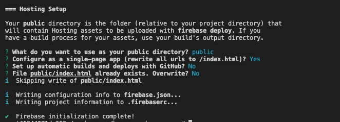
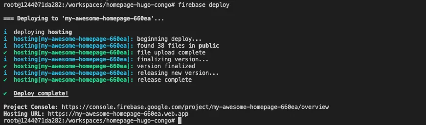

## TL;DR

Attualmente esistono diverse soluzioni per creare e ospitare il proprio sito web personale. Ho voluto sfidarmi per vedere se potevo farlo con le stesse funzionalità di alcune soluzioni a pagamento, ma gratis. Ecco i risultati.

## Perché un PM dovrebbe costruire la propria homepage da zero…

Un paio di mesi fa ho deciso che volevo iniziare a scrivere di più per a) esercitare le mie capacità di scrittura e b) ottenere feedback su alcune delle mie idee. Con questo obiettivo in mente, ho iniziato a cercare strumenti/piattaforme che mi aiutassero a pubblicare senza creare troppa frizione per me o per chi volesse leggere, ad esempio senza dover pagare. Alla fine ho deciso di creare il mio sito web.

Avevo un paio di motivi per volerlo provare:

- Sfidarmi per vedere se io, un ex studente di ingegneria del software, potessi ancora mettere insieme qualcosa che funzionasse e sentirmi bene per non aver dimenticato tutto ciò che ho imparato sulla programmazione,

- Trovare una soluzione gratuita e flessibile che mi permettesse di avviare il mio sito web senza investire subito denaro, evitando costi operativi con piattaforme e servizi che mi avrebbero vincolato in futuro,

- Ospitare i miei contenuti in un posto che non richiedesse alle persone di pagare per leggerli,

- Giocare con gli <a target="_blank" href="https://docs.docker.com/desktop/dev-environments/">ambienti di sviluppo Docker</a> e i <a target="_blank" href="https://github.com/microsoft/vscode-dev-containers">container di sviluppo Microsoft</a> per familiarizzare con entrambe le soluzioni.

## Iniziamo…

Dopo alcune ricerche, ho deciso di scegliere un framework generatore di siti web e un servizio di hosting gratuito. Per il framework del sito web ho scelto <a target="_blank" href="https://gohugo.io">Hugo</a> con <a target="_blank" href="https://github.com/jpanther/congoand">Congo</a> come tema, e per il servizio di hosting <a target="_blank" href="https://firebase.google.com">Firebase</a>. E per ovvie ragioni, ho deciso di configurare il mio ambiente di sviluppo usando <a target="_blank" href="https://www.docker.com">Docker</a> per mettermi nei panni dell'utente per questo esperimento.

Non ho fatto un'analisi approfondita su quale framework fosse il migliore per il mio problema perché volevo rilasciare un MVP velocemente, quindi ho esaminato un paio di opzioni e ho scelto la prima che mi piaceva. Ci sono diverse altre opzioni con funzionalità e approcci diversi. Se vuoi esplorare altre opzioni, queste sono alcune che puoi considerare: <a target="_blank" href="https://docusaurus.io/">Docusaurus</a>, <a target="_blank" href="https://www.gatsbyjs.com/">Gatsby</a>, <a target="_blank" href="https://jekyllrb.com/">Jekyll</a>, <a target="_blank" href="https://ghost.org/">Ghost</a> e persino <a target="_blank" href="https://wordpress.com/">WordPress</a>. Lo stesso vale per la parte di hosting: anche se ho scelto <a target="_blank" href="https://firebase.google.com/">Firebase</a>, ci sono altre soluzioni come <a target="_blank" href="https://pages.cloudflare.com/">Cloudflare Pages</a>, <a target="_blank" href="https://pages.github.com/">GitHub Pages</a>, <a target="_blank" href="https://www.digitalocean.com/">Digital Ocean</a>, <a target="_blank" href="https://www.netlify.com/">Netlify</a>, <a target="_blank" href="https://vercel.com/">Vercel</a> e altre che potresti considerare di esplorare. Se hai suggerimenti per questa guida, contattami pure, sono sempre felice di chiacchierare e imparare.


## Strumenti

Per questa guida userò i seguenti strumenti, che dovrebbero essere installati sulla tua macchina. Ecco una breve spiegazione di cosa verrà usato ogni componente e un link alle istruzioni di installazione.

- **Docker** - Userò Docker per configurare un ambiente di sviluppo per questo progetto in modo da poter saltare la necessità di installare tutto il software richiesto per eseguire Hugo e Firebase CLI, cioè cURL, Go, Hugo, Node, NPM, ecc. Questo ti permetterà di partire da un repository git, avviare l'ambiente e andare direttamente a scrivere codice invece di passare ore a capire come installare un compilatore specifico per la tua architettura CPU. <a target="_blank" href="https://www.docker.com/get-started/">Installa Docker</a>

- **Visual Studio Code** - Sto usando Visual Studio Code come mio editor di codice al momento, e tutto il materiale nella guida presuppone che tu stia usando questo. Se hai una preferenza diversa, dovrai adattare alcune parti di questa guida per ottenere gli stessi risultati. <a target="_blank" href="https://code.visualstudio.com/">Installa Visual Studio Code</a>

## Configurare l'Ambiente di Sviluppo

Iniziamo configurando il tuo ambiente di sviluppo usando <a target="_blank" href="https://www.docker.com">Docker</a>. Questo ti permetterà di creare un container con tutti gli strumenti di cui hai bisogno senza dover modificare le configurazioni del tuo sistema. Inoltre, renderà più facile semplicemente eliminare il container e ricostruirlo quando ne hai bisogno invece di tenere vecchie versioni di software che non ti servono quotidianamente sulla tua macchina personale.


Nota: Se vuoi solo clonare un repo con lo scheletro finale, clona pure <a target="_blank" href="https://github.com/nunocoracao/homepage-hugo-congo">questo repo</a> e salta alla sezione deploy




Fornirò due modi per configurare il tuo ambiente di sviluppo: scegli quello che preferisci o prova entrambi per esplorare le differenze. Entrambe le opzioni si basano su un `Dockerfile` creato da me che usa `klakegg/hugo:0.93.2-ubuntu` come immagine base. Anche se questa non è l'immagine ufficiale di Hugo (dato che al momento non ce n'è una), è quella <a target="_blank" href="https://gohugo.io/getting-started/installing/#docker">raccomandata sul loro sito web</a>.

### Usando Docker

Per avviare un Dev Environment, apri Docker Dashboard e seleziona la scheda "Dev Environments" a sinistra. Se non hai ambienti di sviluppo configurati, seleziona "Create New Environment", altrimenti usa il pulsante "Create" in alto a destra. Procedi al passaggio di configurazione.


Qui scegli l'opzione "Existing Git repo" e usa il seguente URL GitHub:

```
https://github.com/nunocoracao/homepage-kickstart
```


**Nota:** Se cloni il repo localmente puoi anche partire dalla cartella locale


Una volta che il container è in esecuzione dovresti vedere qualcosa di simile alle immagini qui sotto.


In entrambe le situazioni, potrai vedere e cliccare il pulsante "Open in VSCode" che aprirà l'editor e ti permetterà di iniziare a lavorare. Da lì apri un terminale e procedi a [creare lo scheletro del sito](#create-site-skeleton)

### Usando Visual Studio Code

Inizia clonando il repository GitHub con le configurazioni dell'ambiente di sviluppo.

```
git clone https://github.com/nunocoracao/homepage-kickstart
```

Questo metodo richiede l'installazione di un'estensione VSCode aggiuntiva per avviare i container. Cerca **Remote - Containers** e installa l'estensione per continuare questa guida.

Dopo aver installato con successo l'estensione, apri la cartella sorgente in VSCode e apri il pannello dell'estensione "Remote - Containers" a sinistra. Seleziona "Open Folder in Container" per avviare un container con l'ambiente di sviluppo.


Aspetta un paio di minuti mentre l'immagine viene costruita. Docker sta creando un'immagine con tutto il software necessario per lo sviluppo del sito web. Questo accadrà solo la prima volta che avvii l'ambiente.


Una volta costruita l'immagine, VSCode avvierà il container e posizionerà il tuo ambiente di lavoro al suo interno (informazioni disponibili nell'angolo in basso a sinistra della finestra). Ora hai un ambiente di sviluppo con Go, Hugo, Firebase CLI e tutti gli strumenti di cui avrai bisogno per questa guida. Apri semplicemente un nuovo terminale e sei pronto per iniziare a creare il tuo sito.


### ...ma voglio davvero eseguire tutto localmente

Se preferisci o hai bisogno di eseguire il tuo ambiente localmente, segui le guide qui sotto per installare tutto ciò di cui hai bisogno:

- **Homebrew** - <a target="_blank" href="https://brew.sh/">Installa homebrew</a>
- **Hugo** - <a target="_blank" href="https://gohugo.io/getting-started/installing/">Installa Hugo</a>
- **Node.js e NPM** - <a target="_blank" href="https://nodejs.org/en/download/">Installa node.js & NPM</a> (più facile per installare Firebase CLI)
- **Firebase CLI** - <a target="_blank" href="https://firebase.google.com/docs/cli#install_the_firebase_cli">Installa Firebase CLI</a>

## Creare lo Scheletro del Sito

Ora che abbiamo un ambiente di sviluppo in esecuzione, il primo passo è creare la versione base del tuo sito web. Per questo usiamo **Hugo** per generare il template delle cartelle e i file di configurazione di cui abbiamo bisogno eseguendo il seguente comando (il parametro `--force` è richiesto per eseguire Hugo su una directory non vuota):

```
hugo new site . --force
```
Questo dovrebbe aver creato un set di cartelle nel tuo workspace di cui non devi preoccuparti per ora. Il passo successivo è installare un tema per Hugo. Ho scelto <a target="_blank" href="https://github.com/jpanther/congo">Congo</a> perché aveva tutte le funzionalità di cui avevo bisogno per il mio sito web e sembrava facile da modificare se ne avessi avuto bisogno. Se vuoi provare un tema diverso, ce ne sono diversi disponibili nella documentazione di Hugo, ognuno con documentazione ed esempi.

Installa Congo usando i git submodule eseguendo il seguente comando:

```
git submodule add -b stable https://github.com/jpanther/congo.git themes/congo
```

Ora dobbiamo fare alcune modifiche alla struttura delle directory e dei file in modo che Congo possa funzionare correttamente. Non entrerò nei dettagli di cosa sta succedendo in questa guida (puoi consultare la documentazione di Congo se vuoi saperne di più). Il punto principale è che stiamo creando e configurando una cartella in <code>config/_default/</code> che conterrà tutti i file di configurazione importanti per Hugo e Congo.

Esegui i seguenti comandi in ordine:

```
mkdir -p config/_default
rm config.toml
cp themes/congo/config/_default/*.toml config/_default/
echo 'theme = "congo"' | cat - config/_default/config.toml > temp && mv temp config/_default/config.toml
```

Congratulazioni, dovresti avere il tuo sito attivo e funzionante. Proviamolo eseguendo il server di debug di Hugo:

```
hugo server -D
```

Apri il tuo browser preferito e vai su <a target="_blank" href="http://localhost:1313">localhost:1313</a> per vedere la tua pagina.


Dovresti vedere qualcosa di simile all'immagine sopra. Non sembra molto eccitante, vero? Configuriamo il tema nelle prossime sezioni e impariamo come creare il tuo primo articolo.


## Configurare il Tema

Ora spiegherò come cambiare l'aspetto del tuo sito web, aggiungere alcune informazioni personali e attivare il toggle della modalità scura (ovvero la funzionalità più importante in qualsiasi sito web al giorno d'oggi).


Una nota: sto coprendo una configurazione molto semplice per questo tema. Consulta la <a target="_blank" href="https://jpanther.github.io/congo/docs/">documentazione del tema Congo</a> per capire tutto quello che puoi fare con questo tema.


### Immagine del Profilo

Iniziamo aggiungendo un'immagine del profilo al tuo sito. Crea una cartella chiamata "assets" alla radice del tuo progetto. Scegli un'immagine del profilo e mettila nella cartella assets. Il resto della guida presuppone che l'immagine finale si chiami "profile.webp", quindi rinomina la tua immagine o tienilo a mente quando configuri alcuni degli altri file.

<figure>
 	
  <figcaption>Se devi ancora scattare una foto adatta per questo, scarica pure questa per procedere con il tutorial.</figcaption>
</figure>


### File di Configurazione

Apriamo un paio di file di configurazione e iniziamo ad aggiornarli. Tutti i file che andremo a modificare sono nella cartella <code>config/_default/</code>.

#### config.toml

Decommenta il parametro <code>baseURL</code> e sostituiscilo con il dominio finale del tuo sito web. Questo valore verrà usato per creare il file robots.txt affinché i motori di ricerca possano eseguire correttamente il crawling e l'indicizzazione del tuo sito.



Nota: se vuoi configurare Google Analytics aggiungi la seguente riga con il tuo id a questo file `googleAnalytics = "G-XXXXXX"`



#### languages.en.toml

Questo file guiderà le informazioni principali per il sito web e l'autore della pagina (tu). Sostituisci <code>title</code> e <code>description</code> con quelli che vuoi per la tua pagina, questi valori guideranno i tag HTML title e description.

Nel blocco <code>[author]</code> puoi aggiornare i dettagli che desideri evidenziare nel tuo profilo. Il minimo sarebbe <code>name</code>, <code>image</code>, <code>headline</code> e <code>links</code>. Per il parametro <code>links</code> non dimenticare di decommentare l'ultima riga del file dato che questo è un array json. Aggiorna ogni voce con i tuoi link personali.


#### params.toml

Questo file definisce gran parte del comportamento generale in tutto il framework. Per questo tutorial ho modificato alcuni valori generali e uno per la homepage. Se vuoi saperne di più sulle altre configurazioni disponibili, consulta la <a target="_blank" href="https://jpanther.github.io/congo/docs/">documentazione del tema Congo</a>.

Ho cambiato <code>colorScheme</code> in "ocean" che cambia il tema UI globale. Congo definisce una palette di tre colori che viene usata in tutto il tema. I valori validi sono congo (default), avocado, ocean, fire e slate. Anche se questi sono gli schemi predefiniti, puoi anche crearne di tuoi. Fai riferimento alla documentazione principale del tema per sapere come.

Ho attivato <code>showAppearanceSwitcher</code> per abilitare il toggle modalità chiara/scura. Ho attivato <code>enableSearch</code> che indicizza tutti i post futuri ogni volta che costruisci il sito e fornisce una semplice funzione di ricerca. Ho anche cambiato il valore di <code>layout</code>, dentro <code>[homepage]</code>, in "profile" che cambia il modo in cui viene renderizzata la landing page. Infine, l'ultimo valore interessante qui è <code>showRecent</code>, che quando attivato mostra i post recenti nella homepage.


### Finale

Vediamo come appare, esegui di nuovo Hugo:

```
hugo server -D
```

E vai su <a target="_blank" href="http://localhost:1313">localhost:1313</a>, dovresti vedere qualcosa di simile alla pagina qui sotto.


Complimenti, sta venendo benissimo. Impariamo come generare i tuoi primi articoli.

## Come Generare Articoli

Hugo fornisce alcuni strumenti per generare i tuoi articoli (file <a target="_blank" href="https://www.markdownguide.org/">markdown</a>) con un set base di tag già inseriti. Esegui il seguente comando per creare il tuo primo post

```
hugo new posts/my-first-post.md
```

sostituisci il contenuto del file con il seguente:

```
---
title: "My Published Post"
date: 2022-06-19T20:10:29Z
draft: false
categories: ["published", "test"]
tags: ["first", "awesome"]
---

This is my first blog post
```

Questo ha appena creato il tuo primo post del blog. Abbiamo aggiunto un paio di categorie e tag, che verranno indicizzati da Hugo durante il tempo di build. Questi tag verranno usati per creare automaticamente la sezione Categorie e Tag del sito web. Nota che ho cambiato <code>draft</code> in false per simulare un post pubblicato.

Esegui il seguente comando per creare il tuo secondo post

```
hugo new posts/my-draft-post.md
```
e sostituisci il contenuto di quel file con il seguente:

```markdown
---
title: "My Draft Post"
date: 2022-06-19T20:20:39Z
draft: true
categories: ["draft", "test"]
tags: ["second", "awesome"]
---

This is my second blog post
```
Per il secondo post, ho lasciato il parametro <code>draft</code> true per simulare una bozza.

Hugo nasconde automaticamente i post in bozza dalla generazione finale del sito. Puoi continuare a lavorare sugli articoli lasciando l'etichetta draft su true e verranno ignorati dal motore. Se vuoi eseguire in modalità DEBUG usa semplicemente il comando:

```
hugo server -D
```

Se vai ai post sul sito dovresti poter vedere entrambe le voci. Se poi esegui il server in modalità normale gli articoli in bozza scompariranno. Puoi usare il comando qui sotto per farlo:


```
hugo server
```

Puoi usare questo comando per testare la versione finale del sito web o di un articolo prima di generare il build finale. Quando sei pronto usa semplicemente il comando 'hugo' per generare il sito web finale nella cartella /public.

```
hugo
```

Tutti i file sono scritti in <a target="_blank" href="https://en.wikipedia.org/wiki/Markdown">Markdown</a> che Hugo usa poi per generare le pagine finali. Non ti insegnerò come scrivere file markdown in questa guida ma posso raccomandarti questo tutorial <a target="_blank" href="https://www.markdownguide.org/getting-started/">"per iniziare"</a> e questo <a target="_blank" href="https://www.markdownguide.org/cheat-sheet/">"cheat sheet"</a> per cominciare.

## Deploy

Ok, hai configurato il tuo sito web e creato un paio di articoli, ma dobbiamo ancora fare il deploy da qualche parte. Come ho menzionato prima, ho scelto Firebase per questa guida. Anche se so che offre molto di più di un semplice servizio di hosting, mi permette di ospitare il mio sito gratuitamente senza troppi problemi.

### Creare un Progetto Firebase

Iniziamo andando su <a target="_blank" href="https://firebase.google.com">https://firebase.google.com</a> e creando un account. Una volta fatto, puoi creare un progetto gratuitamente. Il processo dovrebbe essere semplice e quando finisci dovresti essere nella dashboard del progetto Firebase.

### Configurare Firebase

Ora puoi tornare al tuo ambiente che ha già gli strumenti Firebase CLI installati e pronti all'uso. Iniziamo autenticandoci usando:

```
firebase login
```
Una volta che sei loggato con successo devi iniziare le configurazioni del progetto per firebase. Per questo usa:

```
firebase init
```

Lo strumento ti offrirà un'ampia varietà di opzioni diverse per configurare il tuo progetto Firebase. Per ora vogliamo solo configurare l'hosting. Se usi GitHub, potresti voler considerare di configurare i deploy con GitHub action che possono automaticamente costruire e deployare il tuo sito ogni volta che c'è un push su un branch specifico o una pull request mergiata.


Scegli il progetto Firebase creato prima come destinazione dell'hosting. E seleziona le configurazioni che desideri per il processo di deployment. Quella importante qui è la cartella dove verranno posizionati i file finali per il server e questa è la cartella <code>public</code>. Per gli altri parametri puoi sperimentare quello che meglio si adatta al tuo caso d'uso. L'immagine qui sotto mostra cosa ho scelto (*Nota: per questo tutorial non ho configurato le GitHub actions ma le sto usando nel mio setup reale*).



### Deploy

Ok, ora per il lungo e noioso processo di deployment… scherzo! Una volta che sei pronto e hai tutti i tuoi file generati dal comando <code>hugo</code> nella cartella public, usa semplicemente il seguente comando per fare il deploy:

```
firebase deploy
```



Il processo dovrebbe richiedere un paio di secondi e il tuo sito è deployato. L'ultima riga dello strumento CLI ti darà un URL per vedere tu stesso. Altrimenti puoi esplorare la sezione hosting della tua dashboard Firebase che avrà più informazioni riguardo al deployment.


## Conclusione

A questo punto dovresti avere una versione semplice del tuo sito web che puoi configurare secondo le tue esigenze. Il principale vantaggio di questa soluzione è che è flessibile ed estensibile a una varietà di esigenze diverse, specialmente se ti prendi il tempo di esplorare il catalogo di temi di Hugo. È vero che potrebbe richiedere un po' di codice per implementare cose complesse, ma suppongo che questo risolva il problema per quasi tutti.

Soprattutto, è una soluzione completamente gratuita se stai cercando di iniziare e non puoi (o non vuoi) spendere soldi. Spero che questa guida ti sia utile, sentiti libero di condividerla con la tua rete e dammi feedback così posso migliorarla nel tempo.

## Risorse

- <a target="_blank" href="https://github.com/nunocoracao/homepage-kickstart">Repository GitHub per ambiente di sviluppo</a>
- <a target="_blank" href="https://github.com/nunocoracao/homepage-hugo-congo">Repository GitHub per configurazione base Hugo e Congo</a>
- <a target="_blank" href="https://github.com/nunocoracao/homepage-dockerimage">Repository GitHub per immagine base</a>
- <a target="_blank" href="https://hub.docker.com/r/nunocoracao/homepage-dockerimage">URL immagine Docker Hub</a>
- <a target="_blank" href="https://gohugo.io/documentation/">Documentazione Hugo</a>
- <a target="_blank" href="https://github.com/jpanther/congo">Documentazione Congo</a>
- <a target="_blank" href="https://firebase.google.com/docs">Documentazione Firebase</a>
- <a target="_blank" href="https://www.markdownguide.org/">Guida Markdown</a>
- <a target="_blank" href="https://www.markdownguide.org/getting-started/">Markdown Per Iniziare</a>
- <a target="_blank" href="https://www.markdownguide.org/cheat-sheet/">Markdown Cheat Sheet</a>
