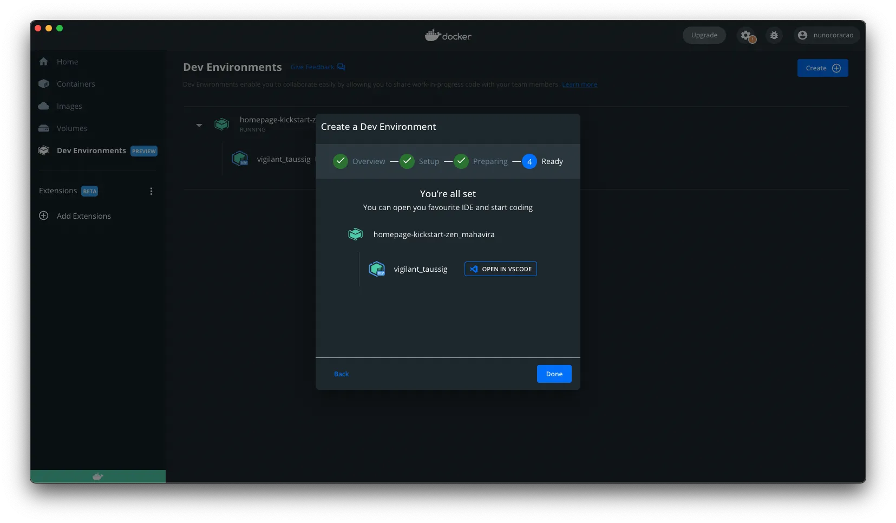
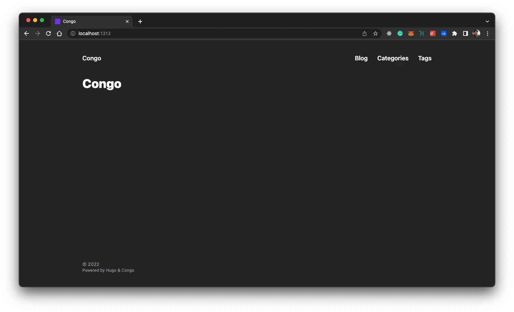
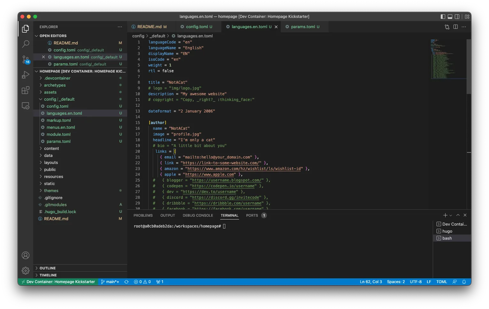
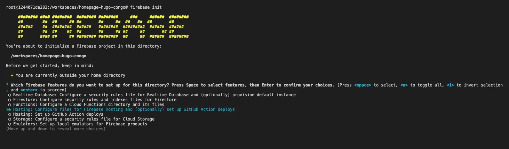

## TL;DR

現在、個人ウェブサイトを構築してホストするためのソリューションは数多くあります。有料ソリューションと同じ機能を無料で実現できるかチャレンジしてみました。その結果をご紹介します。

## なぜPMが自分でホームページを一から作るのか…

数ヶ月前、私は a) 文章力を鍛える b) 自分のアイデアにフィードバックをもらう、という目的でもっと文章を書きたいと思いました。この目標を念頭に、自分にとっても読者にとっても摩擦を生じさせないツール/プラットフォームを探し始めました（例えば有料にしないなど）。最終的に自分のウェブサイトを作ることに決めました。

これを試したかった理由がいくつかありました：

- 元ソフトウェアエンジニアリング学生として、まだ何かを組み合わせて動くものを作れるか、プログラミングについて学んだことを全て忘れていないか確認したかった

- 将来的にプラットフォームやサービスにロックインされる運用コストを避け、お金をかけずにウェブサイトを立ち上げられる柔軟な無料ソリューションを見つけたかった

- 読者がお金を払わなくても読めるコンテンツをホストしたかった

- <a target="_blank" href="https://docs.docker.com/desktop/dev-environments/">Dockerの開発環境</a>と<a target="_blank" href="https://github.com/microsoft/vscode-dev-containers">Microsoftの開発コンテナ</a>を試して、両方のソリューションに慣れたかった

## 始めましょう…

調査の結果、ウェブサイトジェネレーターフレームワークと無料ホスティングサービスを選ぶことにしました。ウェブサイトフレームワークには<a target="_blank" href="https://gohugo.io">Hugo</a>と<a target="_blank" href="https://github.com/jpanther/congoand">Congo</a>テーマを、ホスティングサービスには<a target="_blank" href="https://firebase.google.com">Firebase</a>を選びました。そして明らかな理由から、この実験でユーザーの立場に立つために<a target="_blank" href="https://www.docker.com">Docker</a>を使って開発環境をセットアップすることにしました。

どのフレームワークが最適かの深い分析はせず、MVPを早く出したかったので、いくつかのオプションを見て最初に気に入ったものを選びました。私が選んだものとは異なる機能やアプローチを持つ他のオプションもいくつかあります。他のオプションを探したい場合は、<a target="_blank" href="https://docusaurus.io/">Docusaurus</a>、<a target="_blank" href="https://www.gatsbyjs.com/">Gatsby</a>、<a target="_blank" href="https://jekyllrb.com/">Jekyll</a>、<a target="_blank" href="https://ghost.org/">Ghost</a>、さらには<a target="_blank" href="https://wordpress.com/">WordPress</a>などを検討できます。ホスティングについても同様で、私は<a target="_blank" href="https://firebase.google.com/">Firebase</a>を選びましたが、<a target="_blank" href="https://pages.cloudflare.com/">Cloudflare Pages</a>、<a target="_blank" href="https://pages.github.com/">GitHub Pages</a>、<a target="_blank" href="https://www.digitalocean.com/">Digital Ocean</a>、<a target="_blank" href="https://www.netlify.com/">Netlify</a>、<a target="_blank" href="https://vercel.com/">Vercel</a>などの他のソリューションも検討できます。このガイドについて提案があれば、お気軽にご連絡ください。いつでも喜んでお話しして学びます。


## ツール

このガイドでは、以下のツールを使用します。マシンにインストールしておく必要があります。各コンポーネントの用途と、インストール手順へのリンクを簡単に説明します。

- **Docker** - このプロジェクトの開発環境を設定するためにDockerを使用し、HugoとFirebase CLIを実行するために必要なすべてのソフトウェア（cURL、Go、Hugo、Node、NPMなど）のインストールをスキップできます。これにより、gitリポジトリから開始し、環境を起動して、CPUアーキテクチャ用の特定のコンパイラのインストール方法を何時間もかけて解明する代わりに、すぐにコードを書き始めることができます。<a target="_blank" href="https://www.docker.com/get-started/">Dockerをインストール</a>

- **Visual Studio Code** - 現在Visual Studio Codeをコードエディタとして使用しており、このガイドのすべての内容はこれを使用していることを前提としています。異なる好みがある場合は、同じ結果を得るためにこのガイドの一部を適応させる必要があります。<a target="_blank" href="https://code.visualstudio.com/">Visual Studio Codeをインストール</a>

## 開発環境のセットアップ

<a target="_blank" href="https://www.docker.com">Docker</a>を使用して開発環境を設定することから始めましょう。これにより、システム設定をいじることなく、必要なすべてのツールを含むコンテナを作成できます。さらに、個人マシンに日常的に必要としない古いバージョンのソフトウェアを残す代わりに、必要なときにコンテナを削除して再構築することも簡単になります。


注意：最終的なスケルトンのリポジトリをクローンしたいだけなら、<a target="_blank" href="https://github.com/nunocoracao/homepage-hugo-congo">このリポジトリ</a>をクローンしてデプロイセクションにスキップしてください




開発環境をセットアップする2つの方法を提供しますので、好みの方を選ぶか、両方を試して違いを探ってください。両方のオプションは、`klakegg/hugo:0.93.2-ubuntu`をベースイメージとして使用する私が作成した`Dockerfile`に依存しています。これはHugoの公式イメージではありませんが（現時点では存在しないため）、<a target="_blank" href="https://gohugo.io/getting-started/installing/#docker">彼らのウェブサイトで推奨されているもの</a>です。

### Dockerを使用する

開発環境を起動するには、Docker Dashboardを開き、左側の「Dev Environments」タブを選択します。開発環境がセットアップされていない場合は「Create New Environment」を選択し、そうでなければ右上の「Create」ボタンを使用します。セットアップステップに進みます。


ここで「Existing Git repo」オプションを選択し、以下のGitHub URLを使用します：

```
https://github.com/nunocoracao/homepage-kickstart
```


**注意：** リポジトリをローカルにクローンした場合は、ローカルフォルダから開始することもできます


コンテナが実行されると、以下の画像のようなものが表示されるはずです。




どちらの状況でも、「Open in VSCode」ボタンを見てクリックできます。これによりエディタが開き、作業を開始できます。そこからターミナルを開いて[サイトスケルトンの作成](#create-site-skeleton)に進みます

### Visual Studio Codeを使用する

開発環境設定を含むGitHubリポジトリをクローンすることから始めます。

```
git clone https://github.com/nunocoracao/homepage-kickstart
```

この方法では、コンテナを起動するために追加のVSCode拡張機能のインストールが必要です。**Remote - Containers**を検索してこのガイドを続けるために拡張機能をインストールしてください。

拡張機能のインストールに成功したら、VSCodeでソースフォルダを開き、左側の「Remote - Containers」拡張機能パネルを開きます。「Open Folder in Container」を選択して開発環境を含むコンテナを起動します。


イメージがビルドされている間、数分待ちます。Dockerはウェブサイト開発に必要なすべてのソフトウェアを含むイメージを作成しています。これは最初に環境を起動するときにのみ発生します。


イメージがビルドされると、VSCodeはコンテナを起動し、その中に作業環境を配置します（情報はウィンドウの左下隅で確認できます）。これでGo、Hugo、Firebase CLI、およびこのガイドに必要なすべてのツールを備えた開発環境が手に入りました。新しいターミナルを開くだけで、サイトの作成を始める準備ができています。


### ...でもローカルで全部実行したい

環境をローカルで実行することを好むか、必要とする場合は、以下のガイドに従ってセットアップに必要なものをすべてインストールしてください：

- **Homebrew** - <a target="_blank" href="https://brew.sh/">Homebrewをインストール</a>
- **Hugo** - <a target="_blank" href="https://gohugo.io/getting-started/installing/">Hugoをインストール</a>
- **Node.jsとNPM** - <a target="_blank" href="https://nodejs.org/en/download/">node.jsとNPMをインストール</a>（Firebase CLIのインストールが簡単になります）
- **Firebase CLI** - <a target="_blank" href="https://firebase.google.com/docs/cli#install_the_firebase_cli">Firebase CLIをインストール</a>

## サイトスケルトンの作成

開発環境が準備できたので、最初のステップはウェブサイトのベースバージョンを作成することです。以下のコマンドを実行して**Hugo**にフォルダテンプレートと設定ファイルを生成させましょう（`--force`パラメータは空でないディレクトリでHugoを実行するために必要です）：

```
hugo new site . --force
```
これにより、今は気にする必要のないフォルダセットがワークスペース内に作成されるはずです。次のステップはHugoのテーマをインストールすることです。私はウェブサイトに必要なすべての機能を備え、将来変更が必要な場合でも簡単に変更できそうだったので<a target="_blank" href="https://github.com/jpanther/congo">Congo</a>を選びました。別のテーマを試したい場合は、Hugoのドキュメントにいくつか利用可能で、それぞれにドキュメントと例があります。

git submodulesを使用してCongoをインストールするには、以下のコマンドを実行します：

```
git submodule add -b stable https://github.com/jpanther/congo.git themes/congo
```

次に、Congoが正しく動作するためにディレクトリとファイル構造にいくつかの変更を加える必要があります。このガイドでは何が起こっているかの詳細には触れません（詳しく知りたい場合はCongoのドキュメントを参照してください）。主なポイントは、HugoとCongoのすべての重要な設定ファイルを含む<code>config/_default/</code>フォルダを作成して設定することです。

以下のコマンドを順番に実行してください：

```
mkdir -p config/_default
rm config.toml
cp themes/congo/config/_default/*.toml config/_default/
echo 'theme = "congo"' | cat - config/_default/config.toml > temp && mv temp config/_default/config.toml
```

おめでとうございます、サイトが起動して実行されているはずです。Hugoのデバッグサーバーを実行して試してみましょう：

```
hugo server -D
```

お気に入りのブラウザを開き、<a target="_blank" href="http://localhost:1313">localhost:1313</a>に移動してページを確認してください。



上の画像のようなものが表示されるはずです。あまりエキサイティングには見えませんね？次のセクションでテーマを設定し、最初の記事を作成する方法を学びましょう。


## テーマの設定

ここでは、ウェブサイトの外観と感触を変更し、個人情報を追加し、ダークモードトグル（最近のウェブサイトで最も重要な機能）を有効にする方法を説明します。


注意、このテーマの非常にシンプルな設定を説明しています。このテーマでできることすべてを理解するには<a target="_blank" href="https://jpanther.github.io/congo/docs/">Congoテーマのドキュメント</a>を確認してください。


### プロフィール写真

サイトにプロフィール写真を追加することから始めましょう。プロジェクトのルートに「assets」というフォルダを作成します。プロフィール写真を選び、assetsフォルダ内に配置します。このガイドの残りの部分では、最終的な画像の名前が「profile.webp」であることを前提としていますので、画像の名前を変更するか、他のファイルを設定する際にそれを考慮してください。

<figure>
 	
  <figcaption>まだ適切な素晴らしい写真を撮る必要がある場合は、チュートリアルを進めるためにこれをダウンロードしてください。</figcaption>
</figure>


### 設定ファイル

いくつかの設定ファイルを開いて更新を始めましょう。変更するすべてのファイルは<code>config/_default/</code>フォルダ内にあります。

#### config.toml

<code>baseURL</code>パラメータのコメントを解除し、ウェブサイトの最終ドメインに置き換えます。この値は、検索エンジンがウェブサイトを正常にクロールしてインデックスするためのrobots.txtファイルの作成に使用されます。



注意：Google Analyticsを設定したい場合は、このファイルに次の行をあなたのIDで追加してください `googleAnalytics = "G-XXXXXX"`



#### languages.en.toml

このファイルは、ウェブサイトとページの作者（あなた）のメイン情報を駆動します。<code>title</code>と<code>description</code>をページに望むものに置き換えてください。これらの値はHTMLのtitleとdescriptionタグを駆動します。

<code>[author]</code>ブロック内で、プロフィールでハイライトしたい詳細を更新できます。最低限必要なのは<code>name</code>、<code>image</code>、<code>headline</code>、<code>links</code>です。<code>links</code>パラメータについては、これはjson配列なのでファイルの最後の行のコメントを解除することを忘れないでください。各エントリを個人のリンクで更新してください。



#### params.toml

これはBlowfishのメイン設定ファイルです。利用可能なビジュアルオプションやカスタマイズのほとんどは、これを使用して設定でき、テーマのいくつかの領域をカバーしています。このチュートリアルでは、いくつかの全体的な値とホームページ用のものを変更しました。他の利用可能な設定について詳しく知りたい場合は、<a target="_blank" href="https://jpanther.github.io/congo/docs/">Congoテーマのドキュメント</a>を参照してください。

<code>colorScheme</code>を「ocean」に変更しました。これはグローバルUIテーマを変更します。Congoはテーマ全体で使用される3色のパレットを定義しています。有効な値はcongo（デフォルト）、avocado、ocean、fire、slateです。これらはデフォルトのスキームですが、独自のものを作成することもできます。方法についてはテーマのメインドキュメントを参照してください。

<code>showAppearanceSwitcher</code>を有効にしてライト/ダークモードトグルを有効にしました。<code>enableSearch</code>を有効にして、サイトをビルドするたびにすべての将来の投稿をインデックス化し、シンプルな検索機能を提供します。<code>[homepage]</code>内の<code>layout</code>の値も「profile」に変更しました。これはランディングページのレンダリング方法を変更します。最後に、ここで興味深い値は<code>showRecent</code>で、オンにするとホームページに最近の投稿が表示されます。


### 最終

どのように見えるか確認しましょう。Hugoを再度実行します：

```
hugo server -D
```

<a target="_blank" href="http://localhost:1313">localhost:1313</a>に移動すると、以下のページのようなものが表示されるはずです。


おめでとうございます、素晴らしく見えます。最初の記事を生成する方法を学びましょう。

## 記事の生成方法

Hugoは、ベースのタグセットが既に含まれた記事（<a target="_blank" href="https://www.markdownguide.org/">markdown</a>ファイル）を生成するためのツールを提供しています。以下のコマンドを実行して最初の投稿を作成します

```
hugo new posts/my-first-post.md
```

ファイルの内容を以下のものに置き換えます：

```
---
title: "My Published Post"
date: 2022-06-19T20:10:29Z
draft: false
categories: ["published", "test"]
tags: ["first", "awesome"]
---

This is my first blog post
```

これで最初のブログ投稿が作成されました。いくつかのカテゴリとタグを追加しました。これらはビルド時にHugoによってインデックス化されます。これらのタグは、ウェブサイトのカテゴリとタグセクションを自動的に作成するために使用されます。公開された投稿をシミュレートするために<code>draft</code>をfalseに変更したことに注意してください。

以下のコマンドを実行して2番目の投稿を作成します

```
hugo new posts/my-draft-post.md
```
そしてそのファイルの内容を以下のものに置き換えます：

```markdown
---
title: "My Draft Post"
date: 2022-06-19T20:20:39Z
draft: true
categories: ["draft", "test"]
tags: ["second", "awesome"]
---

This is my second blog post
```
2番目の投稿では、下書き投稿をシミュレートするために<code>draft</code>パラメータをtrueのままにしました。

Hugoは最終サイト生成から下書き投稿を自動的に非表示にします。下書きラベルをtrueのままにして記事の作業を続けることができ、エンジンによって無視されます。DEBUGモードで実行したい場合は、以下のコマンドを使用します：

```
hugo server -D
```

サイトの投稿に行くと、両方のエントリが表示されるはずです。その後、通常モードでサーバーを実行すると、下書き記事は消えます。以下のコマンドを使用してこれを行うことができます：


```
hugo server
```

このコマンドを使用して、最終ビルドを生成する前にウェブサイトや記事の最終バージョンをテストできます。準備ができたら、'hugo'コマンドを使用して/publicフォルダ内に最終ウェブサイトを生成します。

```
hugo
```

すべてのファイルは<a target="_blank" href="https://en.wikipedia.org/wiki/Markdown">Markdown</a>で書かれており、Hugoはそれを使用して最終ページを生成します。このガイドではmarkdownファイルの書き方は教えませんが、この<a target="_blank" href="https://www.markdownguide.org/getting-started/">「入門」</a>チュートリアルとこの<a target="_blank" href="https://www.markdownguide.org/cheat-sheet/">「チートシート」</a>を始めるために推奨できます。

## デプロイ

さて、ウェブサイトを設定していくつかの記事を作成しましたが、まだどこかにデプロイする必要があります。前に述べたように、このガイドではFirebaseを選びました。単純なホスティングサービス以上のものを提供していることは知っていますが、あまり手間をかけずに無料でサイトをホストできます。

### Firebaseプロジェクトの作成

<a target="_blank" href="https://firebase.google.com">https://firebase.google.com</a>に行ってアカウントを作成することから始めましょう。完了したら、無料でプロジェクトを作成できます。プロセスは簡単で、完了するとFirebaseのプロジェクトダッシュボードにいるはずです。

### Firebaseのセットアップ

これで、Firebase CLIツールがインストールされて準備完了の環境に戻ることができます。以下を使用して認証することから始めましょう：

```
firebase login
```
正常にログインしたら、firebaseのプロジェクト設定を開始する必要があります。そのために以下を使用してください：

```
firebase init
```

ツールは、Firebaseプロジェクトを設定するためのさまざまなオプションを提供します。今のところ、ホスティングを設定するだけです。GitHubを使用している場合は、GitHub actionデプロイを設定することを検討するかもしれません。これにより、特定のブランチへのプッシュやマージされたプルリクエストがあるたびにサイトを自動的にビルドしてデプロイできます。



以前に作成したFirebaseプロジェクトをホスティング先として選択します。そして、デプロイプロセスに望む設定を選択します。ここで重要なのは、サーバーへの最終ファイルが配置されるフォルダで、これは<code>public</code>フォルダです。他のパラメータについては、ユースケースに最適なものを実験してください。以下の画像は私が選んだものを示しています（*注意：このチュートリアルではGitHub actionsを設定しませんでしたが、実際のセットアップではそれを使用しています*）。


### デプロイ

さて、長くて退屈なデプロイプロセスです…冗談です！準備ができて、<code>hugo</code>コマンドですべてのファイルがpublicフォルダに生成されたら、以下のコマンドを使用してデプロイするだけです：

```
firebase deploy
```


プロセスは数秒かかり、サイトがデプロイされます。CLIツールの最後の行に自分で確認するためのURLが表示されます。そうでなければ、Firebaseダッシュボードのホスティングセクションを探索すると、デプロイに関する詳細情報が表示されます。


## 結論

これで、ニーズに合わせて設定できるウェブサイトのシンプルなバージョンができたはずです。このソリューションの主な利点は、特にHugoのテーマカタログを探索する時間を取れば、さまざまなニーズに対応できる柔軟性と拡張性です。確かに、複雑なものを実装するにはいくつかのコーディングが必要かもしれませんが、これはほぼ全員の問題を解決すると思います。

何よりも、始めたいけどお金をかけられない（またはかけたくない）場合は、完全に無料のソリューションです。このガイドがお役に立てば幸いです。ネットワークで共有し、時間をかけて改善できるようにフィードバックをください。

## リソース

- <a target="_blank" href="https://github.com/nunocoracao/homepage-kickstart">開発環境用GitHubリポジトリ</a>
- <a target="_blank" href="https://github.com/nunocoracao/homepage-hugo-congo">ベースHugoとCongo設定用GitHubリポジトリ</a>
- <a target="_blank" href="https://github.com/nunocoracao/homepage-dockerimage">ベースイメージ用GitHubリポジトリ</a>
- <a target="_blank" href="https://hub.docker.com/r/nunocoracao/homepage-dockerimage">Docker HubイメージURL</a>
- <a target="_blank" href="https://gohugo.io/documentation/">Hugoのドキュメント</a>
- <a target="_blank" href="https://github.com/jpanther/congo">Congoのドキュメント</a>
- <a target="_blank" href="https://firebase.google.com/docs">Firebaseドキュメント</a>
- <a target="_blank" href="https://www.markdownguide.org/">Markdownガイド</a>
- <a target="_blank" href="https://www.markdownguide.org/getting-started/">Markdown入門</a>
- <a target="_blank" href="https://www.markdownguide.org/cheat-sheet/">Markdownチートシート</a>
