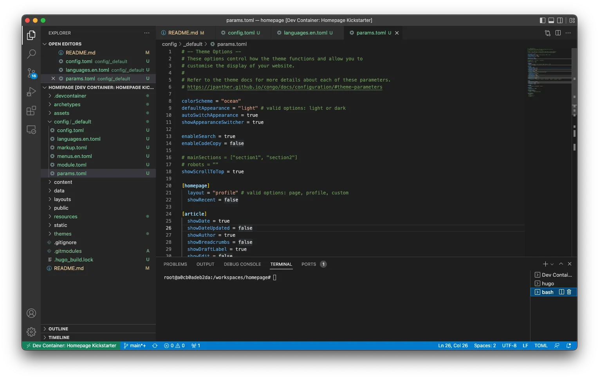

## TL;DR

Atualmente, existem várias soluções para criar e hospedar o seu website pessoal. Quis desafiar-me para ver se conseguia fazê-lo com as mesmas funcionalidades de algumas soluções pagas, mas de graça. Aqui estão os resultados.

## Porque é que um PM construiria a sua própria homepage de raiz…

Há uns meses atrás, decidi que queria começar a escrever mais para a) exercitar as minhas capacidades de escrita e b) obter feedback sobre algumas das minhas ideias. Com este objetivo em mente, comecei a pesquisar ferramentas/plataformas que me ajudassem a publicar sem criar demasiada fricção para mim ou para quem quisesse ler, por exemplo, sem ter de pagar. No final, decidi criar o meu próprio website.

Tinha algumas razões para querer experimentar isto:

- Desafiar-me para ver se eu, um antigo estudante de engenharia de software, ainda conseguia montar algo que funcionasse e sentir-me bem por não ter esquecido tudo o que aprendi sobre programação,

- Encontrar uma solução gratuita e flexível que me permitisse lançar o meu website sem investir dinheiro logo de início, ou seja, evitar custos operacionais com plataformas e serviços que me prenderiam no futuro,

- Hospedar o meu conteúdo num sítio que não exigisse que as pessoas pagassem para ler,

- Brincar com os <a target="_blank" href="https://docs.docker.com/desktop/dev-environments/">ambientes de desenvolvimento do Docker</a> e os <a target="_blank" href="https://github.com/microsoft/vscode-dev-containers">containers de desenvolvimento da Microsoft</a> para me familiarizar com ambas as soluções.

## Vamos começar…

Depois de alguma pesquisa, decidi escolher um framework gerador de websites e um serviço de alojamento gratuito. Para o framework do website, escolhi o <a target="_blank" href="https://gohugo.io">Hugo</a> com o <a target="_blank" href="https://github.com/jpanther/congoand">Congo</a> como tema, e para o serviço de alojamento o <a target="_blank" href="https://firebase.google.com">Firebase</a>. E por razões óbvias, decidi configurar o meu ambiente de desenvolvimento usando <a target="_blank" href="https://www.docker.com">Docker</a> para me colocar na pele do utilizador nesta experiência.

Não fiz uma análise profunda de qual framework seria o melhor para o meu problema porque queria lançar um MVP rapidamente, então passei por algumas opções e escolhi a primeira de que gostei. Existem várias outras opções com funcionalidades e abordagens diferentes. Se quiser explorar outras opções, aqui estão algumas que pode considerar: <a target="_blank" href="https://docusaurus.io/">Docusaurus</a>, <a target="_blank" href="https://www.gatsbyjs.com/">Gatsby</a>, <a target="_blank" href="https://jekyllrb.com/">Jekyll</a>, <a target="_blank" href="https://ghost.org/">Ghost</a>, e até <a target="_blank" href="https://wordpress.com/">WordPress</a>. O mesmo se aplica à parte do alojamento: embora tenha escolhido o <a target="_blank" href="https://firebase.google.com/">Firebase</a>, existem outras soluções como <a target="_blank" href="https://pages.cloudflare.com/">Cloudflare Pages</a>, <a target="_blank" href="https://pages.github.com/">GitHub Pages</a>, <a target="_blank" href="https://www.digitalocean.com/">Digital Ocean</a>, <a target="_blank" href="https://www.netlify.com/">Netlify</a>, <a target="_blank" href="https://vercel.com/">Vercel</a>, e outras que pode considerar explorar. Se tiver sugestões para este guia, sinta-se à vontade para entrar em contacto, estou sempre feliz por conversar e aprender.


## Ferramentas

Para este guia, vou usar as seguintes ferramentas, que devem estar instaladas na sua máquina. Aqui está uma breve explicação de para que cada componente será usado e um link para as instruções de instalação.

- **Docker** - Vou usar o Docker para configurar um ambiente de desenvolvimento para este projeto, de modo a podermos saltar a necessidade de instalar todo o software necessário para executar o Hugo e o Firebase CLI, ou seja, cURL, Go, Hugo, Node, NPM, etc. Isto permitir-lhe-á começar a partir de um repositório git, iniciar o ambiente e ir diretamente para escrever código em vez de passar horas a descobrir como instalar um compilador específico para a sua arquitetura de CPU. <a target="_blank" href="https://www.docker.com/get-started/">Instalar Docker</a>

- **Visual Studio Code** - Estou a usar o Visual Studio Code como o meu editor de código de momento, e todo o material no guia assume que é isto que está a usar. Se tiver uma preferência diferente, terá de adaptar algumas partes deste guia para obter os mesmos resultados. <a target="_blank" href="https://code.visualstudio.com/">Instalar Visual Studio Code</a>

## Configurar o Ambiente de Desenvolvimento

Vamos começar por configurar o seu ambiente de desenvolvimento usando <a target="_blank" href="https://www.docker.com">Docker</a>. Isto permitir-lhe-á criar um container com todas as ferramentas de que precisa sem ter de mexer nas configurações do seu sistema. Além disso, também tornará mais fácil simplesmente apagar o container e reconstruí-lo quando precisar, em vez de manter versões antigas de software que não precisa diariamente na sua máquina pessoal.


Nota: Se apenas quiser clonar um repo com o esqueleto final, sinta-se à vontade para clonar <a target="_blank" href="https://github.com/nunocoracao/homepage-hugo-congo">este repo</a> e saltar para a secção de deploy




Vou fornecer duas formas de configurar o seu ambiente de desenvolvimento: escolha a que preferir ou experimente ambas para explorar as diferenças. Ambas as opções dependem de um `Dockerfile` criado por mim que usa `klakegg/hugo:0.93.2-ubuntu` como imagem base. Embora esta não seja a imagem oficial do Hugo (uma vez que não existe uma de momento), é a <a target="_blank" href="https://gohugo.io/getting-started/installing/#docker">recomendada no seu website</a>.

### Usando Docker

Para iniciar um Dev Environment, abra o Docker Dashboard e selecione o separador "Dev Environments" à esquerda. Se não tiver ambientes de desenvolvimento configurados, selecione "Create New Environment", caso contrário use o botão "Create" no canto superior direito. Prossiga para o passo de configuração.


Aqui escolha a opção "Existing Git repo" e use o seguinte URL do GitHub:

```
https://github.com/nunocoracao/homepage-kickstart
```


**Nota:** Se clonar o repo localmente, também pode começar a partir da pasta local


Assim que o container estiver a correr, deverá ver algo semelhante às imagens abaixo.


Em ambas as situações, poderá ver e clicar no botão "Open in VSCode" que abrirá o editor e permitir-lhe-á começar a trabalhar. A partir daí, abra um terminal e prossiga para [criar o esqueleto do site](#create-site-skeleton)

### Usando Visual Studio Code

Comece por clonar o repositório GitHub com as configurações do ambiente de desenvolvimento.

```
git clone https://github.com/nunocoracao/homepage-kickstart
```

Este método requer a instalação de uma extensão VSCode adicional para iniciar os containers. Por favor procure por **Remote - Containers** e instale a extensão para continuar este guia.

Depois de instalar a extensão com sucesso, abra a sua pasta de código no VSCode e abra o painel da extensão "Remote - Containers" à esquerda. Selecione "Open Folder in Container" para iniciar um container com o ambiente de desenvolvimento.


Aguarde alguns minutos enquanto a imagem é construída. O Docker está a criar uma imagem com todo o software necessário para o desenvolvimento do website. Isto só acontecerá na primeira vez que iniciar o ambiente.


Assim que a imagem estiver construída, o VSCode iniciará o container e colocará o seu ambiente de trabalho dentro dele (informação disponível no canto inferior esquerdo da janela). Agora tem um ambiente de desenvolvimento com Go, Hugo, Firebase CLI e todas as ferramentas de que precisará para este guia. Basta abrir um novo terminal e está pronto para começar a criar o seu site.


### ...mas eu quero mesmo executar tudo localmente

Se preferir ou precisar de executar o seu ambiente localmente, siga os guias abaixo para instalar tudo o que precisa:

- **Homebrew** - <a target="_blank" href="https://brew.sh/">Instalar homebrew</a>
- **Hugo** - <a target="_blank" href="https://gohugo.io/getting-started/installing/">Instalar Hugo</a>
- **Node.js e NPM** - <a target="_blank" href="https://nodejs.org/en/download/">Instalar node.js & NPM</a> (mais fácil para instalar o Firebase CLI)
- **Firebase CLI** - <a target="_blank" href="https://firebase.google.com/docs/cli#install_the_firebase_cli">Instalar Firebase CLI</a>

## Criar o Esqueleto do Site

Agora que temos um ambiente de desenvolvimento a correr, o primeiro passo é criar a versão base do seu website. Para isto, vamos usar o **Hugo** para gerar o template de pastas e ficheiros de configuração de que precisamos executando o seguinte comando (o parâmetro `--force` é necessário para executar o Hugo num diretório não vazio):

```
hugo new site . --force
```
Isto deverá ter criado um conjunto de pastas no seu workspace com as quais não precisa de se preocupar por agora. O próximo passo é instalar um tema para o Hugo. Escolhi o <a target="_blank" href="https://github.com/jpanther/congo">Congo</a> porque tinha todas as funcionalidades de que precisava para o meu website e parecia fácil de alterar se alguma vez precisasse. Se quiser experimentar um tema diferente, existem vários disponíveis na documentação do Hugo, cada um com documentação e exemplos.

Instale o Congo usando git submodules executando o seguinte comando:

```
git submodule add -b stable https://github.com/jpanther/congo.git themes/congo
```

Agora precisamos de fazer algumas alterações à estrutura de diretórios e ficheiros para que o Congo funcione corretamente. Não vou entrar em detalhes sobre o que está a acontecer neste guia (pode consultar a documentação do Congo se quiser saber mais). O ponto principal é que estamos a criar e configurar uma pasta em <code>config/_default/</code> que conterá todos os ficheiros de configuração importantes para o Hugo e Congo.

Por favor execute os seguintes comandos por ordem:

```
mkdir -p config/_default
rm config.toml
cp themes/congo/config/_default/*.toml config/_default/
echo 'theme = "congo"' | cat - config/_default/config.toml > temp && mv temp config/_default/config.toml
```

Parabéns, o seu site deve estar a funcionar agora. Vamos experimentá-lo executando o servidor de debug do Hugo:

```
hugo server -D
```

Por favor abra o seu browser favorito e navegue para <a target="_blank" href="http://localhost:1313">localhost:1313</a> para ver a sua página.


Deverá ver algo semelhante à imagem acima. Não parece muito emocionante, pois não? Vamos configurar o tema nas próximas secções e aprender como criar o seu primeiro artigo.


## Configurar o Tema

Agora vou explicar como alterar o aspeto do seu website, adicionar algumas informações pessoais e ativar o alternador de modo escuro (também conhecido como a funcionalidade mais importante em qualquer website nos dias de hoje).


Uma nota: estou a cobrir uma configuração muito simples para este tema. Por favor consulte a <a target="_blank" href="https://jpanther.github.io/congo/docs/">documentação do tema Congo</a> para entender tudo o que pode fazer com este tema.


### Foto de Perfil

Vamos começar por adicionar uma foto de perfil ao seu site. Crie uma pasta chamada "assets" na raiz do seu projeto. Escolha uma foto de perfil e coloque-a dentro da pasta assets. O resto do guia assume que a imagem final se chama "profile.webp", por isso renomeie a sua imagem ou tenha isso em conta ao configurar alguns dos outros ficheiros.

<figure>
 	
  <figcaption>Se ainda precisar de tirar uma foto adequada para isto, sinta-se à vontade para descarregar esta para prosseguir com o tutorial.</figcaption>
</figure>


### Ficheiros de Configuração

Vamos abrir alguns ficheiros de configuração e começar a atualizá-los. Todos os ficheiros que vamos alterar estão dentro da pasta <code>config/_default/</code>.

#### config.toml

Descomente o parâmetro <code>baseURL</code> e substitua-o pelo domínio final do seu website. Este valor será usado para criar o ficheiro robots.txt para que os motores de busca possam rastrear e indexar o seu website com sucesso.



Nota: se quiser configurar o Google Analytics, por favor adicione a seguinte linha com o seu id a este ficheiro `googleAnalytics = "G-XXXXXX"`



#### languages.en.toml

Este ficheiro conduzirá as informações principais do website e do autor da página (você). Substitua <code>title</code> e <code>description</code> pelos que quer para a sua página, estes valores conduzirão as tags HTML title e description.

Dentro do bloco <code>[author]</code> pode atualizar os detalhes que deseja destacar no seu perfil. O mínimo seria <code>name</code>, <code>image</code>, <code>headline</code> e <code>links</code>. Para o parâmetro <code>links</code> não se esqueça de descomentar a última linha do ficheiro, pois isto é um array json. Atualize cada entrada com os seus links pessoais.


#### params.toml

Este ficheiro define grande parte do comportamento geral em todo o framework. Para este tutorial, alterei alguns valores gerais e um para a homepage. Se quiser saber mais sobre as outras configurações disponíveis, por favor consulte a <a target="_blank" href="https://jpanther.github.io/congo/docs/">documentação do tema Congo</a>.

Alterei o <code>colorScheme</code> para "ocean" que muda o tema UI global. O Congo define uma paleta de três cores que é usada em todo o tema. Os valores válidos são congo (padrão), avocado, ocean, fire e slate. Embora estes sejam os esquemas padrão, também pode criar os seus próprios. Consulte a documentação principal do tema para saber como.

Ativei o <code>showAppearanceSwitcher</code> para ativar o alternador de modo claro/escuro. Ativei o <code>enableSearch</code> que indexa todos os posts futuros cada vez que constrói o site e fornece uma funcionalidade de pesquisa simples. Também alterei o valor de <code>layout</code>, dentro de <code>[homepage]</code>, para "profile" que muda a forma como a landing page é renderizada. Finalmente, o último valor interessante aqui é <code>showRecent</code>, que quando ativado mostra os posts recentes na homepage.



### Final

Vamos ver como fica, execute o Hugo novamente:

```
hugo server -D
```

E navegue para <a target="_blank" href="http://localhost:1313">localhost:1313</a>, deverá ver algo semelhante à página abaixo.


Parabéns, está com ótimo aspeto. Vamos aprender como gerar os seus primeiros artigos.

## Como Gerar Artigos

O Hugo fornece algumas ferramentas para gerar os seus artigos (ficheiros <a target="_blank" href="https://www.markdownguide.org/">markdown</a>) com um conjunto base de tags já incluídas. Execute o seguinte comando para criar o seu primeiro post

```
hugo new posts/my-first-post.md
```

substitua o conteúdo do ficheiro pelo seguinte:

```
---
title: "My Published Post"
date: 2022-06-19T20:10:29Z
draft: false
categories: ["published", "test"]
tags: ["first", "awesome"]
---

This is my first blog post
```

Isto acabou de criar o seu primeiro post de blog. Adicionámos algumas categorias e tags, que serão indexadas pelo Hugo durante o tempo de build. Estas tags serão usadas para criar automaticamente a secção de Categorias e Tags do website. Note que alterei <code>draft</code> para false para simular um post publicado.

Execute o seguinte comando para criar o seu segundo post

```
hugo new posts/my-draft-post.md
```
e substitua o conteúdo desse ficheiro pelo seguinte:

```markdown
---
title: "My Draft Post"
date: 2022-06-19T20:20:39Z
draft: true
categories: ["draft", "test"]
tags: ["second", "awesome"]
---

This is my second blog post
```
Para o segundo post, deixei o parâmetro <code>draft</code> como true para simular um rascunho.

O Hugo esconde automaticamente os posts de rascunho da geração final do site. Pode continuar a trabalhar em artigos deixando a etiqueta draft como true e eles serão ignorados pelo motor. Se quiser executar em modo DEBUG use simplesmente o comando:

```
hugo server -D
```

Se for aos posts no site, deverá conseguir ver ambas as entradas. Se depois executar o servidor em modo normal, os artigos de rascunho desaparecerão. Pode usar o comando abaixo para isso:


```
hugo server
```

Pode usar este comando para testar a versão final do website ou de um artigo antes de gerar o build final. Quando estiver pronto, use simplesmente o comando 'hugo' para gerar o website final dentro da pasta /public.

```
hugo
```

Todos os ficheiros são escritos em <a target="_blank" href="https://en.wikipedia.org/wiki/Markdown">Markdown</a> que o Hugo depois usa para gerar as páginas finais. Não vou ensinar-lhe como escrever ficheiros markdown neste guia, mas posso recomendar este tutorial <a target="_blank" href="https://www.markdownguide.org/getting-started/">"para começar"</a> e esta <a target="_blank" href="https://www.markdownguide.org/cheat-sheet/">"cheat sheet"</a> para o iniciar.

## Deploy

Ok, configurou o seu website e criou alguns artigos, mas ainda precisamos de fazer deploy nalgum sítio. Como mencionei antes, escolhi o Firebase para este guia. Embora saiba que oferece muito mais do que apenas um serviço de alojamento simples, permite-me hospedar o meu site gratuitamente sem muitas complicações.

### Criar Projeto Firebase

Vamos começar por ir a <a target="_blank" href="https://firebase.google.com">https://firebase.google.com</a> e criar uma conta. Assim que isso estiver feito, pode criar um projeto gratuitamente. O processo deve ser simples e quando terminar deverá estar no dashboard do projeto Firebase.

### Configurar Firebase

Agora pode voltar ao seu ambiente que já tem as ferramentas Firebase CLI instaladas e prontas a usar. Vamos começar por nos autenticar usando:

```
firebase login
```
Assim que estiver autenticado com sucesso, precisa de iniciar as configurações do projeto para o firebase. Para isso use:

```
firebase init
```

A ferramenta oferecerá uma grande variedade de opções diferentes para configurar o seu projeto Firebase. Por agora, queremos apenas configurar o hosting. Se estiver a usar o GitHub, pode considerar configurar deploys com GitHub action que podem automaticamente construir e fazer deploy do seu site sempre que houver um push para um branch específico ou um pull request merged.


Escolha o projeto Firebase criado antes como destino do hosting. E selecione as configurações que deseja para o processo de deployment. A importante aqui é a pasta onde os ficheiros finais para o servidor serão colocados e esta é a pasta <code>public</code>. Para os outros parâmetros pode experimentar o que melhor se adequa ao seu caso de uso. A imagem abaixo mostra o que escolhi (*Nota: para este tutorial não configurei GitHub actions mas estou a usá-las na minha configuração real*).


### Deploy

Ok, agora para o longo e aborrecido processo de deployment… estou a brincar! Assim que estiver pronto e tiver todos os seus ficheiros gerados pelo comando <code>hugo</code> na pasta public, use simplesmente o seguinte comando para fazer deploy:

```
firebase deploy
```


O processo deverá demorar alguns segundos e pronto, o seu site está deployed. A última linha da ferramenta CLI dar-lhe-á um URL para ver por si mesmo. Caso contrário, pode explorar a secção de hosting do seu dashboard Firebase que terá mais informações sobre o deployment.


## Conclusão

Até agora deverá ter uma versão simples do seu website que pode configurar de acordo com as suas necessidades. A principal vantagem desta solução é que é flexível e extensível a uma variedade de necessidades diferentes, especialmente se dedicar tempo a explorar o catálogo de temas do Hugo. É verdade que pode requerer alguma programação para implementar coisas complexas, mas eu diria que isto resolve o problema para quase toda a gente.

Acima de tudo, é uma solução completamente gratuita se está à procura de começar e não pode (ou não quer) gastar dinheiro. Espero que este guia o ajude, sinta-se à vontade para o partilhar com a sua rede e dar-me feedback para que eu possa melhorá-lo ao longo do tempo.

## Recursos

- <a target="_blank" href="https://github.com/nunocoracao/homepage-kickstart">Repositório GitHub para ambiente de desenvolvimento</a>
- <a target="_blank" href="https://github.com/nunocoracao/homepage-hugo-congo">Repositório GitHub para configuração base Hugo e Congo</a>
- <a target="_blank" href="https://github.com/nunocoracao/homepage-dockerimage">Repositório GitHub para imagem base</a>
- <a target="_blank" href="https://hub.docker.com/r/nunocoracao/homepage-dockerimage">URL da imagem Docker Hub</a>
- <a target="_blank" href="https://gohugo.io/documentation/">Documentação Hugo</a>
- <a target="_blank" href="https://github.com/jpanther/congo">Documentação Congo</a>
- <a target="_blank" href="https://firebase.google.com/docs">Documentação Firebase</a>
- <a target="_blank" href="https://www.markdownguide.org/">Guia Markdown</a>
- <a target="_blank" href="https://www.markdownguide.org/getting-started/">Markdown Para Começar</a>
- <a target="_blank" href="https://www.markdownguide.org/cheat-sheet/">Cheat Sheet Markdown</a>
