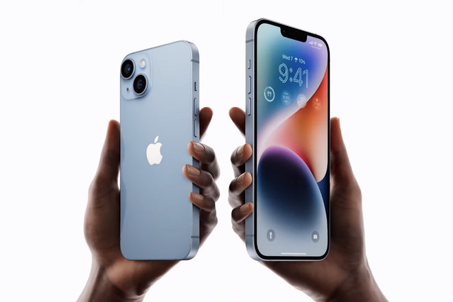

# Apple: iPhone 14, Watch 8, and Sustaining Innovation

Last week, Apple held its “Far Out” iPhone event. New iPhones, Apple Watches, and AirPods were announced, each coming with a plethora of features. Yes, all of it was innovation, but none of it brought the kind of excitement Apple used to. Why is that? And why is probably the best strategy for Apple at this stage.

## Apple’s Announcements
Let’s start at the beginning, what happened on the event. Apple launched the new iPhone 14 line, 2 new Apple Watches, and new AirPods Pro. I will focus just on the iPhones and watches.

### iPhone
During the event, Apple launched four new iPhones: iPhone 14, iPhone 14 Plus, iPhone 14 Pro, and iPhone 14 Pro Max. The base models run last year’s, iPhone 13 Pro, A15 Bionic chip. 

Both Pro models will run on the new A16 Bionic chip. Apple changed the front-facing camera notch into a “dynamic island”, which is an interesting software solution to the front-camera holes. The Pro models will have always-on displays.

All models will drop the physical SIM tray in the US and will be eSIM only, and they will have emergency satellite connectivity. If you are in a spot with no Wi-Fi/cell connectivity and require assistance, these new iPhones will be able to connect to satellites to send compressed emergency alerts and messages. Apple says the satellite service will be included for free for two years, but hasn’t yet mentioned the cost after that. I’m really looking forward to the YouTube videos of people testing this last one.

### Watch
Apple Watch Series 8 looks exactly like the Series 7 with a couple of new tricks under the hood. New temperature sensors that can be used to help wearers more accurately track ovulation cycles. A new sensor suite that can detect if you’re in a car crash and begin the process of contacting emergency services. Basically, last year’s model with a couple of new feature you probably don’t need. I was honestly confused when someone announced “low-power mode” as a new feature of the Apple Watch 8. If I remember correctly, I have that since my Apple Watch Series 2.

Apple also launched a new premium watch, the Apple Watch Ultra, designed for athletes. This one brings in plenty of features that an average person will probably never need: the ability to dive to 39 m, a 86db siren if you need to ask for help, improved GPS sensors to help track direction and distance and so on. The really amazing feature, the battery lasts 36 hours.

## Why It’s Not the Same
People still remember the legendary announcements of the iPod, the iPhone, or the original MacBook Air. However, present day Apple is not the same company that generated those massive innovations. At the time, Apple was on a position of whether to disrupt the market or die. Now, Apple is one of the biggest companies of all time, valued at $2.4T (yes, T as in trillion). As an incumbent, its incentives changed dramatically and for a while now, Apple is in a cycle of **sustaining innovation**.

## Sustaining Innovation
There are three types of innovations: **Sustaining Innovations**, **Low-End disruptions**, and **New-Market disruptions**. Sustaining innovation, usually happens when a company becomes a market leader and is leading technology innovation in its space. Organizations that reach this stage see their incentives change dramatically. 

Instead of focusing on something dramatically different and disruptive, companies end up slowing down their innovation speed and settle for providing ever-better products that can sell for ever-better profits to their very best customers. I.e., the game becomes about staying on the top, not getting there. 

Ultimately, a sustaining innovation makes good products into better products, which is not a bad strategy at all. Sustaining innovation can be characterized in three different aspects: **performance**, **customers**, and **business model**.

### Performance - tbd
Performance improvement in attributes most valued by the industry’s most demanding customers. These improvements may be incremental or breakthrough in character. Allows you to give better products than you have been able to offer before in the market. A sustaining innovation makes good products into better products.

### Customers - tbd

The second characteristic of sustaining innovations is that it targets the people at the high end of the market who almost always are your most profitable customers. That's the second characteristic. 

Customers
The most attractive (i.e., profitable) customers in the mainstream markets who are willing to pay for improved performance.  

Increase of pro entry model $300
launch of apple watch ultra

### Business Model

The third  characteristic of sustaining innovation is that Improves or maintains profit margins. The new revenue is achieved by exploiting the existing processes and cost structures and by making better use of current competitive advantages. 

If we compare the prices between this year’s event and last year’s one there is a clear increase in some of the products. Given the similarity of the hardware between last year and this year’s models I would guess the cost remain relative similar, which would lead to an increase in the profit margin.  

| Products and Starting Prices | 2021                             | 2022                             | Delta                            |
| ---------------------------- | -------------------------------- | -------------------------------- | -------------------------------- |
| iPhone line                  | (13) $799 (13 mini) $699         | (14 Plus) $899 (14) $799         | $100 per unit                    |
| iPhone Pro line              | (13 Pro Max) $1099 (13 Pro) $699 | (14 Pro Max) $1099 (14 Pro) $999 | $300 per unit on the entry model |
| Apple Watch                  | (Watch 7) $399                   | $399                             | n/a                              |
| Apple Watch Ultra            | n/a                              | $799                             | New revenue                      |

2022 prices form [https://techcrunch.com/2022/09/07/heres-everything-apple-announced-today-at-its-far-out-iphone-event/](https://techcrunch.com/2022/09/07/heres-everything-apple-announced-today-at-its-far-out-iphone-event/)
 2021 prices prices from [https://www.engadget.com/apple-iphone-13-event-supercut-201538409.html](https://www.engadget.com/apple-iphone-13-event-supercut-201538409.html?guccounter=1&guce_referrer=aHR0cHM6Ly93d3cuZ29vZ2xlLmNvbS8&guce_referrer_sig=AQAAAJHCQJuqijWGILQQtBdO03CUzWyZ0bdhUqKzXFtiAWL8sYd9fZ1JICKwocw4xSc5MxaYDdGaPH2JiuehPL9I-YzbzjDP68o5Ngw_sN9iuObwuKmXvdpiDQ2YT6LrVQh4bGhajBg5r56z_LXxGRDNn1BsVnDMSjRUmekCbQykJZkW)

## What Will Happen Next? - tbd

And because of these characteristics-- better products that you could sell for better profits to your best customers-the incumbent leaders of an industry almost always win in battles of sustaining innovations.

Apple is competing against itself