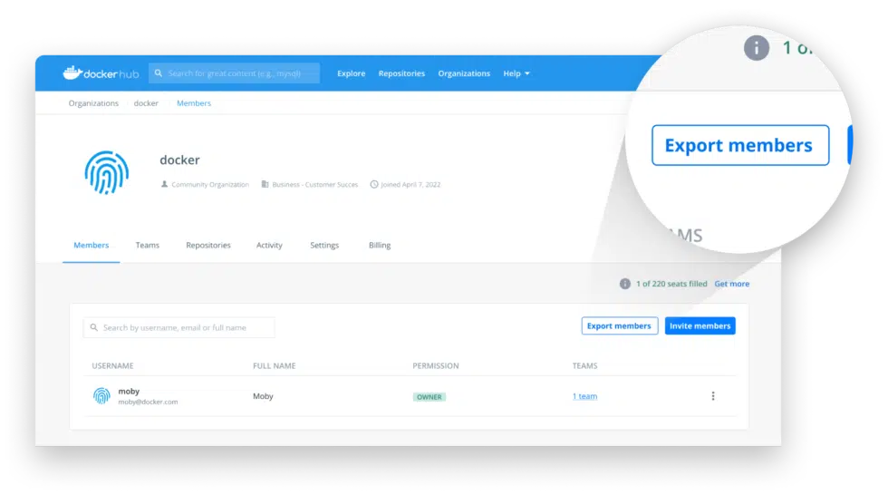


This article was originally published externally, read the original <a target="_blank" href="https://www.docker.com/blog/announcing-docker-hub-export-members/">here</a>.


Docker Hub’s Export Members functionality is now available, giving you the ability to export a full list of all your Docker users into a single CSV file. The file will contain their username, full name, and email address — as well as the user’s current status and if the user belongs to a given team. If you’re an administrator, that means you can quickly view your entire organization’s usage of Docker.

In the Members Tab, you can download a CSV file by pressing the `Export members` button. The file can be used to verify user status, confirm team structure, and quickly audit Docker usage.

The Export Members feature is only available for Docker Business subscribers. This feature will help organizations better track their utilization of Docker, while also simplifying the steps needed for an administrator to review their users within Docker Hub. 

At Docker, we continually listen to our customers, and strive to build the tools needed to make them successful. Feel free to check out our <a target="_blank" href="https://github.com/docker/roadmap">public roadmap</a> and leave feedback or requests for more features like this!

Learn more about exporting users on our <a target="_blank" href="https://docs.docker.com/docker-hub/members/#invite-members">docs page</a>, or <a target="_blank" href="http://hub.docker.com/login">sign in to your Docker Hub account</a> to try it for yourself.