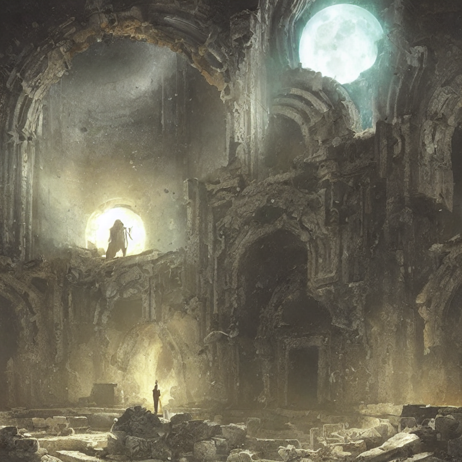
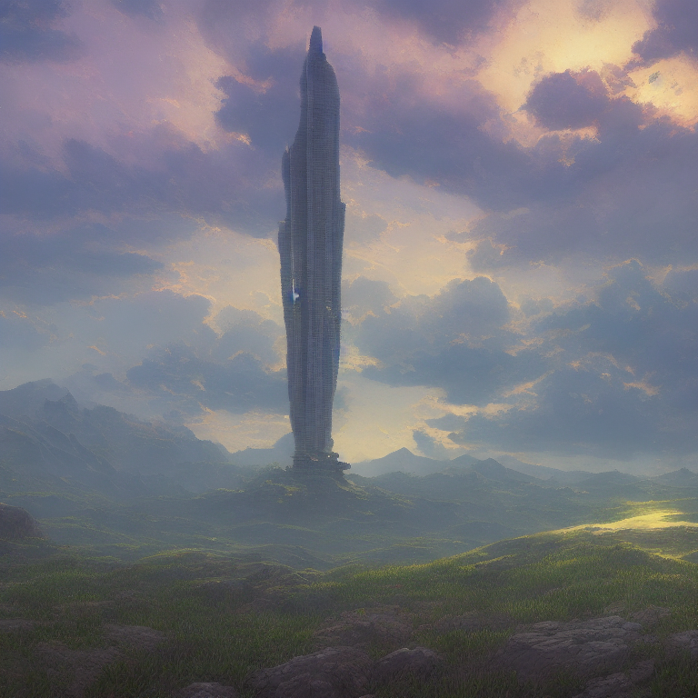
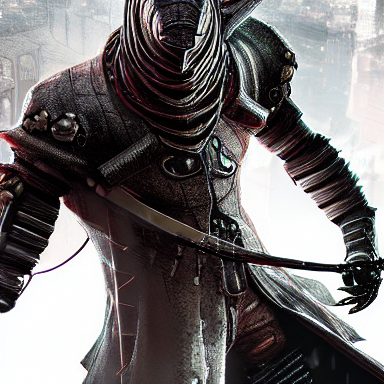
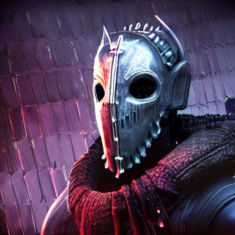
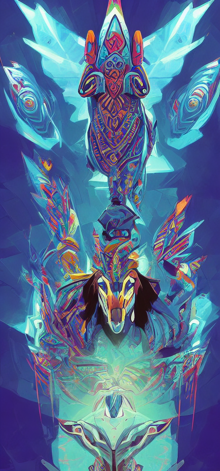
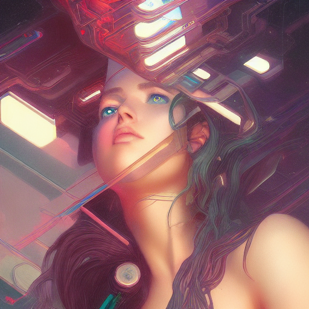

intro and sumary

sd
asd
ad

AI \~\~Image\~\~ Generation - What’s Next?
AI Image Generation - What’s Next?

If you want to learn more about how it works
[https://youtu.be/1CIpzeNxIhU][1]

  
  

## Where are we? d
- dalle
	- Midjourney
	- Imagen
	- Stable diffusion
	- Imagen vasdasdadasdaideo
	- Meta make ssss a video

Talk about image tools (google dream AI)
s
Talk about text to image 
How does this work? - explain diffusion

dall-e outpaint feature

Explain Features
- prompt to image
- IMage completion
- outpaint

## AI Democratization - DIY
- tutorial



Dall-e also released its model to the public

## What does this all mean?

These models and technologies are commoditizing the ability to generate content, which was the last step in the _Idea Propagation Value Chain_  that had yet to be fundamentally disrupted by technology. The internet already completely changed how we distribute content (the last part of the chain). Almost every file is digital, can be copied at zero cost, and sent almost instantaneously to anyone on earth.  These new technologies will re

You don’t need to know how to draw, paint, or model and render 3D content anymore, anyone will be able to tell to an AI what they want to see 

hero

settings

  

    
  

  

    
  

  

    
  

  

    
  

  

    
  

villains

  

    
  

  

    
  

  

    
  

  

    
  

concept art for set

  

    
  

   

    
  

  

    
  

  

    
  

wallpapers

  

    
  

  
  

    
  

  

    
  

  

    
  

Thumbnails

  

    
  

  

    
  

  

    
  

  

    
  

  

    
  

  

    
  

Sites to generate promps
[https://lexica.art/][2]
https://prompthero.com/

## Beyond Images

talk about text to video

[https://podcast.ai/][3]
[https://www.mmamania.com/2022/10/13/23402571/ufc-joe-rogan-ai-podcast-interview-steve-jobs-deep-fake-audio][4]

## Impacts

the creation and substantiation of an idea [https://stratechery.com/2022/the-ai-unbundling/][5]

- copyrights
	- Quality
	- Safety and Social issues?
		- [https://www.newscientist.com/article/2341920-the-success-of-text-to-image-ais-raises-major-ethical-issues/?utm\_campaign=RSS%7CNSNS&utm\_source=NSNS&utm\_medium=RSS&utm\_content=technology][6]
		- [https://githubcopilotinvestigation.com/][7]
	- Commoditization
	- increase productivity

[https://boingboing.net/2022/10/14/dune-subreddit-bans-ai-art.html][8]

IP
[https://techcrunch.com/2022/10/07/5-key-ip-considerations-for-ai-startups/][9]

## What’s Next?
(Prediction)
- future experiments
	- instagram a
	- [https://www.instagram.com/artbyaghost/][10]

[1]:	https://youtu.be/1CIpzeNxIhU
[2]:	https://lexica.art/
[3]:	https://podcast.ai/
[4]:	https://www.mmamania.com/2022/10/13/23402571/ufc-joe-rogan-ai-podcast-interview-steve-jobs-deep-fake-audio
[5]:	https://stratechery.com/2022/the-ai-unbundling/
[6]:	https://www.newscientist.com/article/2341920-the-success-of-text-to-image-ais-raises-major-ethical-issues/?utm_campaign=RSS%7CNSNS&utm_source=NSNS&utm_medium=RSS&utm_content=technology
[7]:	https://githubcopilotinvestigation.com/
[8]:	https://boingboing.net/2022/10/14/dune-subreddit-bans-ai-art.html
[9]:	https://techcrunch.com/2022/10/07/5-key-ip-considerations-for-ai-startups/
[10]:	https://www.instagram.com/artbyaghost/