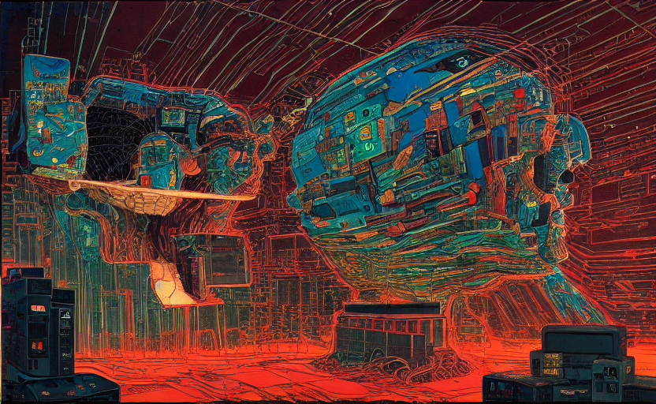
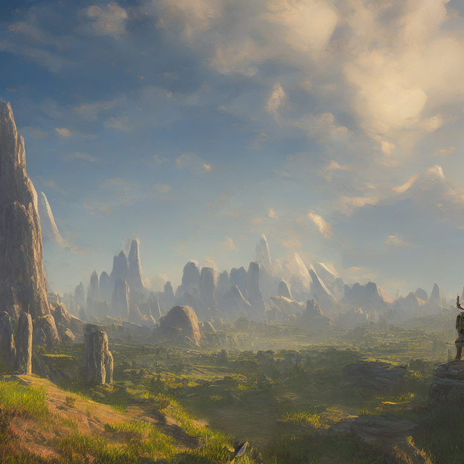

## Machine Learning Image Generation - What’s Next?

intro and sumary

[https://stratechery.com/2022/the-ai-unbundling/][1]  
  
[https://techcrunch.com/2022/10/07/5-key-ip-considerations-for-ai-startups/][2]

## Where are we?
- dalle
	- Midjourney
	- Imagen
	- Stable diffusion
	- Imagen video
	- Meta make a video

Talk about image tools (google dream AI)

Talk about text to image 
How does this work? - explain diffusion

dall-e outpaint feature

Explain Features
- prompt to image
- IMage completion
- outpaint

talk about text to video

[https://podcast.ai/][3]

## Do it yourself (maybe does not require specific section)
- tutorial

## Use cases
- settings
	- Characters
	- wallpapers
	- Poster and Covers
	- Thumbnails

## Downsides
- copyrights
	- Quality
	- Safety and Social issues?
	- Commoditization
	- increase productivity

## What’s Next?
(Prediction)
- future experiments
	- instagram a
	- [https://www.instagram.com/artbyaghost/][4]

<a href="/posts/202210-stable-diffusion-tutorial/" target="_blank">check tutorial here</a> 



concept art for set

  

    
  

   

    
  

  

    
  

  

    
  

concept art for set

  

    
  

  

    
  

  

    
  

  

    
  

hero

villains

settings

  

    
  

  

    
  

  

    
  

  

    
  

  

    
  

  

    
  

  

    
  

  

    
  

wallpapers

  

    
  

  
  

    
  

  

    
  

  

    
  

Thumbnails

  

    
  

  

    
  

  

    
  

  

    
  

  

    
  

  

    
  

[1]:	https://stratechery.com/2022/the-ai-unbundling/
[2]:	https://techcrunch.com/2022/10/07/5-key-ip-considerations-for-ai-startups/
[3]:	https://podcast.ai/
[4]:	https://www.instagram.com/artbyaghost/
