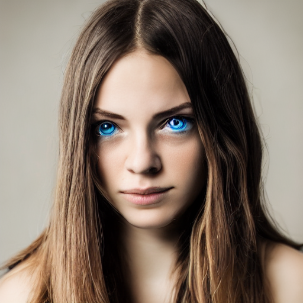

In the last year, several machine learning models have become available to the public to generate images from textual descriptions. This has been an interesting development in the AI space. However, most of these models have remained closed source for valid ethic reasons. Because of this, even though you can interact with them via some interface, you are limited in the number of things you can test. Until now…

The latest of these models is Stable Diffusion, which is an open machine learning model developed by <a href="https://stability.ai/" target="_blank">Stability AI</a> to generate digital images from natural language descriptions. This model has become quite popular, mainly because it was the first one to be open-sourced. 

I’ve already played around with <a href="https://openai.com/dall-e-2/" target="_blank">Dall-E</a> and <a href="https://www.midjourney.com/home/" target="_blank">Midjourney</a>, but wanted to try to run a model locally and get more freedom to play around with things. I was able to successfully install and run the model on my M1 Pro and on my Windows desktop. This guide details the steps I’ve followed to get everything working on my Mac.


## Initial Notes
A couple of notes before we get to it. I tried several guides online, and I was unable to get a smooth experience with any of them. I had to try numerous repos, solutions, etc. The main goal of this guide is to provide instructions for how to run Stable Diffusion on an M1, which is the one where I found more challenges. Installing on Windows was way more straightforward. 

Having said this, the repo I ended up going with has detailed guides for all platforms: <a href="https://github.com/nunocoracao/InvokeAI/blob/main/docs/installation/INSTALL_WINDOWS.md" target="_blank">Windows</a>, <a href="https://github.com/nunocoracao/InvokeAI/blob/main/docs/installation/INSTALL_MAC.md" target="_blank">Mac</a>, and <a href="https://github.com/nunocoracao/InvokeAI/blob/main/docs/installation/INSTALL_LINUX.md" target="_blank">Linux</a>. Please don't hesitate to use any of those if you are using another platform or if this guide doesn’t work for you on a Mac. 


*Note: I didn’t try the above Mac guide, as when I found this repo, I had already figured out most of the workarounds needed to get the model to work.*



## Get the Code

Let’s start with getting the code. I am using <a href="https://github.com/invoke-ai/InvokeAI" target="_blank">InvokeAI's fork of Stable Diffusion</a>, which I forked <a href="https://github.com/nunocoracao/InvokeAI" target="_blank">here</a>. You are welcome to use the original repo from InvokeAI if you'd like to. I am going to use my fork to ensure that the guide remains updated and working across time. I ended up choosing this repo because 1) it was the first that I was able to get, and 2) it was part of a few forks that had a Web UI, which make interactions with the whole thing way easier.

To begin with, clone the repo into your local machine.

```bash
git clone https://github.com/nunocoracao/InvokeAI
```

## Get the Model

Now, you need to get the actual model that contains the weights for the network. This is the result of massive cycles of training with humongous data sets that a normal user with average hardware can’t even try to compete with. The model is not distributed with the code because of it’s size (around 7.5 GB) and to ensure that users need to comply with a license for it, that’s where Hugging Face comes in. 

Just go to the <a href="https://huggingface.co/" target="_blank">Hugging Face’s site</a> and login, or create an account if you don’t have one. Once you are set up, click <a href="https://huggingface.co/CompVis/stable-diffusion-v-1-4-original" target="_blank">here</a>, accept the terms on the model card, and download the file called `sd-v1-4-full-ema.ckpt`. After you download the model, go into the code folder and place it within `models/ldm/stable-diffusion-v1/` with the name `model.ckpt`. The folder `stable-diffusion-v1` does not exist and needs to be created.



*Note: there are other variants of the model that you can explore, this is the one recommended by most of the repos I’ve seen.*


## Setup Environment

With the code and the model ready, the next step is to set up the local environment to run everything.

### Install Xcode

The first step is to install Xcode, which is a suite of tools that developers use to build apps for Apple platforms. Xcode can be installed from the App Store, or you can download it from Apple’s Developer site.

As defined in the documentation, the Command Line Tools Package is a small self-contained package available for download separately from Xcode and that allows you to do command line development in macOS.

For a fresh install, or to make sure you have everything we need, this command should be enough:

```bash
xcode-select --install
```

### Install Conda

Most of the solutions I’ve seen use <a href="https://docs.conda.io/projects/conda/en/latest/#" target="_blank">Conda</a> to manage the required packages and environments needed to run the solution. Conda’s guide to install on any platform is super clear, so I advise you to just follow the instructions <a href="https://docs.conda.io/projects/conda/en/latest/user-guide/install/index.html#regular-installation" target="_blank">here</a>. They have two _flavours_ of their software: Anaconda and Miniconda. I tried Miniconda with no success. I ended up using Anaconda which solved some of the problems I was experiencing. Furthermore, I followed <a href="https://docs.conda.io/projects/conda/en/latest/user-guide/install/macos.html" target="_blank">this guide</a>, when you are set you can use this command to verify your installation (_Note: don’t forget to restart your terminal application_):

```bash
conda
```

If the installation process was successful, you should see something like the image below. 



*Note: `conda` will require that both `python` and `pip` commands are available in the terminal when creating the environment in the next steps. Please make sure to have them properly configured as in Mac the defaults are python3 and pip3, so most likely you would need to create an alias.*



### Install Rust

When following some other guides, I would always get problems on the next part of the process, building the environments. After many tries, I figured that I was missing the Rust compiler from my system. I followed Rust installation guide <a href="https://www.rust-lang.org/tools/install" target="_blank">here</a>, which amounts to running the following command:

```bash
curl --proto '=https' --tlsv1.2 -sSf https://sh.rustup.rs | sh
```


*Note: I didn’t go back to all the guides in the repo I am using to check whether this is required or not in their method. Please don't hesitate to try the next step without installing Rust and come back if you run into issues.*


### Build and Turn On the Environment

We’re almost there. Now we will create the `ldm` environment and activate it before start generating images. To accomplish this, `cd` into the root of the repo you cloned at the beginning of this guide and create the environment using the following command:

```bash
PIP_EXISTS_ACTION=w CONDA_SUBDIR=osx-arm64 conda env create -f environment-mac.yml
```

If you run into any problems in this step, and you need to rebuild the environment, you have two options: 1) using the command below:

```bash
PIP_EXISTS_ACTION=w CONDA_SUBDIR=osx-arm64 conda env update -f environment-mac.yml
```

*If you are on a intel Mac the command should be:*
```bash
PIP_EXISTS_ACTION=w CONDA_SUBDIR=osx-64 conda env create -f environment-mac.yml
```

Or 2) go into Anaconda’s folder, delete the environment and create the environment with the original command in this section. After trying several repos, I had to rely on 2) to clean the clutter.

Now it’s time to activate the environment using:

```bash
conda activate invokeai
```

The last step is to preload the models using the command:

```bash
python scripts/preload_models.py
```


## Have Fun…

Now it’s time to start to play around with Stable Diffusion. Run:

```bash
python scripts/invoke.py --full_precision --web
```

And open your browser on `localhost:9090`

You should see a Web interface like the one below.


Chose your first prompt and try out the model, all the images will be saved in `output/img-samples`. Explore the various models and configurations possible. I’ve been running mine with `512x512` images, around `100` cycles for the final images (`5` for the initial variants), and config scale at. `7.5`. As a sampler I prefer the results using `DDIM`, you can find some details on the differences between samplers and some examples in <a href="https://www.reddit.com/r/StableDiffusion/comments/x4zs1r/comparison\_between\_different\_samplers\_in\_stable/" target="_blank">this Reddit thread</a>.

Since I originally wrote this article there is a new version of InvokeAI's stable diffusion implementation, besides what I've described above there are lots of new features that you can explore, more details [here](https://github.com/invoke-ai/InvokeAI/releases/tag/v2.0.0).

## Some Examples

Here are some examples of images from my initial runs of the model. I have to say that there is some _art_ to making these work. I am leaving here a couple of links to get some ideas on how to start designing `prompts`.

- <a href="https://decentralizedcreator.com/10-best-text-to-image-prompts-for-ai-art-generator-disco-diffusion-a-visual-treat-inside/" target="_blank">10 Best Text to Image Prompts for AI Art Generator</a>
- <a href="https://prompthero.com/" target="_blank">Prompthero</a>


<div style="display: flex; flex-wrap: wrap;">

  <div style="flex: 1; margin:10px; min-width:128px">
    
  </div>

  <div style="flex: 1; margin:10px; min-width:128px">
    
  </div>

  <div style="flex: 1; margin:10px; min-width:128px">
    
  </div>

  <div style="flex: 1; margin:10px; min-width:128px">
    
  </div>

  <div style="flex: 1; margin:10px; min-width:128px">
    
  </div>

  <div style="flex: 1; margin:10px; min-width:128px">
    
  </div>

  <div style="flex: 1; margin:10px; min-width:128px">
    
  </div>

  <div style="flex: 1; margin:10px; min-width:128px">
    
  </div>

  <div style="flex: 1; margin:10px; min-width:128px">
    
  </div>

  <div style="flex: 1; margin:10px; min-width:128px">
    
  </div>

  <div style="flex: 1; margin:10px; min-width:128px">
    
  </div>

  <div style="flex: 1; margin:10px; min-width:128px">
    
  </div>

  <div style="flex: 1; margin:10px; min-width:128px">
    
  </div>

  <div style="flex: 1; margin:10px; min-width:128px">
    
  </div>

  <div style="flex: 1; margin:10px; min-width:128px">
    
  </div>

  <div style="flex: 1; margin:10px; min-width:128px">
    
  </div>
  
</div>

## Disclaimer & Other Options

A couple of things before wrapping up. Even though I installed this on both a Mac and a Windows, and the Mac experience with a M1 Pro was not bad at all, the performance on my Windows machine with an Nvidia RTX 2070 was way better. Most of the images you see on this guide were generated from that system, as it allowed me to be faster in trying variants and getting more quality out of samples I liked. 

One of the initial goals I had was to be able to extend the model with additional training, aka getting my face into the model and play around with it. Unfortunately, that was not possible as I wasn’t able to run the training methods on the Mac, and my GPU on Windows doesn’t have the right requirements to train the model. Currently, it seems you need at least 16Gb of VRAM to do so.

Ultimately, there are a ton of options for running the Stable Diffusion model, some locally, some in the cloud (e.g., Google Colab), so don’t get frustrated if you want to try this out but don’t have access to a machine that can run it. There are probably other solutions right there that you can use.

Tag me on your creations on social if you get this to work:

<div style="display: flex; flex-wrap: wrap;">

  <div style="flex: 1; margin:10px; min-width:256px">
    
    &nbsp;
    Follow me on Twitter
    
  </div>

  <div style="flex: 1; margin:10px; min-width:256px">
    
    &nbsp;
    Follow me on Instagram
    
  </div>

</div>
