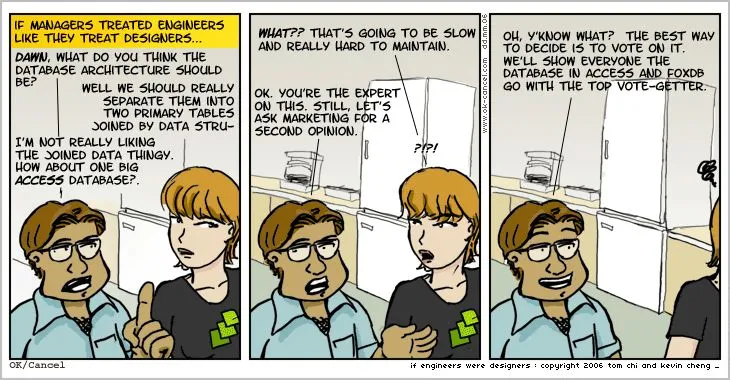
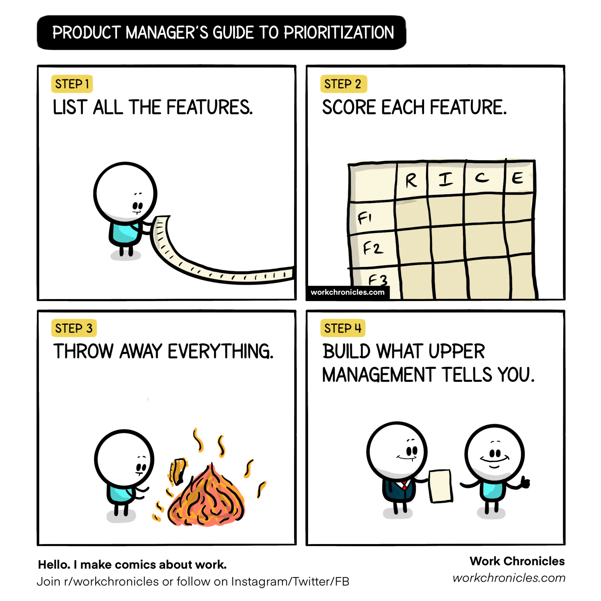

Il ruolo del product manager ha guadagnato popolarità nell'industria tech negli ultimi anni. Man mano che più aziende aggiungono PM ai loro organigrammi, c'è ancora molta sperimentazione con i setup dei team per trovare il miglior allineamento possibile tra prodotto e engineering. Queste due funzioni lavorano ora più vicine che mai, e mentre si dice che sia la ricetta per team ad alte prestazioni, molte aziende stanno ancora lottando per raggiungere buoni livelli di collaborazione.

Le strategie per farlo funzionare sono ben trattate sul [sito web di Martin Fowler](https://martinfowler.com/articles/bottlenecks-of-scaleups/03-product-v-engineering.html). In questo articolo mi concentrerò di più sulla prospettiva dell'ingegnere e su quali sono le nostre aspettative per un buon product manager.

## Cosa non aspettarsi

Come ingegnere io stesso, ho osservato frizioni provenienti da entrambi i lati, ma anche alcune partnership produttive. Mentre si può argomentare che il team o l'organizzazione possano influenzare il risultato, dipende principalmente da quanto ogni funzione è disposta a collaborare con l'altra.

Facciamo un esercizio e pensiamo a queste aspettative al contrario. Credo che il ruolo del PM sia ancora agli inizi, e per questo assume forme diverse, specialmente nelle aziende meno mature che stanno iniziando a costruire le loro strategie di sviluppo prodotto.

### Excel Manager

Un asso con le macro e un maestro nel riportare i progressi nello steering settimanale. L'intero progetto sembra un'opera d'arte geometrica con barre impilate l'una sull'altra. L'excel manager si preoccupa molto poco del ciclo di vita del prodotto e spenderà tutte le sue fiches per far impegnare gli sviluppatori su quelle scadenze.

### Featurist

Specialista top nella ricerca di mercato a 360 gradi. Sa tutto di Steve Jobs e la storia dell'iPod, si preoccupa del ciclo di vita del prodotto, ma non può permettersi di perdere tempo a costruire strategie perché "I dettagli contano, vale la pena aspettare per farlo bene".

### Programmatore in Pensione

Scontento dell'idea di essere code monkey per sempre, ha abbandonato l'engineering alla ricerca di felicità e successo. Guardando con rimpianto la vita che si è lasciato alle spalle, il programmatore in pensione è un buon alleato ed è disposto a gestire le aspettative della leadership.

### La Mano del Re

Perché condividere le proprie idee quando siamo tutti qui per servire uno scopo più grande? Come un filtro passa-tutto, la mano del re non corre rischi che le dita puntino nella sua direzione. È solo il messaggero.

## L'Idea Fondamentale del Product Management

Ciò che gli stereotipi sopra hanno in comune (intenzionalmente) è che tutti delegano le decisioni di business al livello di leadership, che penso sia il più grande game changer riguardo al ruolo del product manager. Più che design o implementazione, il PM è responsabile dell'intero ciclo di vita del prodotto, dall'idea all'implementazione fino al feedback del cliente e alle performance di mercato.

I team di maggior successo in cui ho lavorato sono quelli dove il PM è presente, a volte anche sotto la stessa linea di leadership/reporting. [PM & EM: Rules of engagement](https://segment.com/blog/product-manager-engineering-manager-rules-of-engagement/) stabilisce 3 regole fondamentali: Fiducia, responsabilità congiunta e ownership separata.

## Portare il Team nel Business

Una delle cose che mi ha sempre infastidito è quanto poco gli ingegneri sappiano dei prodotti che stanno costruendo. Sorpresa o meno, è possibile lavorare un'intera vita senza sapere chi usa il software che stai costruendo e quanti soldi fa. Discussioni ricorrenti con il team sulle performance del prodotto sono un modo potente per [promuovere l'innovazione e mantenere alta la motivazione](https://www.platohq.com/blog/slack-product-engineering-collaboration).

## Una Roadmap per Domarle Tutte

Costruire una roadmap tecnica mentre lavoravo in un team di prodotto è stata una delle esperienze più controproducenti che ho avuto. Mentre è importante tenere traccia del debito tecnico che deve essere pagato, se non c'è buy-in dal prodotto, l'esperienza mi dice che quei task non verranno mai implementati.

Un buon PM è in grado di capire il costo di non pagare il debito tecnico e lo includerà come parte della strategia di prodotto.

## Date Target, Non Scadenze

Se vuoi stressare un ingegnere, chiedigli un ETA o di impegnarsi su una scadenza fissata dalla leadership. Costruire software sotto pressione causa solo danni al business nel senso che costringerà le persone a fare più errori.

Mentre non è nemmeno accettabile che gli ingegneri siano liberi di sprecare grandi quantità di tempo, il PM dovrebbe essere abbastanza flessibile da permettere che la data target si sposti o che lo scope venga ridotto.

## Osservazioni Finali

Come dovrebbe essere il PM perfetto è ancora una domanda aperta, ma è chiaro che se sia prodotto che engineering lavorano per costruire una partnership efficace, i risultati possono essere molto più produttivi. Dal punto di vista di un ingegnere, il PM ideale non è uno stakeholder ma un pari, molto simile al CEO di una piccola startup all'interno dell'azienda più grande.
