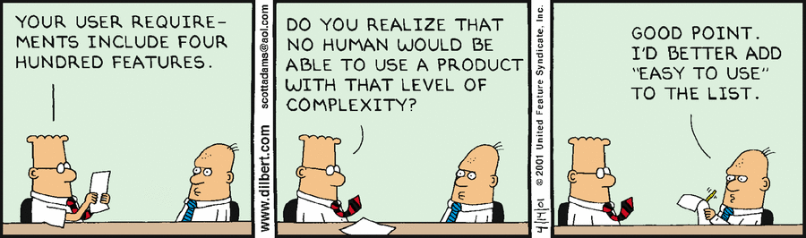
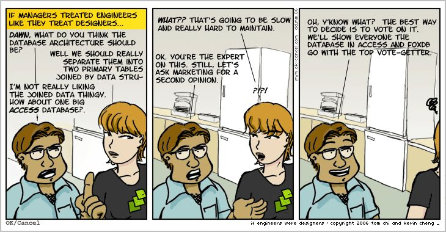
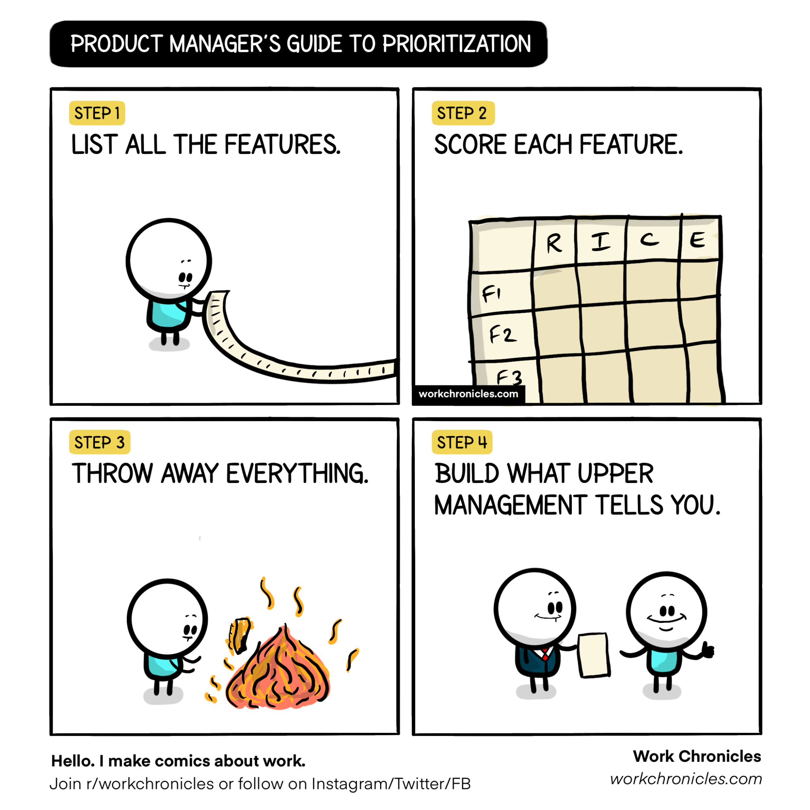

The product manager role has been gaining popularity in the tech industry over the recent years. As more companies add PMs to their organisation charts, there is still a lot of experimentation with team setups to find the best alignment possible between product and engineering. These two functions work now as close as they ever did, and while it is said to be the recipe for high achieving teams, lots of companies are still struggling to achieve good levels of collaboration.

Strategies to make it work are well covered in [Martin Fowler’s website](https://martinfowler.com/articles/bottlenecks-of-scaleups/03-product-v-engineering.html), in this article I’ll focus on more on the engineer’s perspective and what are our expectations for a good product manager.

## What Not to Expect

As an engineer myself I have observed friction coming from both sides, but also some productive partnerships, and while one can argue that the team or the organisation can influence the outcome, it mostly depends on how much each function is willing to collaborate with the other.

Let’s do an exercise and think about these expectations in reverse. I believe the PM role is still early days, and because of that, it assumes different shapes, especially in less mature companies that are starting to build their product development strategies. If you work in the tech industry right now, you might be familiar with some of the following stereotypes.

### Excel Manager

An ace with macros and a master at reporting progress in the weekly steering. The whole project looks like a geometric piece of art with bars stacked over each other, horizontally aligned with a column of red cells that turn green once you type in the word “Delivered”. The excel manager cares very little about the product lifecycle and will spend all of her chips in getting the devs to commit to those deadlines.

### Featurist

Top specialist in 360 market research. She knows all about Steve Jobs and the story of the iPod, and care about the product lifecycle, but can’t afford to loose time building strategies because “Details matter, it’s worth waiting to get it right”. As long as build a responsive design, with social share buttons, cash will start flowing. Be sure to check out “[Avoiding Featurism](https://tdarb.org/blog/avoid-featurism.html?utm_source=pocket_mylist)”, which I stole the word _featurist_ from.

### Retired Programmer

Displeased with the idea of being code monkey forever, she abandoned engineering in the search for happiness and success. Looking with regret at the life she left behind, the retired programmer is good ally and is willing to manage the leadership expectations and push back deadlines at the exchange of sharing some ideas for the software architecture and also that story about getting an A+ on a programming project at the university.

### King’s Hand

Why sharing one’s ideas when we’re all here to serve a greater purpose ? Like an all-pass filter, the king’s hand is taking no chance at fingers pointing on her direction. She’s just the messenger and if you don’t agree, be sure to expect some escalations so that you can all ask guidance from the master.

## The Single Idea of Product Management

Now [puts serious tone], what the above stereotypes have in common (intentionally) is that all of them delegate business calls to the leadership layer, which I think is the biggest game changer about the product manager role. More than design or implementation, the PM is accountable for the entire product lifecycle from idea through implementation to customer feedback and market performance. A good PM will as as a lower level CEO, holding herself accountable for the the success of a small part of the business (the product), offloading this responsibility from leadership. An even better PM will share this accountability across the entire product engineering team.

That being said, how the partnership is implemented is a different story. The most successful teams I’ve integrated are the ones where the PM is there, sometimes even under the same leadership/reporting line. The less friction there is between the two functions, the better results. [PM & EM: Rules of engagement](https://segment.com/blog/product-manager-engineering-manager-rules-of-engagement/) establishes 3 foundational rules which I believe can be extended beyond PM and EM to product and engineering: Trust, joint accountability and separate ownership. While it is important that each function plays a different part, working as a team with shared responsibility will increase everyone’s alignment towards what and why they’re doing it, as well as reducing the bureaucracy required to get something done, giving the PM better flexibility to build and adapt the product strategy iteratively.

## Onboard the Team Into the Business

One of the things that always bothered me is how little engineers know about the products they’re building. Surprise or not it is possible to work an entire lifetime without knowing who uses the software you’re building and how much money does it make. One of the advantages of doing business at a lower level, is that this barrier can be broken. Recurring discussions with the team about the product’s performance as well as the north star or other relevant kpis is a powerful way of [fostering innovation and keeping motivation levels high](https://www.platohq.com/blog/slack-product-engineering-collaboration).

## One Roadmap to Rule Them All

Building a technical roadmap while working on a product team was one of the most counter productive experiences I’ve had. While it’s important to keep track of tech debt that needs to be paid, if there’s no buy in from product, experience tells me that those tasks are never going to be implemented.

Squeezing a couple of tasks into ongoing projects is not sustainable and at some point nor will be the code base leading to developer burnout and degraded product performance. A good PM is able to understand the cost of not paying technical debt and will include it as part of the the product strategy.

## Target Dates, Not Deadlines

If you want to stress out an engineer, ask him for an ETA or to commit to a deadline set by leadership. Building software under pressure only causes harm to the business in a sense that it will force people into making more mistakes that can cost money or decrease the team’s velocity later on.

While it’s also not acceptable that engineers are free to waste large amounts of time, the PM should be flexible enough to either allow the target date to move or scope to be removed.

## Final Remarks

What the perfect PM should be like is still an open question, but it is clear that if both product and engineering work towards building an effective partnership, the results can be far more productive as opposed to working in silos (grouped by activity instead of outcome). Building the product from inside the team is key to build a better collaboration environment where high levels of alignment, motivation and productivity are more likely, similar to startup companies. From an engineer’s point of view, the ideal PM is not a stakeholder but a peer instead, pretty much like the CEO of a small startup inside the wider company.
