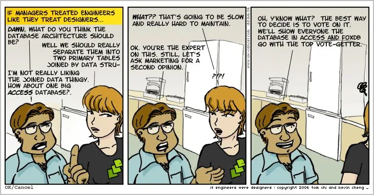

O papel do product manager tem vindo a ganhar popularidade na indústria tech nos últimos anos. À medida que mais empresas adicionam PMs aos seus organigramas, ainda há muita experimentação com configurações de equipas para encontrar o melhor alinhamento possível entre produto e engineering. Estas duas funções trabalham agora tão próximas como nunca, e embora se diga que é a receita para equipas de alto desempenho, muitas empresas ainda lutam para alcançar bons níveis de colaboração.

Estratégias para fazer funcionar estão bem cobertas no [site do Martin Fowler](https://martinfowler.com/articles/bottlenecks-of-scaleups/03-product-v-engineering.html). Neste artigo, vou concentrar-me mais na perspetiva do engenheiro e quais são as nossas expectativas para um bom product manager.

## O Que Não Esperar

Como engenheiro eu próprio, observei fricção vinda de ambos os lados, mas também algumas parcerias produtivas. Embora se possa argumentar que a equipa ou a organização podem influenciar o resultado, depende principalmente de quanto cada função está disposta a colaborar com a outra.

Façamos um exercício e pensemos nestas expectativas ao contrário. Acredito que o papel de PM ainda está nos seus primeiros dias, e por causa disso, assume diferentes formas, especialmente em empresas menos maduras que estão a começar a construir as suas estratégias de desenvolvimento de produto.

### Excel Manager

Um ás com macros e mestre em reportar progresso no steering semanal. O projeto inteiro parece uma peça de arte geométrica com barras empilhadas umas sobre as outras. O excel manager preocupa-se muito pouco com o ciclo de vida do produto e gastará todas as fichas para fazer os devs comprometerem-se com aqueles prazos.

### Featurista

Especialista top em pesquisa de mercado 360. Ela sabe tudo sobre Steve Jobs e a história do iPod, preocupa-se com o ciclo de vida do produto, mas não pode dar-se ao luxo de perder tempo a construir estratégias porque "Os detalhes importam, vale a pena esperar para fazer bem".

### Programador Reformado

Descontente com a ideia de ser code monkey para sempre, ela abandonou o engineering em busca de felicidade e sucesso. Olhando com arrependimento para a vida que deixou para trás, o programador reformado é um bom aliado e está disposto a gerir as expectativas da liderança.

### A Mão do Rei

Porque partilhar as ideias de alguém quando estamos todos aqui para servir um propósito maior? Como um filtro passa-tudo, a mão do rei não arrisca que dedos apontem na sua direção. Ela é apenas a mensageira.

## A Ideia Central do Product Management

O que os estereótipos acima têm em comum (intencionalmente) é que todos delegam decisões de negócio para a camada de liderança, o que acho que é o maior game changer sobre o papel de product manager. Mais do que design ou implementação, o PM é responsável por todo o ciclo de vida do produto, desde a ideia até à implementação, feedback do cliente e desempenho no mercado.

As equipas mais bem-sucedidas em que trabalhei são aquelas onde o PM está presente, às vezes até sob a mesma linha de liderança/reporting. [PM & EM: Rules of engagement](https://segment.com/blog/product-manager-engineering-manager-rules-of-engagement/) estabelece 3 regras fundamentais: Confiança, responsabilidade conjunta e ownership separado.

## Trazer a Equipa para o Negócio

Uma das coisas que sempre me incomodou é o quão pouco os engenheiros sabem sobre os produtos que estão a construir. Surpresa ou não, é possível trabalhar uma vida inteira sem saber quem usa o software que estás a construir e quanto dinheiro ele gera. Discussões recorrentes com a equipa sobre o desempenho do produto são uma forma poderosa de [fomentar inovação e manter os níveis de motivação altos](https://www.platohq.com/blog/slack-product-engineering-collaboration).

## Uma Roadmap para Governar Todas

Construir uma roadmap técnica enquanto trabalhava numa equipa de produto foi uma das experiências mais contraproducentes que tive. Embora seja importante acompanhar a dívida técnica que precisa de ser paga, se não houver buy-in do produto, a experiência diz-me que essas tarefas nunca vão ser implementadas.

Um bom PM consegue entender o custo de não pagar a dívida técnica e incluirá isso como parte da estratégia de produto.

## Datas Alvo, Não Prazos

Se queres stressar um engenheiro, pede-lhe um ETA ou que se comprometa com um prazo definido pela liderança. Construir software sob pressão só causa danos ao negócio no sentido de que forçará as pessoas a cometer mais erros.

Embora também não seja aceitável que os engenheiros sejam livres de desperdiçar grandes quantidades de tempo, o PM deve ser flexível o suficiente para permitir que a data alvo se mova ou que o âmbito seja reduzido.

## Observações Finais

Como deveria ser o PM perfeito ainda é uma questão em aberto, mas é claro que se tanto produto como engineering trabalharem para construir uma parceria eficaz, os resultados podem ser muito mais produtivos. Do ponto de vista de um engenheiro, o PM ideal não é um stakeholder mas um par, muito parecido com o CEO de uma pequena startup dentro da empresa maior.
