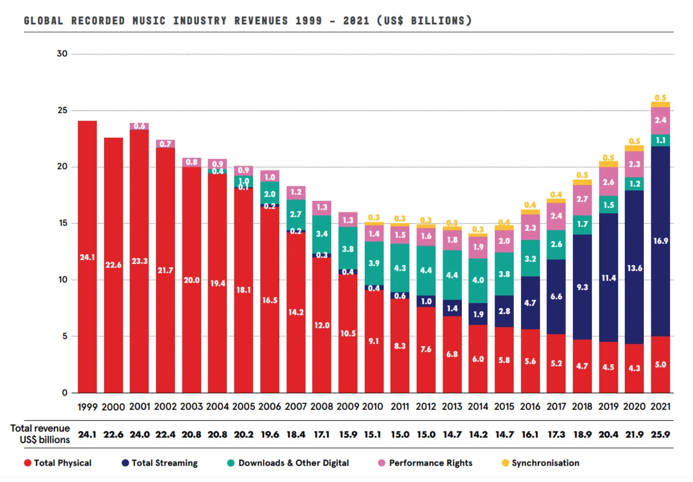
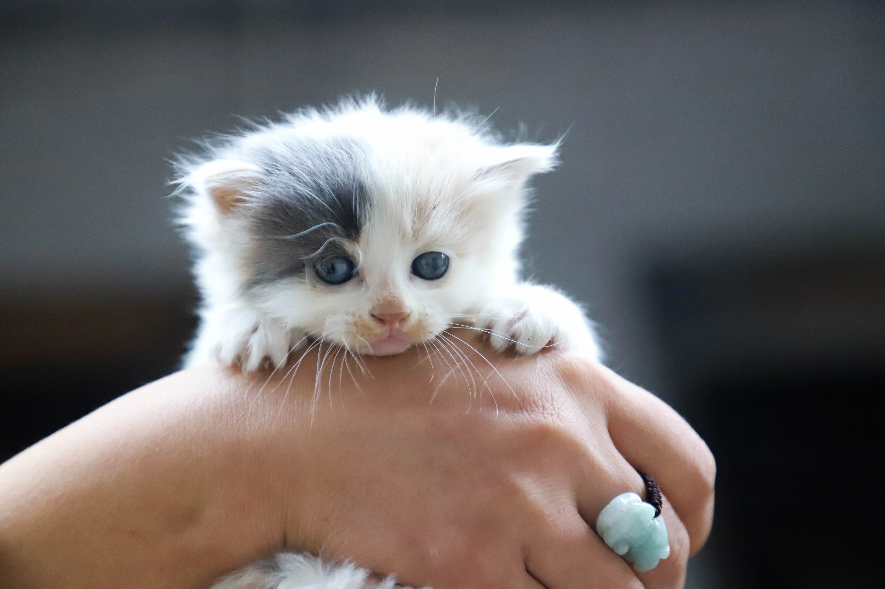
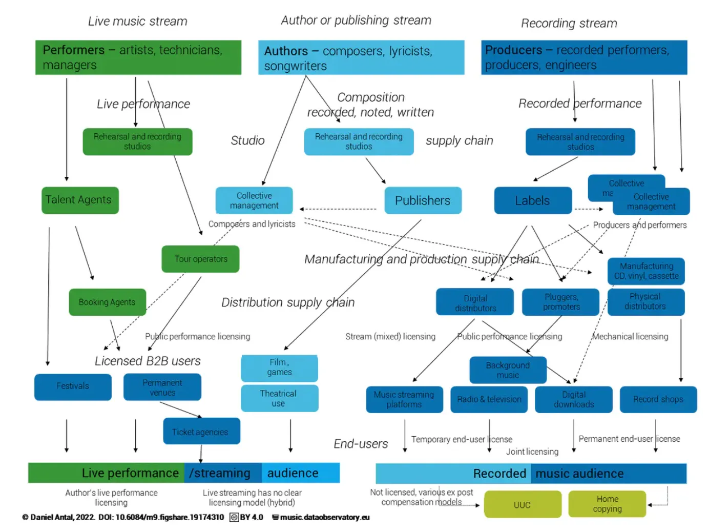
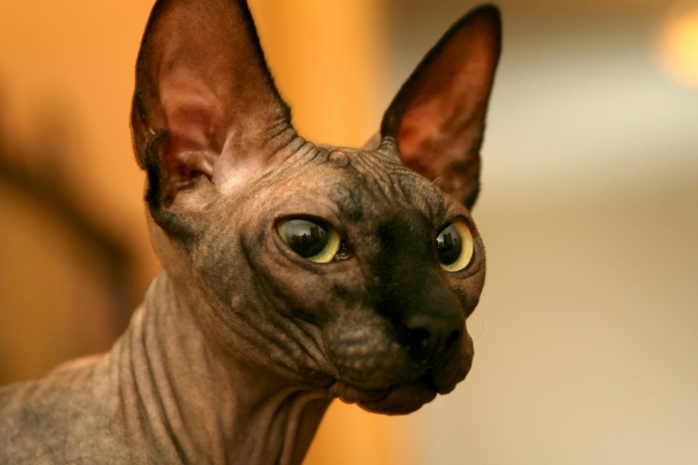

テクノロジーは歴史の中で何度も音楽業界を破壊し、私たちの音楽の消費方法、配信方法、さらには作り方まで変えてきました。ラジオ、レコード、そしてポータブルオーディオプレーヤーの導入により、音楽との関係は日常生活の一部となり、より親密で多様なものとなり、アーティストから最大限の可能性を引き出し、消費者としての私たちの要求を満たすために常に再発明する数十億ドル規模の産業を生み出しました。

過去数年間、非代替性トークン（NFT）の適用可能性について大きな議論がありました。音楽業界は現在、[Snoop Dogg](https://www.complex.com/music/snoop-dogg-nft-plans-death-row-records)、[Steve Aoki](https://decrypt.co/91317/dj-steve-aoki-launches-ethereum-nft-membership-club-i-am-building-my-own-world)、[Mike Shinoda](https://www.kerrang.com/mike-shinoda-has-released-the-music-from-his-45-second-nft-mixtape)のような人気アーティストがこの分野で大胆な動きをしており、多くの実験の舞台となっています。この記事では、音楽業界におけるNFTの良い点、悪い点、醜い点について考察します。

## 現状

何十年もの間、音楽業界はパブリッシャーとスタジオによってコントロールされており、彼らは何が録音され配信されるかのゲートキーパーとして機能していました。その期間、音楽の録音は先行投資を必要とする高価なプロセスでした。一方、マーケティングと配信マシンは、録音されたものが確実に販売されることを保証していました。パブリッシング契約を得られなかったアーティストは、市場に参入するチャンスがほぼゼロでした。

それがすべてテクノロジーによって変わりました。録音は今やほぼすべてのラップトップでできるほど安価になり、主要なストリーミングプラットフォームへの配信は安価でアクセスしやすく、マーケティングはソーシャルネットワークを通じて達成できます（例えば[TikTok](https://www.businessinsider.com/how-tiktok-is-changing-the-music-industry-marketing-discovery-2021-7)は最も一般的なマーケティング手段の1つです）。これらすべての変化にもかかわらず、音楽業界は依然として主要なパブリッシャーによって大部分がコントロールされています。なぜなら、新しい音楽、コンサート、ソーシャルアカウントなどをマーケティング、プロモーション、配信する巨大なマシンがあるからです。

ストリーミングは数年間、主要な配信フォーマットとなっています。2021年、[グローバル録音音楽収益の約65%](https://www.ifpi.org/wp-content/uploads/2022/04/IFPI_Global_Music_Report_2022-State_of_the_Industry.pdf)を占め、Spotifyだけで[5億人近いユーザー](https://variety.com/2022/digital/news/spotify-q3-results-456-million-total-users-1235414241/)と約2億人の有料会員を占めています。

大多数のコンテンツについて、デジタルプラットフォームは主要なレコードレーベルとストリーミング権を交渉しています。Sony BMG、Warner、Universalは合わせて[グローバル録音音楽市場の約67.5%](https://musicandcopyright.wordpress.com/2022/04/05/sme-and-wmg-the-biggest-market-share-winners-in-2021/)の権利を保有しており、これらの企業が業界でいかに多くの力と影響力を持っているかを示しています。アーティストはバリューチェーンの末端でコンテンツを作成し、ライブパフォーマンスを行い、[ピザの最後の一切れを確保](https://output.com/blog/how-much-musicians-actually-earn)しています。これがほとんどのアーティストにとっての現状ですが、テクノロジーの改善により、アーティストは音楽キャリアを構築し、自分の作品からまともな生活を送るためのDIYの代替方法を一貫して探求できるようになっています。近年、NFTは独立した音楽制作の道を進む多くの人々の注目を集めています。

しかし、一歩引いて、NFTとは実際に何でしょうか？元々Ethereumスマートコントラクトとして提案・構築された[非代替性トークン](https://ethereum.org/en/nft/)は、ユニークな資産の所有権と取引を表す仕様です。技術的には、NFT自体は通常のコンピューターとスマートフォンを使用して保存・消費できるデジタルドキュメントの単純なコレクションです。より興味深いのは、それらが分散台帳の上に構築されているという事実で、これにより改ざんが非常に困難/高価になり、ユーザーが直接取引でき、取引記録全体が誰でも監査してNFTの所有権を確認できる公開状態になる、トラストレスで透明な経済が可能になります。

## 良い点

### ロイヤリティ

アーティストとファンの間の[バリューチェーン](https://music.dataobservatory.eu/post/2022-02-15-music-value-chain/)には多くのホップがあります。商業音楽がイヤホンで再生されることを可能にするマシンは複雑で、多くの異なるエンティティがその間で利益を得ています。ストリーミングサービスは[低いペイアウト](https://www.forbes.com/sites/marisadellatto/2022/03/24/spotify-says-it-paid-7-billion-in-royalties-in-2021-amid-claims-of-low-pay-from-artists/?sh=6c5fc06da0db)で厳しく批判されており、レコードレーベルはアーティストに曲の所有権をレーベルに譲渡させる不公正な契約で[権利を独占](https://nickledanddimed.com/2022/05/24/record-labels-the-third-party-monopolies-in-the-music-industry/)することで常に知られていました。

NFTと暗号資産経済が作り出しているのは、いくつかのホップをバイパスし、ビジネスの方法を自然に変える可能性です。私たちが見ているものの多くはまだ実験段階ですが、[権利所有権の維持](https://rockcelebrities.net/mike-shinoda-explains-the-commercial-rights-rule-for-his-nfts/)が主な議論のトピックのようです。

ファンにコンテンツをほぼ直接販売することに加えて、NFT取引により、アーティストが二次市場でクリエイターシェアを獲得するためのロイヤリティ執行メカニズムを自動化することが可能になります。[Open Sea](https://support.opensea.io/hc/en-us/articles/1500009575482-How-do-creator-fees-work-on-OpenSea-)、[Rarible](https://rarible.com/)、[Sound.xyz](https://www.sound.xyz/)、[Catalog](https://beta.catalog.works/)などのNFTプラットフォームには、すでに機能の一部としてロイヤリティが含まれていますが、最大のゲームチェンジャーは、これらのロイヤリティが実際にブロックチェーンプロトコル自体によって強制される可能性があることで、アーティストが音楽が再販されたときに手数料を受け取れないことからさらに保護されます。さらに、このような公開レジストリは紛争や重複するロイヤリティ請求を回避するのに役立つため、ライセンスもより効率的になります。

### 代替の収益化方法

NFTにより、仲介者をスキップし、アーティストが自分でコンテンツを販売できる異なるビジネスモデルが可能になります。NFTで実際に「何」が販売されるかについてはまだ標準的なレシピはなく、そのためアーティストは異なる組み合わせを実験しています。エレクトロニックダンスミュージックのスター3LAUは、NFT分野に進出した最初の人々の1人で、アルバムUltravioletの3周年を記念するNFTセールで[小さな財産を築きました](https://www.forbes.com/sites/abrambrown/2021/03/03/3lau-nft-nonfungible-tokens-justin-blau)。コンテンツには、カスタムソング、オンラインでこれまで聴いたことのない音楽へのアクセス、音楽に基づくカスタムアート、Ultravioletの11曲のオリジナル曲の新バージョンなど、いくつかの独占アイテムが含まれていました。もう1つの人気のNFTセールは、独占音楽を伴うデジタルアートのコレクションを発売した[Grimes](https://www.rollingstone.com/music/music-news/grimes-nft-digital-artwork-1134516/)によって行われました。より保守的なアプローチも登場しており、この場合、[Kings of Leon](https://www.rollingstone.com/pro/news/kings-of-leon-when-you-see-yourself-album-nft-crypto-1135192/)は、SpotifyやiTunesなどの既存の配信チャネルのリストにNFTを追加し、NFT保有者向けの特別な特典も付けた最初のアーティストの1つでした。

もう1つの興味深いことは、やはり権利ですが、譲渡可能性の観点からです。レコードレーベル契約がない場合、コンテンツを自分で権利を保持して保護するか、NFT保有者に譲渡するかはアーティス次第です。Mike Shinodaと彼のファンの1人の間で、`Ziggurat`がソーシャルメディア投稿で再現できるかどうかを尋ねられたとき、アーティストが非商用使用について非常に明確であったTwitterでの[人気のある議論](https://rockcelebrities.net/mike-shinoda-explains-the-commercial-rights-rule-for-his-nfts/)がありました。一方、アーティストがNFTに著作権を埋め込むことを選択した場合、潜在的な投資とポートフォリオの多様化を求める一般大衆に権利市場を開放し、短期的にはより価値のあるものになります。

### 希少性とファンとの新しい交流方法

希少性の要素は、販売できるほぼすべてのもので収益性の高い利益を生み出すことで知られています。絵画と限定版製品は、希少性が特定の資産の価格を押し上げる一般的な例です。音楽業界はこのマーケティングテクニックに疎くなく、NFTのユニークな性質により、アーティストが新しい方法で希少性に訴えるための完璧な手段となります。なぜなら、流通しているコピーの数をコントロールするのは彼らだからです。一例として、Shawn Mendesの[NFTコレクション](https://opensea.io/collection/genies)の発売があります。これには、Fenderギターやゴールドリングなどの彼のシグネチャーアクセサリーの希少なデジタルバージョンが含まれています。このような資産は簡単にコピーして違法に複製できますが、NFTによって可能になる所有権の証明は真正性の保証としても機能し、バックステージアクセス、デジタルコレクタブル、その他最も熱心なファンのための独占的な資産などの体験を構築するために使用できます。これは、プラットフォーム[aok1verse](https://a0k1verse.xyz/)（Steve AokiのNFTとメタバースへの取り組み）が、マーチャンダイズへのアクセス、リアルライフイベント、未リリース音楽への早期アクセス、さらにはアーティスティックコラボレーションなどの独占的な特典をファンに付与することで作り出そうとしているものです。

## 悪い点

NFTとブロックチェーンは多くの業界でより公正で平等な未来を約束していますが、現時点では基盤となる技術はまだかなり未成熟であり、どのような条件で定着するかわかりません。何かが変わってEthereumが突然支配的なNFTプラットフォームでなくなった場合、ユーザーは異なる技術に移行する可能性があり、すでにNFTに投資した人々に何が起こるかは不明です。

標準化と相互運用性の欠如があり、新しいNFT仕様とブロックチェーンが登場しています。エコシステムが進化し続けるにつれて、異なる互換性のないプラットフォームが登場し、アーティストが心配すべき配信チャネルが過剰になる可能性があります。

ユーザビリティもまだそこにはなく、これらの技術のほとんどは誰にでもアクセスできるわけではなく、熟練していない人を外に置き去りにする一方で、プロデューサーやディストリビューターのように、アーティストの成功から利益を得る新しい仲介者企業の機会を作り出しています。

これらすべての上に、暗号資産市場があり、これはまだ初期段階にあり、価格投機、ボラティリティ、詐欺の中心的な舞台となることがよくあります。上記の問題のほとんどは、主に市場自体の規制の一般的な欠如に関連しており、これは当然NFT資産クラスの認識に影響を与えています。

## 醜い点

上記のすべての変化にもかかわらず、音楽業界のコアは依然としてパイの最大の部分を持っています。パブリッシャーとディストリビューターは依然としてほとんどのアーティストの成功のゲートキーパーです。ソーシャルネットワークを通じて成功を収めたアーティストでさえ、ブランドをスケールし、できるだけ多くのリスナーに音楽を届けるために、最終的には主要なパブリッシャーと契約することになります。

以前に議論したNFTの実験のいくつかは、この分野への新参者ではなく、音楽業界のプレイヤーによって推進されています。したがって、NFTがパブリッシャーが利益を最大化するためのベルトのもう1つのツールになるのか、それとも新しい未署名のアーティストが大規模に活用できる別のものになるのかはまだ分かりません。

最後に、ほとんどの試みと実験は、暗号のハイプを利用するためのマーケティングスタントのように見えます。これは、技術的にも経済的にも、音楽にとってのNFTの将来の価値を損なう可能性があります。

## まとめ

暗号資産産業全体はまだ初期段階にあり、基本的に定義と標準化が欠けており、これは音楽業界におけるその役割にとって良いことも悪いこともあります。一方では、勇敢で反抗的な人々がキャリアへの新しいアプローチを実験するスペースを作りましたが、他方ではインフラがまだ構築されておらず、NFTを技術に精通したユーザーに制限し、新しい仲介者のスペースを作ります。
また、NFTと暗号資産全般の現在の価格投機と詐欺は、音楽NFTの金銭的価値がどうなるか、そしてそれらから生計を立てることが可能かどうかの明確な予測を許さないことにも注意する必要があります。

今のところ記録に残っているのは、デジタル資産の商取引を民主化することで、NFTは音楽業界で間違いなく注目を集め、アーティストがより独立したキャリアを持ち、ファンに直接音楽を販売するのを助けているということです。業界の大企業もこれに気づいており、エコシステム全体がまだ適切に規制されていないため、最終的には参入し始めるでしょう。後者は、NFTとブロックチェーンが何を表しているかの核心に直接関係する興味深い質問も提起します：システムの中央集権化がある場合、この場合は主要なスタジオ/パブリッシャーがこれらの技術のほとんどをコントロールしている場合、コミュニティは本当に分散型技術から恩恵を受けるのでしょうか？

NFTは音楽業界と芸術全般に大きな可能性を持っていますが、最大の不公平なアドバンテージはおそらく常にそうであったように同じままでしょう：何かを群衆の中で目立たせる能力。そしてここが、NFTの有無にかかわらず、ほぼ何でも取り上げてグローバルな視聴者にマーケティング/配信できる驚くほどよく油が塗られたマシンを持っているため、主要なスタジオとパブリッシャーが勝つところです。
