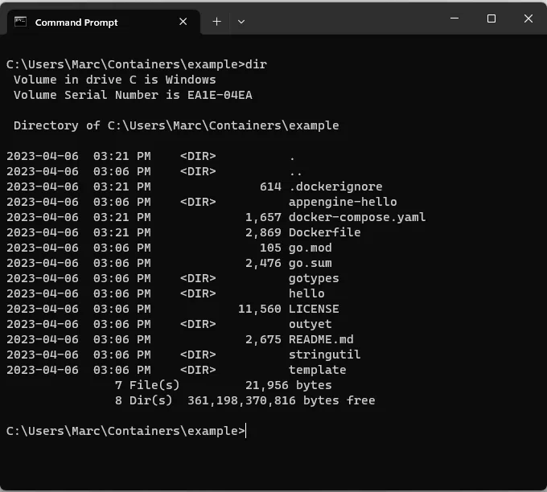

Docker has revolutionized the way developers build, package, and deploy their applications. Docker containers provide a lightweight, portable, and consistent runtime environment that can run on any infrastructure. And now, the Docker team has developed `docker init`, a new command-line interface (CLI) command introduced as a beta feature that simplifies the process of adding Docker to a project (Figure 1).


Note: Docker Init should not be confused with the internally -used docker-init executable, which is invoked by Docker when utilizing the –init flag with the docker run command.



  
  


*With one command, all required Docker files are created and added to your project.*

## Create assets automatically
The new  docker init command automates the creation of necessary Docker assets, such as Dockerfiles, Compose files, and .dockerignore files, based on the characteristics of the project. By executing the docker init command, developers can quickly containerize their projects. Docker init is a valuable tool for developers who want to experiment with Docker, learn about containerization, or integrate Docker into their existing projects.

To use docker init, developers need to upgrade to the version 4.19.0 or later of Docker Desktop and execute the command in the target project folder. Docker init will detect the project definitions, and it will automatically generate the necessary files to run the project in Docker. 

The current Beta release of docker init supports Go, Node, and Python, and our development team is actively working to extend support for additional languages and frameworks, including Java, Rust, and .NET. If there is a language or stack that you would like to see added or if you have other feedback about docker init, let us know through our Google form.

In conclusion, docker init is a valuable tool for developers who want to simplify the process of adding Docker support to their projects. It automates the creation of necessary Docker assets  and can help standardize the creation of Docker assets across different projects. By enabling developers to focus on developing their applications and reducing the risk of errors and inconsistencies, Docker init can help accelerate the adoption of Docker and containerization.

## See Docker Init in action
To see docker init in action, check out the following overview video by Francesco Ciulla, which demonstrates building the required Docker assets to your project.

<iframe width="100%" height="315" src="https://www.youtube.com/embed/f4cHtDRZv5U" title="YouTube video player" frameborder="0" allow="accelerometer; autoplay; clipboard-write; encrypted-media; gyroscope; picture-in-picture; web-share" allowfullscreen></iframe>

 


**Note:** this post was originally posted externally please go to [Docker's blog](https://www.docker.com/blog/docker-init-initialize-dockerfiles-and-compose-files-with-a-single-cli-command/) to read the full post


