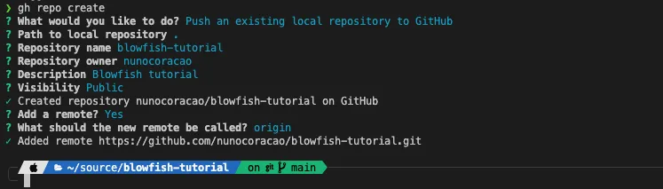

ちょうど1年前、私は個人ホームページのユニークなビジョンを構築するために作られた[Hugo](https://gohugo.io/)テーマ、[Blowfish](https://blowfish.page/)を作成しました。また、オープンソースプロジェクトにすることも決めました。今日に至るまで、BlowfishはGitHubで600以上のスターを獲得し、数百人のユーザーベースを持つ活発なオープンソースプロジェクトに成長しました。このチュートリアルでは、始め方と数分でウェブサイトを稼働させる方法をお見せします。



## TL;DR

このガイドの目標は、Hugoの初心者に自分のウェブサイトをインストール、管理、公開する方法を説明することです。コードの最終バージョンはこの[リポジトリ](https://github.com/nunocoracao/blowfish-tutorial/tree/main)で利用可能です - 最後までスキップしたい方のために。


ビジュアルスタイルは、Blowfishで利用可能な多くの可能性の1つにすぎません。ユーザーは[ドキュメントページ](https://blowfish.page/)をチェックして、テーマを自分のニーズに合わせてカスタマイズする方法を学ぶことをお勧めします。さらに、インスピレーションのために他のユーザーによるテーマの[素晴らしい例](https://blowfish.page/users/)がすでに利用可能です。Blowfishはまた、テーマですぐに使える`shortcodes`の形でいくつかの追加機能を提供しています - [こちら](https://blowfish.page/docs/shortcodes/)でチェックしてインスピレーションを得てください。

## 環境のセットアップ

必要なすべてのツールをインストールすることから始めましょう。このガイドはMacの手順をカバーしているので、これらの指示はお使いのハードウェアとOSに適用されない可能性があります。WindowsまたはLinuxの場合は、お使いのOS用の[Hugoのインストール](https://gohugo.io/installation/)と[GitHub CLI](https://cli.github.com/)のガイドを参照してください。

とにかく、macOSを使用している場合は、`brew`をインストールしましょう - Mac用のパッケージマネージャーで、他のツールのインストールと管理に役立ちます。

```bash
/bin/bash -c "$(curl -fsSL https://raw.githubusercontent.com/Homebrew/install/HEAD/install.sh)"
```

`brew`がインストールされたら、Git、Hugo、GitHub CLIをインストールしましょう。
```bash
brew install git
brew install hugo
brew install gh
```

コード用のフォルダを作成し、そこにターミナルセッションを開きます（以下のコマンドでは_blowfish-tutorial_を選びましたが、好きな名前を付けてください）。
```bash
mkdir blowfish-tutorial
cd blowfish-tutorial
```

フォルダ内に入ったら、次のステップはローカルの`git`リポジトリを初期化することです。
```bash
git init -b main
```

次に、ローカルリポジトリを作成してGitHubリポジトリと同期し、コードがリモートに保存されるようにしましょう。
```bash
gh auth login
gh repo create
git push --set-upstream origin main
```

このガイドで選択したオプションについては下の画像を確認してください。名前と説明は自由に変更してください。




最後に、リポジトリから特定のファイルを自動的に除外できる**.gitignore**ファイルを作成します。以下の例から始めることをお勧めします。

```bash
#others
node_modules
.hugo_build.lock

# OS generated files
.DS_Store
.DS_Store?
._*
.Spotlight-V100
.Trashes

# Hugo
public
```

最後のステップは、すべての変更をリポジトリに保存することです。
```bash
git add .
git commit -m "initial commit"
git push
```


## サイトの作成と設定

すべてのツールが準備できたので、サイトの作成と設定は簡単です。前のセクションで作成したフォルダ内で、空のHugoウェブサイト（_テーマなし_）を作成しましょう。

```bash
hugo new site --force .
```

スキャフォールディングが終わったら、以下のコマンドを試してページを実行します。ブラウザで_[https://localhost:1313](https://localhost:1313)_を開いてサイトを見てください…

```bash
hugo server
```

 おっと…ページが見つかりません - ですよね？
これは予想通りでした。ウェブサイトを作成しましたが、Hugoはデフォルトのエクスペリエンスを提供しません - つまり、サイトには表示するページがありません。

次のステップでは、`git submodules`を使用してBlowfishをインストールします。これにより、将来の管理と新しいバージョンへのアップグレードが簡単になります。

```bash
git submodule add -b main https://github.com/nunocoracao/blowfish.git themes/blowfish
```

次に、コードディレクトリのルートに次のフォルダ構造を作成します - `config/_default/`。次に、[これらのファイル](https://minhaskamal.github.io/DownGit/#/home?url=https:%2F%2Fgithub.com%2Fnunocoracao%2Fblowfish%2Ftree%2Fmain%2Fconfig%2F%5C_default)をダウンロードして、作成した_\_default_フォルダに配置する必要があります。最終的な構造は次のようになるはずです。

```md
config/_default/
├─ config.toml
├─ languages.en.toml
├─ markup.toml
├─ menus.en.toml
└─ params.toml
`
```


**config.toml**を開き、**theme = "blowfish"**の行のコメントを解除すれば準備完了です。再度サイトを実行して_[https://localhost:1313](https://localhost:1313)_で結果を確認してみてください

```bash
hugo server
```

下の画像のようなものが表示されるはずです。コンテンツをまだ追加していないのであまりありませんが、Blowfishのメインスケルトンはすでに配置されています - 設定だけが必要です。


それではテーマを設定しましょう。


**参考** このガイドでは、Blowfishで利用可能な各パラメータの詳細については説明しません - すべてのファイルのすべてのオプションについては、[Blowfishのドキュメント](https://blowfish.page/docs/configuration/#theme-parameters)を確認してください。


### menus.en.toml
このファイルは、トップバナーとフッターのメニュー構造を定義します。このガイドでは、_Posts_と_Tags_の2つのメニューセクションを作成しましょう。
- **Posts** - エントリの完全なリストを表示します
- **Tags** - 各記事に配置されたタグに基づいて自動的に生成されます

これを実現するには、**menus.en.toml**ファイルに次のエントリが存在することを確認してください。変更が完了したら、**hugo server**を再実行するとメニューが表示されるはずです。

```toml
[[main]]
  name = "Posts"
  pageRef = "posts"
  weight = 10

[[main]]
  name = "Tags"
  pageRef = "tags"
  weight = 30
```


### languages.en.toml

このファイルは、ウェブサイトの作者としてのあなたの主な詳細を設定します。以下のセクションを変更して、あなたの詳細を反映させてください。

```bash
[author]
   name = "Your name here"
   image = "profile.jpg"
   headline = "I'm only human"
   bio = "A little bit about you" # appears in author card for each article
```

ウェブサイトの画像は_assets_フォルダに配置する必要があります。このステップでは、そのフォルダに_profile.jpg_という名前のプロフィール画像を追加するか、上記の設定を選択したファイル名に変更してください。プロフィール画像がない場合は、チュートリアル用に以下のものを使用できます。


最後のステップは、リンク - ソーシャルメディア、GitHubなどを設定することです。ファイルにはサポートされているすべてのオプションが含まれていますが、コメントアウトされています。すべてのコメントを解除して、使用したくないものを削除してください。残すことにしたものに正しいリンクを置き換えてください。順序も変更できます。


### params.toml

これはBlowfishのメイン設定ファイルです。利用可能なビジュアルオプションやカスタマイズのほとんどは、これを使用して設定でき、テーマのいくつかの領域をカバーしています。このチュートリアルでは、**background**レイアウト - [Blowfishのランディングページの他のレイアウトを確認](https://blowfish.page/) - と**Neon**カラースキームを使用することにしました - 必要に応じて異なるカラースキームを選ぶことができます - [このリスト](https://blowfish.page/docs/getting-started/#colour-schemes)を確認するか、[独自のものを作成](https://blowfish.page/docs/advanced-customisation/#colour-schemes)してください。

サイトの背景となる**image.jpg**をassetsフォルダに追加してください。このチュートリアルで使用している例もダウンロードできます。


それでは_params.toml_に入って、ファイルの設定を始めましょう。変更が必要な値だけに焦点を当て、ドキュメントを読まずにファイルの残りを削除しないでください。正しいカラースキームがあり、画像最適化がオンになっており、デフォルトの背景画像を設定することから始めましょう。

```bash
colorScheme = "neon"
disableImageOptimization = false
defaultBackgroundImage = "image.jpg" # used as default for background images
```

次に、ホームページを設定しましょう。_background_レイアウトで、ホームページ画像と最近のアイテムを設定します。さらに、最近のカテゴリのアイテムに**card view**を使用しています。最後に、ヘッダーを固定に設定しましょう。

```bash
[homepage]
  layout = "background" # valid options: page, profile, hero, card, background, custom
  homepageImage = "image.jpg" # used in: hero, and card
  showRecent = true
  showRecentItems = 6
  showMoreLink = true
  showMoreLinkDest = "/posts"
  cardView = true
  cardViewScreenWidth = false
  layoutBackgroundBlur = true # only used when layout equals background

[header]
  layout = "fixed"
```

次に、記事とリストページの外観を設定します。これらの設定は以下の通りです。

```bash
[article]
  showHero = true
  heroStyle = "background"
  showSummary = true
  showTableOfContents = true
  showRelatedContent = true
  relatedContentLimit = 3

[list]
  showCards = true
  groupByYear = false
  cardView = true
```


再度**hugo server**を実行すると、下の画像のようなものが表示されるはずです。


## サイトへのコンテンツ追加

投稿を配置するフォルダを`/content/posts`に作成します。これはメニューですべての記事をリストするように設定したディレクトリでもあります。そのフォルダ内で、新しいディレクトリを作成して**myfirstpost**という名前を付けます。その中に**index.md**ファイル - あなたの記事を作成し、同じディレクトリにfeatured.jpgまたは.webpを記事のサムネイルとして配置します。以下の例を使って始めてください。ファイルの最初の行はFront Matterで、記事の外観とエクスペリエンスをHugoに伝えます - 異なるテーマはこれに対して異なるパラメータをサポートしています。詳細は[ドキュメント](https://blowfish.page/docs/front-matter/)を確認してください。

```md
---
title: "My first post"
date: 2023-08-14
draft: false
summary: "This is my first post on my site"
tags: ["space"]
---

## A sub-title

Lorem ipsum dolor sit amet, consectetur adipiscing elit. Morbi nibh nisl, vulputate eu lacus vitae, maximus molestie libero. Vestibulum laoreet, odio et sollicitudin sollicitudin, quam ligula tempus urna, sed sagittis eros eros ac felis. In tristique tortor vitae lacinia commodo. Mauris venenatis ultrices purus nec fermentum. Nunc sit amet aliquet metus. Morbi nisl felis, gravida ac consequat vitae, blandit eu libero. Curabitur porta est in dui elementum porttitor. Maecenas fermentum, tortor ac feugiat fringilla, orci sem sagittis massa, a congue risus ipsum vel massa. Aliquam sit amet nunc vulputate, facilisis neque in, faucibus nisl.
```

コンテンツがあるとサイトがどのように見えるかを確認するために、追加の記事を作成できます。サイトは以下の画像のように見えるはずです。メインページには最近の記事が表示され、各記事は関連セクションを通じて自動的に他の記事に接続され、タグ集約とフルテキスト検索があります。


  
  
  
  



## 公開する

残っているのはサイトを公開することだけです。ホスティングには[Firebase](https://firebase.google.com/)を使用します - 無料の代替手段で、より複雑なものを作成する場合はより高度な機能を提供します。Firebaseに行って新しいプロジェクトを作成してください。完了したら、CLIに切り替えましょう。すべての設定が簡単になります。

Firebase CLIをインストールしましょう - Macでない場合は[Firebaseのインストール手順](https://firebase.google.com/docs/cli)を確認してください。
```bash
brew install firebase
```

ログインしてプロジェクトのfirebaseホスティングを初期化します。

```bash
firebase login
firebase init
```

hostingを選択して続行します。


お勧めのオプションについては下の画像に従ってください。GitHub actionsのワークフローファイルをセットアップしてください。これにより、リポジトリに変更があったときにコードが自動的にデプロイされます。


しかし、これらのファイルはそのままでは動作しません。Hugoはビルドを機能させるために追加のステップが必要です。以下のコードブロックを**.github**フォルダ内のそれぞれのファイルにコピー＆ペーストしてください。ただし、firebaseによって生成されたファイル内の元の**projectId**は保持してください。

### firebase-hosting-merge.yml
```yaml
# This file was auto-generated by the Firebase CLI
# https://github.com/firebase/firebase-tools

name: Deploy to Firebase Hosting on merge
'on':
  push:
    branches:
      - main
jobs:
  build_and_deploy:
    runs-on: ubuntu-latest
    steps:
      - name: Hugo setup
        uses: peaceiris/actions-hugo@v2.6.0
        with:
          hugo-version: 0.115.4
          extended: true
        env:
          ACTIONS_ALLOW_UNSECURE_COMMANDS: 'true'

      - name: Check out code into the Go module directory
        uses: actions/checkout@v4
        with:
          submodules: true  # Fetch Hugo themes (true OR recursive)
          fetch-depth: 0    # Fetch all history for .GitInfo and .Lastmod

      - name: Build with Hugo
        env:
          # For maximum backward compatibility with Hugo modules
          HUGO_ENVIRONMENT: production
          HUGO_ENV: production
        run: hugo -E -F --minify -d public

      - name: Deploy Production
        uses: FirebaseExtended/action-hosting-deploy@v0
        with:
          repoToken: '${{ secrets.GITHUB_TOKEN }}'
          firebaseServiceAccount: '${{ secrets.FIREBASE_SERVICE_ACCOUNT_BLOWFISH_TUTORIAL }}'
          channelId: live
          projectId: blowfish-tutorial

```


### firebase-hosting-pull-request.yml
```yaml
# This file was auto-generated by the Firebase CLI
# https://github.com/firebase/firebase-tools

name: Deploy to Firebase Hosting on PR
'on': pull_request
jobs:
  build_and_preview:
    if: '${{ github.event.pull_request.head.repo.full_name == github.repository }}'
    runs-on: ubuntu-latest
    steps:
      - name: Hugo setup
        uses: peaceiris/actions-hugo@v2.6.0
        with:
          hugo-version: 0.115.4
          extended: true
        env:
          ACTIONS_ALLOW_UNSECURE_COMMANDS: 'true'

      - name: Check out code into the Go module directory
        uses: actions/checkout@v4
        with:
          submodules: true  # Fetch Hugo themes (true OR recursive)
          fetch-depth: 0    # Fetch all history for .GitInfo and .Lastmod

      - name: Build with Hugo
        env:
          # For maximum backward compatibility with Hugo modules
          HUGO_ENVIRONMENT: production
          HUGO_ENV: production
        run:  hugo -E -F --minify -d public

      - name: Deploy preview
        uses: FirebaseExtended/action-hosting-deploy@v0
        with:
          repoToken: '${{ secrets.GITHUB_TOKEN }}'
          firebaseServiceAccount: '${{ secrets.FIREBASE_SERVICE_ACCOUNT_BLOWFISH_TUTORIAL }}'
          expires: 30d
          channelId: preview-${{ github.event.number }}
          projectId: blowfish-tutorial
```


最後のステップは、コードをGitHubにコミットして、作成したワークフローがサイトのデプロイを処理するようにすることです。GitHub actionsを設定したので、これによりサイトを自動的に設定してデプロイするジョブがトリガーされます。

```bash
git add .
git commit -m "add github actions workflows"
git push
```

リポジトリのactionsタブを見ると、次のようなものが表示されるはずです。


すべてのステップが完了したら、Firebaseコンソールには下の画像のようなものが表示されるはずです - アプリを見るためのリンクを含めて - このチュートリアルのバージョンが[https://blowfish-tutorial.web.app/](https://blowfish-tutorial.web.app/)で実行されています。


## 結論と次のステップ

これでホームページの最初のバージョンができました。ローカルで変更を加え、コードをコミットすると自動的にオンラインに反映されます。次に何をしますか？Blowfishとhugoについてもっと学び、インスピレーションを得るための便利なリンクをいくつか残しておきます。

- https://blowfish.page/docs/
- https://blowfish.page/docs/configuration/
- https://blowfish.page/docs/shortcodes/
- https://blowfish.page/examples/
- https://blowfish.page/users/
- https://gohugo.io/documentation/


