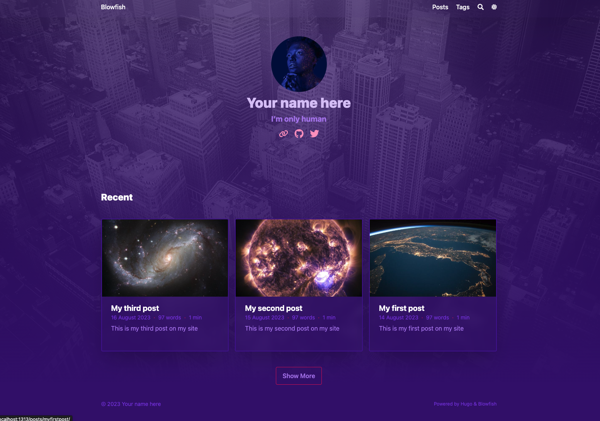

chit chat


## TL;DR

The goal of this guide is to walk a newcomer to Hugo on how to install, manage, and publish your own website. The final version of the code is available in this [repo](https://github.com/nunocoracao/blowfish-tutorial/tree/main). 


The visual style is just one of the main possibilities available in Blowfish. Users are encouraged to check the [documentation page](https://blowfish.page/) and learn how to customize the theme to their needs. Additionally, there are already [great examples](https://blowfish.page/users/) of the theme from existing users available for inspiration. Blowfish also offers several extra features in the form of `shortcodes` available out of the box in the theme - check them out [here](https://blowfish.page/docs/shortcodes/).

## Setup tools

Assumes nothing walk you through all the steps
- install brew -

```bash
/bin/bash -c "$(curl -fsSL https://raw.githubusercontent.com/Homebrew/install/HEAD/install.sh)"
```

- install Hugo - 
```bash
brew install hugo
```

- install GitHub cli tool - 
```bash
brew install gh
```

- create a folder for your site
```bash
mkdir blowfish-tutorial
cd blowfish-tutorial
```

- setup git
```bash
git init -b main
```

- setup github repo
 

```bash
gh auth login
gh repo create
git push --set-upstream origin main
```


- add core files
README.md  
.gitignore

https://github.com/nunocoracao/blowfish-tutorial/blob/main/.gitignore

```bash
#others
node_modules
.hugo_build.lock

# OS generated files
.DS_Store
.DS_Store?
._*
.Spotlight-V100
.Trashes
```

save changes to repo

```bash
git add .
git commit -m “initial commit”
git push
```

[https://github.com/nunocoracao/blowfish-tutorial](https://github.com/nunocoracao/blowfish-tutorial)
[https://brew.sh/](https://brew.sh/)
[https://gohugo.io/installation/](https://gohugo.io/installation/)


## setup site and config

- create hugo vanilla site
```bash
hugo new site --force .
```
 - PAGE NOT FOUND - no content but everything is looking good 
```bash
hugo server
```


- Install Blowfish
let’s install blowfish using git submodules - makes it easier to upgrade  
```bash
git submodule add -b main https://github.com/nunocoracao/blowfish.git themes/blowfish
```

config/\_default/\_

[https://minhaskamal.github.io/DownGit/#/home?url=https:%2F%2Fgithub.com%2Fnunocoracao%2Fblowfish%2Ftree%2Fmain%2Fconfig%2F\_default](https://minhaskamal.github.io/DownGit/#/home?url=https:%2F%2Fgithub.com%2Fnunocoracao%2Fblowfish%2Ftree%2Fmain%2Fconfig%2F_default)

```md
config/_default/
├─ config.toml
├─ languages.en.toml
├─ markup.toml
├─ menus.en.toml
└─ params.toml
```


config.toml - uncomment the line ‘theme = "blowfish”

try hugo server and you should see something

```bash
hugo server
```


https://blowfish.page/docs/configuration/


Let’s configure the theme a little
strucure
Create /content/posts - for your posts


### menus.en.toml

```toml
[[main]()]
  name = "Posts"
  pageRef = "posts"
  weight = 10

[[main]()]
  name = "Tags"
  pageRef = "tags"
  weight = 30
```


layout and colors
background layout - [https://blowfish.page/](https://blowfish.page/)
neon colors[https://blowfish.page/docs/getting-started/#colour-schemes](https://blowfish.page/docs/getting-started/#colour-schemes)

add an image.jpg to assets folder - background for the site

profile.jpg for your profile picture

Here are the examples I am using in this tutorial


### params.toml

```bash
disableImageOptimization = false
defaultBackgroundImage = "image.jpg" # used as default for background images 
```

```bash
[homepage]
  layout = "background" # valid options: page, profile, hero, card, background, custom
  homepageImage = "IMAGE.jpg" # used in: hero, and card
  showRecent = true
  showRecentItems = 6
  showMoreLink = true
  showMoreLinkDest = "/posts"
  cardView = true
  cardViewScreenWidth = false
  layoutBackgroundBlur = true # only used when layout equals background

[header]
  layout = "fixed"
```

```bash
[article]
  showHero = true
  heroStyle = "background" 
  showSummary = true
  showTableOfContents = true
  showRelatedContent = true
  relatedContentLimit = 3

[list]
  showCards = true
  groupByYear = false
  cardView = true
```


### languages.en.toml

personal info

```bash
[author]
   name = "Your name here"
   image = "profile.jpg"
   headline = "I'm only human"
   bio = "A little bit about you" - appears as author card in articles
```

uncomment the links


## content
got to your posts folder and let’s create our first article
create a new folder and give it the name myfirstpost
withn create a index.md file - your article
and pick a featured.jpg or .png for your image

```md
---
title: "My first post"
date: 2023-08-14
draft: false
summary: "This is my first post on my site"
tags: ["space"]
---

## A sub-title

Lorem ipsum dolor sit amet, consectetur adipiscing elit. Morbi nibh nisl, vulputate eu lacus vitae, maximus molestie libero. Vestibulum laoreet, odio et sollicitudin sollicitudin, quam ligula tempus urna, sed sagittis eros eros ac felis. In tristique tortor vitae lacinia commodo. Mauris venenatis ultrices purus nec fermentum. Nunc sit amet aliquet metus. Morbi nisl felis, gravida ac consequat vitae, blandit eu libero. Curabitur porta est in dui elementum porttitor. Maecenas fermentum, tortor ac feugiat fringilla, orci sem sagittis massa, a congue risus ipsum vel massa. Aliquam sit amet nunc vulputate, facilisis neque in, faucibus nisl.
```





## host

Firebase

got to firebase and create a new project

tou can disable or enable analytics - up to you - I am skipping this step in this tutorial

```bash
brew install firebase
```


```bash
firebase login
firebase init
```


hugo -E -F --minify -d ../public


firebase-hosting-merge.yml
```yaml
# This file was auto-generated by the Firebase CLI
# https://github.com/firebase/firebase-tools

name: Deploy to Firebase Hosting on merge
'on':
  push:
    branches:
      - main
jobs:
  build_and_deploy:
    runs-on: ubuntu-latest
    steps:
      - name: Hugo setup
        uses: peaceiris/actions-hugo@v2.6.0
        env:
          ACTIONS_ALLOW_UNSECURE_COMMANDS: 'true'

      - name: Check out code into the Go module directory
        uses: actions/checkout@v4
        with:
          submodules: true  # Fetch Hugo themes (true OR recursive)
          fetch-depth: 0    # Fetch all history for .GitInfo and .Lastmod

      - name: Build with Hugo
        env:
          # For maximum backward compatibility with Hugo modules
          HUGO_ENVIRONMENT: production
          HUGO_ENV: production
        run: hugo -E -F --minify -d ../public

      - name: Deploy Production
        uses: FirebaseExtended/action-hosting-deploy@v0
        with:
          repoToken: '${{ secrets.GITHUB_TOKEN }}'
          firebaseServiceAccount: '${{ secrets.FIREBASE_SERVICE_ACCOUNT_BLOWFISH_TUTORIAL }}'
          channelId: live
          projectId: blowfish-tutorial

```


firebase-hosting-pull-request.yml
```yaml
# This file was auto-generated by the Firebase CLI
# https://github.com/firebase/firebase-tools

name: Deploy to Firebase Hosting on PR
'on': pull_request
jobs:
  build_and_preview:
    if: '${{ github.event.pull_request.head.repo.full_name == github.repository }}'
    runs-on: ubuntu-latest
    steps:
      - name: Hugo setup
        uses: peaceiris/actions-hugo@v2.6.0
        env:
          ACTIONS_ALLOW_UNSECURE_COMMANDS: 'true'

      - name: Check out code into the Go module directory
        uses: actions/checkout@v4
        with:
          submodules: true  # Fetch Hugo themes (true OR recursive)
          fetch-depth: 0    # Fetch all history for .GitInfo and .Lastmod

      - name: Build with Hugo
        env:
          # For maximum backward compatibility with Hugo modules
          HUGO_ENVIRONMENT: production
          HUGO_ENV: production
        run:  hugo -E -F --minify -d ../public

      - name: Deploy preview
        uses: FirebaseExtended/action-hosting-deploy@v0
        with:
          repoToken: '${{ secrets.GITHUB_TOKEN }}'
          firebaseServiceAccount: '${{ secrets.FIREBASE_SERVICE_ACCOUNT_BLOWFISH_TUTORIAL }}'
          expires: 30d
          channelId: preview-${{ github.event.number }}
          projectId: blowfish-tutorial
```


```bash
git add .
git commit -m "add github actions workflows"  
git push  
```


## Conclution and Next Steps


https://blowfish.page/docs/
https://blowfish.page/docs/configuration/
https://blowfish.page/docs/shortcodes/
https://blowfish.page/examples/
https://blowfish.page/users/


  
[https://blowfish-tutorial.web.app/](https://blowfish-tutorial.web.app/)

https://blowfish-tutorial.web.app/ 