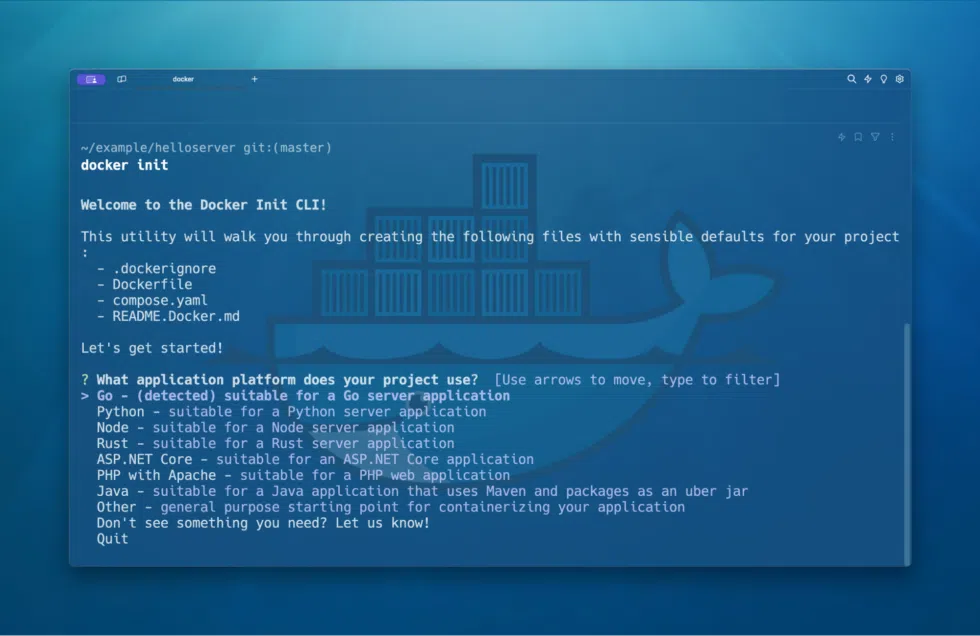

In May 2023, Docker announced the beta release of docker init, a new command-line interface (CLI) tool in Docker Desktop designed to streamline the Docker setup process for various types of applications and help users containerize their existing projects. We’re now excited to announce the general availability of docker init, with support for multiple languages and stacks, making it simpler than ever to containerize your applications.

## What is docker init?
Initially released in its beta form in Docker 4.18, docker init has undergone several enhancements. docker initis a command-line utility that aids in the initialization of Docker resources within a project. It automatically generates Dockerfiles, Compose files, and.dockerignore files based on the nature of the project, significantly reducing the setup time and complexity associated with Docker configurations. 

The initial beta release of init came with support only for Go and generic projects. The latest version, available in Docker Desktop 4.27, supports Go, Python, Node.js, Rust, ASP.NET, PHP, and Java.

## How to use docker init
Using docker init is straightforward and involves a few simple steps. Start by navigating to your project directory where you want the Docker assets to be initialized. In the terminal, execute the docker init command. This command initiates the tool and prepares it to analyze your project (Figure 1).

docker init will scan your project and ask you to confirm and choose the template that best suits your application. Once you select the template, docker init asks you for some project-specific information, automatically generating the necessary Docker resources for your project (Figure 2).

This step includes creating a Dockerfile and a Compose file tailored to the language and framework of your choice, as well as other relevant files. The last step is to run docker-compose up to start your newly containerized project.

## Why use docker init?
The docker init tool simplifies the process of dockerization, making it accessible even to those new to Docker. It eliminates the need to manually write Dockerfiles and other configuration files from scratch, saving time and reducing the potential for errors. With its template-based approach, docker init ensures that the Docker setup is optimized for the specific type of application you are working on and that your project will follow the industry’s best practices.

## Conclusion
The general availability of docker init offers an efficient and user-friendly way to integrate Docker into your projects. Whether you’re a seasoned Docker user or new to containerization, docker init is set to enhance your development workflow. 


**Note:** this post was originally posted externally please go to [Docker's blog](https://www.docker.com/blog/streamline-dockerization-with-docker-init-ga/) to read the full post


