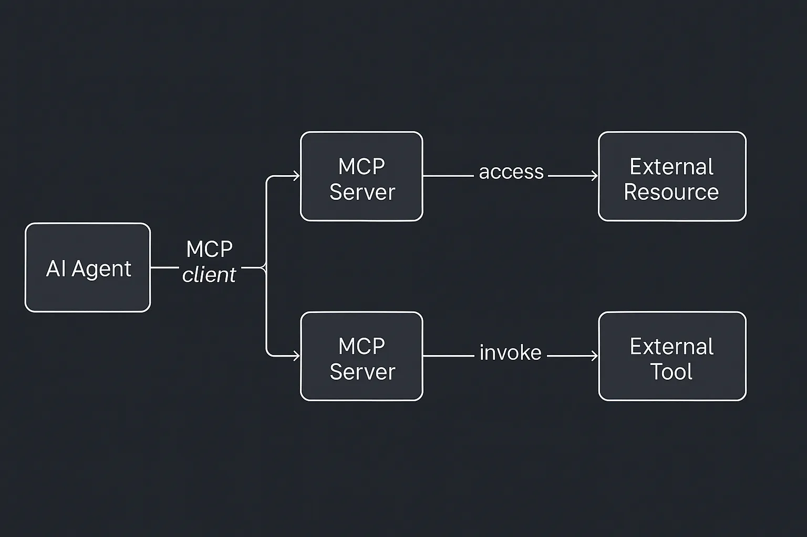

Model Context Protocol（MCP）は、AIが汎用コネクタを手に入れたときに起こることです — USB-Cを想像してください - ただしインテリジェントシステム用です。軽量で発見可能で標準化されたインターフェースを通じて、AIモデルがツール、データソース、さらには複雑なワークフローにアクセスできるようにするシンプルなクライアント-サーバープロトコルを定義しています。[^ref-1]

この記事では、MCPとは何か、どのように機能するか、なぜAI開発にとって重要なのか、そして現在の採用状況の概要を提供し、概念的な理解と実践的なコンテキストの両方を身につけていただきます。

コアでは、MCP（Model Context Protocol）は、AIシステムが標準化されたプロトコルを使用して外部ツールやデータソースと通信するための一貫した方法を定義しています。AIエージェントをそれらが対話するシステムから切り離すインターフェース仕様と考えてください。各統合をハードコードする代わりに、開発者は既知の形式で機能を公開するサーバーを定義し、[^ref-4]AIクライアント（Claude、ChatGPT、またはカスタムアシスタントなど）はJSON-RPCを使用してローカルまたはリモートストリーム経由で接続します。[^ref-4]

プロトコルはクライアント-サーバーモデルを中心に構成されています：

- **MCPクライアント**はAIアプリケーション内にあります。接続、機能の発見、リクエストのルーティングを処理します。
- **MCPサーバー**は、スタンドアロンプログラム（多くの場合マイクロサービスまたはコンテナ）[^ref-3]で、クライアントが理解できる形式で特定の機能（「ツール」）、データソース（「リソース」）、および指示テンプレート（「プロンプト」）を公開します。

AIエージェントが何かをする必要があるとき — 例えば、ファイルを検索したり、データベースにクエリを実行したり、外部サービスを呼び出したりする場合 — クライアントを使用して適切なサーバーに構造化されたリクエストを送信します。そのサーバーはロジックを実行し（APIへのクエリやドキュメントのスクレイピングなど）、結果をクライアントに送り返し、クライアントはそれをAIのコンテキストに注入します。

この分離には強力な影響があります。[^ref-1] [^ref-4]まず、外部システムの複雑さをAIモデルから抽象化します。第二に、AIロジックとビジネスロジックの間に再利用可能で発見可能なレイヤーを導入します。第三に、モデルが外部システムに作用することを許可されたときに重要な、制御されたアクセス、認証、サンドボックス化などの安全機能を可能にします。しかし、おそらく最も重要な影響はこれです：AIエージェントの価値は、アクセスできる**コンテキスト**と実行できる**アクション**に直接結びついています。コンテキストのないモデルは汎用的です。インターフェースのないモデルは不活性です。AIに真の有用性を与えるのは、知性だけでなく、関連性です — 意味のある入力で推論し、それに応じて意味のあることを行う能力です。これには、外部の知識、ユーザーデータ、ツール、システムへのアクセス、およびそれらとのインターフェースのための安全で信頼性の高い方法が必要です。これこそがMCPが解き放つものです。

MCPサーバーは、孤立したAIモデルを接続された有能なシステムに変えます。構造化されたコンテキスト（リソース経由）、アクション可能な機能（ツール経由）、戦略的ガイダンス（プロンプト経由）を公開することで、AIモデルに実世界のアプリケーションで実際に価値を提供するために必要な基盤と余裕を与えます。アシスタントが「物事を知っている」だけでは十分ではありません — 物事を調べ、行動を起こし、実際のデータに基づいて適応できる必要があります。MCPは、それが大規模に起こることを可能にするインフラストラクチャです。

### なぜ重要なのか

今日のほとんどのAIエージェントは、同じ致命的な欠陥に苦しんでいます：彼らはあまり*しない*のです。確かに、質問に答えたりコピーを書いたりできますが、行動を起こすこと（データベースへのクエリ、メールの送信、会議の予約）に関しては、助けが必要です。今日のほとんどのAIエージェントは、孤立した脳のように動作しています — 賢いですが、切断されています。タイムリーでタスクに関連する情報へのアクセスがなく、世界で行動する能力がなければ、その有用性は限られています。テキストを生成するようにプロンプトできますが、カレンダーを確認したりCRMにクエリを実行したりできなければ、推測に限定されます。

MCPはこれを変えます。外部システムへのインターフェースレイヤーをAIに装備し、エージェントがライブデータについて推論し、意味のあるアクションを取ることを可能にします。これにより、受動的なアドバイザーからワークフローへの能動的な参加者に変わります。AIはタスクを推奨するだけでなく、実際のスタックを使用してそれをスケジュールし、ログに記録し、完了します。

### MCPサーバーの解剖学

各サーバーは3つのコアを公開します：

- **ツール** — モデルが呼び出せる関数（`send_email`、`run_query`など）
- **リソース** — モデルがコンテキストにロードできる読み取り専用データ（ファイル、レコード）
- **プロンプト** — モデルがツールを効果的に使用するのに役立つテンプレートまたは例

この構造により、AIに高度にモジュラーで検査可能な環境が与えられます。ツールはスコープとバージョン管理ができます。リソースはリアルタイムで更新できます。プロンプトはモデル間で動作を標準化するドメイン固有の指示を運ぶことができます。

技術的なプロトコルに馴染みのない読者のために、JSON-RPCはリクエストとレスポンスがJSONで構造化される軽量なメッセージング形式です。クライアント（AIエージェント）が「このツールをこれらのパラメータで呼び出せ」などの指示を送信し、構造化された結果を受け取ることができます。このシンプルさにより、AIがツールとどのように対話するかを標準化するのに適しています。

例えば、現在のMCP仕様は**JSON-RPC**をメッセージング形式として使用し、通常はストリーム（例えばHTTPストリーム、Unixパイプ、またはWebSocket）経由で送信されます。JSON-RPCはJSONでエンコードされたリモートプロシージャコールプロトコルで、クライアントがサーバー上のメソッド（ツール）を呼び出し、構造化された結果を受け取ることができます。これにより、軽量で言語に依存せず、デバッグが容易になります。さらに、認証と認可フローは**OAuth 2.1**を介して標準化されており、クライアントとサーバー間でユーザー資格情報が安全に交換される方法を管理しています。


sequenceDiagram autonumber
    participant Agent as AIエージェント (クライアント)
    participant Server as MCPサーバー
    participant Tool as 外部システム

    Agent->>Server: JSON-RPC呼び出し
    Server->>Tool: API / ツール呼び出し
    Tool-->>Server: レスポンス
    Server-->>Agent: JSON-RPC結果


そして、すべてが発見可能なスキーマを介して公開されるため、新しく接続されたエージェントでも、特定のMCPサーバーが何を提供するかをすぐに理解できます。これは、AIエージェントが新しい機能に動的に適応できるゼロ設定モデルをサポートします。

### プラグアンドプレイの相互運用性

MCPはオープンでモデルに依存しません。つまり：

- 1つのGitHub MCPサーバーがClaude、ChatGPT、またはその他のエージェントで動作できます。
- 1人の開発者がコネクタを一度構築すれば、すべてのAIモデルが使用できます。
- チームはハードな依存関係なしにツールを交換したりチェーンしたりできます。

この設計は「一度書いて、多くに提供」アプローチを奨励しています。開発者は、例えばNotionのコネクタを一度書けば、互換性のあるすべてのAIアシスタントが即座にNotionの機能にアクセスできます。同様に、チームがナレッジベース用のカスタム内部MCPサーバーを書けば、複数のエージェント — リサーチアシスタント、サポートボット、開発者コパイロット — をロジックの重複なしに同じインターフェースに接続できます。

統合をインフラストラクチャに変えています。

### すでに起こっていること

2024年後半にAnthropicによってオープンソースでリリースされて以来、MCPはAI業界全体で急速に普及しています：

- **OpenAI**: 2025年3月、OpenAIはChatGPTデスクトップアプリとAgents SDKを含む製品全体でMCPのサポートを発表しました。CEOのSam AltmanはMCPの人気とOpenAIの製品への統合を強調しました[^ref-6]。

- **Microsoft**: Anthropicと協力して、MicrosoftはMCP用のC# SDKを導入し、.NETアプリケーションとの統合を容易にしました。ModelContextProtocol NuGetパッケージはプレビューフェーズで21,000以上のダウンロードを記録しています[^ref-7]。

- **Google Cloud**: Google Cloud Next 2025で、Googleは「Agentspace」と「Agent2Agent」（A2A）プロトコルを発表し、AIエージェント間の相互運用性を促進しています。これらのイニシアチブは、AIシステムとツール間の標準化された通信というMCPの目標と一致しています[^ref-8]。

- **Azure AI**: MicrosoftのAzure AI Agent ServiceはMCPをサポートし、AIエージェントがAzure AI Searchやbing検索によるリアルタイムWebデータを含む多様なデータソースにアクセスできるようにしています[^ref-9]。

- **企業採用**: Block、Apollo、Sourcegraphなどの企業がMCPをシステムに統合し、AIエージェントがプロプライエタリなナレッジベースや開発者ツールとシームレスに対話できるようにしています[^ref-1]。

- **オープンソースエコシステム**: MCPコミュニティは、Docker、Gmail、GitHub、PostgreSQLなどのプラットフォームとの統合をカバーする300以上のオープンソースMCPサーバーを開発しています[^ref-10]。

これらの採用は理論的なものだけではありません。例えば、Sourcegraphの開発者はMCPを使用してCody AIアシスタントがインデックス化されたドキュメントとコード参照をオンデマンドで取得できるようにし、開発者サポートワークフローを劇的に改善しました。同様に、ReplitはMCPサーバーを統合して、ブラウザ内AIアシスタントがプロジェクトファイルとユーザー固有のコンテキストにリアルタイムでアクセスできるようにしました。これらの実世界の実装は、MCPがデプロイ可能であるだけでなく、AIを活用したツールの機能を意味のある形で強化することを示しています。

### 開発者のパワームーブ

ビルダーとして、今できること：
- Dockerコンテナを実行することでエージェントに新しいスキルを追加 [^ref-3]。
- Python、JS、またはC#で独自のMCPサーバーを書く — すべての主要なスタック用のSDKが存在します。
- Docker、Kubernetes、またはCloudflare Workers [^ref-5]でコネクタをリモートまたはローカルでホスト。

MCPは統合の負担を逆転させます。すべてのツールにAIサポートを構築する代わりに、任意のAIがアクセスできるツールを構築します。これは小規模チームや独立開発者にとってゲームチェンジャーです — MCPインターフェースがあれば、プロトコルを理解するすべてのモデルにツールを公開できます。

また、良いAPIの衛生状態と人間と機械の間の明確な契約を促進します。機能とデータフローを形式化することで、MCPは予測可能で信頼性の高い動作を確保するのに役立ちます — これはシステム間でタスクを自動化するときに不可欠です。

MCPはもう1つの開発者ツールではありません — コンポーザブルAIのための**デザインパターン**です。

### 戦略的影響

- **標準化 → エコシステム**: HTTPがウェブを作ったように、MCPは共有AIインターフェースレイヤーを作成しています。
- **コンポーザブルエージェント**: あるエージェントの出力がMCPリソースを介して別のエージェントのコンテキストになります。
- **新しいカテゴリ**: 「エージェントハブ」や「MCPマーケットプレイス」として製品全体が登場しています。

MCPを話すツールが増えるほど、複雑なエージェンティックワークフローにチェーンするのが簡単になります。Salesforceから販売データを取得し、レポートを生成し、スライドデッキを作成し、会議をスケジュールするAIを想像してください — すべて相互接続されたMCPサーバー経由で。

これはまた、より高レベルの抽象化の舞台を設定します：ツール間でエージェントの動作をルーティングするオーケストレーションプラットフォーム、MCPを介して配布されるプロンプトカタログ、さらには標準化されたコネクタを介してAI活動を監視する自動化されたコンプライアンスレイヤー。MCPは使用を可能にするだけでなく、ガバナンスとスケールを可能にしています。

SLA付きのエンタープライズグレードのコネクタを期待してください。内部チームが自分のデータをMCPエンドポイントとして公開することを期待してください。成長するスキルライブラリにプラグインしてスケールするAIアプリを期待してください。

### 今後の展望

もちろん、この未来を実現するには、いくつかの重要な技術的および組織的考慮事項をナビゲートする必要があります。レガシーシステムとの統合には、既存のAPIを準拠したMCPサーバーにラップする必要があり、これは簡単ではない場合があります。セキュリティも最重要になります — ツールとリソースをAIに公開するには、堅牢な認証とサンドボックス化メカニズムが必要です。幸い、仕様にはOAuth2フローと安全なチャネル上のJSON-RPCのサポートが含まれていますが、実装には依然として注意が必要です。さらに、組織は自分たちがコントロールしていないMCPサーバーへの信頼を確立する必要があり、コードの出所と安全なデフォルトに関する疑問が生じます。他のオープンスタンダードと同様に、より広いエコシステムはベストプラクティスに合わせる必要があり、その調整はまだ形成中です。

これはまた、業界全体を再形成する世代的な機会を表しています。開発者ツールからカスタマーサポート、法的自動化からIT運用まで、MCPはAIネイティブインターフェースが標準になる道を開きます。より多くのツールがMCPエンドポイントを公開するにつれて、エージェントは断片化されたシステムとドメイン間で動作し、以前は手動のステッチングを必要としていた複雑なワークフローを調整できます。

さらに先を見ると、これが「アプリ」の伝統的な概念を完全に置き換えるかもしれません。個別のアプリケーションを起動する代わりに、ユーザーはMCP接続されたツールを使用して動的にワークフローを組み立てるインテリジェントエージェントにタスクを割り当てます。言い換えれば、いくつかのスタートアップが単一目的のデバイスでやろうとしたこと — [Humane AI Pin](https://www.theverge.com/24126502/humane-ai-pin-review)、[Rabbit R1](https://www.theverge.com/2024/5/2/24147159/rabbit-r1-review-ai-gadget)を見てください — ですが、実際の有用性、拡張性、そしてギミックではなく基盤になる可能性があります。

採用が増えるにつれて、ガバナンスへの需要も高まります。幸い、MCPはこれを扱いやすくします：すべてのツール呼び出しは記録され監査可能で、トークンはスコープ指定され取り消し可能で、サーバーは分離またはサンドボックス化できます。企業がMCPサーバーをポリシーレイヤーでラップし、アクセス制御、可観測性、コンプライアンスに関するベストプラクティスが出現することを期待してください。

### 何を構築しますか？

2025年にAIツールを構築しているなら、ハードコードしないでください — MCPサーバーを構築してください。MCPはエージェントに行動し、スケールし、より広いエコシステムにプラグインする能力を与えます。自分のエージェントを拡張する場合でも、エコシステムに新しいツールを貢献したい場合でも、今が始めるのに最適な時期です。

📌 これらの出発点をチェックしてください：
- [MCP SDKと仕様](https://modelcontextprotocol.io)
- [Docker MCPサーバーコミュニティリポジトリ](https://github.com/docker/mcp-servers)
- [Ardor Cloudのクイックスタートガイド](https://ardor.cloud/blog/early-adopters-mcp-open-source-implementations)

### 参考文献

[^ref-1]: https://modelcontextprotocol.io
[^ref-2]: https://openai.com/blog/openai-embraces-mcp
[^ref-3]: https://github.com/docker/mcp-servers
[^ref-4]: https://github.com/modelcontextprotocol
[^ref-5]: https://developers.cloudflare.com/workers/tutorials/mcp-servers
[^ref-6]: https://techcrunch.com/2025/03/26/openai-adopts-rival-anthropics-standard-for-connecting-ai-models-to-data/?utm_source=chatgpt.com
[^ref-7]: https://visualstudiomagazine.com/articles/2025/04/14/trending-model-context-protocol-for-ai-agents-gets-csharp-sdk.aspx?utm_source=chatgpt.com
[^ref-8]: https://www.techradar.com/pro/live/google-cloud-next-2025-all-the-news-and-updates-as-it-happens?utm_source=chatgpt.com
[^ref-9]: https://devblogs.microsoft.com/foundry/integrating-azure-ai-agents-mcp/?utm_source=chatgpt.com
[^ref-10]: https://ardor.cloud/blog/early-adopters-mcp-open-source-implementations?utm_source=chatgpt.com
