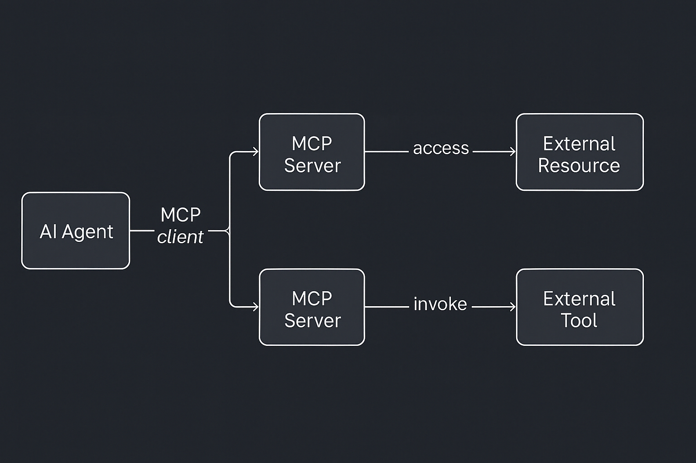

Model Context Protocol (MCP) is what happens when AI gets a universal connector — think USB-C - but for intelligent systems. It defines a simple client-server protocol that lets AI models tap into tools, data sources, and even complex workflows through lightweight, discoverable, and standardized interfaces.[^ref-1]

This piece offers an overview of what MCP is, how it works, why it matters for AI development, and the current state of its adoption—equipping you with both conceptual understanding and practical context.

At its core, MCP (Model Context Protocol) defines a consistent way for AI systems to talk to external tools and data sources using a standardized protocol. Think of it as an interface spec that decouples AI agents from the systems they interact with. Instead of hardcoding each integration, developers define a server that exposes functionality in a known format,[^ref-4] and AI clients (like Claude, ChatGPT, or a custom assistant) connect via a local or remote stream using JSON-RPC.[^ref-4]

The protocol revolves around a client-server model:

- The **MCP Client** lives inside the AI application. It handles connections, capability discovery, and request routing.
- The **MCP Server** is a standalone program (often a microservice or container)[^ref-3] that exposes specific functions (“tools”), data sources (“resources”), and instruction templates (“prompts”) in a format the client can understand.

When the AI agent needs to do something—say, look up a file, query a database, or invoke an external service—it uses the client to send a structured request to the appropriate server. That server executes the logic (like querying an API or scraping a document), and sends the result back to the client, which injects it into the AI’s context.

This separation has powerful implications.[^ref-1] [^ref-4] First, it abstracts away the complexity of external systems from the AI model. Second, it introduces a reusable, discoverable layer between AI logic and business logic. And third, it enables safety features like controlled access, authentication, and sandboxing—critical when models are allowed to act on external systems. But perhaps the most important implication is this: the value of an AI agent is directly tied to the **context** it can access and the **actions** it can take. A model without context is generic. A model without interface is inert. What gives AI real utility is not just intelligence, but relevance — the ability to reason with meaningful inputs and do something meaningful in response. That requires access to external knowledge, user data, tools, systems — and a safe, reliable way to interface with them. This is precisely what MCP unlocks.

MCP servers turn isolated AI models into connected, capable systems. By exposing structured context (via resources), actionable capabilities (via tools), and strategic guidance (via prompts), they give AI models the grounding and affordances needed to actually deliver value in real-world applications. It's not enough for an assistant to "know things" — it has to be able to look things up, take action, and adapt based on real data. MCP is the infrastructure that allows that to happen at scale.

### Why It Matters

Most AI agents today suffer from the same fatal flaw: they don’t *do* much. Sure, they can answer questions or write copy—but when it comes to taking action (querying a database, sending an email, booking a meeting), they need help. Most AI agents today operate like isolated brains — smart, but disconnected. Without access to timely, task-relevant information and without the ability to act in the world, their usefulness is capped. You can prompt them to generate text, but if they can’t check your calendar or query your CRM, they’re limited to guesswork.

MCP changes this. It equips AI with an interface layer to external systems, allowing agents to reason over live data and take meaningful actions. That turns them from passive advisors into active participants in workflows. It means your AI doesn’t just recommend a task — it schedules it, logs it, or completes it using your actual stack. 

### Anatomy of an MCP Server

Each server exposes three core things:

- **Tools** — Functions the model can invoke (like `send_email`, `run_query`)
- **Resources** — Read-only data the model can load into context (files, records)
- **Prompts** — Templates or examples that help the model use the tool effectively

This structure gives the AI a highly modular, inspectable environment. Tools can be scoped and versioned. Resources can be updated in real time. Prompts can carry domain-specific instructions that standardize behavior across models. 

For readers unfamiliar with technical protocols, JSON-RPC is a lightweight messaging format where requests and responses are structured in JSON. It allows the client (AI agent) to send instructions like “call this tool with these parameters” and receive a structured result in return. This simplicity makes it well-suited for standardizing how AI interacts with tools.

For example, the current MCP specification uses **JSON-RPC** as the messaging format, typically transmitted over streams (e.g. HTTP streams, Unix pipes, or WebSockets). JSON-RPC is a remote procedure call protocol encoded in JSON that allows the client to call methods (tools) on the server and receive structured results. This makes it lightweight, language-agnostic, and easy to debug. Additionally, authentication and authorization flows are standardized via **OAuth 2.1**, which governs how user credentials are exchanged securely between clients and servers.


sequenceDiagram autonumber
    participant Agent as AI Agent (Client)
    participant Server as MCP Server
    participant Tool as External System

    Agent->>Server: JSON-RPC call
    Server->>Tool: API / Tool Invocation
    Tool-->>Server: Response
    Server-->>Agent: JSON-RPC result


And because everything is exposed via a discoverable schema, even newly connected agents can immediately understand what a given MCP server offers. This supports a zero-configuration model where AI agents can dynamically adapt to new capabilities.

### Plug-and-Play Interoperability

MCP is open and model-agnostic. That means:

- One GitHub MCP server can work with Claude, ChatGPT, or any other agent.
- One developer can build a connector once, and every AI model can use it.
- Teams can swap out or chain tools without hard dependencies.

This design encourages a “write once, serve many” approach. A developer can write a connector for, say, Notion once — and every compatible AI assistant instantly gains access to Notion capabilities. Similarly, if your team writes a custom internal MCP server for your knowledge base, you can connect multiple agents — research assistants, support bots, dev copilots — to the same interface with no duplication of logic. 

It’s turning integration into infrastructure.

### What’s Already Happening

Since its open-source release by Anthropic in late 2024, MCP has rapidly gained traction across the AI industry:

- **OpenAI**: In March 2025, OpenAI announced support for MCP across its products, including the ChatGPT desktop app and Agents SDK. CEO Sam Altman highlighted MCP's popularity and its integration into OpenAI's offerings[^ref-6].

- **Microsoft**: Collaborating with Anthropic, Microsoft introduced a C# SDK for MCP, facilitating integration with .NET applications. The ModelContextProtocol NuGet package has seen significant adoption, with over 21,000 downloads in its preview phase[^ref-7].

- **Google Cloud**: At Google Cloud Next 2025, Google unveiled "Agentspace" and the "Agent2Agent" (A2A) protocol, promoting interoperability among AI agents. These initiatives align with MCP's goals of standardized communication between AI systems and tools[^ref-8].

- **Azure AI**: Microsoft's Azure AI Agent Service now supports MCP, enabling AI agents to access diverse data sources, including Azure AI Search and real-time web data via Bing Search[^ref-9].

- **Enterprise Adoption**: Companies like Block, Apollo, and Sourcegraph have integrated MCP into their systems, allowing AI agents to interact seamlessly with proprietary knowledge bases and developer tools[^ref-1].

- **Open-Source Ecosystem**: The MCP community has developed over 300 open-source MCP servers, covering integrations with platforms like Docker, Gmail, GitHub, and PostgreSQL[^ref-10].

These adoptions are not just theoretical. For example, developers at Sourcegraph have used MCP to let their Cody AI assistant retrieve indexed documentation and code references on-demand, dramatically improving developer support workflows. Similarly, Replit integrated MCP servers to allow their in-browser AI assistant to access project files and user-specific contexts in real time. These real-world implementations show how MCP is not only possible to deploy—but meaningfully enhances the capabilities of AI-powered tools.

### Developer Power Move

As a builder, you can now:
- Add new skills to your agent by running a Docker container [^ref-3].
- Write your own MCP server in Python, JS, or C#—SDKs exist for all major stacks.
- Host connectors remotely or locally, on Docker, Kubernetes, or even Cloudflare Workers [^ref-5].

MCP flips the integration burden. Instead of building AI support into every tool, we build tools to be accessible to any AI. This is game-changing for small teams or indie developers — once you’ve got an MCP interface, you can expose your tool to any model that understands the protocol. 

It also promotes good API hygiene and clear contracts between humans and machines. By formalizing the capabilities and data flows, MCP helps ensure predictable, reliable behavior — which is essential when automating tasks across systems.

MCP isn’t another dev tool—it’s a **design pattern** for composable AI.

### Strategic Implications

- **Standardization → Ecosystem**: Just like HTTP created the web, MCP is creating a shared AI interface layer.
- **Composable Agents**: One agent’s output becomes another agent’s context, via MCP resources.
- **New Categories**: Entire products are emerging as “agent hubs” or “MCP marketplaces.”

The more tools speak MCP, the easier it becomes to chain them into complex, agentic workflows. Imagine an AI that pulls sales data from Salesforce, generates a report, creates a slide deck, and schedules a meeting — all via interconnected MCP servers. 

This also sets the stage for higher-level abstractions: orchestration platforms that route agent behavior across tools, prompt catalogs distributed via MCP, and even automated compliance layers that monitor AI activity via standardized connectors. MCP isn’t just enabling use — it’s enabling governance and scale.

Expect to see enterprise-grade connectors with SLAs. Expect internal teams to expose their own data as MCP endpoints. Expect AI apps that scale by plugging into a growing library of skills.

### Looking Ahead

Of course, realizing this future involves navigating some key technical and organizational considerations. Integration with legacy systems often requires wrapping existing APIs into compliant MCP servers, which can be non-trivial. Security also becomes paramount—exposing tools and resources to AI requires robust authentication and sandboxing mechanisms. Fortunately, the spec includes support for OAuth2 flows and JSON-RPC over secure channels, but implementation still demands care. Additionally, organizations must establish trust in MCP servers they don’t control—raising questions around code provenance and safe defaults. As with any open standard, the broader ecosystem must align on best practices, and that alignment is still forming.

This also represents a generational opportunity to reshape entire industries. From developer tooling to customer support, legal automation to IT operations, MCP paves the way for AI-native interfaces to become the norm. As more tools expose MCP endpoints, agents can operate across fragmented systems and domains, coordinating complex workflows that previously required manual stitching.

And looking even further ahead, this might be what replaces the traditional concept of an “app” altogether. Instead of launching discrete applications, users will task intelligent agents that assemble workflows dynamically using MCP-connected tools. In other words, it's what some startups tried to do with single-purpose devices — looking at you: [Humane AI Pin](https://www.theverge.com/24126502/humane-ai-pin-review), [Rabbit R1](https://www.theverge.com/2024/5/2/24147159/rabbit-r1-review-ai-gadget) — but with actual utility, extensibility, and a shot at becoming foundational instead of gimmicky.

As adoption grows, so will demand for governance. Thankfully, MCP makes this tractable: every tool call is logged and auditable, tokens are scoped and revocable, and servers can be isolated or sandboxed. Expect enterprises to wrap MCP servers with policy layers — and for best practices to emerge around access control, observability, and compliance.

### What will you build?

If you're building AI tools in 2025, don’t hardcode — build an MCP server. MCP gives your agent the ability to act, scale, and plug into a broader ecosystem. Whether you're extending your own agent or want to contribute a new tool to the ecosystem, there's never been a better time to dive in.

📌 Check out these starting points:
- [MCP SDKs and Spec](https://modelcontextprotocol.io)
- [Docker MCP Server community repo](https://github.com/docker/mcp-servers)
- [Fast Start Guide from Ardor Cloud](https://ardor.cloud/blog/early-adopters-mcp-open-source-implementations)

### References

[^ref-1]: https://modelcontextprotocol.io  
[^ref-2]: https://openai.com/blog/openai-embraces-mcp  
[^ref-3]: https://github.com/docker/mcp-servers  
[^ref-4]: https://github.com/modelcontextprotocol  
[^ref-5]: https://developers.cloudflare.com/workers/tutorials/mcp-servers  
[^ref-6]: https://techcrunch.com/2025/03/26/openai-adopts-rival-anthropics-standard-for-connecting-ai-models-to-data/?utm_source=chatgpt.com  
[^ref-7]: https://visualstudiomagazine.com/articles/2025/04/14/trending-model-context-protocol-for-ai-agents-gets-csharp-sdk.aspx?utm_source=chatgpt.com  
[^ref-8]: https://www.techradar.com/pro/live/google-cloud-next-2025-all-the-news-and-updates-as-it-happens?utm_source=chatgpt.com  
[^ref-9]: https://devblogs.microsoft.com/foundry/integrating-azure-ai-agents-mcp/?utm_source=chatgpt.com  
[^ref-10]: https://ardor.cloud/blog/early-adopters-mcp-open-source-implementations?utm_source=chatgpt.com