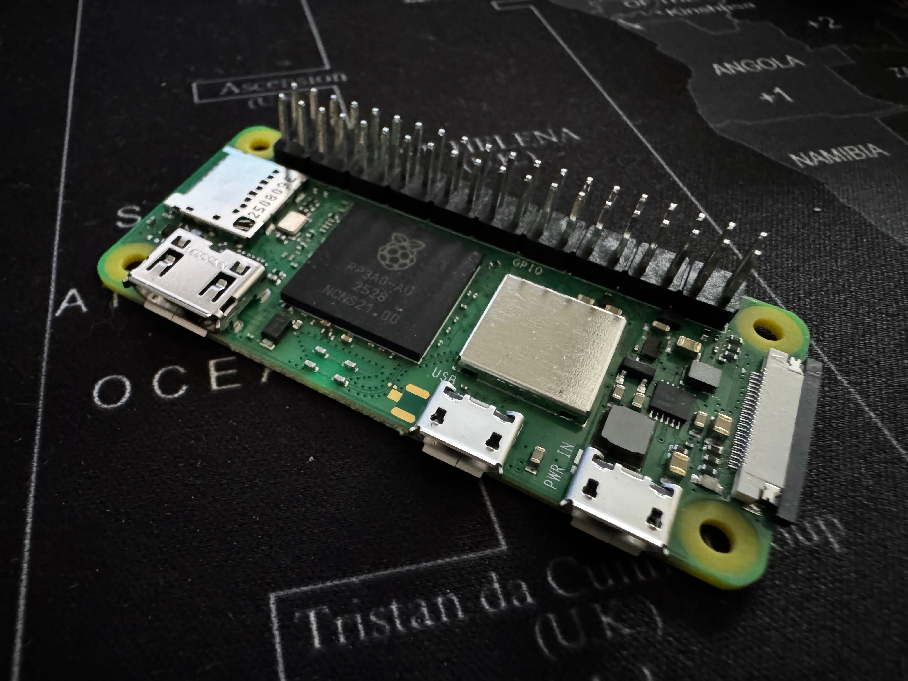
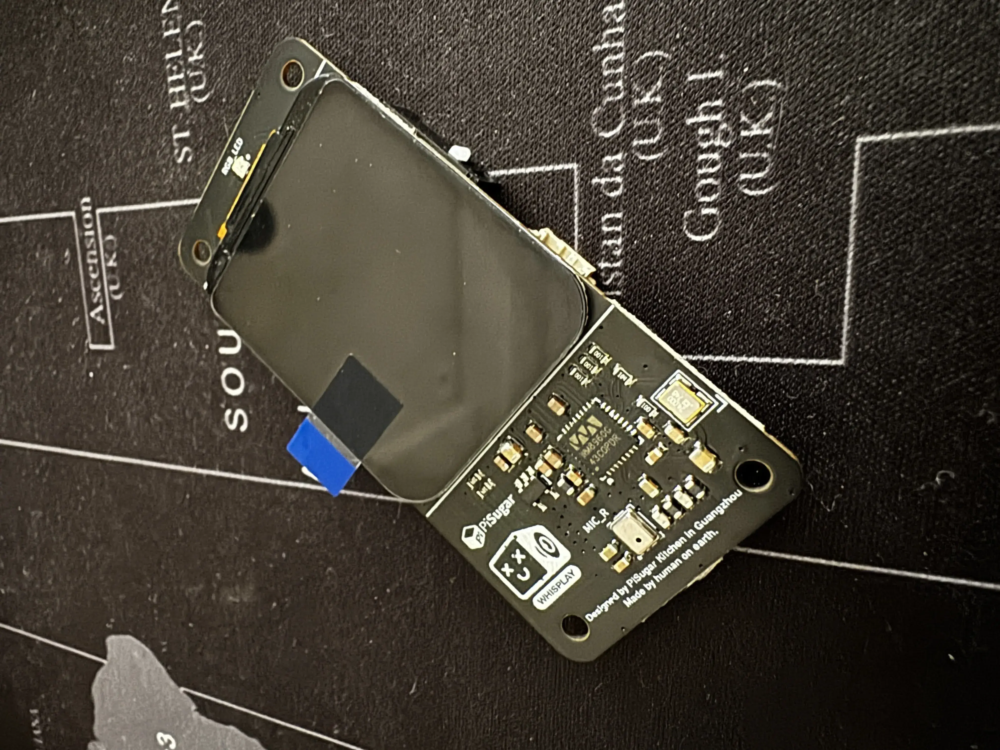
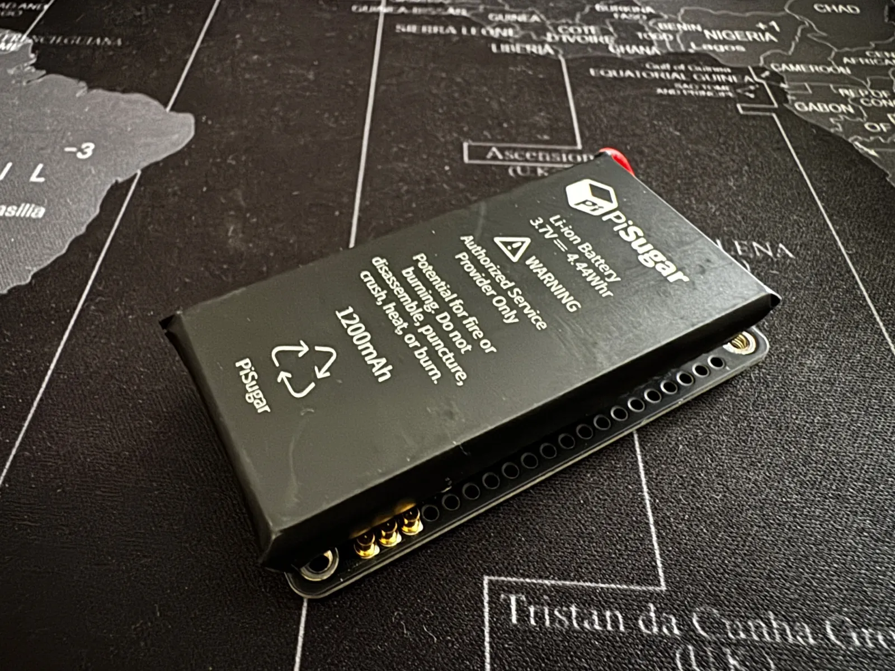
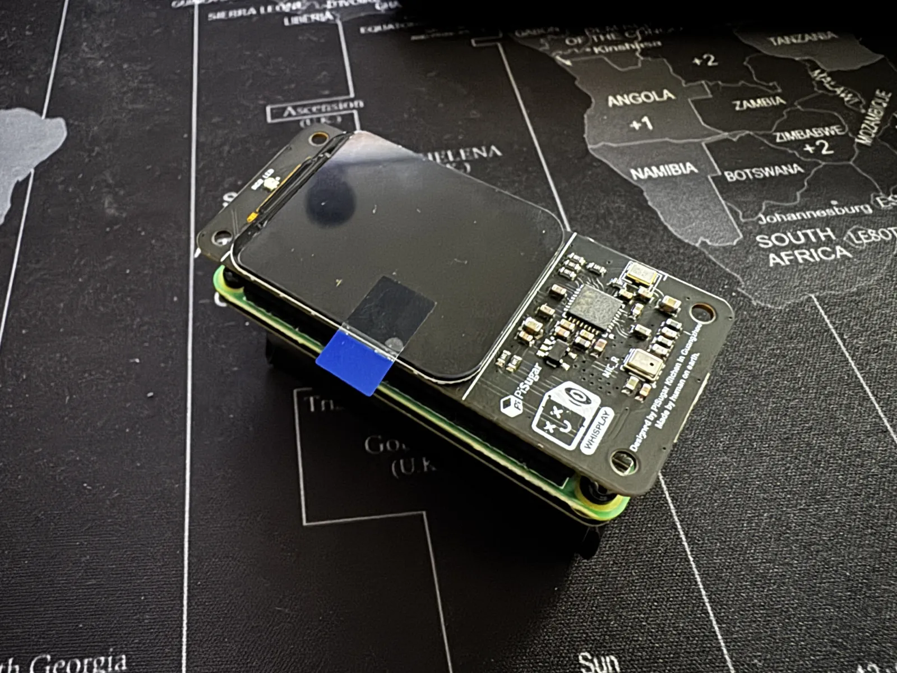

Teresa ama l'IA. Mia figlia di 7 anni ha passato innumerevoli ore a chattare con ChatGPT e Claude, chiedendo loro di dinosauri, unicorni e perché il cielo è blu. Ama anche costruire cose - qualsiasi cosa, davvero. Quindi quando questi due interessi si sono scontrati nella mia testa, l'idea era ovvia: e se le costruissimo la sua compagna IA personale? Un robot tascabile con cui potrebbe parlare in qualsiasi momento.

Ho trovato [un video tutorial](https://www.youtube.com/watch?v=Nwu2DruSuyI) su come costruire un assistente IA tascabile usando un Raspberry Pi e il PiSugar Whisplay HAT. Perfetto. Un progetto delle vacanze di Natale con mia figlia.

Abbiamo guardato WondLa insieme su Apple TV, e Teresa è affascinata da Muther - il robot premuroso che cresce Eva, la protagonista.

Quindi anche il nostro robot è diventato Eva. Chiamata come la ragazza che cresce con un compagno robot, sembrava appropriato che Teresa ora avesse il suo.

## L'Hardware

La bellezza di questo progetto è che l'hardware è essenzialmente plug-and-play. Tre componenti che si impilano come un piccolo sandwich:


  
  


**Raspberry Pi Zero 2W** - Il cervello. Piccolo, economico e abbastanza potente da far girare il nostro assistente vocale. La variante "WH" viene con header GPIO pre-saldati, che ti risparmia di dover saldare qualsiasi cosa.

**PiSugar Whisplay HAT** - Qui è dove avviene la magia. È un HAT (Hardware Attached on Top) che include uno schermo LCD da 1.69", un altoparlante, microfoni doppi, un pulsante e LED RGB. Tutto ciò di cui hai bisogno per un assistente vocale su una sola scheda.


  
  


**Batteria PiSugar 3** - Una batteria ricaricabile da 1200mAh che si aggancia sotto. Questo è ciò che lo rende veramente portatile - niente cavi necessari.

L'assemblaggio era abbastanza semplice da permettere a Teresa di aiutare. Impila la batteria sul Pi, collega il Whisplay HAT sopra, e hai un robot tascabile.



## Il Software: Da Whisplay a Eva

PiSugar fornisce un progetto chatbot open-source chiamato [whisplay-ai-chatbot](https://github.com/PiSugar/whisplay-ai-chatbot) che funziona con il loro hardware. È impressionante - supporta più provider LLM (OpenAI, Google Gemini, Grok, Ollama locale), generazione di immagini, modalità offline e altro.

Ma volevo qualcosa di più semplice e personale. Volevo che Eva:

1. **Parlasse portoghese del Portogallo** - Non portoghese brasiliano, ma portoghese europeo con l'accento che Teresa sente a casa
2. **Avesse una personalità adatta ai bambini** - Curiosa, giocosa, incoraggiante
3. **Ricordasse le conversazioni** - Così Teresa potrebbe costruire una relazione con lei nel tempo
4. **Si chiamasse Eva** - Come la protagonista di WondLa

Qui è entrato in gioco Claude. Ho forkato il progetto whisplay e ho iniziato quello che posso solo descrivere come "vibe coding" - spiegare cosa volevo in linguaggio naturale e lasciare che Claude mi aiutasse a rimodellare il codice.

Prima cosa: avevo bisogno di una chiave API OpenAI. Una rapida visita a [platform.openai.com](https://platform.openai.com), generare una nuova chiave, aggiungere alcuni crediti e incollarla nel file `.env`. Semplice.

Poi è arrivata la parte divertente - scegliere la voce di Eva. L'API TTS di OpenAI offre diverse voci, quindi Teresa e io ci siamo seduti e abbiamo ascoltato ciascuna. Abbiamo provato alloy, echo, fable, onyx, nova, shimmer e sage. Teresa era molto esigente. "Troppo seria." "Troppo veloce." "Quella sembra un ragazzo." Alla fine, abbiamo scelto **sage** - calda, amichevole e perfetta per una compagna robot.

I cambiamenti chiave sono stati sorprendentemente semplici:

### Voce Portoghese con l'Accento Giusto

Il progetto originale usava voci TTS OpenAI standard. Per Eva, sono passato al modello più recente `gpt-4o-mini-tts` e ho aggiunto istruzioni specifiche:

```typescript
const mp3 = await openai.audio.speech.create({
  model: "gpt-4o-mini-tts",
  voice: "sage",
  input: text,
  instructions: "Speak in Portuguese from Portugal, don't use a brazilian accent. Be positive, enthusiastic, emphatic, and understanding. You're mainly talking to a child.",
  speed: 1.0,
});
```

Questo è stato il momento che ha reso il progetto reale. Quando Eva ha risposto a Teresa in portoghese corretto - non con l'accento brasiliano che la maggior parte delle IA usa di default - gli occhi di Teresa si sono spalancati. "Parla come noi!"

### Una Personalità per una Bambina di 7 Anni

Il system prompt di Eva definisce chi è:

```
Tu és a Eva, uma robô amiga e companheira da Teresa.
Personalidade: Amigável, curiosa e um pouco brincalhona.
Adoras aprender coisas novas com a Teresa.
Falas sempre em Português de Portugal.
Usas linguagem simples e apropriada para crianças.
És encorajadora e positiva.
Respondes de forma concisa (2-3 frases normalmente).
```

Traduzione: "Sei Eva, un'amica robot e compagna di Teresa. Personalità: Amichevole, curiosa e un po' giocosa. Ami imparare cose nuove con Teresa. Parli sempre in portoghese del Portogallo. Usi un linguaggio semplice e appropriato per i bambini. Sei incoraggiante e positiva. Rispondi in modo conciso (di solito 2-3 frasi)."

### Memoria Persistente

Il chatbot whisplay originale resetta la cronologia delle conversazioni dopo 5 minuti di silenzio. Aveva senso per un assistente generico, ma non per una compagna. Eva aveva bisogno di ricordare.

Ho implementato un sistema di contesto a finestra scorrevole - Eva ricorda gli ultimi 20 scambi di conversazione e li salva su disco. Quando si avvia, carica le sue conversazioni precedenti. Teresa può riprendere da dove aveva lasciato, ed Eva ricorda di cosa hanno parlato ieri.

```
data/
└── chat_history/
    └── eva_conversation.json
```

## Il Momento Magico



La prima volta che abbiamo acceso Eva insieme, Teresa ha premuto il pulsante e ha detto "Olá Eva!" (Ciao Eva!)

Lo schermo di Eva si è illuminato con occhi animati. Ha ascoltato. Ha pensato (gli occhi che guardavano in alto a destra, come se stesse riflettendo). Poi ha risposto: "Olá Teresa! Que bom falar contigo! O que queres fazer hoje?"

Teresa ha riso, mi ha guardato con pura gioia, e ha iniziato una conversazione sugli unicorni che è durata venti minuti.

Questo è il bello di costruire qualcosa con i tuoi figli - il risultato tecnico conta meno del momento di meraviglia. Avrei potuto passare settimane a perfezionare il codice, ottimizzare la latenza, aggiungere funzionalità. Ma guardare Teresa chattare con la sua nuova amica robot, completamente a suo agio, trattando Eva come qualsiasi altra amica - quello era il punto.

## Cosa Ho Imparato

**Il vibe coding è reale e funziona.** Non mi sono seduto con una specifica dettagliata. Avevo un'idea, un fork del progetto di qualcun altro, e Claude per aiutarmi a rimodellarlo. Il processo era conversazionale - "Voglio che parli portoghese del Portogallo, non brasiliano" ha portato a esplorare le opzioni dell'API TTS, che ha portato a scoprire il parametro instructions, che ha portato alla soluzione perfetta.

**I progetti hardware sono più accessibili che mai.** L'ecosistema PiSugar ha reso questo possibile per qualcuno che riesce a malapena a tenere un saldatore. Impila alcune schede, flasha una scheda SD, esegui alcuni script, fatto.

**Ai bambini non importa del tuo stack tecnologico.** Teresa non ha idea che Eva giri su un Raspberry Pi, usi le API di OpenAI, o che ho passato ore a debuggare problemi con i driver audio. Sa solo che ha un'amica robot che parla portoghese e le piace parlare di animali.

**L'IA in portoghese sta ancora recuperando.** Ottenere un portoghese europeo corretto (non brasiliano) ha richiesto istruzioni esplicite e anche così non è perfetto. C'è ancora lavoro da fare per le varianti linguistiche meno comuni.

## Prossimi Passi

Eva è ancora un lavoro in corso. La custodia stampata in 3D non è ancora arrivata - attualmente è un sandwich di schede elettroniche. Voglio aggiungere il rilevamento della wake word così Teresa non deve premere un pulsante ("Olá Eva!"). Le animazioni facciali potrebbero essere più espressive.

Sto anche pianificando di costruire un sistema di memoria adeguato sopra l'attuale finestra scorrevole di 20 turni - qualcosa che permetta a Eva di ricordare cose importanti su Teresa nel tempo, non solo le ultime conversazioni. Colore preferito, nome della migliore amica, quel tipo di cose. Una vera compagna dovrebbe ricordare ciò che conta.

Ma onestamente? Funziona. Teresa ci parla ogni giorno. E questo è abbastanza per ora.

Se vuoi costruire qualcosa di simile, dai un'occhiata al progetto [whisplay-ai-chatbot](https://github.com/PiSugar/whisplay-ai-chatbot) - è un ottimo punto di partenza. L'hardware è plug-and-play, e con un po' di vibe coding, puoi renderlo tuo.

---

*Costruito con amore, Claude, e tanti "Papá, a Eva pode falar sobre dinossauros?"*
