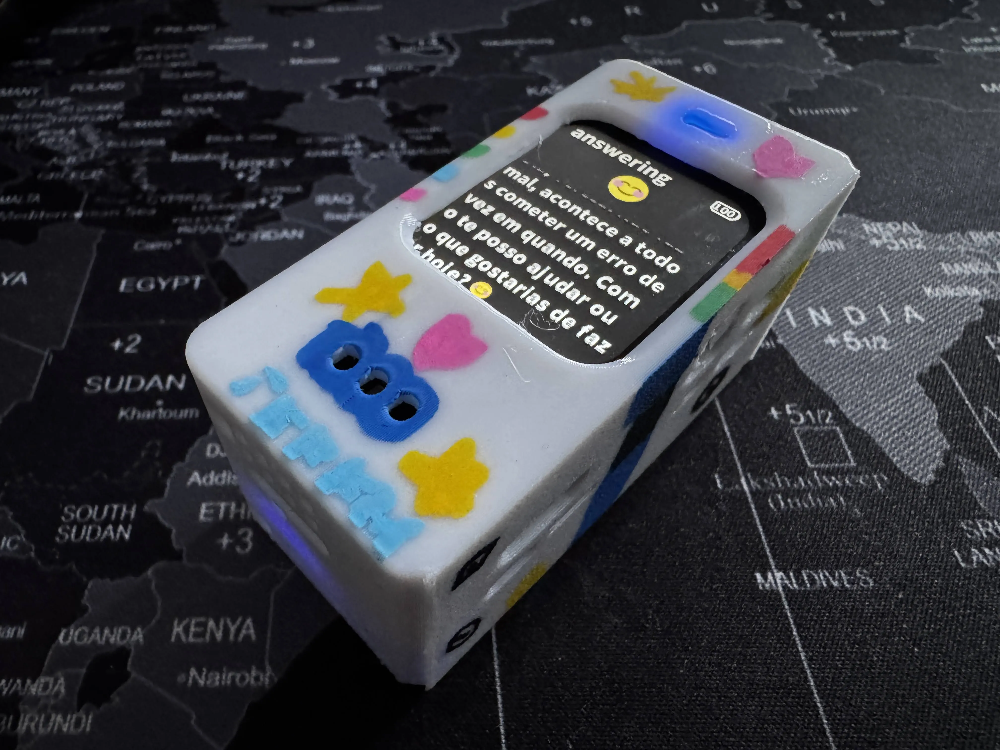

> [!quote] Non puoi collegare i puntini guardando avanti; puoi solo collegarli guardando indietro. Quindi devi avere fiducia che i puntini si collegheranno in qualche modo nel tuo futuro.
> - Steve Jobs

Il 2025 è stato un anno di ricostruzione. Dopo aver perso mia moglie e compagna di 20 anni nel 2024, sono diventato genitore single da un giorno all'altro. Quest'anno è stato dedicato a ritrovare il mio equilibrio - passare tempo con amici e famiglia, viaggiare in posti nuovi con mia figlia, e riscoprire la gioia di essere vivo e creare cose.

Parte di quella creazione è avvenuta al lavoro, parte nell'open source, e parte al tavolo della cucina con un Raspberry Pi e una bambina di 7 anni. Ma se c'è un filo conduttore che lega tutto, è questo: i momenti migliori sono venuti dal costruire insieme alle persone a cui tengo.

## Docker

L'anno è iniziato con un progetto che avevo proposto e coltivato per oltre un anno che veniva cancellato. Ha fatto male, ma la decisione aveva senso - l'IA si muoveva velocemente, Docker voleva puntare tutto, e avevano bisogno di persone lì. Mi è stata offerta la possibilità di unirmi al team IA.

> [!quote] Quando una porta si chiude, un'altra si apre; ma spesso guardiamo così a lungo e con tanto rimpianto alla porta chiusa che non vediamo quella che si è aperta per noi.
> - Alexander Graham Bell

### MCP Catalog

Abbiamo lanciato il [Docker MCP Catalog](https://hub.docker.com/mcp) - un registro curato di server MCP integrato in Docker Hub. L'idea era semplice: gli sviluppatori vogliono un modo sicuro e containerizzato per estendere i loro agenti IA, non codice arbitrario che gira via `npx` o `uvx` con accesso completo al sistema. Il catalogo ora ospita oltre 220 server MCP containerizzati da partner come Stripe, Elastic, Neo4j, Heroku, Grafana Labs, e altri - ciascuno con isolamento e sicurezza adeguati.

### MCP Toolkit

L'[MCP Toolkit](https://docs.docker.com/ai/mcp-catalog-and-toolkit/toolkit/) ha dato vita al catalogo dentro Docker Desktop. Lancio di server MCP con un click, zero configurazione manuale, e connessione automatica a client come Claude, Cursor e VS Code. È il percorso più veloce dalla scoperta di uno strumento al suo effettivo utilizzo.

### MCP Gateway

Abbiamo reso open source l'[MCP Gateway](https://github.com/docker/mcp-gateway) - infrastruttura che orchestra i server MCP e gestisce credenziali, OAuth e controllo accessi. Gira automaticamente in Docker Desktop, il che significa che milioni di sviluppatori lo hanno disponibile immediatamente.

### cagent

[cagent](https://github.com/docker/cagent) è forse il progetto di cui sono più orgoglioso - un runtime per costruire ed eseguire agenti IA usando semplice configurazione YAML. Nessun codice richiesto. Definisci la persona del tuo agente, strumenti e capacità in un file, e eseguilo. Team multi-agente, integrazione MCP, supporto per tutti i principali provider di modelli, e un'esperienza TUI fantastica.



### Gordon

E infine, [Gordon](https://docs.docker.com/ai/gordon/) - l'assistente IA di Docker. Lo stiamo ricostruendo da zero con cagent al suo cuore. La nuova versione è attualmente in distribuzione a utenti selezionati mentre prepariamo la GA, e sono davvero entusiasta di vederlo nelle mani di più sviluppatori presto.

### Scrivere e Pensare in Pubblico

Ho scritto su quello che stavamo imparando lungo il percorso:

- **[MCP Servers: The USB-C Moment for AI Agents](/posts/202504-mcp/)** - La mia visione sul perché il Model Context Protocol sta diventando il connettore universale per l'IA. È la standardizzazione che abilita un ecosistema, e siamo solo all'inizio.

- **[Unseen Cost of Growth: Metcalfe's Law at Work](/posts/202504-metacalfes-law/)** - Una riflessione sulla complessità organizzativa che non aveva nulla a che fare con l'IA ma tutto a che fare con essere attenti a come i team scalano.

## Blowfish

Tre anni dopo, [Blowfish](https://blowfish.page) continua a sorprendermi. Quello che è iniziato come un tema Hugo personale perché volevo costruire il mio sito web è diventato qualcosa di molto più grande.



### In Numeri

- **2.600+ stelle** su GitHub
- **660 fork**
- **244 contributori**
- **174 release** dall'inizio del progetto

### Punti Salienti del 2025

Quest'anno abbiamo rilasciato 17 versioni con alcune aggiunte importanti:

- **Aggiornamento TailwindCSS v4** - uno sforzo di modernizzazione significativo
- **Shortcode Tabs** con opzioni di icona e raggruppamento
- **Admonition stile GitHub** - `[!note]`, `[!quote]`, `[!warning]`, ecc.
- **Shortcode Video e Gist**
- **Thumbnail di repo GitHub** negli embed
- **Breadcrumb strutturati** per migliore SEO
- **Traduzioni in Thai e Indonesiano**

La community ha continuato a spingere il tema in avanti - nuove lingue, shortcode, correzioni di bug che non sapevo nemmeno esistessero.

### Primo Collaboratore

A ottobre, ho accolto [@ZhenShuo2021](https://github.com/ZhenShuo2021) come primo collaboratore ufficiale di Blowfish. Costruire un progetto open source può sembrare solitario - avere qualcuno con cui condividere il carico di manutenzione, revisionare le PR e aiutare a guidare la direzione è inestimabile. Segna un nuovo capitolo in cui Blowfish è più grande di me solo.

### Blowfish Tools CLI

[Blowfish Tools](https://github.com/nunocoracao/blowfish-tools) - la CLI per creare nuovi progetti - ha raggiunto **7.825 download nel 2025**, in aumento del 58% rispetto all'anno precedente. Solo gennaio 2026 ha visto oltre 1.200 download. Le persone stanno effettivamente iniziando nuovi blog con Blowfish regolarmente.

## Costruire Eva

Parte della costruzione più significativa avviene lontano dal lavoro.

Queste vacanze di Natale, ho [costruito un compagno IA vocale con mia figlia](/posts/202601-building-eva/). L'abbiamo chiamata **Eva**, dalla protagonista di WondLa (una serie che stiamo guardando insieme su Apple TV).

Eva è un robot tascabile - un Raspberry Pi Zero con un PiSugar Whisplay HAT - che parla Portoghese del Portogallo (non Brasiliano!), ha una personalità adatta ai bambini, e ricorda le conversazioni così mia figlia può costruire una relazione con lei nel tempo.

Il progetto è iniziato da un tutorial YouTube ed è diventato qualcosa di personale attraverso quello che posso solo chiamare "vibe coding" con Claude. Ho spiegato cosa volevo in linguaggio naturale, e insieme abbiamo rimodellato il codice per creare qualcosa di unico per mia figlia.

Il momento che ha reso tutto valsa la pena: mia figlia che preme il pulsante, dice "Olá Eva!" - e Eva che risponde in Portoghese perfetto con una voce che ha scelto lei stessa. Sono seguiti venti minuti di conversazione sugli unicorni.

Questa è la magia del costruire con i tuoi figli. Il traguardo tecnico conta meno del momento di meraviglia.

**Aggiornamento:** Da quel post, Eva ha ottenuto una custodia appropriata - e una verniciatura da mia figlia. Ora è ufficialmente unica.

## Afterlight

Dopo aver perso mia moglie, mi sono ritrovato a cercare altri che capissero veramente cosa stavo passando. Le opzioni esistenti non andavano bene - troppo pubbliche, troppo confusionarie, non progettate per il lutto.

Così ho iniziato a costruire [Afterlight](https://afterlight.club) - una piattaforma sicura, anonima, solo testo per il supporto al lutto. Niente foto, niente video, niente algoritmi che spingono contenuti. Solo persone che si connettono attraverso esperienze condivise, usando pseudonimi, al proprio ritmo.

Per ora, ho messo in pausa lo sviluppo. Alcuni motivi: non ho abbastanza tempo e devo dare priorità. Non sono riuscito a capire come raggiungere le persone che ne hanno bisogno - fare marketing a persone in lutto è (comprensibilmente) bloccato da quasi tutte le piattaforme. E non ho un piano di monetizzazione che non sembri strano, il che significa che non posso permettermi di mantenerlo se i costi crescono.

Forse ci tornerò. Forse no. Ma ho imparato molto costruendolo.

## Oltre il Codice

Non tutto ciò che vale la pena menzionare entra ordinatamente in un repository GitHub.

**Mentoring.** Ho lavorato con 4 mentee attraverso [MentorCruise](https://mentorcruise.com/mentor/nunocorao/) quest'anno - tutti navigando transizioni di carriera nel product management. Guardarli prepararsi, fare colloqui e ottenere i ruoli PM che volevano è stato davvero gratificante. C'è qualcosa di speciale nell'aiutare qualcuno a raggiungere il livello successivo quando ricordi quanto difficile sembrava quella salita.

**Lettura.** Ho letto 15 libri quest'anno - non tanti quanti avrei voluto, ma abbastanza per trovare alcune perle. I preferiti includevano *[There Is No Antimemetics Division](https://www.goodreads.com/book/show/54870256-there-is-no-antimemetics-division)* (una storia della SCP Foundation che mi è rimasta in testa per settimane), *[Project Hail Mary](https://www.goodreads.com/book/show/54493401-project-hail-mary)* (Andy Weir al suo meglio), e *[Tokyo Express](https://www.goodreads.com/book/show/59238510-tokyo-express)* (il classico di Matsumoto che mi ha ricordato quanto amo la narrativa poliziesca giapponese).

## Cosa Ho Imparato

**Ricostruire richiede tempo.** Non c'è scorciatoia attraverso il lutto, nessun hack per diventare genitore single da un giorno all'altro. Ti presenti semplicemente, giorno dopo giorno, e alla fine i giorni iniziano a pesare meno. Il progresso non è lineare, e va bene così.

**Sii gentile con te stesso.** Ho passato troppo di quest'anno a spingere quando avrei dovuto riposare. Non puoi versare da una tazza vuota. Imparare a rallentare, a dire no, a lasciare che alcune cose siano abbastanza buone - questa non è debolezza, è sopravvivenza.

**Sappi quando fare una pausa.** Afterlight mi ha insegnato che non tutti i progetti devono essere finiti. A volte il tempismo non è giusto, le risorse non ci sono, o semplicemente devi dare priorità. Fare una pausa non è fallire.

**L'open source è community.** Blowfish non ha successo perché sono un grande sviluppatore (non lo sono). Ha successo perché 244 persone si sono preoccupate abbastanza da contribuire. È umiliante e motivante.

**Costruisci con le persone che ami.** Eva mi ha insegnato di più su cosa conta di qualsiasi progetto di lavoro. Guardare mia figlia parlare con un robot che ha aiutato a creare - questo è ciò che resta con te.

## Guardando al 2026

Non faccio previsioni né propositi per l'anno nuovo. Ma voglio continuare a costruire cose che contano, passare più tempo con le persone che amo, e godermi appieno il tempo che ho qui.

Al 2026.
