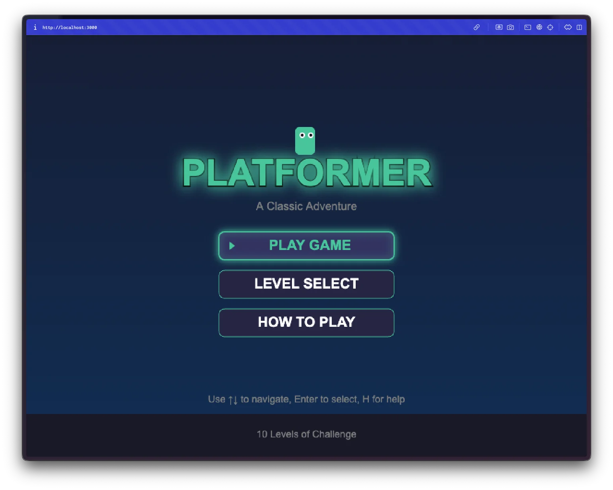
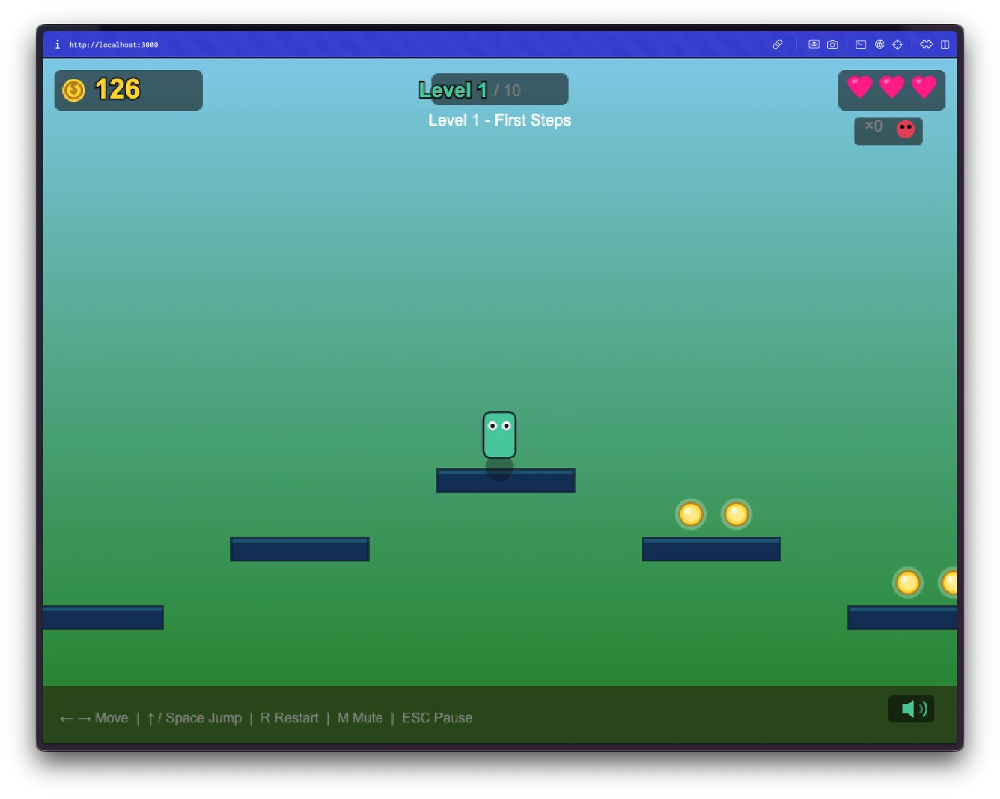
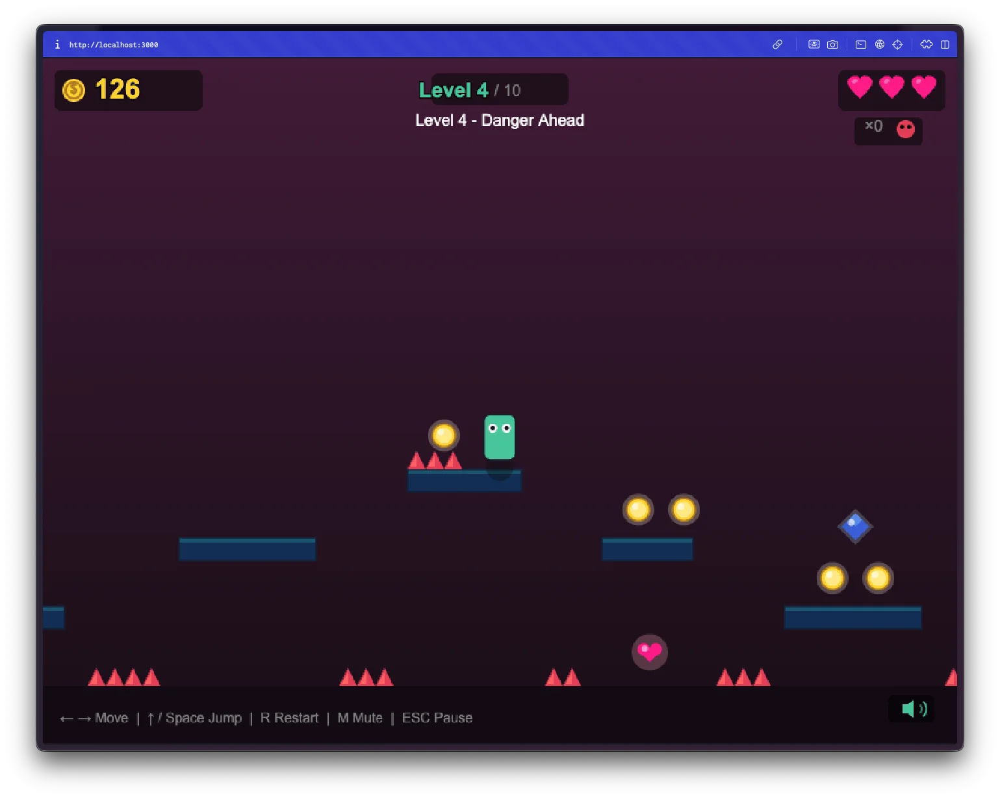

Day 1. Let's see what happens when I tell an AI to build me a game.

## The Prompt

I started with this:

> "I want to create a web based platformer with 10 levels"

That's it. That was the entire creative direction.

## What I Got

I was not expecting this.

**It has actual graphics.** Not placeholder squares - there's a little character, platforms with different colors, particle effects when you land. The whole thing has a cohesive visual style that I definitely didn't specify.

**It has music.** 8-bit background music that loops while you play. I never asked for audio. It just... added it.

**The levels actually get harder.** Level 1 is a gentle tutorial. By level 4, there are spikes. Level 7 has lava. Level 10 is genuinely challenging. The difficulty curve exists and makes sense.

**There's a full menu system.** Main menu, level select, pause screen, game over screen. I can pick any level I've unlocked. This is way more polished than "10 levels."

**It saves my progress.** Close the browser, come back later, my unlocked levels are still there. localStorage persistence that I didn't ask for.

## The Bug Reports

It wasn't perfect on the first try. I had to playtest and report issues:

- "Only see a blue box" - some browser compatibility thing
- "Level doesn't end when I reach the flag"
- "Player keeps moving right when I start the next level"
- "Level select always loads level 1"

Simple descriptions. I didn't debug anything myself - just described what I saw. The fixes came back and worked.

## A Little Secret

Here's the thing: I wasn't sitting there approving every file change and command.

The process was simple: I gave Claude the single prompt and asked it to break that down into tasks. Then it worked on each task separately, one by one. I built a small tool that manages this workflow and lets Claude Code run more autonomously - I can queue up work and come back to finished results. Still refining it, but it's what made this whole 30-day challenge possible. More on that later.

## Try It



**[Play the Platformer](https://vibe30-day01-the-platformer.vercel.app)**

Arrow keys or WASD to move, space to jump. Works on mobile too.

## Screenshots

A tour through the levels:

## Day 1 Verdict

One sentence prompt. A complete game with 10 levels, music, menus, and a save system.

**The good:** I went from zero to a working game in hours instead of weeks. The 0-to-1 speed is real.

**The tradeoff:** I don't really know the code that was built. There are 18 modules in there and I've read maybe two of them. Are there security issues? Probably. Is the architecture sound? I'm trusting that it is.

That's vibe coding. You trade deep understanding for velocity. For a fun side project like this, that's fine. For production software... we'll see.

---

*This is day 1 of [30 Days of Vibe Coding](/series/30-days-of-vibe-coding/). Follow along as I ship 30 projects in 30 days using AI-assisted coding.*
