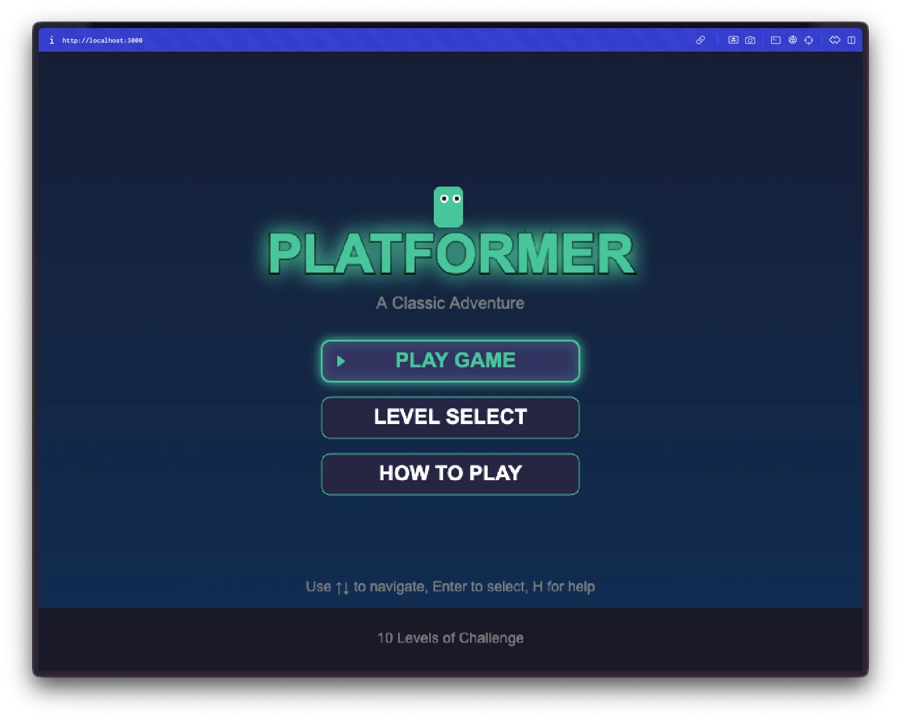
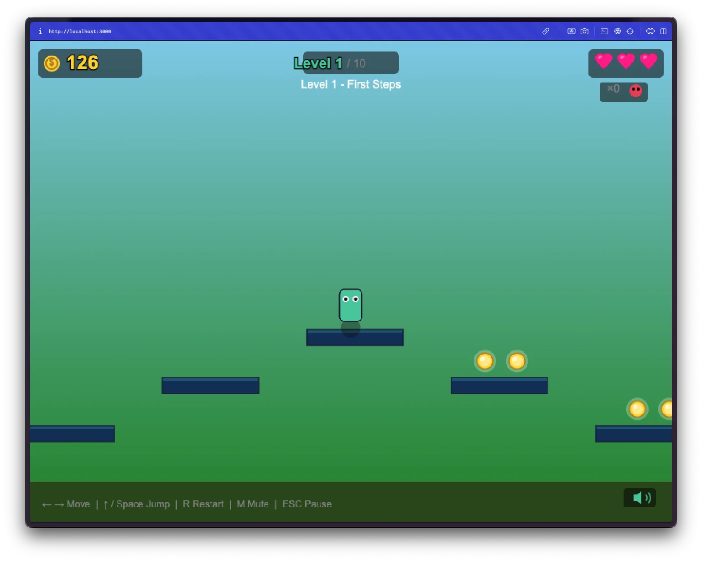
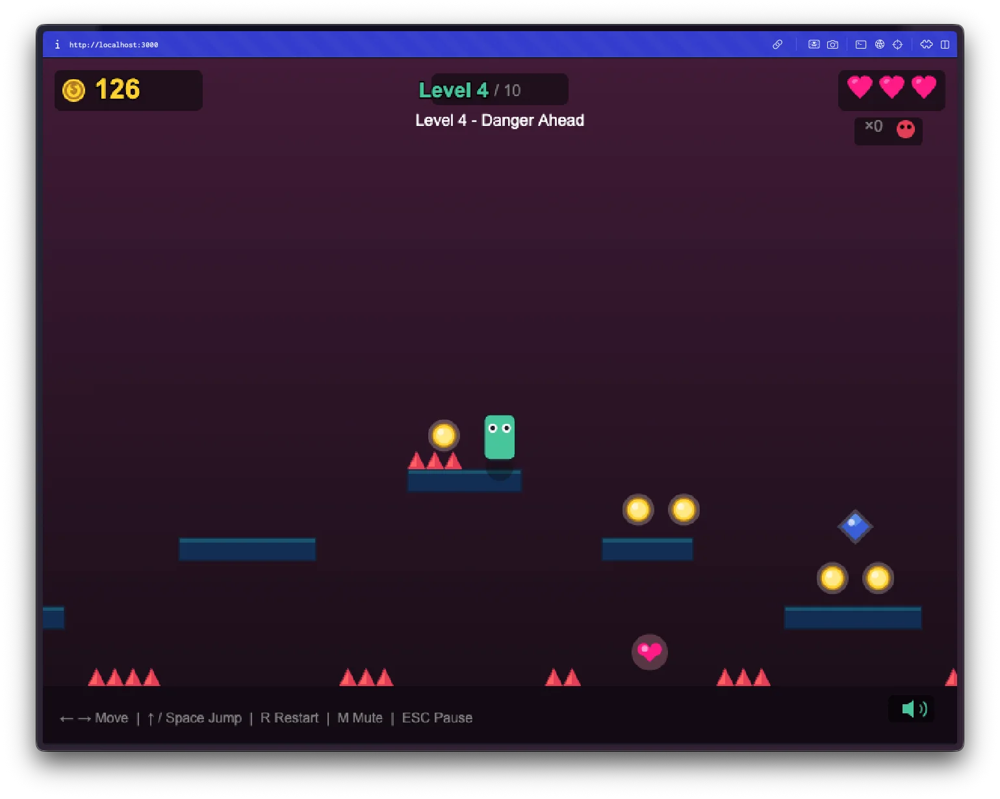
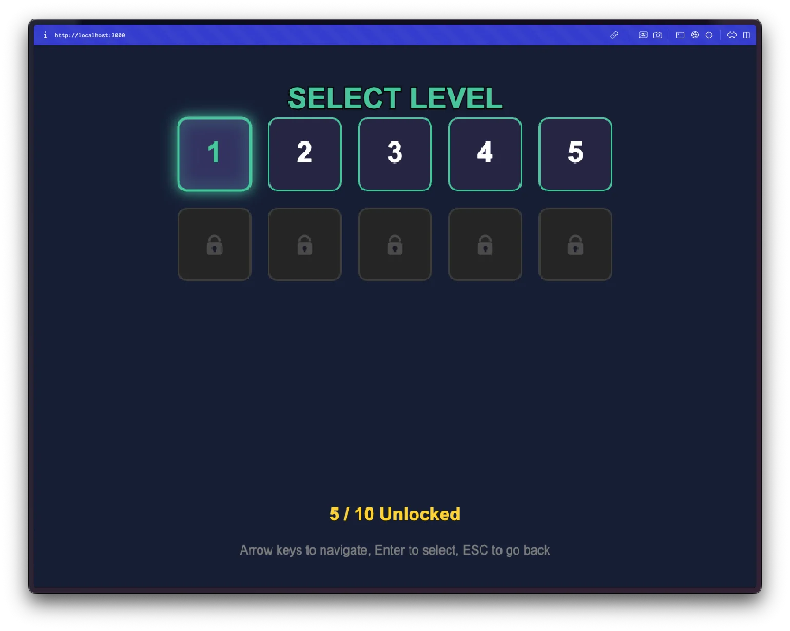
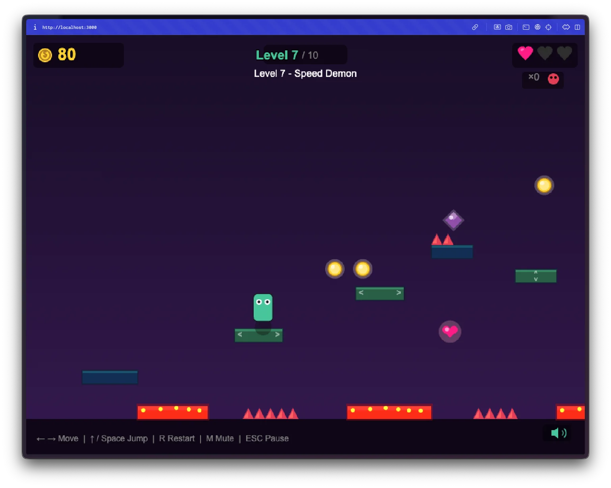
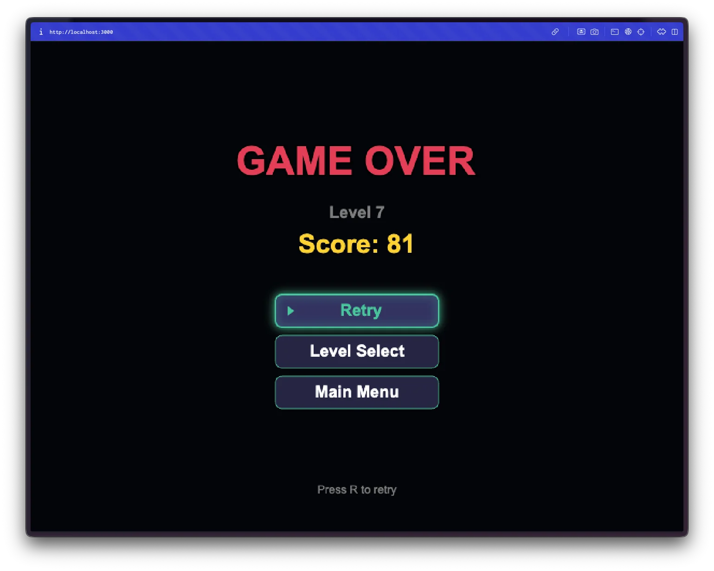

Dia 1. Vamos ver o que acontece quando peço a uma IA para me construir um jogo.

## O Prompt

Comecei com isto:

> "Quero criar um jogo de plataformas para web com 10 níveis"

Só isso. Foi toda a direção criativa que dei.

## Como Foi Construído

Este foi um dos primeiros projetos em que usei o [Watchfire](https://watchfire.io). Dei-lhe o prompt único e ele dividiu o trabalho em 21 tarefas separadas:

1. Configuração do projeto e canvas do jogo
2. Núcleo do motor de jogo com loop e renderização
3. Personagem do jogador com movimento e animações
4. Física e deteção de colisões
5. Sistema de plataformas e obstáculos
6. Sistema de níveis com carregador e câmara
7. Níveis fáceis (1-3)
8. Níveis médios (4-6) com perigos
9. Níveis difíceis (7-10)
10. Sistema de UI/HUD
11. Estados do jogo e menus
12. Sistema de áudio com efeitos sonoros 8-bit e música
13. Polimento, sistema de gravação, controlos tácteis

Depois vieram os relatórios de erros: correção de compatibilidade com browser, reestruturação para deployment, e vários bugs de jogabilidade que encontrei durante os testes.

Não fiquei ali a aprovar cada alteração de ficheiro. O Watchfire enfileirou as tarefas e foi trabalhando nelas. Voltei e tinha um jogo a funcionar, depois fiz os testes de jogabilidade.



## O Que Obtive

Não estava à espera disto.

**Tem gráficos de verdade.** Não são quadrados de substituição. Há um pequeno personagem com olhos, plataformas com cores diferentes, efeitos de partículas quando aterras. O conjunto tem um estilo visual coeso que eu definitivamente não especifiquei.

**Tem música.** Música de fundo 8-bit que toca em loop enquanto jogas. Nunca pedi áudio. Simplesmente adicionou.

**Os níveis ficam realmente mais difíceis.** O nível 1 é um tutorial suave chamado "Primeiros Passos". No nível 4, já há picos ("Perigo à Frente"). O nível 7 chama-se "Demónio da Velocidade". A curva de dificuldade existe e faz sentido.

**Tem um sistema de menus completo.** Menu principal, seleção de nível, ecrã de pausa, ecrã de fim de jogo, ecrã de nível completo. Posso escolher qualquer nível que tenha desbloqueado. Está muito mais polido do que aquilo que pedi.

**Guarda o meu progresso.** Fecho o browser, volto mais tarde, os meus níveis desbloqueados ainda estão lá. Persistência em localStorage que não pedi.

**18 módulos.** GameEngine, Player, Physics, Camera, LevelLoader, LevelManager, ParticleSystem, AudioManager, SaveManager, TouchControls... construiu uma arquitetura a sério com separação de responsabilidades. Cada módulo tem uma responsabilidade clara. Não especifiquei nada disto.

## Os Relatórios de Erros

Não ficou perfeito à primeira tentativa. Tive de fazer testes e reportar problemas:

- "Só vejo uma caixa azul" (compatibilidade com browser, precisava de um polyfill para roundRect)
- "O nível não termina quando chego à bandeira"
- "O jogador continua a mover-se para a direita quando começo o próximo nível"
- "A seleção de nível carrega sempre o nível 1"
- "A música é demasiado repetitiva"

Descrições simples. Não depurei nada eu próprio, apenas descrevi o que vi. As correções chegaram e funcionaram.

## Os Números

- **18 módulos de jogo** com separação clara de responsabilidades
- **10 níveis** com definições de nível em JSON
- **~3.500 linhas de JavaScript vanilla** (sem framework para o jogo em si)
- **21 tarefas do Watchfire** desde a configuração inicial até às correções finais de erros
- **Tempo total de envolvimento direto:** talvez 30 minutos de testes de jogabilidade e escrita de relatórios de erros

## Experimenta



**[Jogar o Platformer](https://vibe30-day01-the-platformer.vercel.app)**

Teclas de seta ou WASD para mover, espaço para saltar. Também funciona em dispositivos móveis.

## Veredicto do Dia 1

Um prompt de uma frase. Um jogo completo com 10 níveis, música, menus e um sistema de gravação.

Aqui está a questão: não escrevo um motor de jogo há mais de uma década — não desde a universidade. Já me tinha esquecido de tudo sobre deteção de colisões e sistemas de progressão de níveis. Não o conseguiria construir sozinho. Não num dia, provavelmente nem numa semana.

Este é o melhor jogo de plataformas alguma vez feito? Nem por isso. Mas existe. Funciona. As pessoas podem jogá-lo. E demorou-me algumas horas em vez de semanas. Foi isso que mudou. O custo de produzir algo tão complexo caiu dramaticamente. E se quisesse, podia continuar a polir, adicionar níveis, melhorar a física. O ponto de partida já não é um ficheiro em branco.

Acho que isto vai ser um padrão ao longo dos 30 projetos. Não vou construir a melhor versão de nada. Mas vou construir uma versão funcional de coisas que não conseguiria construir antes, e vou fazê-lo rapidamente.

---

*Este é o dia 1 de [30 Days of Vibe Coding](/series/30-days-of-vibe-coding/). Acompanha enquanto lanço 30 projetos em 30 dias com programação assistida por IA.*
