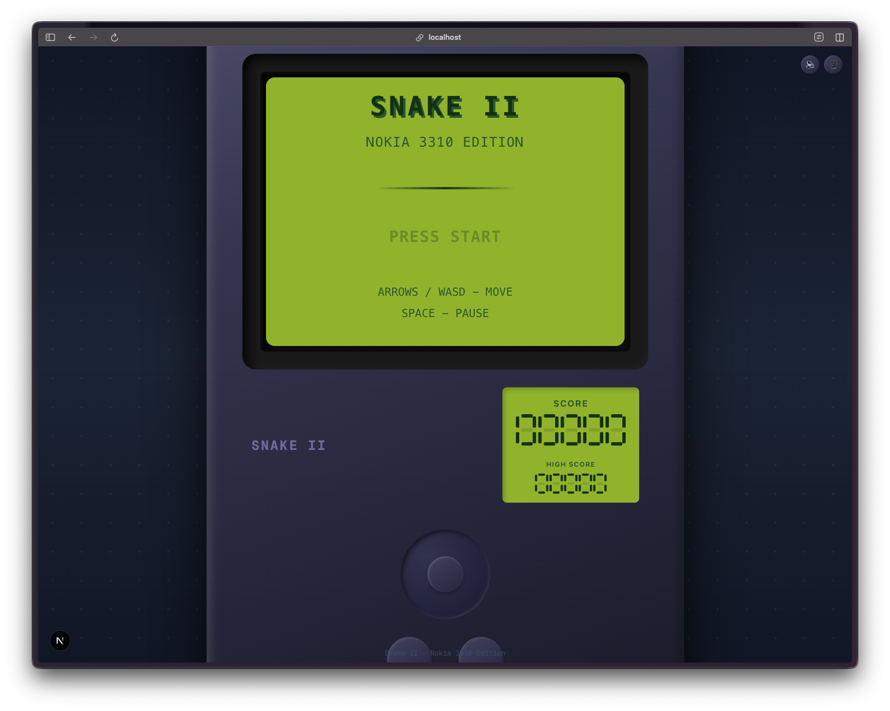
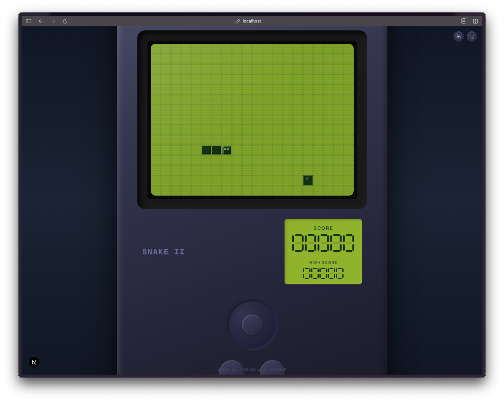
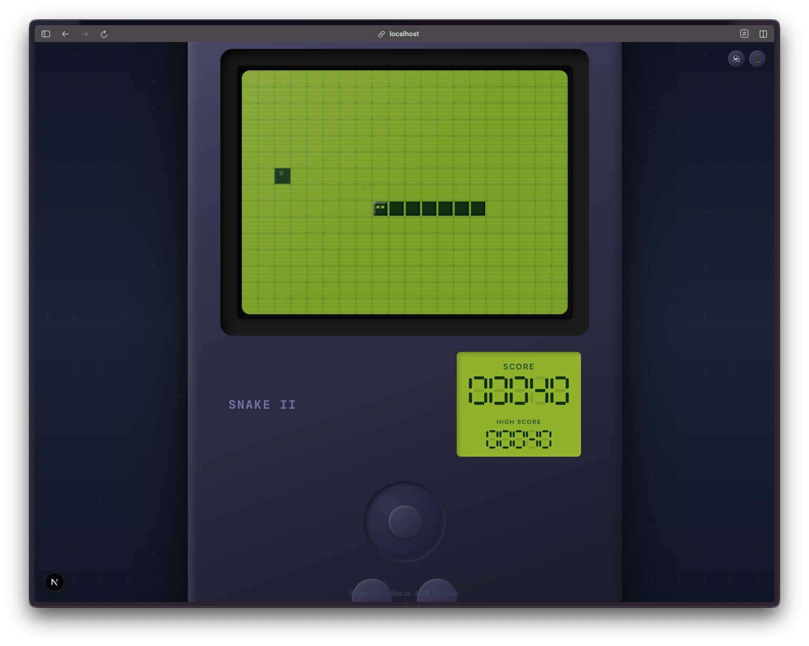
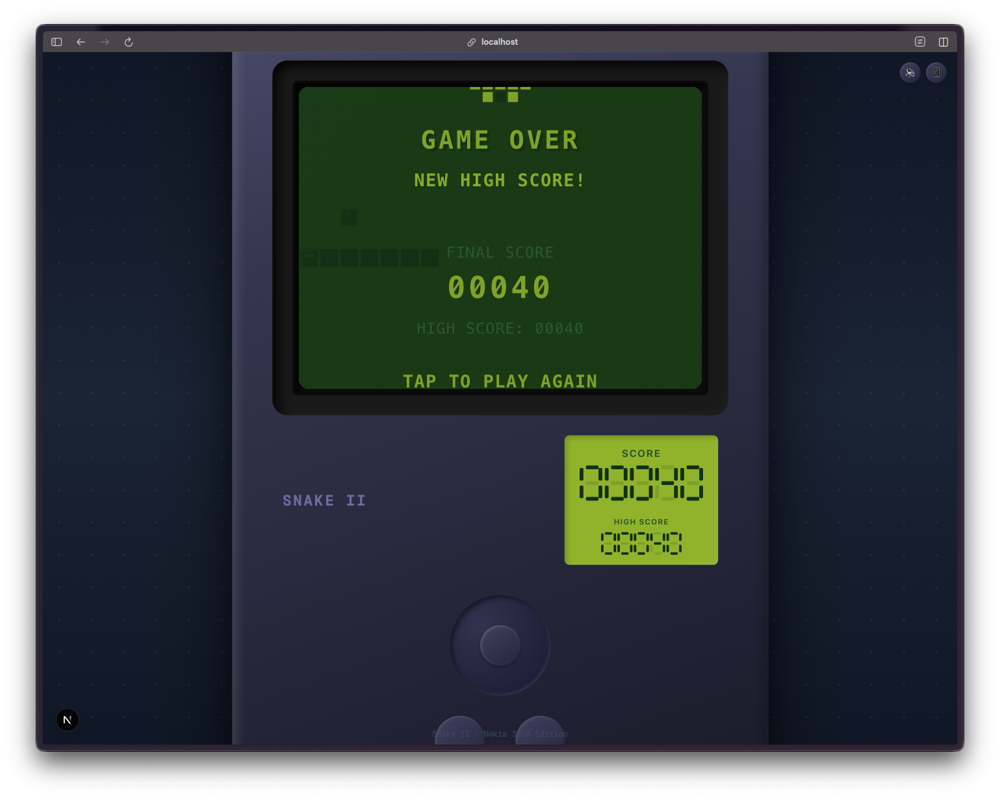

Giorno 2. Volevo qualcosa di nostalgico.

## Il Prompt

Ho usato questo:

> "Costruisci un gioco Snake in stile Nokia 3310. Schermo verde LCD, blocchi pixel, tutto quanto. Mettilo dentro una cornice telefono."

Era praticamente l'intero brief. Avevo un'immagine visiva chiara in mente ma non ho fornito alcun dettaglio implementativo.

## Come È Stato Costruito

[Watchfire](https://watchfire.io) ha preso quel prompt e lo ha suddiviso in task che coprono il motore di gioco, lo stile visivo Nokia, gli effetti sonori, i controlli mobile e l'interfaccia della cornice telefono. La logica di gioco, il rendering LCD, il display del punteggio a sette segmenti: tutto è venuto fuori da quel singolo prompt.

Non ho guidato ogni singola decisione. Ho descritto l'atmosfera che volevo e sono tornato a qualcosa di giocabile.



## Cosa Ho Ottenuto

Questo mi ha sorpreso per quanto sia andato lontano sul fronte estetico.

**Ha costruito un telefono intero.** Non solo una tela di gioco. Una cornice Nokia 3310 completa con griglia altoparlante, marchio NOKIA, un D-pad, pulsanti azione e un bordo schermo con profondità. Il corpo del telefono ha sfumature e ombre che lo fanno sembrare tridimensionale. Ho chiesto una cornice telefono. Ho ottenuto un telefono.

**Lo schermo LCD è autentico.** Il classico verde Nokia (#9bbc0f per chi fosse curioso), con una griglia pixel visibile, un overlay di scanline e un effetto riflesso sullo schermo nell'angolo. Ogni cella della griglia ha un piccolo gap per simulare i veri segmenti LCD. La testa del serpente ha persino dei piccoli occhi pixel.

**Ha un display del punteggio a sette segmenti.** Non solo un numero sullo schermo. Un vero display LCD a sette segmenti renderizzato in SVG posizionato fuori dallo schermo di gioco, come il display secondario del telefono. Punteggio e record, entrambi renderizzati con il corretto effetto fantasma dei segmenti inattivi.

**Il cibo pulsa.** C'è un'animazione a onda sinusoidale sul blocco cibo che lo fa pulsare delicatamente. Il serpente accelera ogni volta che mangia. Inizia a 150ms per tick e scende fino a un minimo di 50ms. La curva di difficoltà è integrata nel ciclo di gioco, non programmata per livello.

**Effetti sonori retrò.** Suoni a oscillatore a onda quadra generati tramite la Web Audio API. Toni ascendenti all'avvio, un gorgheggio allegro quando mangi, toni tristi discendenti al game over. Tutto sintetizzato in runtime, nessun file audio necessario. Salva persino la tua preferenza di mute su localStorage.

**Persistenza del record.** Salva il tuo punteggio migliore su localStorage e mostra un messaggio "NEW HIGH SCORE!" con un'animazione pulse quando lo batti. La schermata di game over ha un'icona teschio in pixel art costruita con una griglia CSS.

**Controlli mobile.** Sui dispositivi touch, renderizza un D-pad con un pulsante pausa centrale. Sul desktop, mostra pulsanti decorativi che si abbinano all'estetica del telefono. Rileva il tipo di dispositivo e si adatta. Ci sono anche controlli swipe come fallback.

**Cornice telefono attivabile/disattivabile.** Puoi passare dalla cornice telefono Nokia completa a una vista minimale con solo lo schermo di gioco. La preferenza persiste su localStorage.

## I Numeri

- **8 moduli sorgente** (GameBoard, StartScreen, GameOverScreen, PauseOverlay, ScoreDisplay, useSnakeGame, useSound, più il layout della pagina)
- **~2.100 righe di TypeScript e React**
- **Zero librerie di gioco esterne** (solo Next.js e React, la logica di gioco è tutta hook personalizzati e Canvas)
- **5 effetti sonori sintetizzati** tramite Web Audio API
- **Tempo totale hands-on:** forse 20 minuti a giocare e modificare il prompt

## Provalo



**[Gioca a Snake II](https://vibe30-day02-snake.vercel.app)**

Tasti freccia o WASD per muoverti, spazio per mettere in pausa. Funziona su mobile con i controlli D-pad.

## Verdetto Giorno 2

Ho chiesto un gioco Snake in una cornice Nokia. Ho ottenuto una simulazione telefono completa con audio sintetizzato, display a sette segmenti, effetti scanline LCD e persistenza localStorage per punteggi, preferenze audio e visibilità della cornice.

Quello che colpisce è quanto lavoro sia andato nei dettagli che non ho mai richiesto. Il riflesso dello schermo. I punti della griglia altoparlante. L'animazione pulse sul cibo. Il teschio in pixel art sulla schermata di game over. Queste sono scelte di rifinitura che richiederebbero ore da implementare a mano, e sono apparse gratis.

Avrei potuto costruire Snake da solo? Probabilmente, dato abbastanza tempo. Ma avrei creato un quadrato verde su una griglia con un contatore del punteggio. Non avrei costruito un simulatore Nokia 3310 con audio chiptune sintetizzato e controlli mobile responsive. Il divario tra quello che avrei costruito e quello che ho ottenuto è tutto il senso di questa sfida.

Due giorni dentro, due giochi spediti. Il pattern del Giorno 1 regge: il punto di partenza non è più un file vuoto, e il punto di arrivo è molto oltre quello a cui avrei puntato da solo.

---

*Questo è il giorno 2 di [30 Days of Vibe Coding](/series/30-days-of-vibe-coding/). Seguimi mentre spedisco 30 progetti in 30 giorni usando il coding assistito da AI.*
