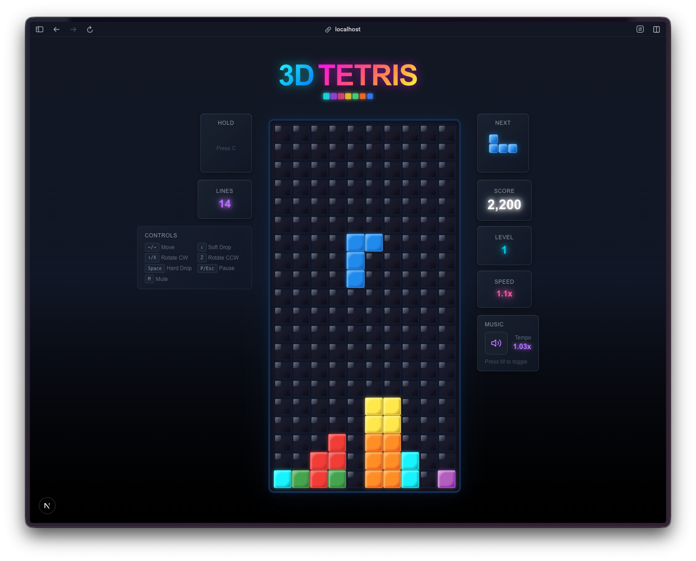
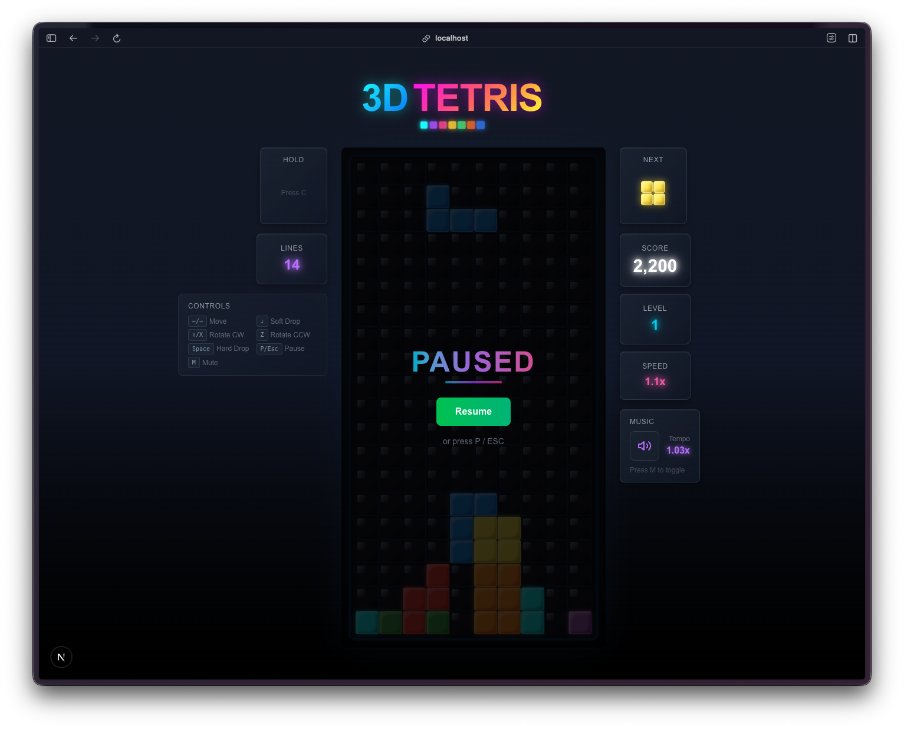

Day 4. Everyone knows Tetris. That's what makes it a good test. You know exactly what it should feel like, so you notice immediately when something is off.

## The Prompt

> "I want to create a web-based Tetris game with 3D-styled blocks, music, and sound effects"

## How It Was Built

This one went through [Watchfire](https://watchfire.io) like the others. The package name in the repo tells the story: `watchfire-0001-initialize-nextjs-project-with`. It started from a single prompt and Watchfire broke it into tasks covering project setup, game state management, the board renderer, piece definitions with rotation states, the audio system, and the UI components.

The architecture it chose was React with hooks. Three custom hooks handle the core logic: `useGameState` for the game reducer and tick loop, `useGameMusic` for the Korobeiniki theme, and `useSoundEffects` for all the in-game audio. The game state itself is a proper reducer with actions for every move, rotation, hard drop, and pause. Wall kicks, line clearing, level progression, scoring. All the Tetris fundamentals.

## What I Got

This one genuinely surprised me.

**The blocks have actual depth.** Each tetromino type has its own color scheme with a main color, a light highlight for the top-left edges, a dark shadow for the bottom-right edges, and a glow effect. The I-piece is cyan with a soft blue glow. The T-piece is purple. The Z-piece is red. They look like little 3D candy pieces sitting on a dark grid. I asked for "3D-styled blocks" and it delivered something that looks genuinely polished.

**It plays the Korobeiniki theme.** The actual Tetris melody, generated in real-time using the Web Audio API. No audio files. It creates oscillators and gain nodes on the fly, plays a square-wave melody with a triangle-wave bass line, and loops it seamlessly. The music speeds up as you level up, going from 1.0x at level 0 to 1.5x at level 15. It even remembers your mute preference in localStorage.

**The sound effects are surprisingly good.** There are 8 distinct sound effects: move click, rotate whoosh, piece landing thud (with noise buffer for impact texture), line clear arpeggio, a special Tetris fanfare for clearing four lines, hard drop swoosh, a sad descending game over arpeggio, and a celebratory level up jingle. All synthesized. No audio files anywhere.

**It has all the real Tetris features.** Next piece preview, score tracking with proper multipliers (100 for single, 300 for double, 500 for triple, 800 for Tetris), level progression every 10 lines, speed that actually increases, high score persistence, pause with resume, and a game over screen showing your final stats against your high score.

**The controls feel right.** Arrow keys or WASD for movement, W or Up to rotate clockwise, Z for counter-clockwise, Space for hard drop, P or Escape to pause. It even has wall kicks so pieces nudge away from walls when you rotate near the edges.

## The Numbers

- **22 source files** across components, hooks, constants, and types
- **~2,000 lines of TypeScript**
- **8 distinct synthesized sound effects** plus a full looping soundtrack
- **7 tetromino types** with 4 rotation states each (28 shape definitions)
- **16 speed levels** from 1000ms down to 100ms per tick
- **0 audio files** in the entire project

## Try It

<!--  -->

**[Play Tetris](https://vibe30-day04-tetris.vercel.app)**

Arrow keys or WASD to move, Space to hard drop, P to pause. Works best on desktop.

## Day 4 Verdict

Four days in and I'm building classic games faster than I can playtest them. That's the real bottleneck now. Not the coding, not the debugging. The playtesting.

This Tetris clone is genuinely fun to play. The 3D block styling gives it personality, the Korobeiniki theme makes it feel authentic, and the sound design adds satisfying feedback to every action. The fact that all the audio is procedurally generated from oscillators and noise buffers is honestly wild. There are no audio files in this entire project.

The thing that keeps catching me off guard is the completeness. I asked for Tetris with 3D blocks and music. I got wall kicks, high score persistence, score multipliers by level, a pause screen with a gradient button, mute state saved to localStorage, and a game over panel that tells you if you beat your high score. These are all things I would have eventually asked for, but I didn't have to.

Is the wall kick implementation as good as official Tetris guidelines? Probably not. Is the scoring system 100% authentic? Close, but I didn't verify against the spec. None of that matters for a one-day project. What matters is that it works, it feels good, and someone can play it right now.

---

*This is day 4 of [30 Days of Vibe Coding](/series/30-days-of-vibe-coding/). Follow along as I ship 30 projects in 30 days using AI-assisted coding.*
