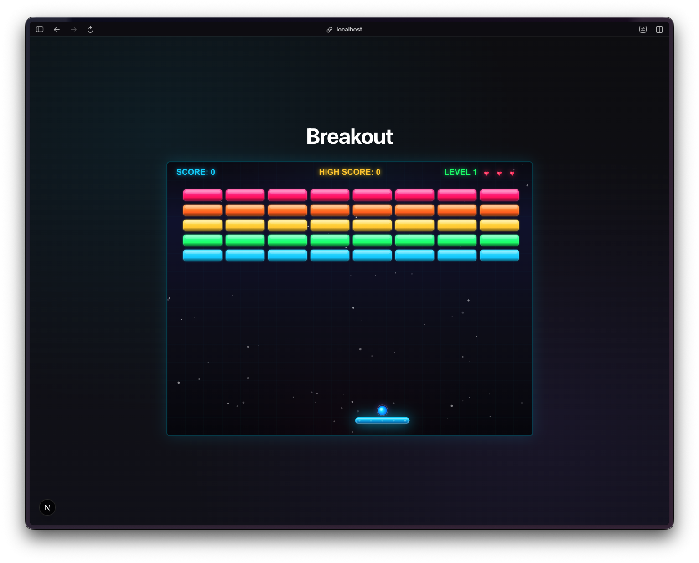
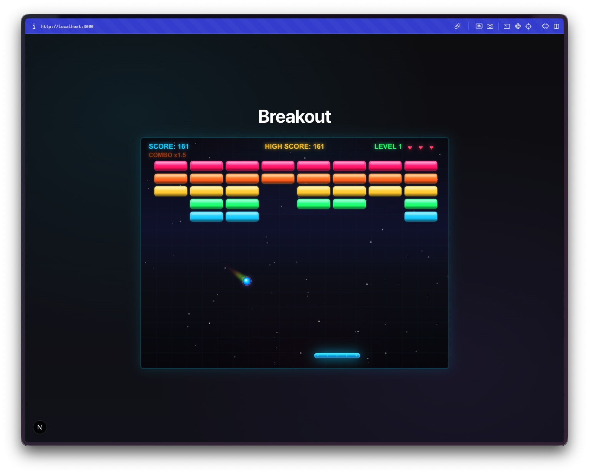
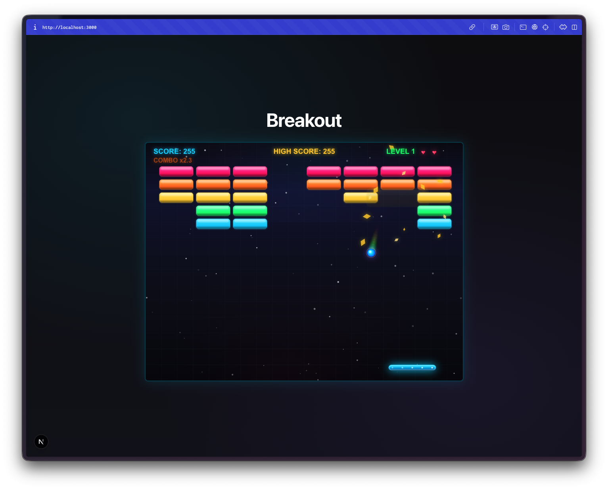
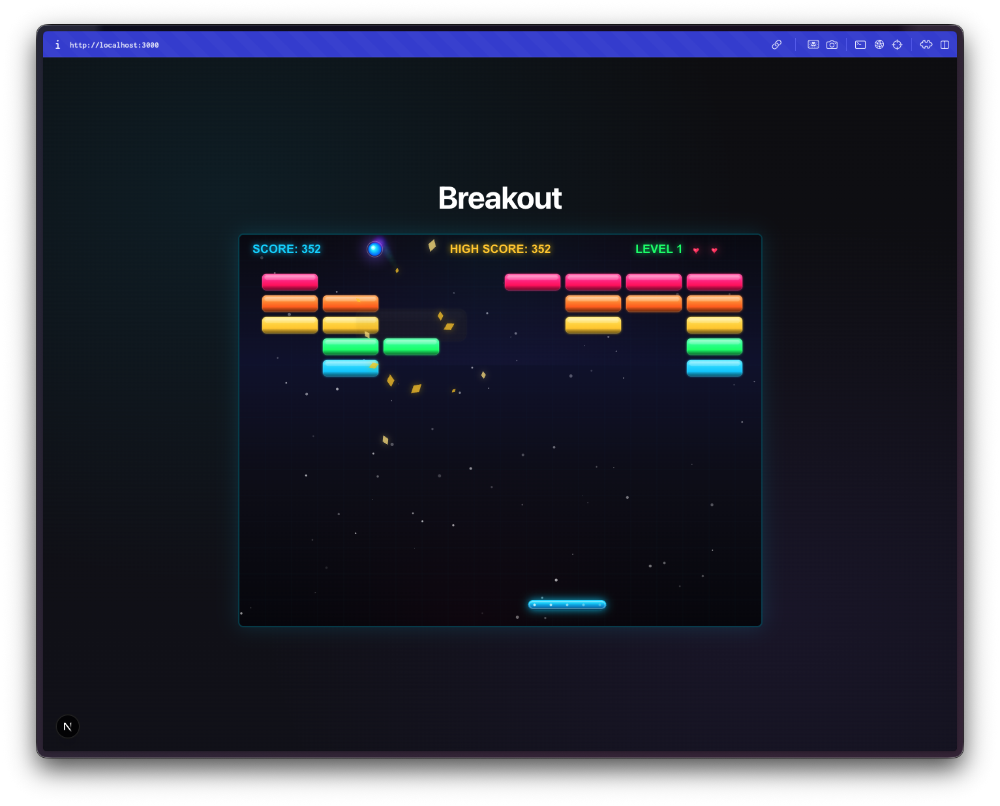
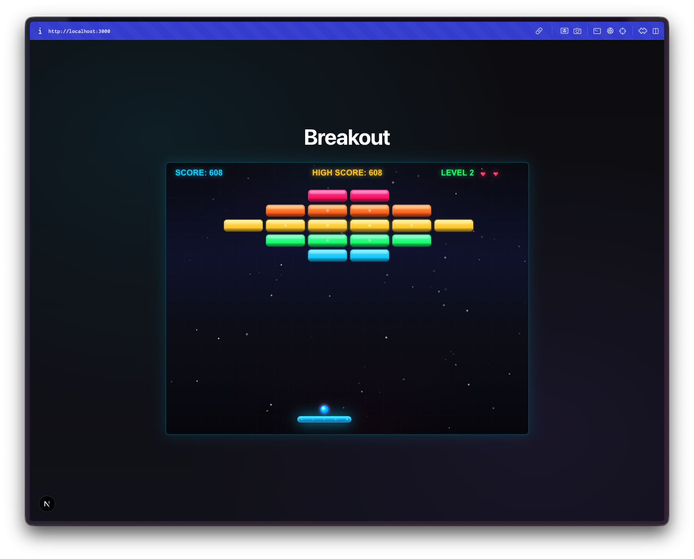

Day 5. Another arcade classic. This time I wanted to see what happens when I ask for Breakout.

## The Prompt

> "I want to create a Breakout/Arkanoid style arcade game with multiple levels, power-ups, combo scoring, and smooth physics"

A bit more specific than some of my earlier prompts. By day 5 I was learning that being slightly more intentional with the features you want upfront saves you from filing bug reports later.

## How It Was Built

I used [Watchfire](https://watchfire.io) again for this one. You can tell from the package.json, which gets auto-named with a `watchfire-0000` prefix. I gave it the prompt and it handled the rest. The entire game lives in a single React component wrapping an HTML5 Canvas, which is a pattern I've seen a few times now in these daily builds. Not the cleanest architecture, but it works and it ships.

The tech stack is Next.js with TypeScript and Tailwind CSS. The game rendering is all Canvas-based with React handling the overlay UI for menus and pause screens.



## What I Got

A fully playable Breakout clone with way more polish than I expected.

**Five levels with unique patterns.** "The Beginning" is a standard full grid. "Diamond Formation" arranges bricks in a diamond shape. "Fortress" builds walls with gaps. "Waves" alternates rows. "Final Challenge" is a dense layered pattern. Each level bumps the ball speed multiplier, going from 1.0x up to 1.5x.

**Power-ups actually matter.** Four types drop from broken bricks: wide paddle (10 seconds), slow ball (8 seconds), multi-ball (splits into multiple balls until you lose them), and extra life (instant). Special "super" bricks have double the drop chance. The power-ups float down as glowing orbs and you catch them with your paddle.

**The combo system adds depth.** Chain hits build a score multiplier up to 3x. The combo decays after 2 seconds of no hits, so you're incentivized to keep the ball moving fast and hitting bricks in quick succession. It's a small thing but it makes you play differently.

**Visual effects everywhere.** Particle explosions when bricks break. A ball trail effect. Screen shake on certain hits. Flash effects. A twinkling starfield background. Bricks have a neon gradient color scheme with hot pink, orange, yellow, green, and cyan rows. None of this was strictly necessary for a Breakout game, but it makes the whole thing feel alive.

**Three brick types.** Normal bricks break in one hit. Strong bricks take multiple hits (they have a visible HP indicator). Super bricks are even tougher and have a higher power-up drop chance. The level patterns mix these types to create different challenges.

## The Bug Reports

Honestly, this one was pretty clean. The physics felt right from the start, the paddle movement was smooth with both mouse and keyboard, and the levels loaded correctly. No major bugs to report on this build.

## The Numbers

- **5 levels** with unique brick patterns and increasing difficulty
- **4 power-up types** with timed durations
- **~2,300 lines of TypeScript** in a single game component
- **3 brick types** (normal, strong, super)
- **3 control methods:** keyboard, mouse, and touch

## Try It



**[Play Breakout](https://vibe30-day05-breakout.vercel.app)**

Mouse or arrow keys to move the paddle. Space or click to launch the ball. P or Escape to pause.

## Day 5 Verdict

Five days in and I'm noticing a pattern. These Canvas-based games are a sweet spot for AI-assisted coding. The scope is clear, the rules are well-defined, and there's an immediate way to test if it works: you just play it.

What surprised me here was the particle system and visual polish. I didn't ask for screen shake or ball trails or a starfield background. The AI just decided the game would feel better with those things, and it was right. The combo system was also a nice touch. It turns a simple "bounce ball, break bricks" game into something where you're actually thinking about angle and timing.

Is it going to compete with the real Arkanoid? No. But it's a complete game with multiple levels, power-ups, and a scoring system that actually makes you want to replay levels. Built in a day, from a single prompt.

---

*This is day 5 of [30 Days of Vibe Coding](/series/30-days-of-vibe-coding/). Follow along as I ship 30 projects in 30 days using AI-assisted coding.*
