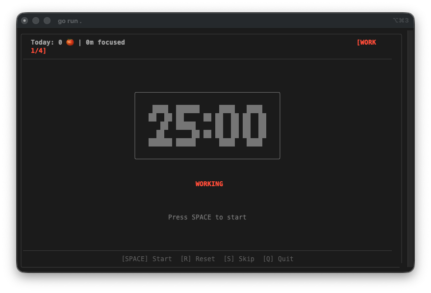
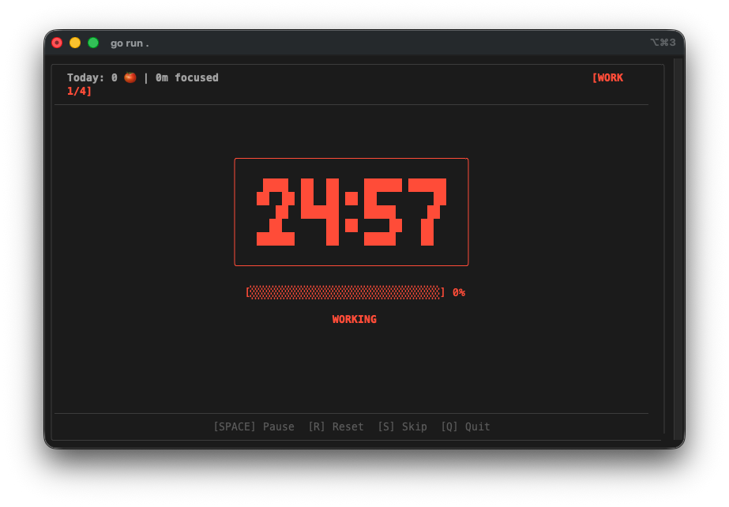
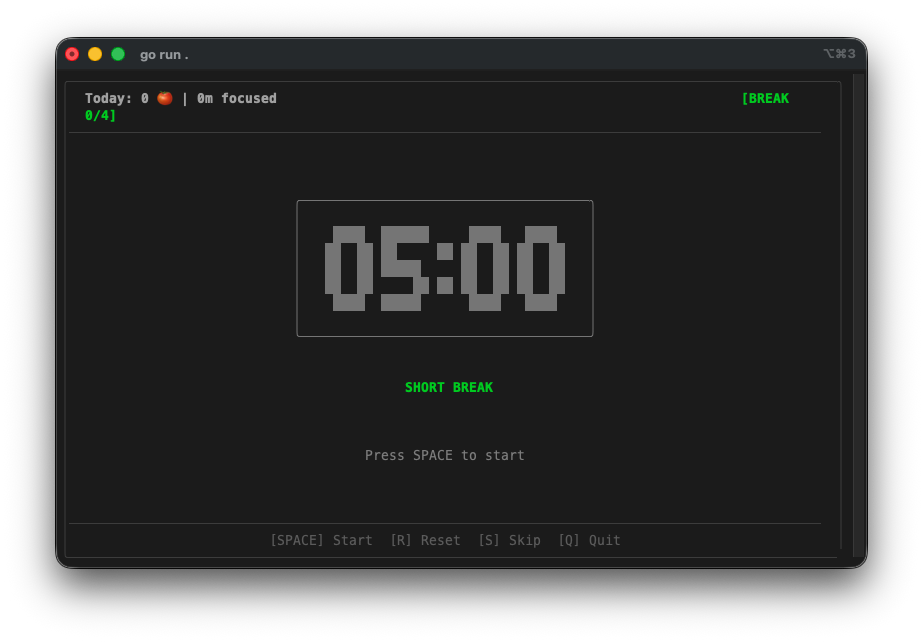
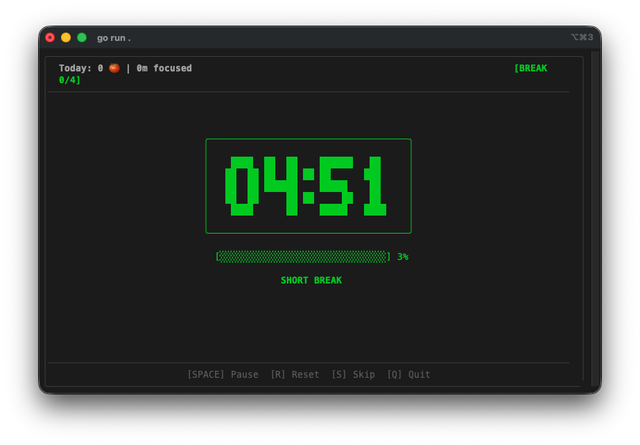

Jour 6. Il est temps de quitter le navigateur — et de sortir complètement de ma zone de confort.

Chaque projet jusqu'ici a utilisé TypeScript, React, Canvas. Des langages et des frameworks que je connais. Aujourd'hui, je voulais tester quelque chose de différent : que se passe-t-il quand je demande à l'IA de construire avec des outils que je n'ai jamais utilisés ?

## Le Prompt

> "Construis un minuteur Pomodoro en terminal en Go avec Bubble Tea, avec un grand compte à rebours ASCII, le suivi des sessions avec SQLite, des statistiques quotidiennes et hebdomadaires, des étiquettes de tâches et des durées personnalisables."

Je n'ai jamais écrit de Go. Je n'ai jamais utilisé Bubble Tea. Je n'ai jamais touché à Lip Gloss. Je ne saurais pas vous expliquer la différence entre une `goroutine` et un `channel` sans chercher. Toute la pile technique de ce prompt m'est étrangère.

C'était le but. Cinq jours à construire des jeux web sur un terrain familier m'avaient amené à me demander : l'IA n'est-elle efficace que pour les choses que je comprends déjà ? Que se passe-t-il si je lui soumets une pile que je ne peux même pas relire correctement ?

## Comment C'a Été Construit

[Watchfire](https://watchfire.io) a pris le prompt et l'a décomposé de la même façon qu'avec les projets TypeScript. Le fait que ce soit du Go plutôt que du TypeScript n'a pas semblé avoir d'importance. Il a choisi Bubble Tea pour le framework TUI, Lip Gloss pour le style, SQLite pour la persistance. Pas de serveur web, pas d'enveloppe Electron, pas de navigateur. Juste un binaire que vous pouvez exécuter depuis n'importe où.

Le projet est arrivé sous la forme d'un module Go propre avec 11 fichiers sources répartis en 6 packages : `main`, `ascii`, `config`, `db`, `stats`, `timer` et `ui`. Chaque package a une responsabilité claire. Le package timer gère la machine à états (inactif, en cours, en pause, terminé). Le package UI rend tout avec Bubble Tea. Le package database gère la persistance SQLite. Le package stats agrège les données de session pour les vues quotidiennes et hebdomadaires.

Il est même livré avec un script d'installation, un Makefile et des options CLI appropriées utilisant un chargeur de configuration personnalisé qui fusionne un fichier de configuration YAML avec les arguments en ligne de commande. Je n'aurais pas su comment configurer tout ça en Go moi-même.



## Ce Que J'ai Obtenu



**De grands chiffres ASCII.** L'affichage du compte à rebours utilise des chiffres personnalisés en caractères-blocs sur 5 lignes de hauteur. Ils sont lisibles depuis l'autre bout de la pièce, ce qui est un peu le but d'un minuteur Pomodoro. Vous devez pouvoir y jeter un coup d'œil et savoir combien de temps il vous reste.



**Des sessions codées par couleur.** Les sessions de travail brillent en rouge. Les courtes pauses deviennent vertes. Les longues pauses ont une teinte différente. Toute l'interface change de couleur selon la phase en cours, vous savez donc d'un coup d'œil si vous devriez travailler ou vous reposer.



**Il enregistre tout.** Chaque session est stockée dans une base de données SQLite locale à `~/.pomo/sessions.db`. La barre d'en-tête affiche vos statistiques quotidiennes en temps réel : le nombre de pomodoros complétés et le temps de concentration total. Lancez `pomo stats` et vous obtenez un récapitulatif hebdomadaire avec des graphiques à barres ASCII.



**Le cycle de sessions fonctionne.** Quatre sessions de travail, puis une longue pause. Le badge de progression en haut à droite indique où vous en êtes dans le cycle (par ex., `[WORK 1/4]`). Après la quatrième session de travail, il passe automatiquement à une longue pause de 15 minutes au lieu de la courte pause habituelle de 5 minutes.

**Étiquettes de tâches.** Lancez `pomo -t "Écrire l'article de blog"` et le nom de la tâche s'affiche dans l'en-tête. Il est également stocké dans la base de données, donc lorsque vous consultez vos statistiques plus tard, vous pouvez voir sur quoi vous travailliez réellement.

**Sonnerie du terminal.** Quand une session se termine, il sonne la cloche du terminal. Simple, efficace, et ça fonctionne avec n'importe quel système de notification pris en charge par votre terminal.

## Les Rapports de Bugs

Aucun cette fois. Le minuteur a fonctionné correctement dès le premier build. Démarrer, mettre en pause, reprendre, passer, réinitialiser, les transitions de session — tout a fonctionné comme prévu. Les contrôles clavier étaient réactifs et la machine à états a géré les cas limites proprement.

## Les Chiffres

- **11 fichiers sources Go** répartis en 6 packages
- **1 fichier de test** avec des tests de la machine à états du minuteur
- **4 types de sessions :** travail, courte pause, longue pause et les transitions entre elles
- **Persistance SQLite** pour l'historique des sessions
- **Configuration YAML + CLI** avec des valeurs par défaut sensées (cycles de 25/5/15 minutes)
- **Temps de manipulation total :** environ 20 minutes de tests et d'ajustements du prompt

## Essayez-Le



Installez-le avec :

```bash
go install github.com/nunocoracao/Vibe30-day06-pomodoro@latest
```

Ou utilisez le script d'installation :

```bash
curl -sSL https://raw.githubusercontent.com/nunocoracao/Vibe30-day06-pomodoro/main/install.sh | bash
```

Puis lancez simplement `pomo` dans votre terminal.

## Verdict du Jour 6

Celui-ci a répondu à une question que je portais depuis le jour 1 : le codage assisté par IA ne fonctionne-t-il que lorsqu'on connaît déjà la pile technologique ?

Non. Pas du tout. Je ne sais pas écrire du Go. Je ne sais pas construire une TUI avec Bubble Tea. Je ne saurais pas comment structurer un module Go avec six packages, configurer des liaisons SQLite ou écrire un Makefile pour la compilation croisée. Mais l'outil existe, il fonctionne, et c'est quelque chose que j'utilise réellement tous les jours. Un seul binaire, aucune dépendance à l'exécution, fonctionne dans n'importe quel terminal.

Ce qui m'a le plus surpris, c'est l'architecture. Six packages avec des frontières claires. Une machine à états appropriée pour le minuteur. Une gestion gracieuse de la base de données où, si SQLite échoue, le minuteur fonctionne quand même — vous n'avez juste pas de statistiques. C'est le genre de décision qu'un développeur senior prendrait, et elle vient d'un prompt écrit par quelqu'un qui ne connaît pas le langage.

Cela change ce que signifie « non-standard ». Si je peux livrer une application TUI Go soignée sans connaître Go, alors la barrière pour essayer des piles technologiques inconnues vient de disparaître. Le coût de l'expérimentation est tombé à quasi zéro.

Six jours et c'est le premier projet que j'ai continué à faire tourner après avoir écrit l'article de blog.

---

*Ceci est le jour 6 de [30 Days of Vibe Coding](/series/30-days-of-vibe-coding/). Suivez l'aventure pendant que je livre 30 projets en 30 jours avec le codage assisté par IA.*
