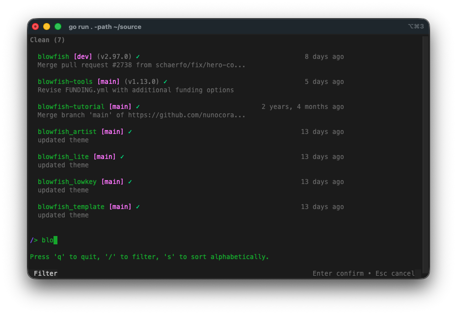
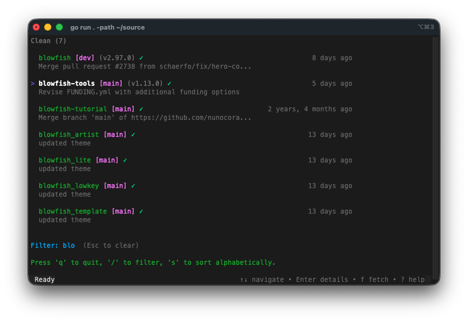
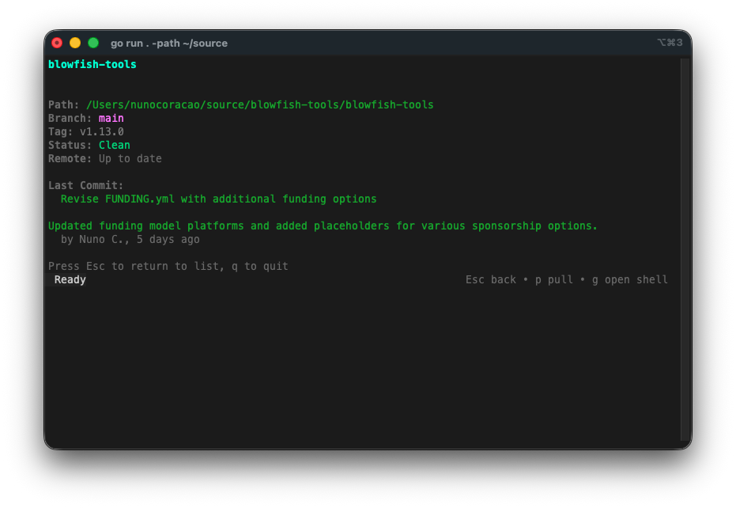
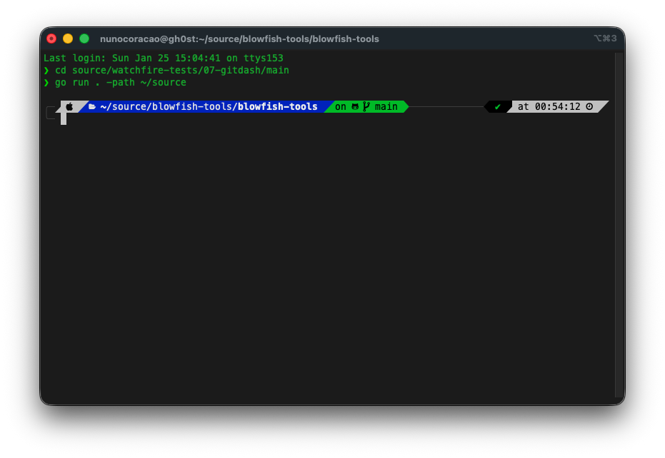

Giorno 7. Stesso stack di ieri. Stesso framework. Neanche l'idea più originale.

Dopo che il Giorno 6 ha dimostrato che potevo costruire con Go e Bubble Tea senza averli mai toccati, volevo testare qualcos'altro: cosa succede quando punti l'IA verso uno strumento esistente e le chiedi di costruire un wrapper? In questo caso, git. Ho troppi repo e zero idea su quali abbiano modifiche non committate.

## Il Prompt

> "Costruisci un'app TUI in Go che scansiona un albero di directory alla ricerca di repo git e mostra il loro stato in una dashboard da terminale. Codice colore: verde per pulito, giallo per modificato, blu per avanti/indietro. Fammi fare fetch, pull e aprire una shell in qualsiasi repo. Usa Bubble Tea per l'interfaccia."

## Come è stato costruito

La parte interessante di questo progetto non è l'interfaccia né il framework. È come l'IA si è interfacciata con git. L'intera app è essenzialmente un wrapper: chiama `git` da riga di comando per ogni informazione che mostra. Nomi di branch, hash dei commit, contatori avanti/indietro, liste di stash, tracciamento dei file modificati. Non usa una libreria Go per git. Esegue gli stessi comandi che digiteresti a mano e fa il parsing dell'output.

L'IA ha suddiviso il lavoro in package che mappano le responsabilità: uno scanner che percorre gli alberi di directory cercando cartelle `.git`, un package git che wrappa i comandi CLI, un sistema di configurazione con YAML, e un layer TUI costruito su Bubble Tea di Charm. Lo scanner salta `node_modules`, `vendor` e le directory nascoste. Il package git gestisce branch, status, log, rev-list, stash list e describe. L'interfaccia ha una separazione netta tra vista lista, vista dettaglio, barra di stato, overlay di aiuto e stili.

È arrivato persino con un Makefile per build multi-piattaforma (darwin/linux, amd64/arm64) e uno script di installazione che rileva automaticamente il tuo OS e la tua architettura.



## Cosa ho ottenuto



**Raggruppa i repo per stato.** I repo modificati con cambiamenti non committati appaiono per primi (punto giallo), poi i repo che devono essere sincronizzati con il remote (contatori avanti/indietro in blu), poi i repo puliti (spunta verde). A colpo d'occhio posso vedere quali repo richiedono attenzione. Premi `s` per alternare tra vista raggruppata e alfabetica.



**Ogni repo mostra un sacco di info su due righe.** Nome, branch tra parentesi quadre rosa, ultimo tag tra parentesi tonde, indicatore pulito/modificato, frecce avanti/indietro, tempo relativo del commit a destra, e l'ultimo messaggio di commit sotto. Condensa una quantità sorprendente di contesto in uno spazio ridotto.



**La vista dettagliata è davvero utile.** Premi Invio su qualsiasi repo e hai il quadro completo: percorso, branch, tag, stato, stato di sincronizzazione remote, messaggio di commit completo con autore, lista dei file modificati se dirty, e conteggio stash. Da qui puoi fare pull, o premere `g` per aprire una shell direttamente nella directory di quel repo.



**L'integrazione con la shell funziona.** Premi `g` e lancia la tua shell (legge `$SHELL`) nella directory del repo. Fai quello che devi fare, esci, e sei di nuovo in GitDash. Quando torni, lo stato del repo si aggiorna automaticamente.

**Ha ricerca e filtro.** Premi `/` e inizia a digitare per filtrare i repo per nome in tempo reale. Utile quando stai scansionando una directory con decine di progetti.

**File di config YAML.** Imposta i tuoi percorsi di monitoraggio in `~/.config/gitdash/config.yaml` così non devi passare `-path` ogni volta. Configura directory multiple, profondità massima di scansione, e se mostrare le cartelle nascoste.

## I Bug

Niente di grave su questo. La TUI si è assemblata in modo pulito. L'unica cosa che ho notato è che su alberi di directory molto grandi, la scansione iniziale richiede un momento, ma mostra un messaggio "Scanning for repositories..." così sai che sta lavorando.

## I Numeri

- **11 file sorgente Go** distribuiti in 5 package (main, config, git, scanner, ui)
- **~1.900 righe di Go**
- **1 file di test** per lo scanner
- **Build multi-piattaforma** per macOS e Linux (amd64/arm64)
- **Script di installazione** con rilevamento automatico di OS e architettura
- **Tempo effettivo speso:** forse 20 minuti di test e aggiustamenti del prompt

## Provalo



Installalo con:

```bash
go install github.com/nunocoracao/Vibe30-day07-gitdash@latest
```

Oppure con una sola riga:

```bash
curl -fsSL https://raw.githubusercontent.com/nunocoracao/Vibe30-day07-gitdash/main/scripts/install.sh | bash
```

Poi lancia semplicemente `gitdash` in qualsiasi directory che contiene repo git.

## Verdetto del Giorno 7

Sarò onesto: questo non è un progetto creativo. Una dashboard per lo stato di git non è un'idea nuova. Lazygit e tig esistono già e lo fanno meglio. Ed è lo stesso stack Go + Bubble Tea che ho usato ieri, quindi non c'è nessuna storia di "tecnologia sconosciuta" da raccontare.

Ma il build ha rivelato qualcosa che vale la pena notare. L'IA non ha avuto bisogno di capire i meccanismi interni di git. Ha semplicemente wrappato la CLI. Ogni dato in questa dashboard viene dall'esecuzione di un comando git e dal parsing dell'output testuale. `git status --porcelain` per i file modificati. `git rev-list --count` per avanti/indietro. `git stash list` per il conteggio degli stash. Ha trattato git come una scatola nera con un'interfaccia testuale, che è esattamente come la maggior parte degli sviluppatori lo tratta.

Questo è il pattern interessante di oggi. Puoi puntare l'IA verso qualsiasi strumento CLI con output strutturato e ottenere un'interfaccia wrapper costruita attorno. Git, Docker, kubectl, qualsiasi cosa. L'IA non ha bisogno di capire i meccanismi interni del sistema più di quanto ne abbia bisogno tu. Deve solo sapere quali comandi eseguire e come fare il parsing di quello che torna indietro.

Il progetto in sé è ok. Funziona, il raggruppamento per stato è utile a colpo d'occhio, la vista dettagliata contiene un sacco di info. Ma non ho intenzione di fingere che sia qualcosa che userò ogni giorno quando posso semplicemente lanciare `git status` in ogni repo. Il valore qui stava nel vedere il pattern, non nello strumento specifico.

---

*Questo è il giorno 7 di [30 Days of Vibe Coding](/series/30-days-of-vibe-coding/). Segui l'avventura mentre consegno 30 progetti in 30 giorni usando il coding assistito dall'IA.*
