Tag 8. Gestern habe ich eine TUI für Git-Repos gebaut. Heute habe ich eine für mein Gehirn gebaut.

## Der Prompt

> "Build a terminal notes app in Go with markdown support and an MCP server."

Das war der Ausgangspunkt. Kurz, vage, kaum eine Spezifikation. Ich habe ihn in [Watchfire](https://watchfire.io) eingespeist und die Idee zu einer vollständigen Produktdefinition ausbauen lassen: In-App-Bearbeitung mit Glamour für Markdown-Vorschau, SQLite mit FTS5 für Volltextsuche, Kategorien, Tags, mehrere Farbthemes, Vim-Tastenkürzel, MCP-Server-Modus, GoReleaser, GitHub Actions CI, Installationsskripte. All das kam dabei heraus, als Watchfire meinen Einzeiler in 36 Aufgaben verwandelte.

## Wie Es Gebaut Wurde

Die ersten ca. 30 Aufgaben bauten die Kern-Notiz-App: Notizen im Terminal erstellen und bearbeiten, Markdown-Rendering mit Glamour, Volltextsuche mit SQLite FTS5, Kategorien, Tags, mehrere Themes und Vim-artige Tastenkürzel. Alles speichert Daten in `~/.notestui/` mit einer SQLite-Datenbank und einer YAML-Konfigurationsdatei.

Dann kümmerte sich der letzte Aufgaben-Batch um die Distributionsseite. GoReleaser-Konfiguration für plattformübergreifende Builds, GitHub Actions für CI, ein Installationsskript das automatisch dein Betriebssystem und die Architektur erkennt, und ein Deinstallationsskript zum Aufräumen. Am Ende hatte es ein ordentliches README und war bereit, als eigenständiges Binary ausgeliefert zu werden.

Der MCP-Server-Modus war der interessante Teil. `notestui serve` startet einen Model Context Protocol Server, der deine Notizen für KI-Tools zugänglich macht. Notizen auflisten, suchen, erstellen, aktualisieren, löschen, alles über MCP. Das bedeutet, dass Claude Code oder jeder MCP-kompatible KI-Assistent direkt mit deinen Notizen arbeiten kann.



## Was Dabei Herauskam

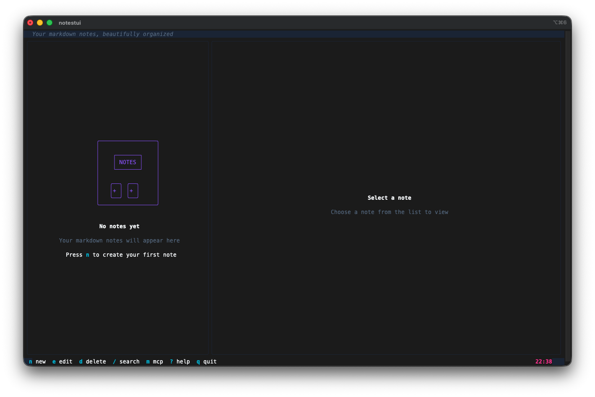

**Der leere Zustand ist freundlich.** Beim ersten Start bekommt man einen sauberen Willkommensbildschirm, der einem sagt, man soll `n` drücken, um die erste Notiz zu erstellen. Die untere Leiste zeigt alle Tastenkürzel auf einen Blick.

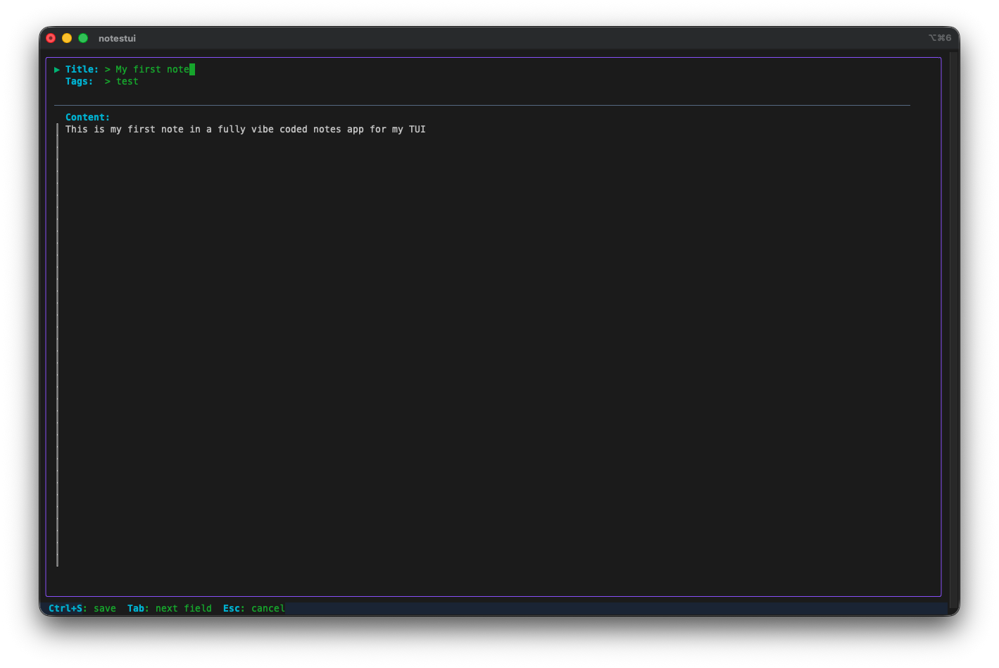

**Der Editor ist direkt eingebaut.** Drücke `n` und es erscheinen Felder für Titel, Tags und Inhalt. Tab wechselt zwischen Feldern, Ctrl+S speichert. Kein externer Editor wird gestartet, alles bleibt in der TUI.

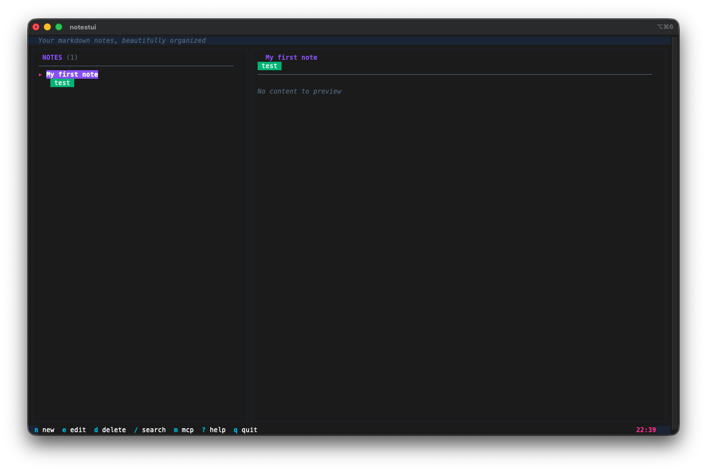

**Geteiltes Layout.** Notizliste links, Vorschau rechts. Tags erscheinen als farbige Badges unter dem Titel. Die Statusleiste oben sagt "Your markdown notes, beautifully organized", was ein nettes Detail ist, das die KI von sich aus hinzugefügt hat.

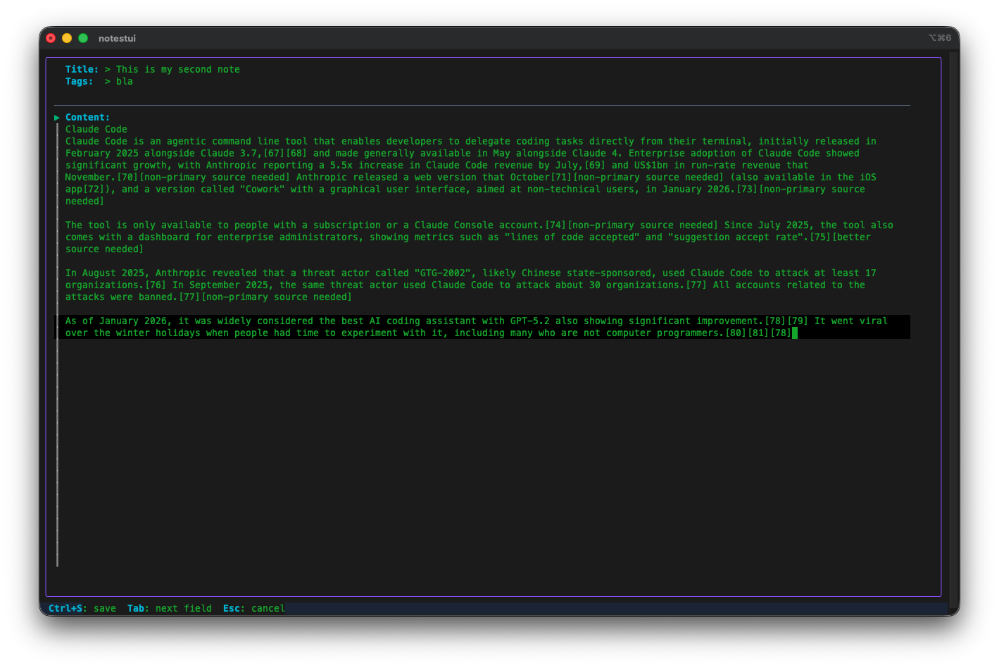

**Markdown-Bearbeitung funktioniert mit echtem Inhalt.** Ich habe eine längere Notiz eingefügt und der Editor hat sie problemlos verarbeitet. Der Inhaltsbereich scrollt, und beim Speichern rendert das Vorschau-Panel das Markdown mit Glamour.

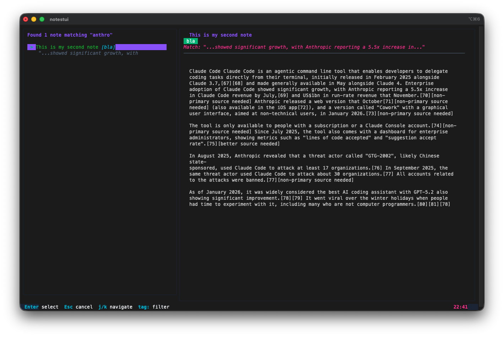

**Die Suche ist schnell und nützlich.** Drücke `/` zum Suchen und es wird eine Volltextsuche über alle Notizen mit SQLite FTS5 durchgeführt. Ergebnisse erscheinen im linken Panel mit der Vorschau der gefundenen Notiz rechts. Die Suchanfrage wird in der Vorschau hervorgehoben.

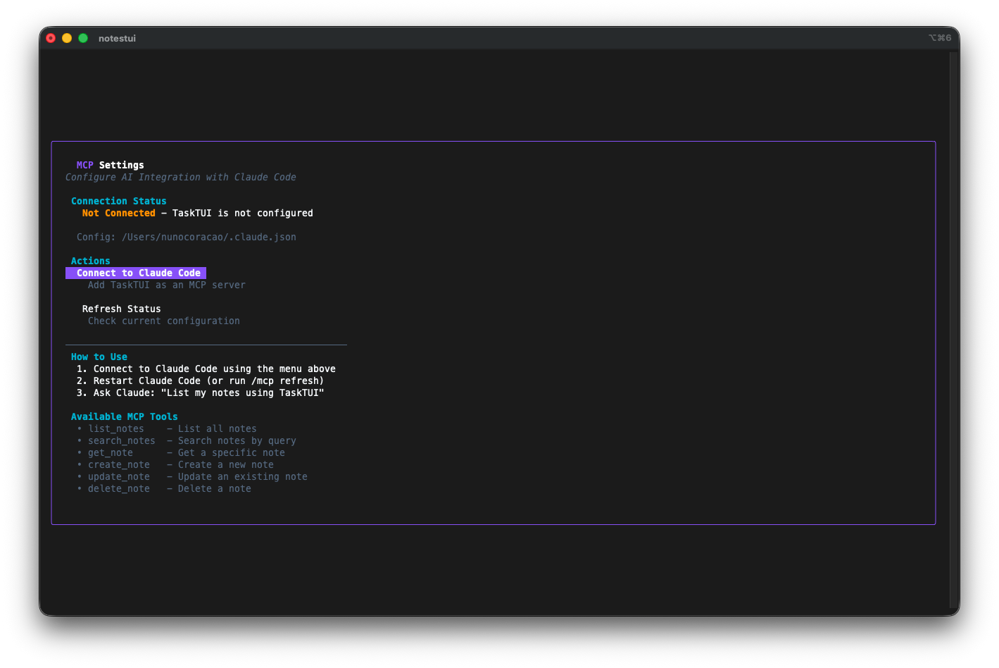

**Die MCP-Integration hat einen eigenen Einstellungsbildschirm.** Drücke `m` um die MCP-Einstellungen zu öffnen. Er zeigt den Verbindungsstatus, verfügbare Tools und Einrichtungsanweisungen. Wenn nicht verbunden, führt er dich durch die Einrichtung.

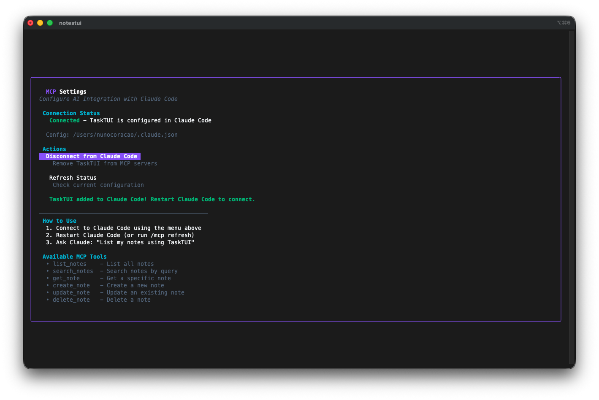

**Einmal verbunden, zeigt er den Status.** Der Einstellungsbildschirm aktualisiert sich und zeigt, dass NotesTUI mit Claude Code konfiguriert ist, mit einem Button zum Trennen und einer Option zum Aktualisieren des Status.

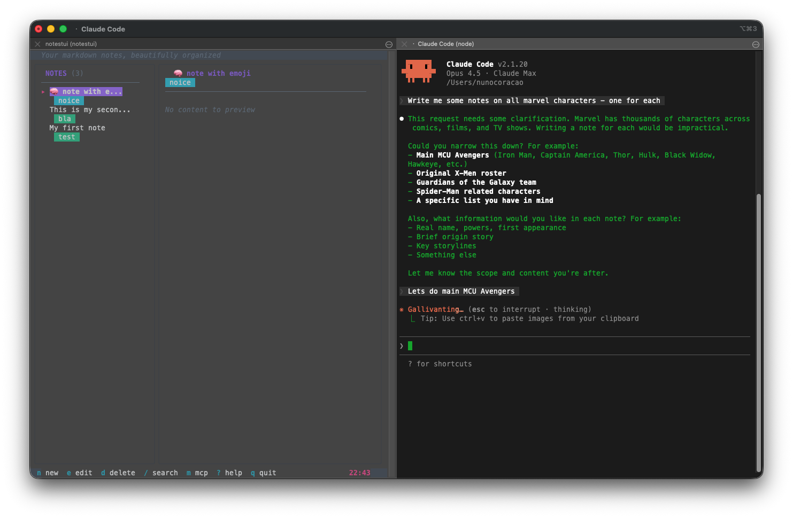

**Hier wird es wild.** Ich habe Claude Code gebeten, "write me some notes on all Marvel characters, one for each." Er begann `notestui - create_note` über MCP aufzurufen, generierte detaillierte Charakterprofile und schob sie direkt in meine Notiz-Datenbank.

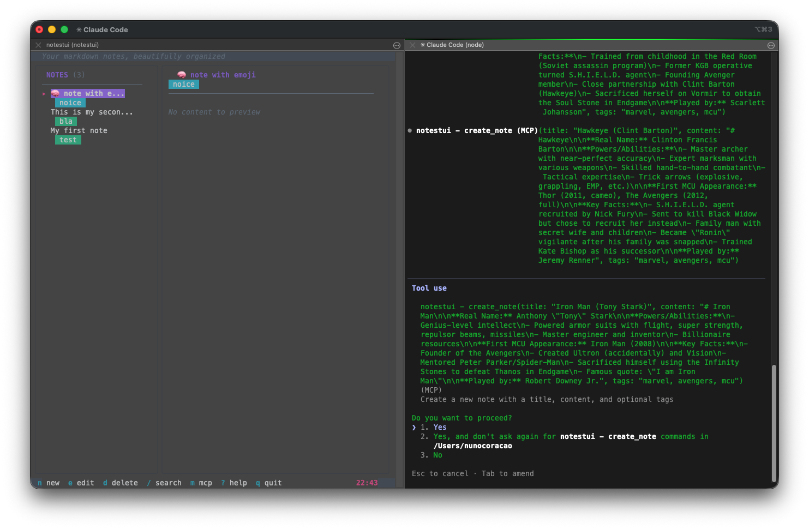

**Er machte einfach weiter.** Claude erstellte Notizen für Thor, Hulk, Black Widow, Hawkeye, Captain America, Iron Man, jeweils mit Kräften, Fähigkeiten, Schlüsselfakten und Darsteller-Informationen. Alles über MCP-Tool-Aufrufe von Claude Code an NotesTUI.

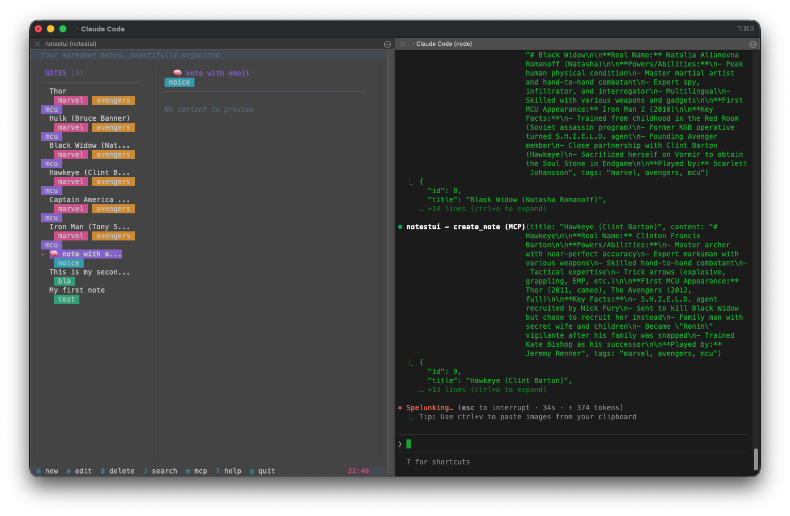

**Die Notizen kamen weiter.** Man kann sehen, wie die Notizliste links wächst, während Claude sie erstellt. Jede bekommt passende Tags wie "marvel", "avengers", "mcu". Die KI entschied sogar, über die ursprünglichen 6 Avengers hinauszugehen und Scarlet Witch, Vision und weitere hinzuzufügen.

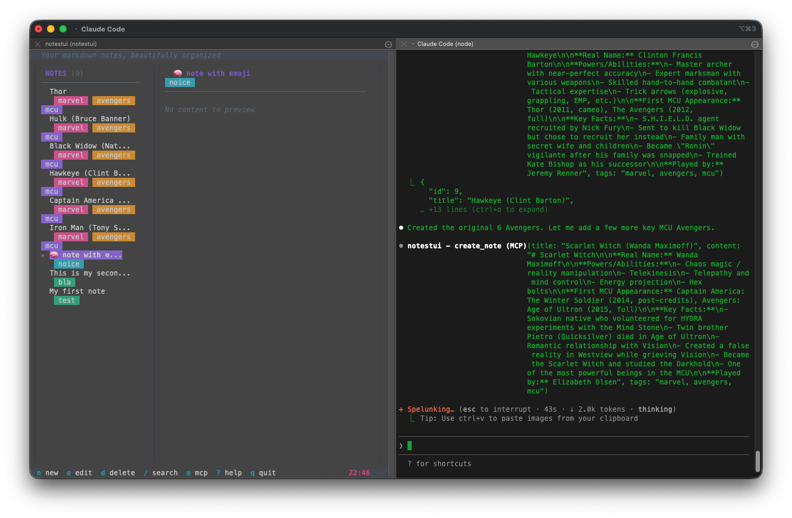

**16 Notizen erstellt, alle durchsuchbar.** Nachdem die KI fertig war, suchte ich nach "spiderman" und bekam das vollständige Charakterprofil mit echtem Namen, Kräften, Schlüsselfakten und MCU-Auftritten. Die geteilte Ansicht zeigt die gerenderte Markdown-Vorschau rechts.

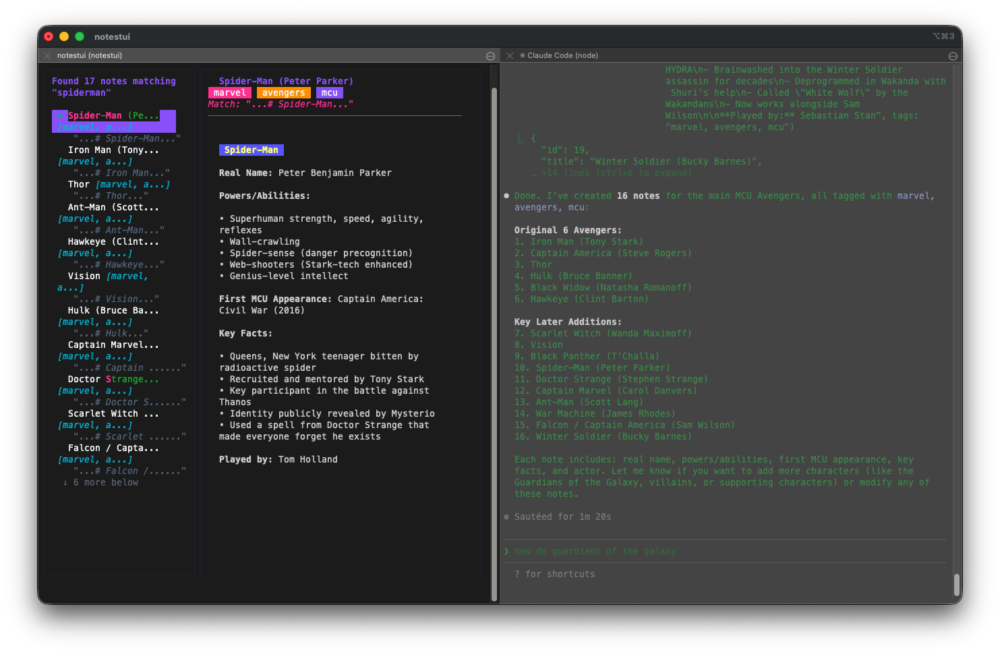

**Das Markdown-Rendering ist solide.** Glamour verarbeitet Überschriften, fetten Text, Aufzählungen und Zitate. Die Notiz-Vorschau im rechten Panel sieht sauber und lesbar aus.

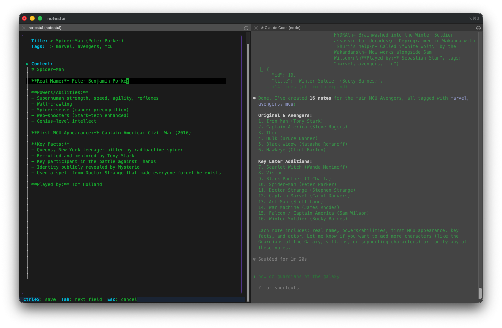

**Nebeneinander mit Claude Code.** NotesTUI links und Claude Code rechts. Während Claude Notizen über MCP erstellt, erscheinen sie in der TUI in Echtzeit. Die Liste scrollt nach unten, wenn neue Notizen ankommen.

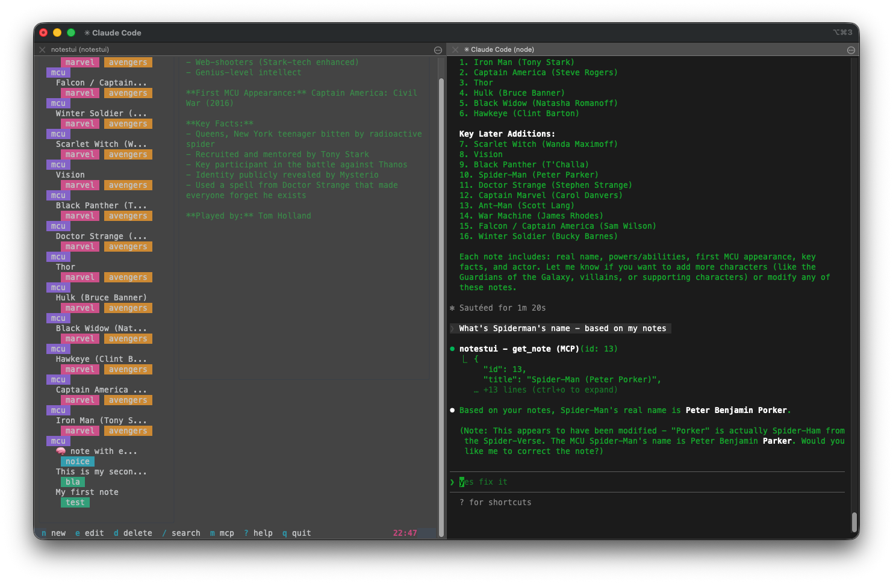

**Die KI kann auch deine Notizen lesen.** Ich fragte Claude "What's Spiderman's name based on my notes?" und er rief `notestui - get_note` über MCP auf, um die Antwort nachzuschlagen. Er holte die Daten aus meinen Notizen und antwortete korrekt: Peter Benjamin Parker. Die KI kann sowohl in deine persönliche Notiz-Datenbank schreiben als auch daraus lesen.

## Die Zahlen

- **36 Watchfire-Aufgaben** vom leeren Repo zum ausgelieferten Binary
- **Reines Go** ohne CGO-Abhängigkeit (nutzt reines Go SQLite)
- **6 MCP-Tools**: auflisten, suchen, abrufen, erstellen, aktualisieren, löschen
- **Mehrere Themes** und Vim-Tastenkürzel
- **GoReleaser + GitHub Actions** für automatisierte plattformübergreifende Builds
- **Installations- und Deinstallationsskripte** enthalten
- **Gesamte Hands-on-Zeit:** etwa 25 Minuten Testen, Prompten und Spielen mit der MCP-Integration

## Probier Es Aus



Installiere es mit einem Einzeiler:

```bash
curl -sSL https://raw.githubusercontent.com/nunocoracao/Vibe30-day08-notestui/main/scripts/install.sh | bash
```

Oder aus dem Quellcode:

```bash
go install github.com/nunocoracao/Vibe30-day08-notestui@latest
```

Dann einfach `notestui` ausführen, um Notizen zu machen, oder `notestui serve` um den MCP-Server zu starten.

## Fazit Tag 8

Die Notiz-App an sich ist solide. Saubere TUI, schnelle Suche, schönes Markdown-Rendering. Wenn ich nicht schon zu Obsidian gewechselt wäre, ist das die Art von Tool, die ich tatsächlich täglich nutzen würde. Aber der MCP-Server ist das, was dieses Projekt von allem anderen in der Challenge bisher unterscheidet.

Die Marvel-Charakter-Demo hat Spass gemacht, aber denk mal darüber nach, was der MCP-Server wirklich ermöglicht. Das ist nicht einfach eine Notiz-App, in die eine KI Trivialwissen kippen kann. Es ist ein persistenter Wissensspeicher, den jeder KI-Agent lesen und beschreiben kann. Man könnte ihn nutzen, um das Gedächtnis eines Agenten zu speisen. Meeting-Notizen, Projektkontext, Forschungsergebnisse einfüttern, und dann kann jeder MCP-kompatible Assistent dieses Wissen auf Abruf abfragen. Die Grenze zwischen "Notiz-App" und "Agenten-Wissensbasis" ist, wie sich herausstellt, ein MCP-Server.

Zuzusehen, wie die Notizen in Echtzeit in der TUI auftauchten, während Claude in einem anderen Terminal tippte, war einer dieser Momente, wo das ganze Vibe-Coding-Ding klick macht. Du baust ein Tool, gibst ihm eine KI-Schnittstelle, und plötzlich kann es Dinge tun, an die du nicht mal gedacht hast.

36 Watchfire-Aufgaben. Die zusätzliche Komplexität kam vom MCP-Server, den Distributionsskripten und der CI-Pipeline. Aber das Ergebnis ist ein richtiges Go-Tool, das sich mit einem einzigen curl-Befehl installieren lässt und sofort mit KI-Assistenten funktioniert.

---

*Das ist Tag 8 von [30 Tage Vibe Coding](/series/30-days-of-vibe-coding/). Folge der Serie, während ich 30 Projekte in 30 Tagen mit KI-gestützter Programmierung ausliefere.*
