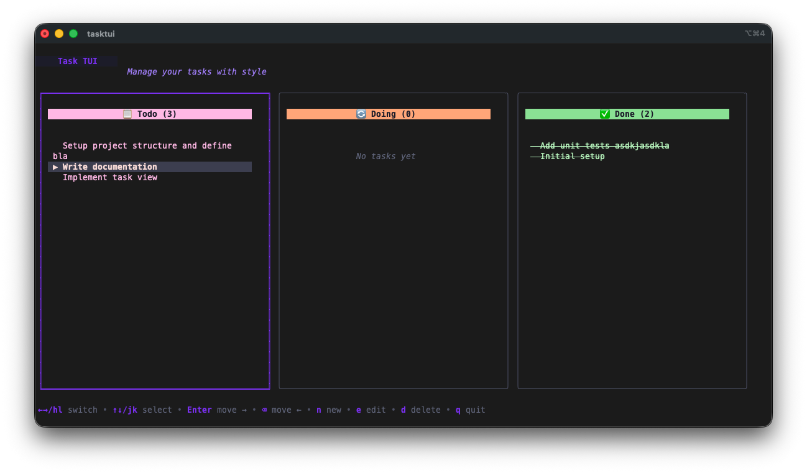
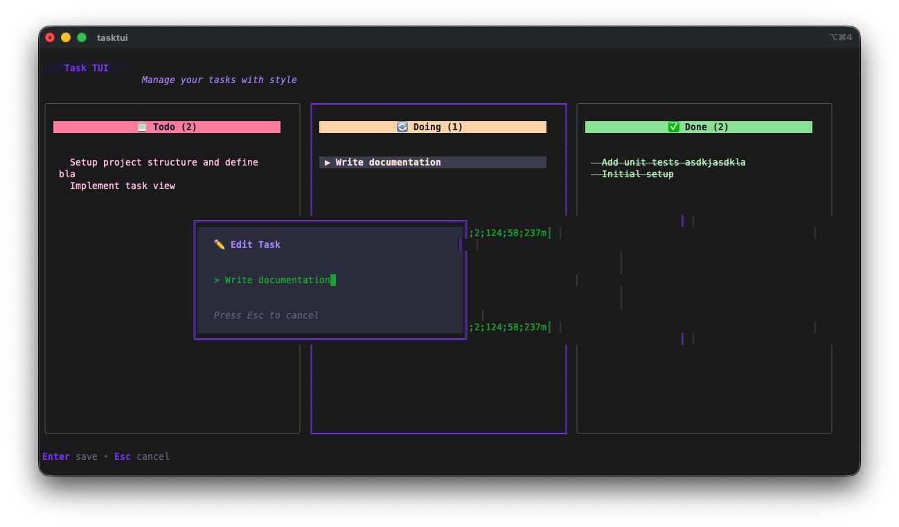
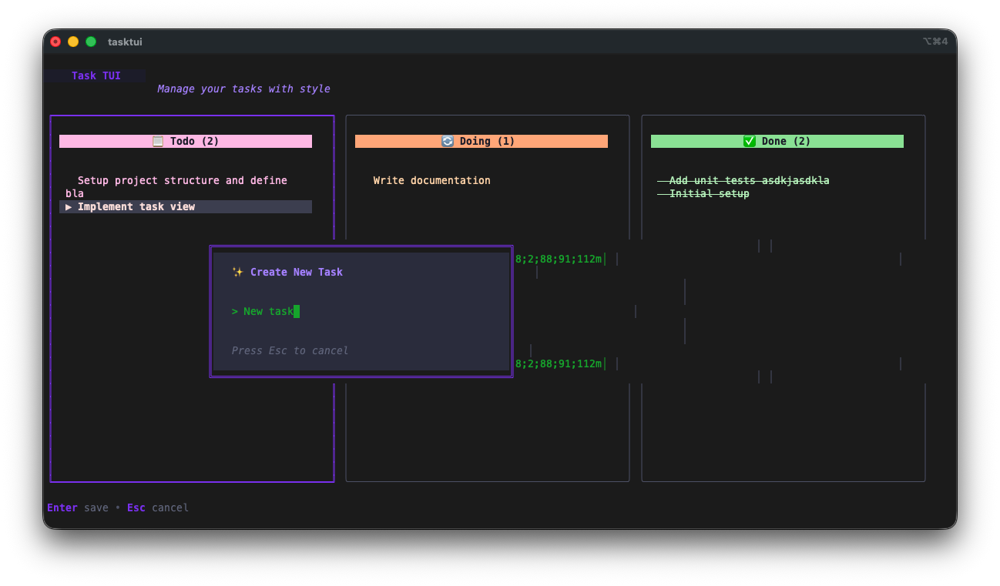
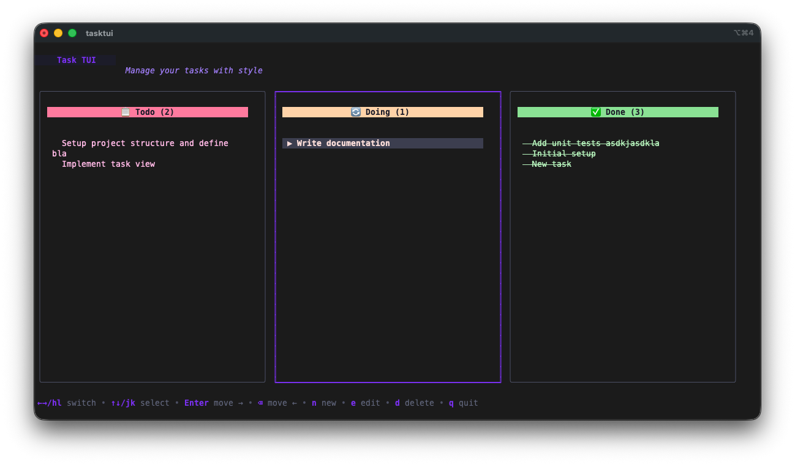

Day 9. I wanted a task board that lives in the terminal and that Claude can also read and write to.

## The Prompt

> "Build a Go TUI personal kanban board with three columns: Todo, Doing, Done. Vim-style navigation with h/j/k/l. Use Bubble Tea and Lip Gloss for the UI. Store tasks as JSON locally. Add a file watcher so the board auto-refreshes when the file changes. Then add an MCP server mode so Claude Code can list, add, move, and delete tasks through the Model Context Protocol. Also add CLI commands for quick task management from the shell."

## How It Was Built

This one took 13 Watchfire tasks to get from nothing to a fully packaged release. The first nine tasks built up the core kanban board: the board model, card rendering, drag-and-drop between columns, and all the Lip Gloss styling to make it look good in the terminal. Task 9 added the MCP server mode. Task 10 brought in real-time file watching. The last three handled CLI commands, GoReleaser config for cross-platform binaries, and the README.

The architecture splits cleanly into packages: `task` for the domain model, `storage` for JSON persistence, `watcher` for filesystem monitoring, `mcp` for the MCP server, and `cli` for all the Cobra commands. The entry point routes between three modes depending on how you invoke it: TUI mode (default), CLI mode (with subcommands like `add` or `list`), and MCP server mode (with `tasktui mcp`).



## What I Got



**The kanban board looks great in the terminal.** Three columns with color-coded headers: red/pink for Todo, orange/yellow for Doing, green for Done. Each card shows the task title and description. The selected card gets a highlighted border. You navigate with `h/l` to switch columns and `j/k` to move between tasks within a column.



**Inline task creation.** Press `n` and a modal pops up where you type the task title and description. It drops right into the Todo column. Press `e` to edit an existing task the same way.



**The input dialog has proper field navigation.** Tab between title and description, Enter to confirm. It stays out of your way and works exactly like you'd expect.



**Moving tasks between columns is instant.** Press Enter or Space to advance a task forward (Todo to Doing to Done), or Backspace to move it back. You can also use Shift+H and Shift+L to move tasks left and right explicitly. The board has full undo/redo support too.

**The CLI commands are handy for quick captures.** `tasktui add "Fix that bug"` drops a task into Todo without opening the TUI. `tasktui list --state doing` shows what's in progress. `tasktui done 3` marks task 3 as complete. All from the shell.

**The MCP server is the interesting part.** Run `tasktui mcp` and it starts a Model Context Protocol server that exposes four tools: `list_tasks`, `add_task`, `move_task`, and `delete_task`. Add it to your `~/.claude/mcp.json` config and Claude Code can manage your tasks directly. The file watcher means if you have the TUI open at the same time, it auto-refreshes whenever Claude makes a change. You can literally watch tasks appear on your board as Claude adds them.

## The Bug Reports

The file watcher occasionally double-fires on saves, which causes a brief visual flicker as the board reloads twice in quick succession. Not a big deal but noticeable. The MCP server mode itself worked cleanly on the first try, which honestly surprised me given how finicky protocol implementations can be.

## The Numbers

- **13 Watchfire tasks** from start to packaged release
- **6 CLI commands** (root, tui, add, list, done, mcp)
- **4 MCP tools** (list_tasks, add_task, move_task, delete_task)
- **Go + Bubble Tea + Lip Gloss + Cobra** stack
- **GoReleaser** for cross-platform binary builds
- **Total hands-on time:** maybe 25 minutes of testing and prompt iteration

## Try It

{{/*< github repo="nunocoracao/Vibe30-day09-tasktui" >*/}}

Install it with:

```bash
curl -fsSL https://raw.githubusercontent.com/nunocoracao/Vibe30-day09-tasktui/main/install.sh | sh
```

Or build from source:

```bash
git clone https://github.com/nunocoracao/Vibe30-day09-tasktui.git
cd Vibe30-day09-tasktui
go build -o tasktui ./cmd/tasktui
```

To set up MCP integration with Claude Code, add this to `~/.claude/mcp.json`:

```json
{
  "mcpServers": {
    "tasktui": {
      "command": "tasktui",
      "args": ["mcp"]
    }
  }
}
```

## Day 9 Verdict

This doubles down on the Go + Bubble Tea stack but adds something new: AI integration through MCP.

The kanban board itself is solid. It does exactly what a personal task manager should do and nothing more. But the MCP server mode is what makes this one interesting. Having Claude Code manage my task board while I'm working, adding tasks it discovers in code comments, marking things done after it fixes them, that's a workflow I didn't know I wanted.

The file watcher ties it all together. The TUI stays open in one terminal pane, Claude works in another, and the board updates in real time. It feels like pair programming with a shared task board between you and the AI.

Nine days in and the projects are starting to connect. GitDash for repo awareness, TaskTUI for task management, both living in the terminal where I actually work. The tools are starting to talk to each other.

---

*This is day 9 of [30 Days of Vibe Coding](/series/30-days-of-vibe-coding/). Follow along as I ship 30 projects in 30 days using AI-assisted coding.*
