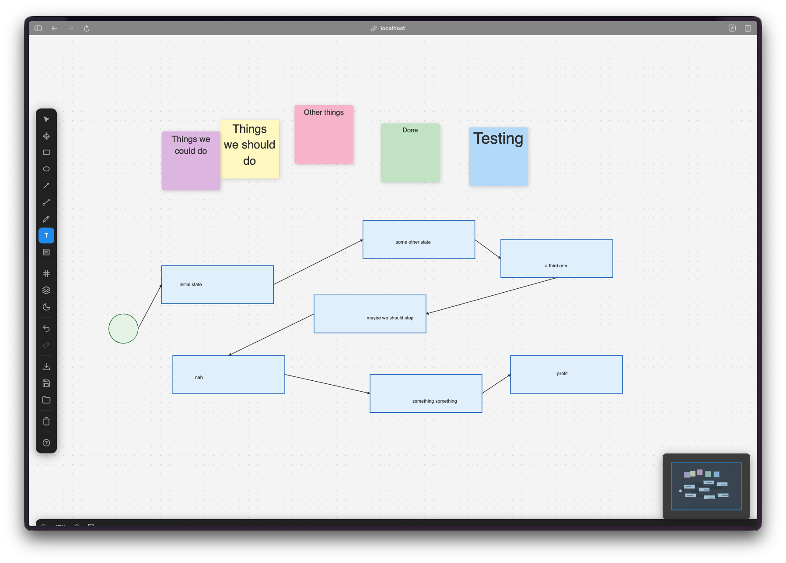
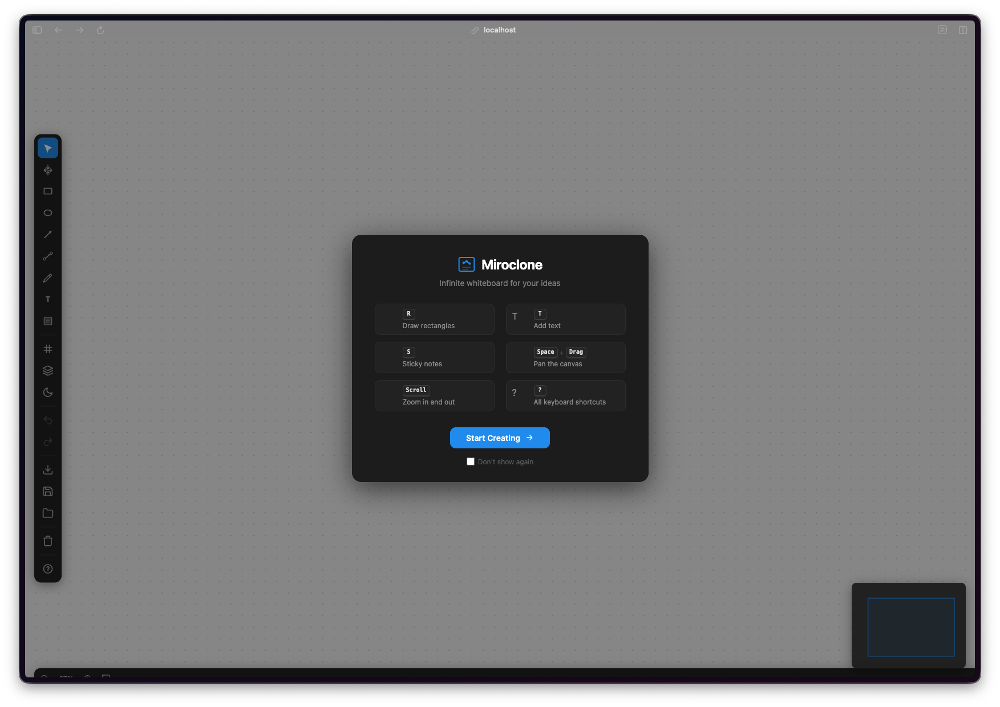
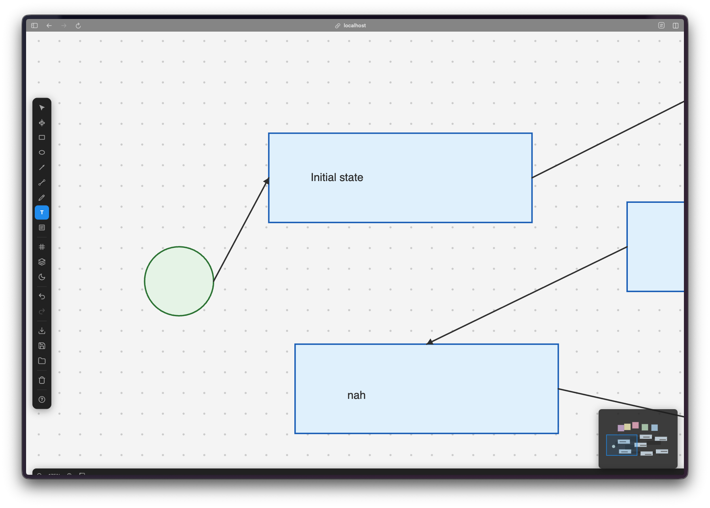
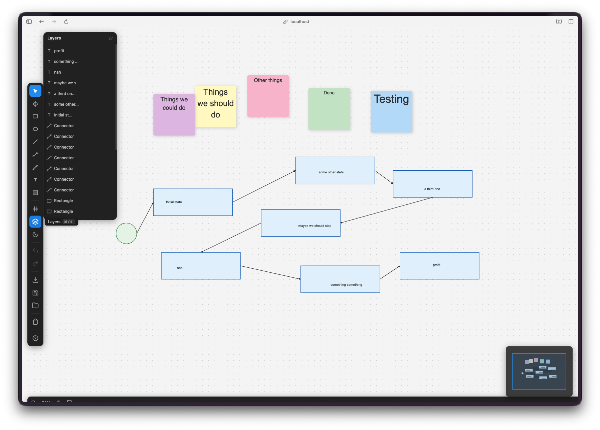
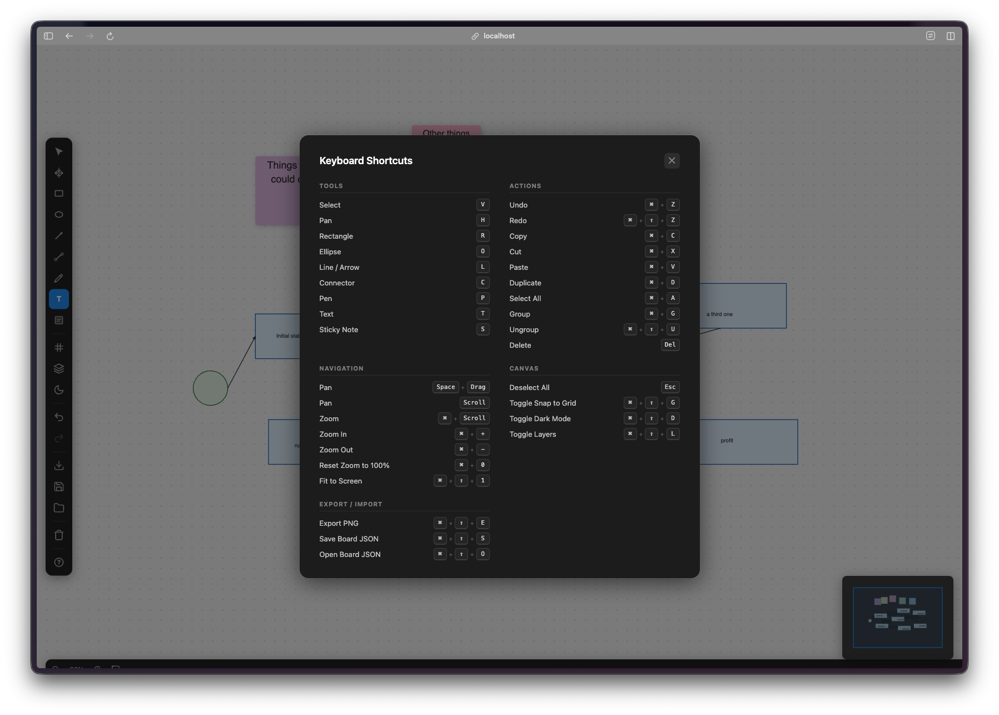
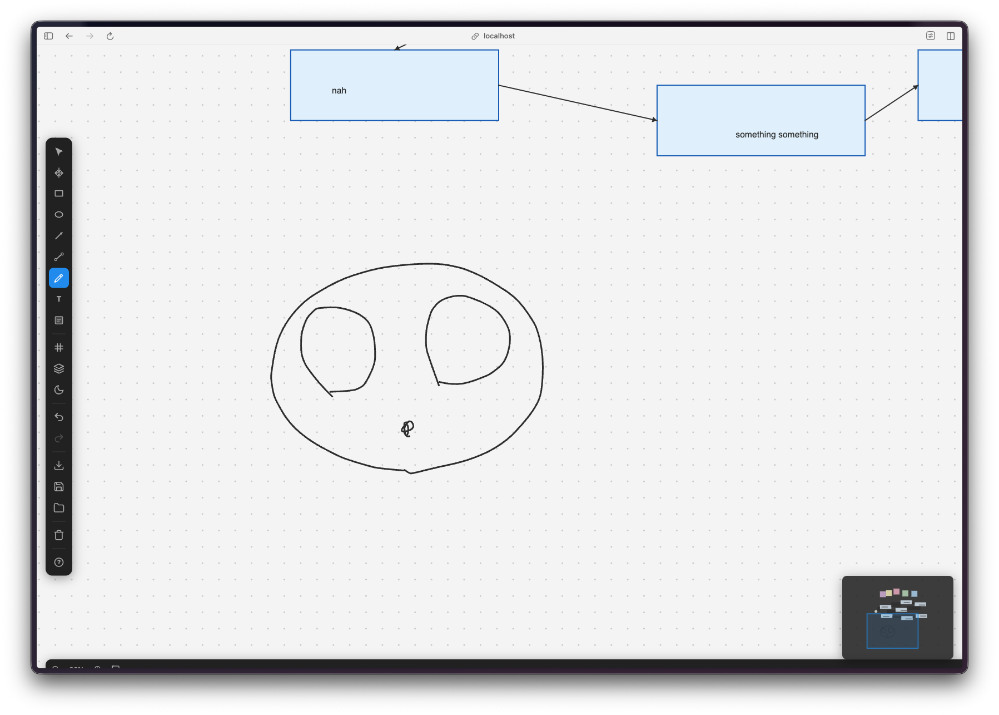

Giorno 10. Ho chiesto un clone di Miro. Un canvas infinito completo con forme, connettori, livelli e una modalità presentazione.

## Il Prompt

> "Costruisci un'app di lavagna a canvas infinito come Miro. Local-first, TypeScript, HTML5 Canvas."

Era il punto di partenza. Tutto il resto è venuto dalla suddivisione dei task.

## Come È Stata Costruita

Questo era grosso. Watchfire l'ha diviso in 27 task, il massimo che ho visto finora in questa challenge. La suddivisione copriva:

1. Forme e strumenti di disegno (rettangoli, ellissi, linee, frecce)
2. Strumento penna a mano libera
3. Elementi di testo
4. Post-it con codice colore
5. Connettori intelligenti tra le forme
6. Griglia e aggancio alla griglia
7. Cronologia annulla/ripristina
8. Export in PNG e JSON
9. Pannello livelli
10. Selettore di colori
11. Controlli di zoom e spostamento
12. Scorciatoie da tastiera per tutto
13. Modalità scura
14. Schermata di benvenuto con onboarding
15. Modalità presentazione

27 task sono tanti. Ma erano ben definiti. Ognuno aggiungeva un pezzo specifico di funzionalità senza rompere quello che c'era prima.



## Cosa Ho Ottenuto

Questa cosa è sorprendentemente completa.

**Sembra uno strumento di lavagna vero.** La apri e c'è un canvas infinito con una griglia di puntini. Puoi spostarti, zoommare, piazzare forme, scrivere testo, collegare le cose con le frecce. Il ciclo base della lavagna funziona e basta.

**C'è una vera schermata di benvenuto.** Ti mostra le scorciatoie da tastiera e come iniziare. Puoi chiuderla e spuntare una casella per non mostrarla più. Piccolo tocco, ma fa sembrare l'app finita.

**I connettori sono intelligenti.** Disegni una linea tra due forme e si aggancia ai punti di connessione. Sposta una forma e il connettore la segue. È il tipo di funzionalità che separa un'app di disegno da uno strumento di diagrammi.

**Il pannello dei livelli funziona davvero.** Ogni elemento appare in una lista laterale. Puoi vedere la gerarchia, riordinare le cose, e gestire cosa sta sopra a cosa. È come un mini pannello livelli di Figma.

**Scorciatoie da tastiera per tutto.** V per selezionare, R per rettangolo, O per ellisse, P per penna, T per testo, S per post-it. Più tutta la roba standard come Cmd+Z per annullare, Cmd+Shift+Z per ripristinare. C'è un overlay completo delle scorciatoie che puoi richiamare con ?.

**Lo strumento penna è fluido.** Ho disegnato una faccia solo per testarlo. I tratti sono reattivi e naturali. Non sensibili alla pressione o roba fancy, ma abbastanza buoni per abbozzare idee durante un brainstorm.

## I Bug Report

Questo era relativamente pulito. Con 27 task, mi aspettavo più problemi, ma l'approccio incrementale ha fatto sì che ogni pezzo fosse testato prima che arrivasse il successivo. Le cose principali che ho notato:

- I post-it a volte si sovrapponevano al testo quando li ridimensionavi troppo piccoli
- La minimappa nell'angolo poteva andare fuori sincrono dopo zoom pesanti
- L'export in PNG a volte tagliava elementi ai bordi del canvas

Niente di grave. L'esperienza base della lavagna era solida fin da subito.

## I Numeri

- **27 task Watchfire** dal setup del canvas alla modalità presentazione
- **TypeScript + Vite** con rendering HTML5 Canvas
- **Suite di strumenti completa:** selezione, spostamento, rettangolo, ellisse, linea, freccia, connettore, penna, testo, post-it
- **Modalità scura, livelli, export, scorciatoie da tastiera, modalità presentazione**
- **Zero librerie UI esterne.** Tutto è costruito su misura sul canvas

## Provalo



**[Apri la Lavagna](https://vibe30-day10-miroclone.vercel.app)**

Funziona meglio su desktop. Usa le scorciatoie da tastiera per l'esperienza completa.

## Verdetto del Giorno 10

Questo è il primo progetto della challenge che punta a un servizio web complesso. Miro non è un gioco con regole auto-contenute. È un prodotto vero, con forme, connettori, livelli, export, modalità presentazione, e tutto un modello di interazione che al team originale ha richiesto anni per essere messo a punto. Clonarlo in un giorno significa fare delle scelte su cosa tenere e cosa lasciare perdere.

La scelta più grossa è stata il backend. Non c'è. Tutto vive nel browser, persistito nel local storage. Niente account, niente server, niente database. È un vincolo deliberato che mi tengo nei primi progetti di questa challenge — tenere tutto locale, spedire più veloce, evitare la complessità di tirare su infrastruttura per ogni demo. Qui funziona perché una lavagna non ha bisogno di essere multiplayer per essere utile. Prima o poi sbatterà contro un muro. Collaborazione in tempo reale, sync cloud, condividere una lavagna con qualcun altro via URL — niente di tutto questo è possibile senza un backend. Ci arriveremo in un progetto futuro.

Quello che spicca è l'architettura. Il codice è diviso in moduli puliti per la gestione dell'input, il rendering, la gestione dello stato, gli strumenti e l'UI. Ogni strumento è un suo modulo. La gestione dello stato si occupa della cronologia per annulla/ripristina. Non è un prototipo rabberciato, è un'app strutturata come si deve.

Potrebbe sostituire Miro? No. Ma come strumento local-first di schizzi e diagrammi, è sorprendentemente usabile. Mi sono ritrovato a buttare giù idee davvero, invece di limitarmi a testarlo.

Un terzo della challenge è fatta. La portata di quello che entra in una singola giornata continua a crescere.

---

*Questo è il giorno 10 di [30 Days of Vibe Coding](/series/30-days-of-vibe-coding/). Seguimi mentre spedisco 30 progetti in 30 giorni usando il coding assistito dall'IA.*
