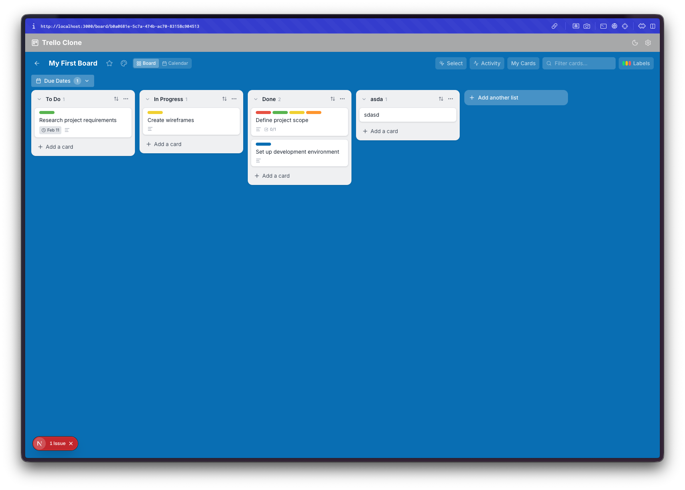
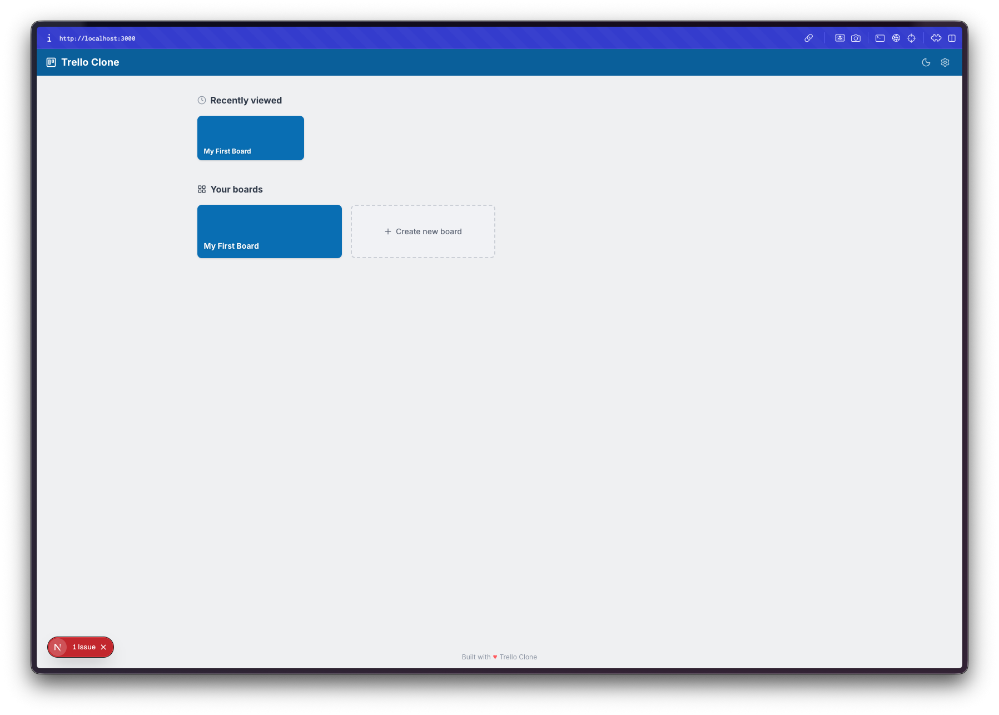
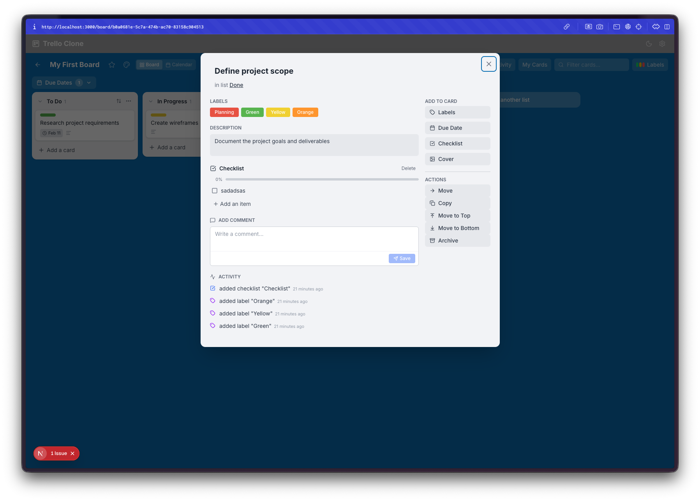
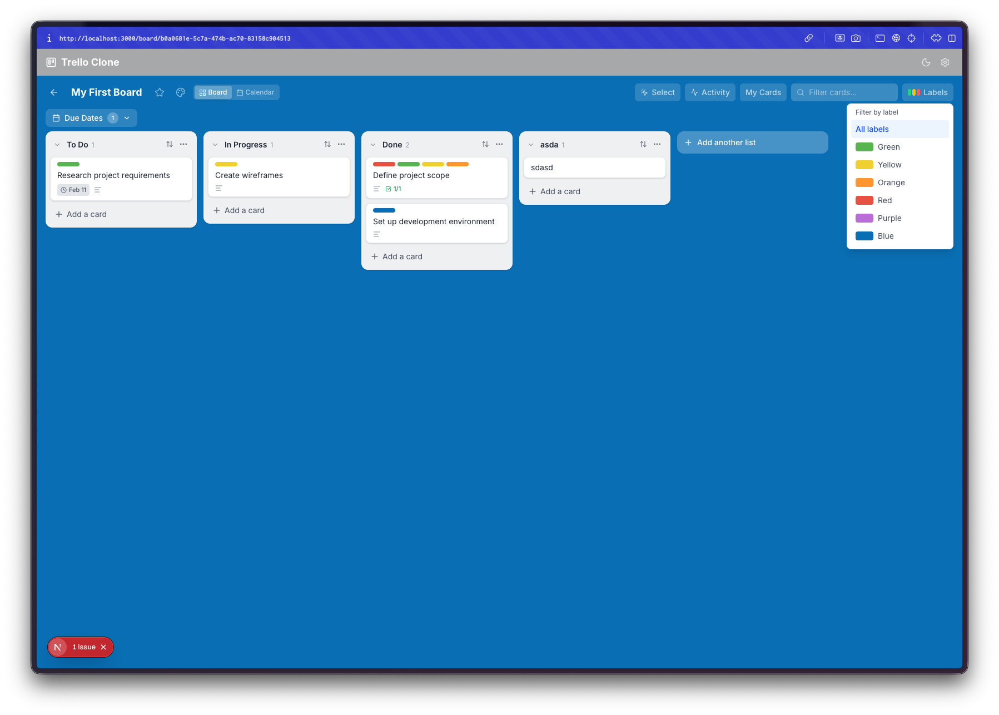
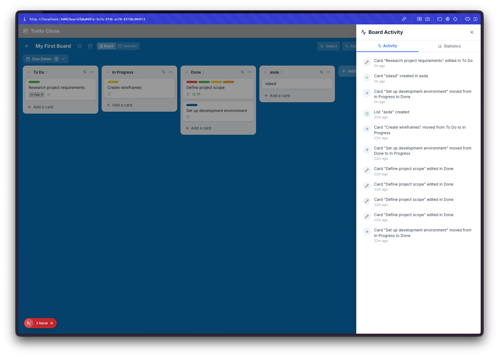
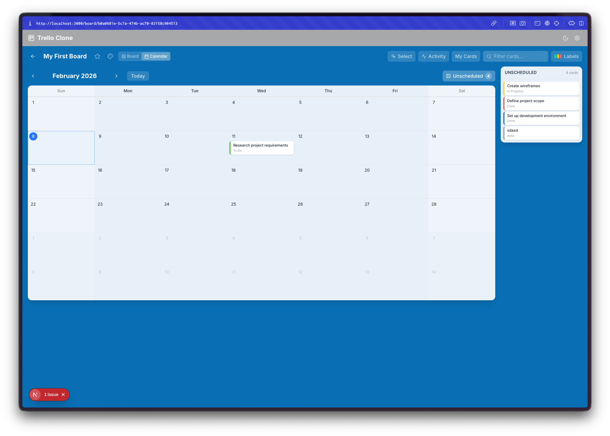
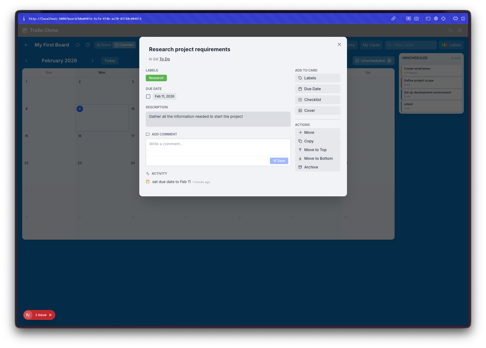
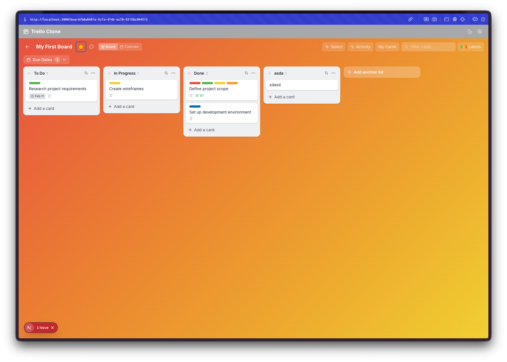

Day 11. I asked for a Trello clone and got something I'd actually use.

## The Prompt

> "Build a Trello-style kanban board app with boards, lists, cards, and drag-and-drop"

I named it Treelo because I'm very creative with names.

## How It Was Built

Watchfire broke this one down into 18 tasks. The core stuff came first: boards, lists, cards, and drag-and-drop. Then it kept going. Labels. Due dates. A card detail modal. Custom board backgrounds. Search and filtering. Card archiving. Multi-select with bulk operations. An activity feed. A calendar view. And then a performance optimization pass at the end to keep everything smooth.

That's a lot of features for a single prompt. Most of these I didn't explicitly ask for. The initial prompt was just boards, lists, cards, and drag-and-drop. Everything else was Watchfire deciding "a kanban board should also have these things" and just building them.

## What I Got

**It looks like Trello.** The layout, the card styling, the blue background, the list columns. If you squint it could pass for the real thing. There's a top bar with search, activity, calendar, and filter buttons. Lists have card counts. Cards show labels and due date badges.

**Multiple boards.** There's a homepage with recently viewed boards and a "Create new board" button. It tracks which boards you've visited recently. Simple but functional.

**The card detail modal is surprisingly complete.** Click any card and you get a full modal with labels, a due date picker, a checklist with progress tracking, a description field, comments, and an activity log. On the right side there's a set of actions: move, copy, archive. This is the kind of thing that would take days to build properly by hand.

**Labels actually work.** You can assign color-coded labels to cards and then filter by them. The filter panel slides out from the right side. Cards on the board show their label colors as small colored strips at the top.

**There's an activity feed.** Every action gets logged. Card created, card moved, label added, checklist completed. It shows timestamps and describes what happened. This is one of those features that separates a toy from something usable. You can actually trace what happened on a board.

**A calendar view.** Toggle from the board view to a calendar and see all your cards with due dates laid out on a monthly grid. Cards without due dates show up in a sidebar. It's a genuinely useful way to see what's coming up.

**Card modals work from the calendar too.** Click a card on the calendar and the same detail modal opens. Due dates, labels, everything is accessible from either view.

**Custom board backgrounds.** You can change the board background to different colors and gradients. Dark mode is also fully supported. The whole app respects your theme preference.

## What Else Is In There

Some things that don't show up well in screenshots but are worth mentioning:

- **Drag-and-drop** using @dnd-kit. You can reorder cards within a list, move them between lists, and reorder the lists themselves.
- **Multi-select.** Hold shift or ctrl to select multiple cards and then move, archive, or label them in bulk.
- **Undo/redo.** Full history support with Ctrl+Z and Ctrl+Shift+Z.
- **Keyboard shortcuts.** Press N to add a card, F to search, B to go back to boards, Q to filter by due date, and ? to see all shortcuts.
- **Checklists** inside cards with a progress bar.
- **Archive and restore.** Cards and lists can be archived without being deleted.
- **Local storage persistence.** Everything saves to the browser. Close the tab, come back, your boards are still there.

## The Bug Reports

Honestly, this one was pretty clean. The main issues were around drag-and-drop edge cases (dropping a card at the very bottom of a list sometimes didn't register) and the calendar view initially not updating when you changed a due date from the modal. Small stuff. Nothing structural.

## The Numbers

- **18 Watchfire tasks** from core kanban to performance optimization
- **Next.js + TypeScript + Tailwind CSS** stack
- **@dnd-kit** for drag-and-drop
- **Full keyboard navigation** with shortcut overlay
- **Two views:** board and calendar
- **All data in localStorage** with no backend needed

## Try It

{{/*< github repo="nunocoracao/Vibe30-day11-trelloclone" >*/}}

**[Try Treelo](https://vibe30-day11-trelloclone.vercel.app)**

Create a board, add some lists, drag some cards around. It's more fun than it should be.

## Day 11 Verdict

This is the most feature-complete thing I've built in this challenge so far. A kanban board sounds simple on the surface, but there are so many small interactions that need to work: drag targets, modal state, filtering, undo history, cross-view consistency. The fact that all of this came from one prompt and 18 automated tasks is still wild to me.

I keep coming back to the same thought: I could not have built this in a day by myself. The drag-and-drop alone would have taken me a full day of fighting with libraries and edge cases. Instead I got a working Trello clone with a calendar view, an activity feed, bulk operations, and keyboard shortcuts. And I spent my time testing it and filing a couple of bug reports.

The gap between "I want a kanban board" and "here's a kanban board" just keeps getting shorter.

---

*This is day 11 of [30 Days of Vibe Coding](/series/30-days-of-vibe-coding/). Follow along as I ship 30 projects in 30 days using AI-assisted coding.*
