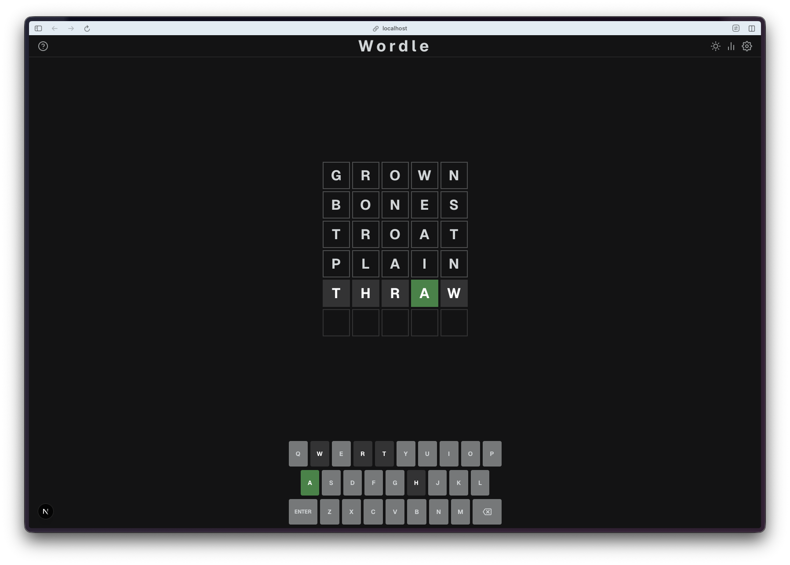
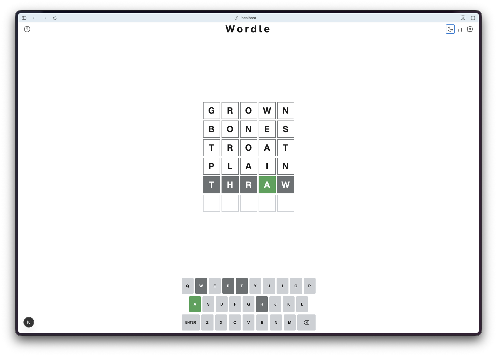
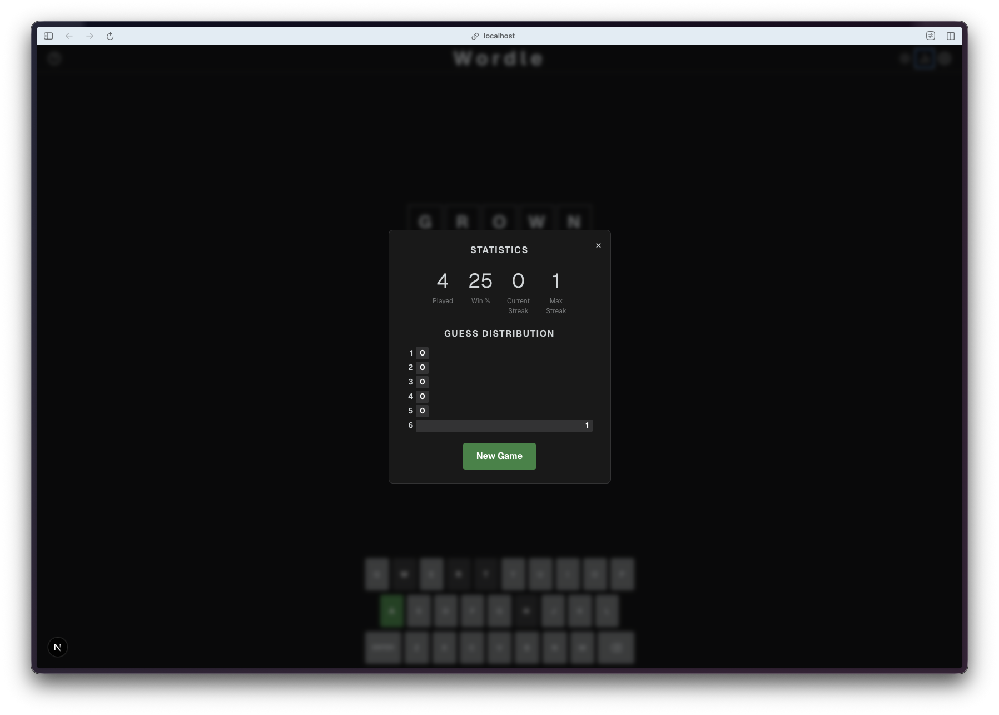
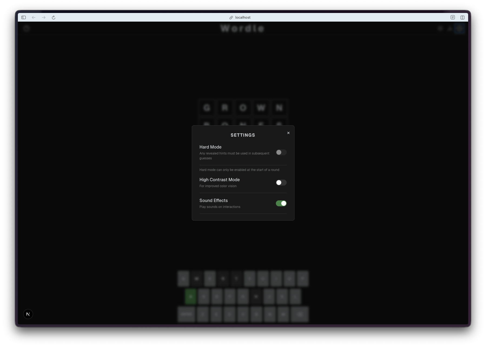

Day 12. Everyone's played Wordle. Let's see how close AI can get to the real thing.

## The Prompt

> "Build a Wordle clone with a proper word list, tile animations, keyboard, statistics tracking, and share functionality."

## How It Was Built

This one went through 7 Watchfire tasks, and watching the progression was interesting because it mirrors how you'd actually build a polished game if you had infinite patience.

1. **Game engine with word lists.** The foundation: a solution list of around 2,300 words, a valid guesses list of around 10,000 words, and the core guess evaluation logic. Green, yellow, gray. The basics.
2. **Polished UI with tile animations and keyboard.** Tile flips on reveal, pop on input, shake on invalid words. An on-screen keyboard that updates letter colors as you play.
3. **Statistics and share.** Win percentage, guess distribution bar chart, current and max streak tracking. The share button copies your emoji grid to clipboard, just like the real Wordle.
4. **Help modal, dark/light theme, hard mode.** A how-to-play overlay with visual examples. Theme toggle with smooth transitions. Hard mode that forces you to use revealed hints in subsequent guesses.
5. **Colorblind mode, accessibility, React refs bug fix.** High contrast colors for colorblind players. This task also caught and fixed a React refs bug that was causing issues with the tile animations.
6. **Sound effects with Web Audio API.** Audio feedback for key presses, tile reveals, wins, and errors. All generated with the Web Audio API, so no audio files to load.
7. **Confetti celebration on win.** A canvas-based particle system that fires when you solve the puzzle. Because you earned it.

The whole thing lives in a single custom React hook (`useWordle.ts`) for the game logic, with the UI as a Next.js page. Clean separation.



## What I Got

**It feels like Wordle.** That was the bar, and it clears it. The tile flip animation on reveal, the slight pop when you type a letter, the shake when you enter an invalid word. These micro-interactions are what make the real Wordle satisfying to play, and they're all here.

**Dark and light themes.** Both look clean. The dark mode is the default (as it should be), but the light mode works well too. Toggle is in the header, transitions are smooth.

**Statistics that persist.** Games played, win percentage, current streak, max streak, and a guess distribution chart. All stored in localStorage, so your stats survive between sessions. The share button formats your results as an emoji grid, ready to paste anywhere.

**Settings that matter.** Hard mode is a real constraint, not just a label. If you reveal that the word has an A in position 3, every subsequent guess must have an A in position 3. The game enforces it and tells you why your guess was rejected. Colorblind mode swaps the green and yellow for orange and blue, which is a small thing that makes the game playable for a lot more people.

**Sound effects without sound files.** The Web Audio API approach is clever. No mp3s to load, no audio sprites, no preloading. The sounds are synthesized on the fly. A soft click for key input, a satisfying tone sequence for the tile reveals, a little fanfare for winning. They add a lot without adding any download weight.

**Confetti that feels right.** Win the game and canvas particles burst from the center of the screen. It is a small touch, but it turns a quiet "you got it" moment into a celebration.

## The Bug Reports

The React refs issue in task 5 was the only real bug. The tile flip animations were not triggering consistently because of how React was handling refs during re-renders. Watchfire caught it during the accessibility pass and fixed it in the same task. I did not have to file a separate report for that one.

Beyond that, the game played correctly from the start. Valid words were accepted, invalid words were rejected with a shake, the keyboard colors updated correctly, and hard mode enforced its rules properly.

## The Numbers

- **~2,300 solution words** and **~10,000 valid guesses**
- **7 Watchfire tasks** from bare game engine to confetti
- **1 custom hook** (`useWordle.ts`) containing all game logic
- **Web Audio API** for zero-download sound effects
- **Canvas particle system** for win celebrations
- **localStorage** for statistics and game state persistence

## Try It



**[Play Wordle](https://vibe30-day12-wordle.vercel.app)**

Type a 5-letter word and press Enter. Green means right letter, right spot. Yellow means right letter, wrong spot. Gray means the letter is not in the word. Six tries to figure it out.

## Day 12 Verdict

Wordle is one of those games that looks simple until you try to build it. The core logic is straightforward, but the polish is what makes it work. The animations, the keyboard feedback, the statistics, the share feature, hard mode enforcement. Strip any of those away and it stops feeling like Wordle.

What impressed me here was the progression. Task 1 gave me a functional but ugly word guessing game. By task 7 it had everything the real Wordle has, plus sound effects and confetti. Each task layered on a specific category of polish, and none of them broke what came before. That is not easy to do with animations and state management in React.

The Web Audio API choice for sound effects was a nice surprise. I would have expected it to reach for audio files. Instead it generates the sounds programmatically, which means zero additional assets and instant playback. Smart trade-off.

The pattern is holding. Each day adds polish, and nothing has fallen apart yet.

---

*This is day 12 of [30 Days of Vibe Coding](/series/30-days-of-vibe-coding/). Follow along as I ship 30 projects in 30 days using AI-assisted coding.*
