Day 13. What if you could turn any GitHub profile into a good-looking portfolio site without writing a single line of code?

## The Prompt

> "Build a GitHub portfolio generator. Enter a username, get a polished portfolio with stats, repos, languages, and activity. Multiple templates, multiple color themes, export to HTML."

## How It Was Built

Watchfire broke this down into 19 tasks. The core work started with GitHub API integration and pulling all the data you would want in a portfolio: profile info, repos, contribution activity, languages, organizations. From there it built out the template system, the theme engine, and all the export and sharing features.

The task list covered a lot of ground: five portfolio templates (Minimal, Developer Card, Creative/Bento Grid, Corporate/Showcase, and a Hacker/Terminal theme), seven color themes, custom accent colors, print and PDF mode, auto-detected skills, deployment guides, README export, and a social share card generator. It is a surprisingly deep feature set for something that runs entirely in the browser with no backend.



## What I Got

The landing page already looks polished. Dark mode by default, clean typography, a three-step explainer, and a preview of all the templates and themes right on the homepage.

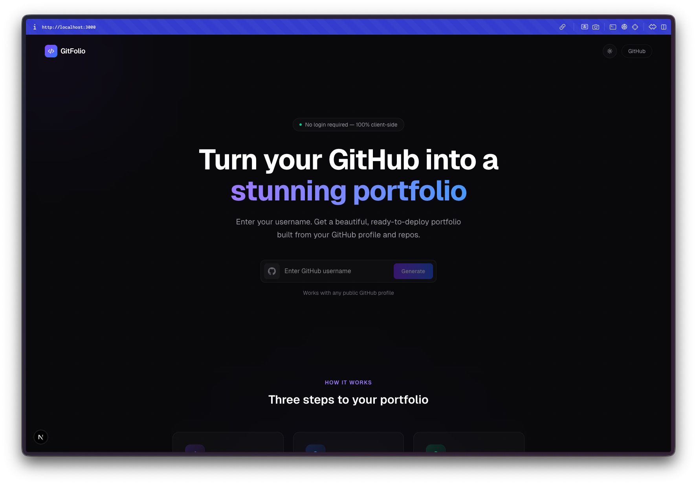

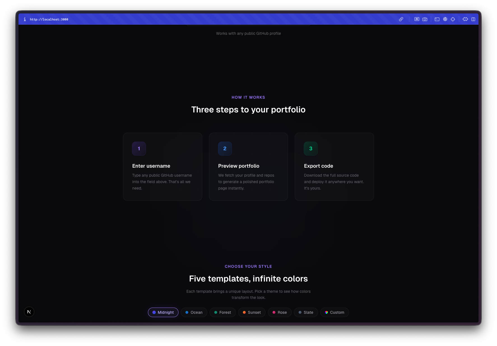

**Five templates, each with a distinct personality.** Showcase is the full-featured option with a bento grid layout. Developer Card is compact and to the point. Bento Grid goes for the asymmetric card look. Minimal strips everything down to typography. And Terminal renders the whole thing as a command-line interface, complete with ASCII art and monospaced fonts.

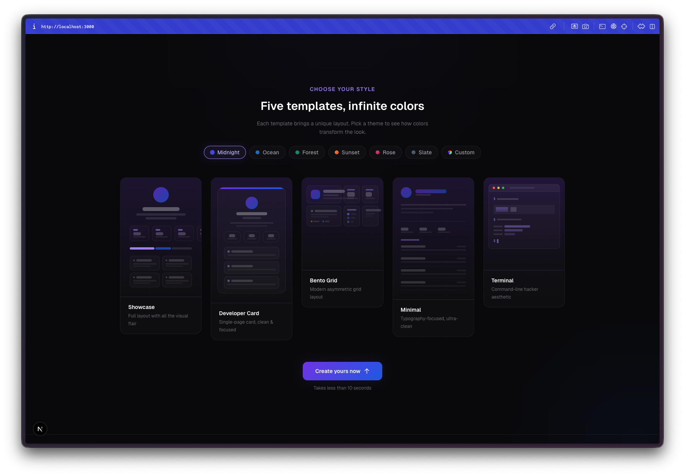

**Seven color themes plus custom accents.** Midnight, Ocean, Forest, Sunset, Rose, Slate, and a custom option where you pick your own accent color. The landing page even has a light mode variant.

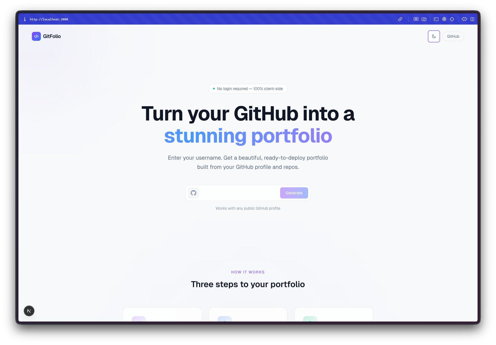

**The generated portfolios are packed with data.** Stats with animated counters, contribution heatmap, language breakdown with a stacked bar chart, top repositories, recent activity, organizations, social links. All pulled from the public GitHub API with zero authentication required.

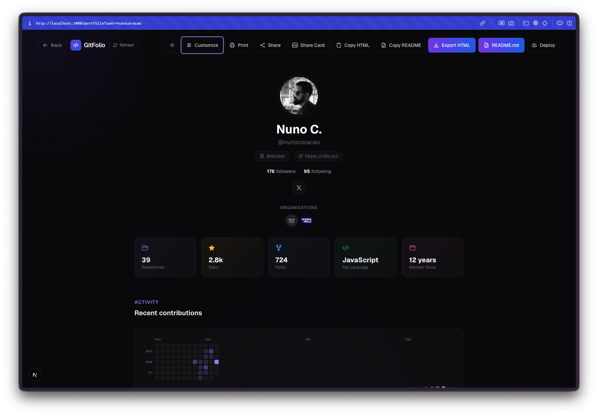

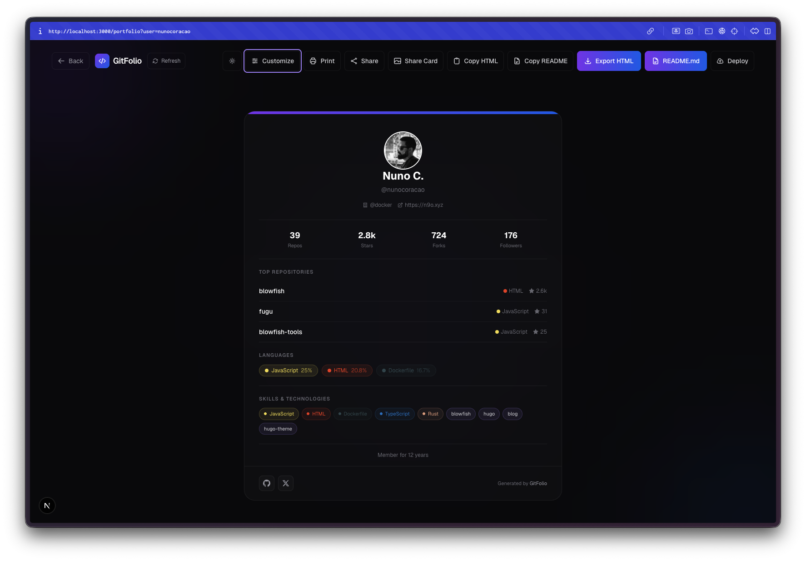

**The customization panel is thorough.** You can toggle individual sections on and off, switch themes and templates live, override the bio text, and see changes reflected instantly. Everything happens client-side so there is no loading between switches.

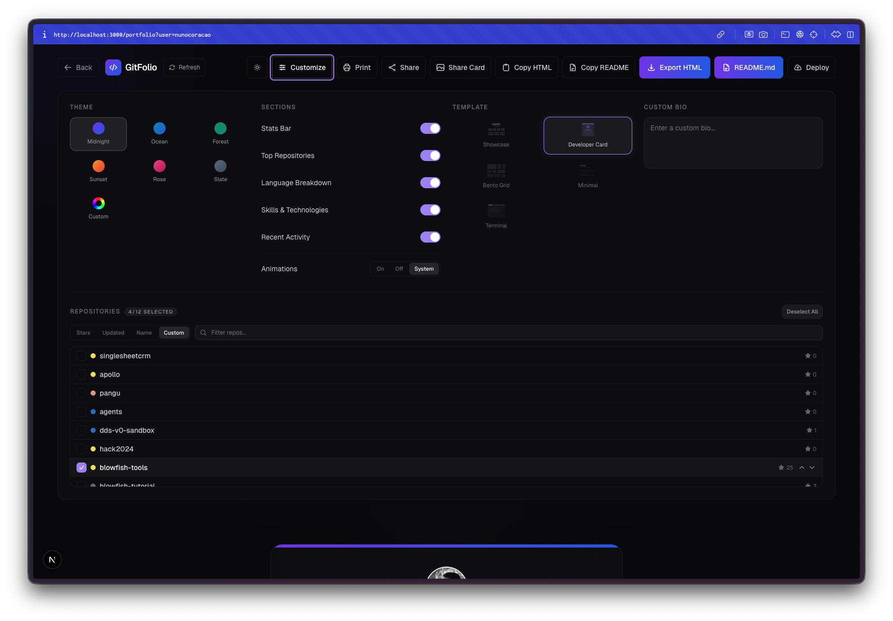

**The Bento Grid template looks great.** This was the one that surprised me. It lays out profile info, stats, featured repos, recent activity, and languages in an asymmetric card grid that feels like a proper design project.

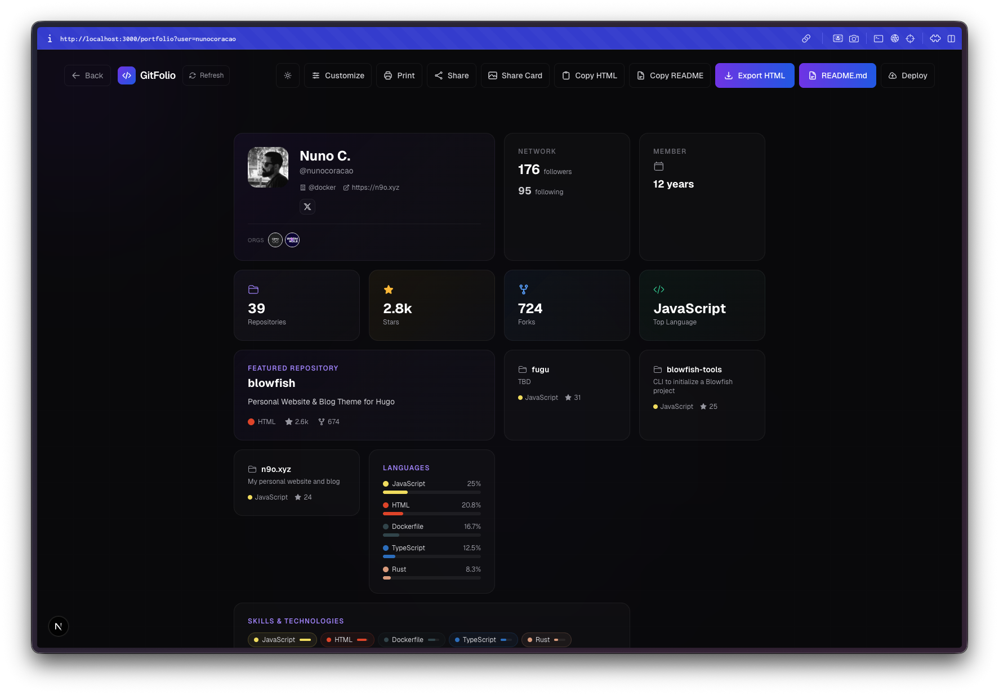

**The Terminal template is wild.** It renders your entire portfolio as if you are running commands in a terminal. Profile info shows up as a fetch-style output, stats display as CLI responses, repos list as directory entries. It even has a blinking cursor.

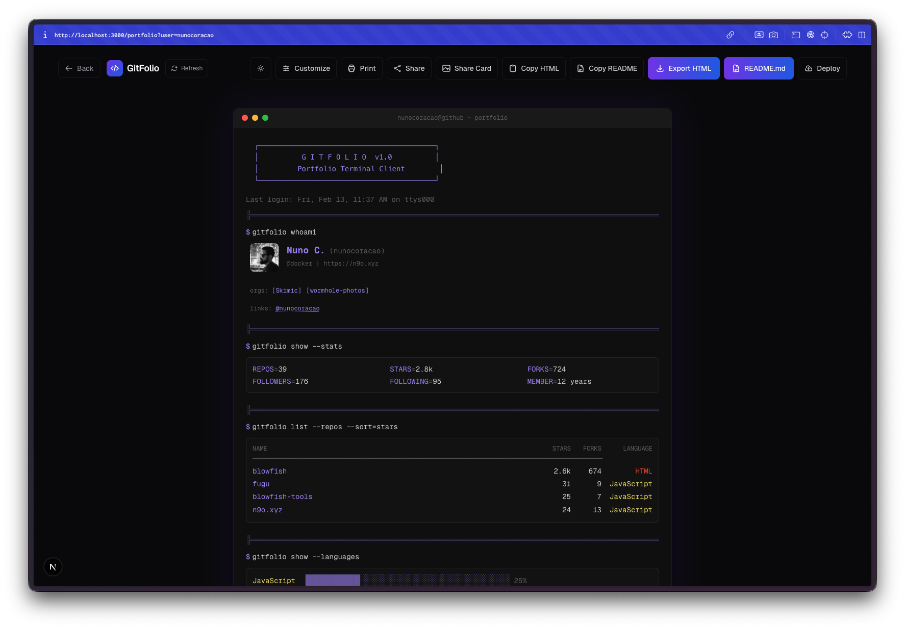

**Built-in deployment guides.** Once you export your portfolio HTML, a deploy modal walks you through hosting it on Netlify Drop, GitHub Pages, or Vercel. Step by step instructions with links to each platform. This is the kind of finishing touch that turns a demo into something people can actually use.

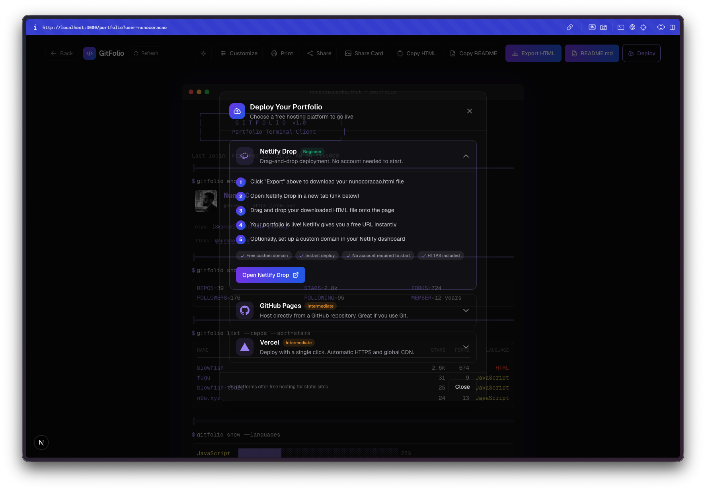

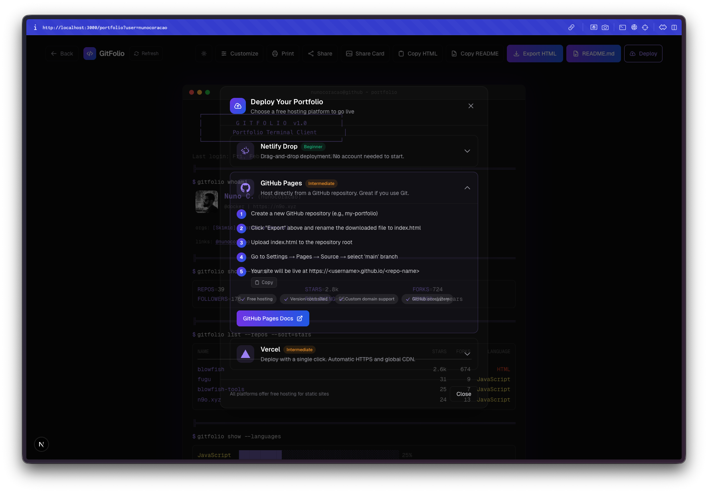

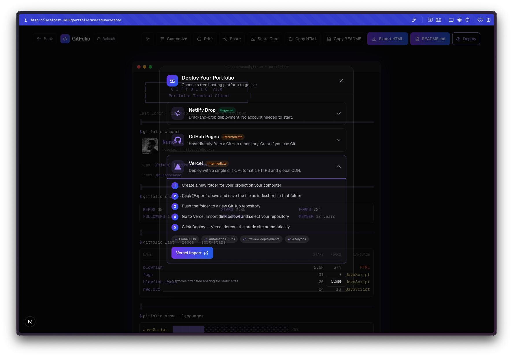

## The Bug Reports

The GitHub public API caps you at 60 requests per hour without authentication, and each portfolio generation uses about 4 requests. During testing I hit the rate limit a few times when rapidly regenerating portfolios. Not really a bug, just a constraint worth knowing about. The app handles it gracefully and tells you to wait.

The README mentions 6 themes and 4 templates, but the actual app ships with 5 templates and 7 themes. The code outgrew the documentation, which is kind of the story of this whole challenge.

## The Numbers

- **5 portfolio templates** with distinct layouts
- **7 color themes** plus custom accent colors
- **19 Watchfire tasks** from API integration to deployment guides
- **Zero backend** required, everything runs client-side
- **4 GitHub API calls** per portfolio generation
- **Export formats:** HTML download, clipboard copy, shareable link, README, and social share card

## Try It

{{/*< github repo="nunocoracao/Vibe30-day13-githubportfolio" >*/}}

**[Generate Your Portfolio](https://vibe30-day13-githubportfolio.vercel.app)**

Just enter any public GitHub username and pick a template.

## Day 13 Verdict

This one is genuinely useful. Most developer portfolio tools either require you to set up a whole project or lock you into a specific design. GitFolio just takes a username and gives you a self-contained HTML file you can host anywhere. The template variety is solid, the Terminal theme alone is worth trying, and the deployment guides remove the last friction point between generating a portfolio and actually putting it online.

The fact that it runs entirely in the browser with no auth, no database, and no tracking is a nice touch. You could hand this URL to someone who has never touched a terminal and they could have a portfolio site live in five minutes.

Thirteen days in and I am starting to notice that the projects are getting more polished. The landing pages are better, the feature sets are deeper, the edge cases are handled. Whether that is me getting better at prompting or the tools getting better at inferring what I want, I am not sure. Probably both.

---

*This is day 13 of [30 Days of Vibe Coding](/series/30-days-of-vibe-coding/). Follow along as I ship 30 projects in 30 days using AI-assisted coding.*
