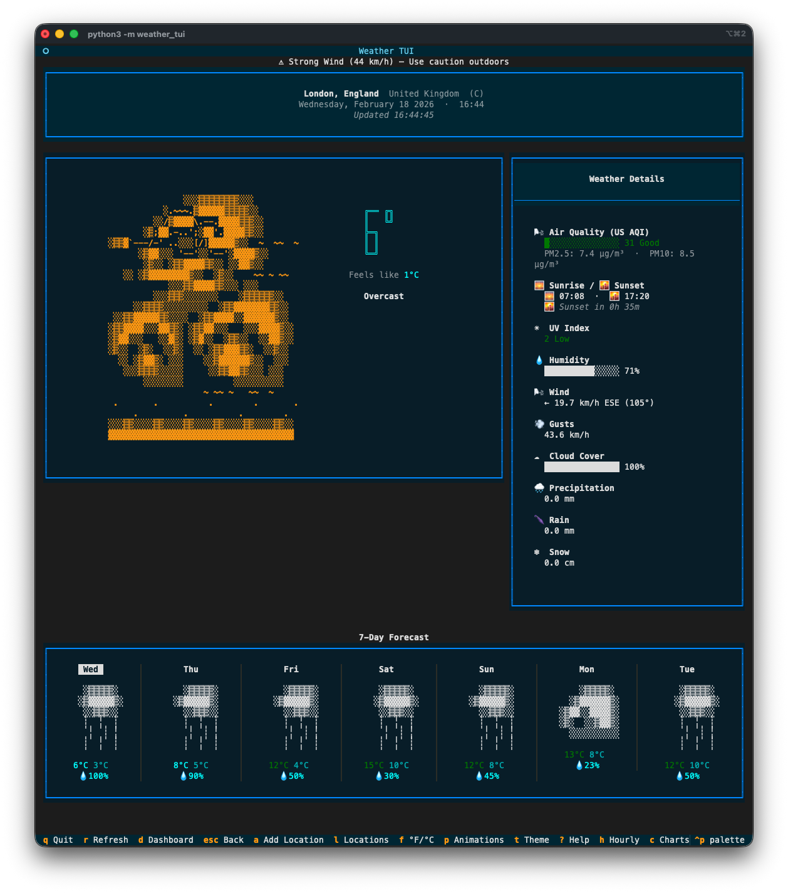
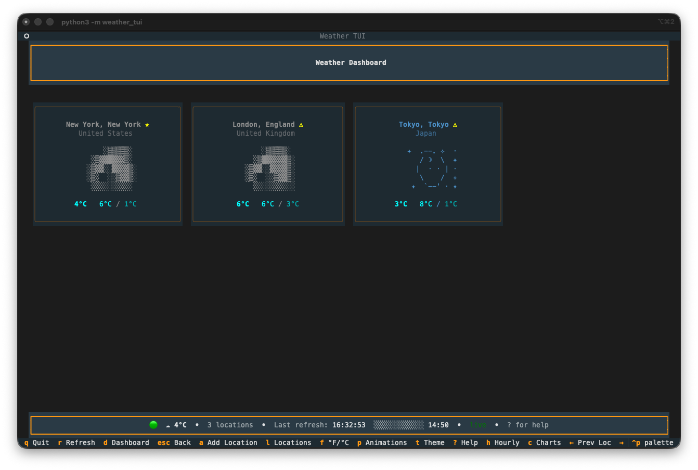
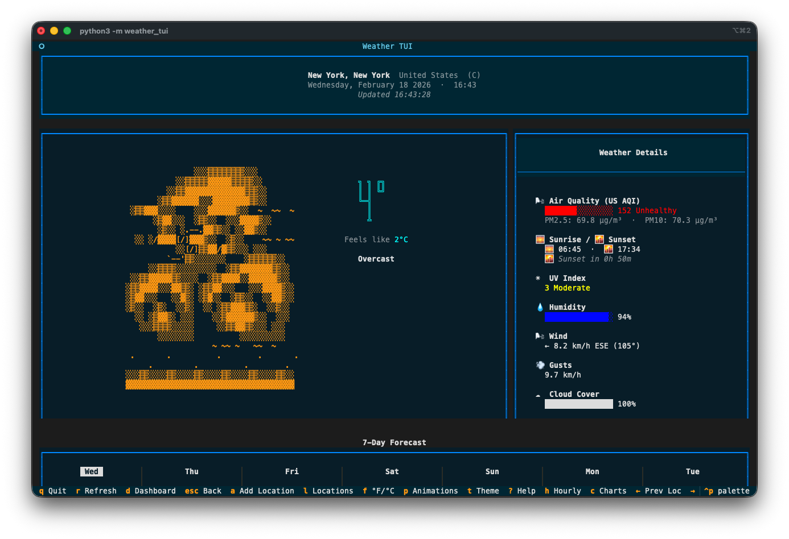
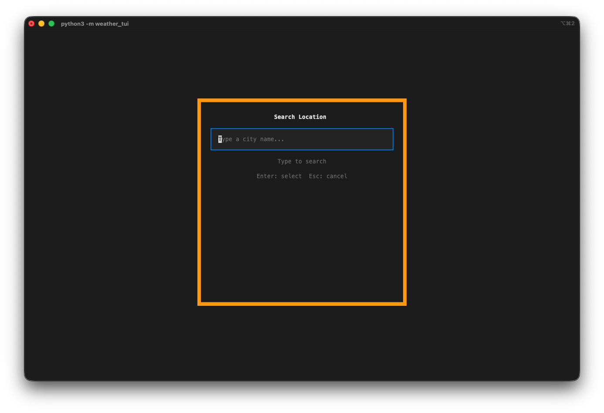
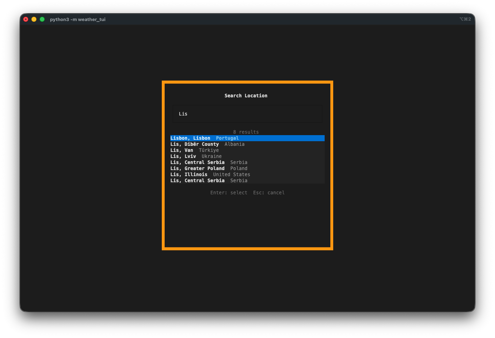
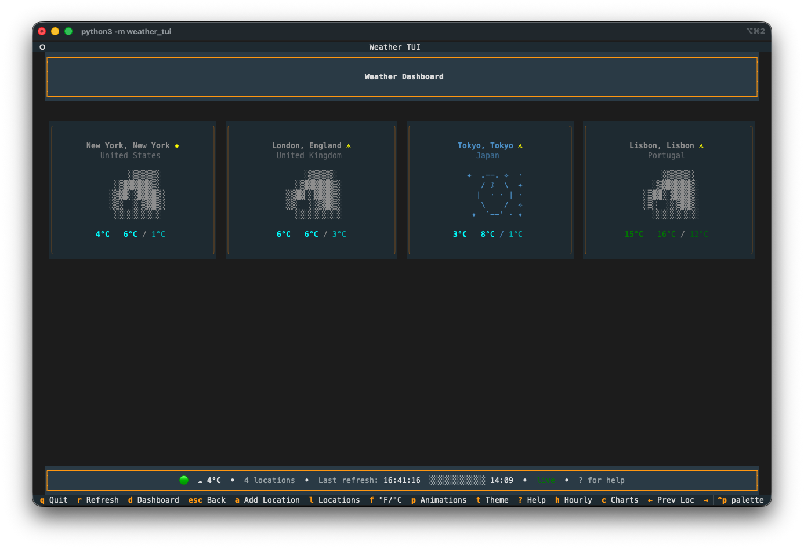
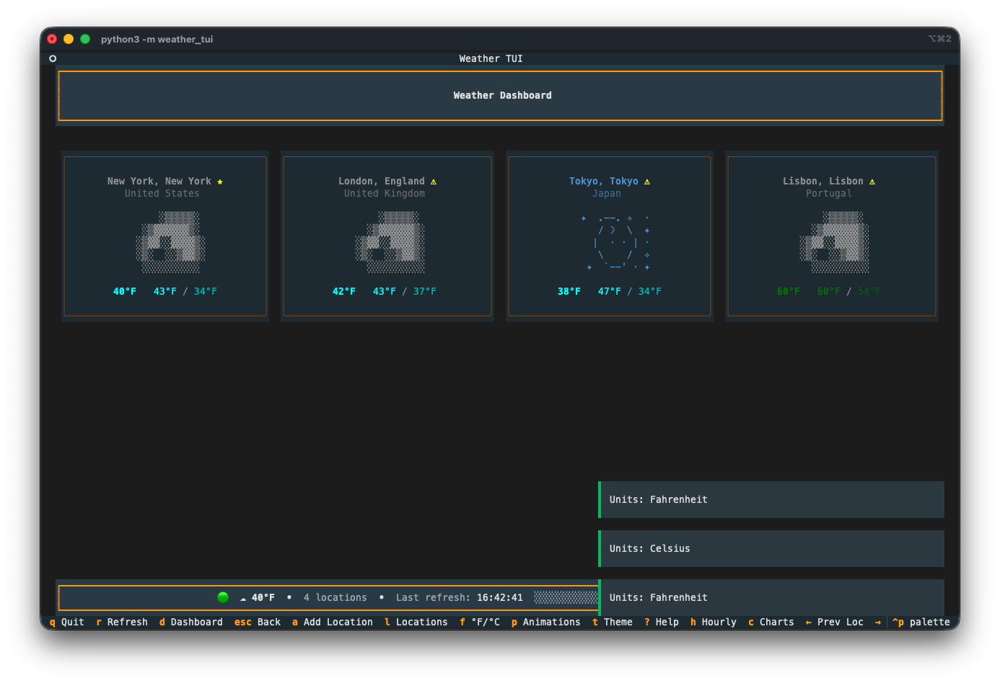
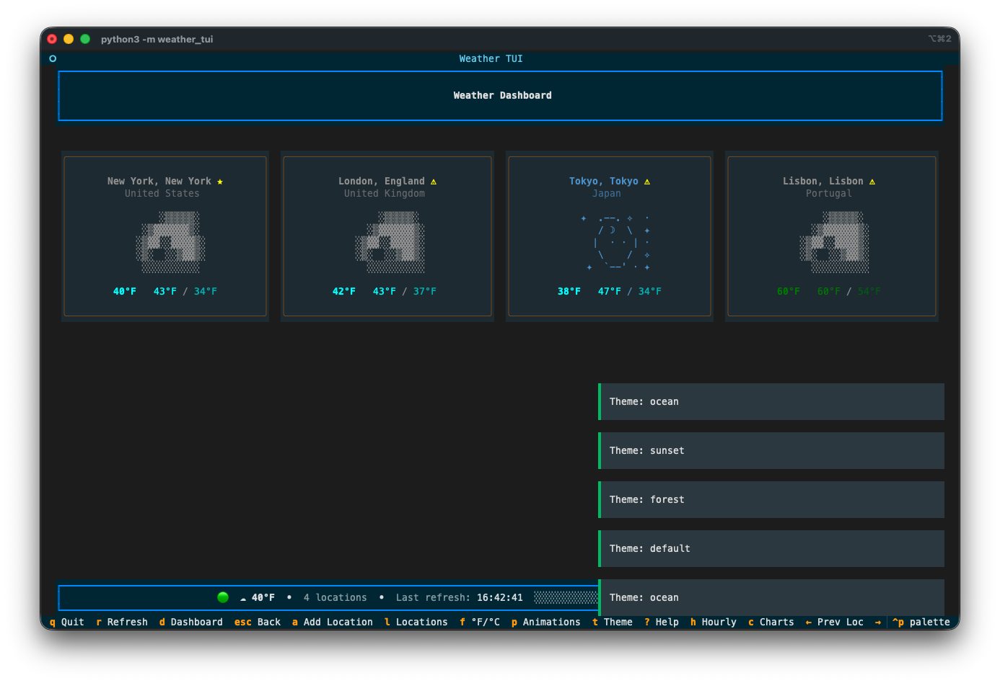

Day 14. I wanted to see what a weather app looks like when you strip away every modern UI framework and force everything into a terminal.

## The Prompt

> "Build a terminal weather dashboard with ASCII art weather scenes, animated weather effects, and multi-location support"

## How It Was Built

I used [Watchfire](https://watchfire.io) and it broke the work into 23 tasks. That sounds like a lot for a weather app, but the scope grew fast once ASCII art and animations entered the picture.

The task list covered the expected stuff first: project setup, API integration with Open-Meteo, basic layout. Then it got into the fun territory: 12 unique ASCII art weather scenes (sun, moon, rain, snow, thunderstorm, fog, wind, clouds), particle-based animated effects for each weather condition, temperature and precipitation charts, hourly and daily forecast views, a multi-location dashboard, color themes, mouse support, and a scrollable layout.

23 tasks. I didn't sit there guiding each one. Watchfire queued them up and worked through them while I did other things.



## What I Got

This one surprised me more than most.

**The ASCII art is genuinely impressive.** Each weather condition gets its own scene. There's a big overcast sky with layered clouds, rain with falling droplets, snow with drifting flakes, a sun with radiating rays. The art is detailed and fills the terminal with actual character. Not the lazy "it's raining: //" kind of ASCII art. Real multi-line scenes with shading and depth.

**The animations are smooth.** Rain drops fall. Snowflakes drift. Stars twinkle in the night sky. Wind particles blow across the screen. Lightning flashes during thunderstorms. All of this happening in a terminal. You can pause and resume the animations with a single keypress.

**The dashboard is clean.** Multiple locations displayed in a grid, each with a small ASCII weather icon, current temperature, and conditions at a glance. Click any card or press a number key to jump into the detailed focused view for that location.

**The detail view has everything.** Air quality index, sunrise/sunset times, UV index with color coding, humidity bar, wind speed and direction, cloud cover, precipitation breakdown (rain vs snow). Plus a 7-day forecast at the bottom with mini ASCII art for each day. You can toggle to a 12-hour hourly view too.

**Location management works well.** Search for any city worldwide, add it to your dashboard, reorder locations, set a default. The geocoding search returns results quickly and the selection interface is clean.

**Four color themes.** Default, ocean (blues and cyans), sunset (warm oranges), and forest (greens and earth tones). Press `t` to cycle through them. Your preference gets saved to a config file.

**No API key required.** It uses the free Open-Meteo API, so you clone it, install dependencies, and run. No sign-up, no tokens, no configuration needed.

## The Numbers

- **12 unique ASCII art weather scenes** with matching animated effects
- **4 color themes** with persistent preferences
- **23 Watchfire tasks** from setup to final polish
- **Built with Python and Textual** (the TUI framework by Textualize)
- **Total hands-on time:** maybe 20 minutes of trying different cities and cycling through themes

## Try It

{{/*< github repo="nunocoracao/Vibe30-day14-weathertui" >*/}}

Clone the repo and run `python -m weather_tui`. No API key needed. Arrow keys to navigate, number keys to jump between locations, `t` to change themes, `?` for the full keybinding list.

## Day 14 Verdict

The ASCII art alone would have taken me days to design by hand. The animated weather effects on top of that? I wouldn't have even attempted it.

What gets me is the attention to detail. The 7-day forecast cards each have their own tiny ASCII weather icon. The humidity shows as a progress bar. Wind includes both speed and compass direction. The UV index changes color based on severity. None of that was specified explicitly. It just understood that a weather dashboard needs these things and built them all.

Terminal apps seem to be a sweet spot for AI-assisted coding. The constraints of a text-based interface help focus the output rather than limiting it.

---

*This is day 14 of [30 Days of Vibe Coding](/series/30-days-of-vibe-coding/). Follow along as I ship 30 projects in 30 days using AI-assisted coding.*
