Tag 15. Ich wollte etwas nachbauen, das ich als Teenager geliebt habe. MyBrute war dieses simple Browserspiel, wo man einen kleinen Kämpfer erstellt hat, die Kämpfer anderer Leute herausgefordert hat, und dann die Kämpfe automatisch ablaufen sah. Keine Strategie während des Kampfes selbst, einfach den Charakter aufbauen und schauen was passiert. Es war süchtig machend auf eine Art, die keinen Sinn ergab für das Wenige, was man tatsächlich tat. Perfekter Kandidat für ein Ein-Tages-Projekt.

## Der Prompt

> "Baue ein browserbasiertes Kampfspiel inspiriert von MyBrute. Charaktererstellung mit visueller Anpassung, rundenbasierter Auto-Kampf mit Animationen, Waffen und Haustiere die man durch Siege sammelt, XP und Leveling, Turniere, Bosskämpfe und ein Prestige-System."


Probier das Spiel selbst aus [hier](https://vibe30-day15-mybrute.vercel.app)


## Wie Es Gebaut Wurde

Watchfire hat das in 27 Aufgaben aufgeteilt. Das ist eine Menge, und es ergibt Sinn. Das Ding hat eine Menge Systeme, die alle miteinander kommunizieren müssen: Kampfmathematik, XP-Kurven, Loot-Tabellen, Haustier-Verhalten, Prestige-Boni, Turnier-Brackets, tägliche Herausforderungen, Rivalen-Tracking, Erfolge, Replays.

Der Build begann mit der Kern-Kampf-Engine und der Charaktererstellung, dann wurden Systeme eins nach dem anderen draufgepackt. Das Charakterdesign ging durch mehrere Iterationen. Ich habe Chibi-Stil-Charaktere versucht, dann einen Hollow-Knight-inspirierten Look, dann etwas mit fließenden Umhängen. Am Ende bin ich bei diesen kleinen verhüllten Figuren gelandet, die in der Größe, in der sie gerendert werden, gut lesbar sind. Das Charakterdesign richtig hinzubekommen hat mehr Watchfire-Aufgaben verbrannt als ich zugeben möchte, aber das Endergebnis hat einen schönen dunklen mittelalterlichen Vibe.



## Was Ich Bekommen Habe

**Die Charaktererstellung ist tiefgehend.** Man wählt einen Namen, dann passt man Hautfarbe, Frisur und Haarfarbe, Körpertyp, Augenfarbe, Accessoires (Narben, Kriegsbemalung, Augenklappen, Masken, Hörner) und Outfit-Farbe an. Die Vorschau aktualisiert sich live auf der rechten Seite. Das sind eine Menge Optionen für ein Ein-Tages-Projekt.

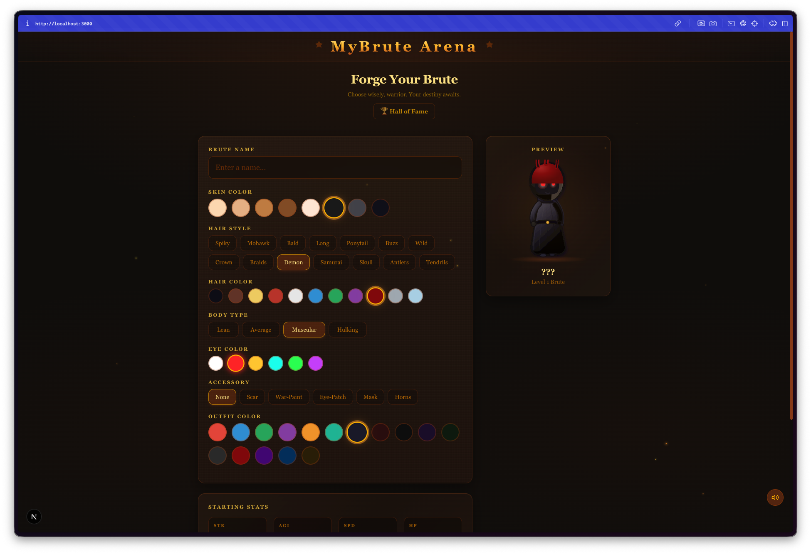

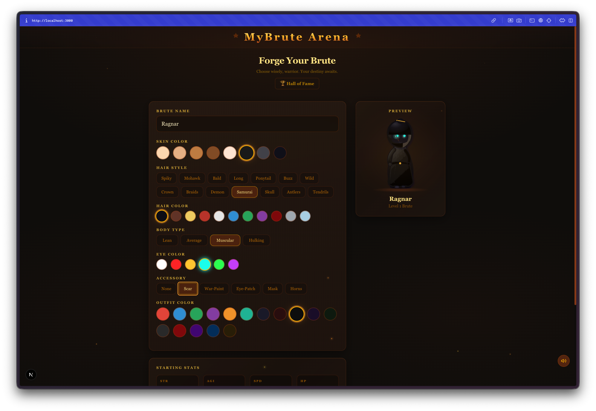

**Der Hub-Bildschirm ist deine Heimatbasis.** Er zeigt die Stats deines Brute, Level, XP-Leiste, ausgerüstete Waffe, gesammelte Haustiere, erlernte Fähigkeiten und alle Aktions-Buttons. Kampf, Training, Inventar, Exportieren, Importieren, Ruhmeshalle. Es gibt auch eine tägliche Herausforderung direkt auf dem Hub mit einem 2x XP-Bonus fürs Annehmen.

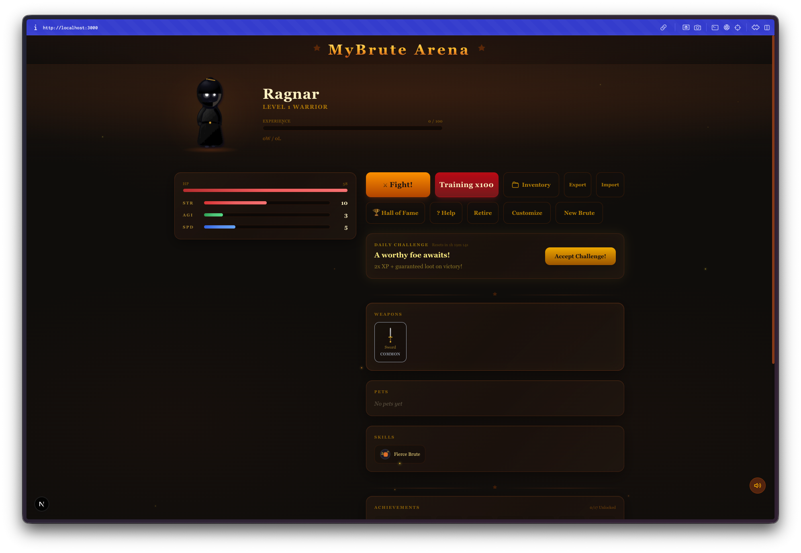

**Die Gegnerwahl gibt dir Optionen.** Du bekommst drei Gegner zur Auswahl, jeder zeigt sein Level, Stats und ausgerüstete Ausrüstung. Das Spiel skaliert Gegner auf dein Level, damit Kämpfe wettbewerbsfähig bleiben.

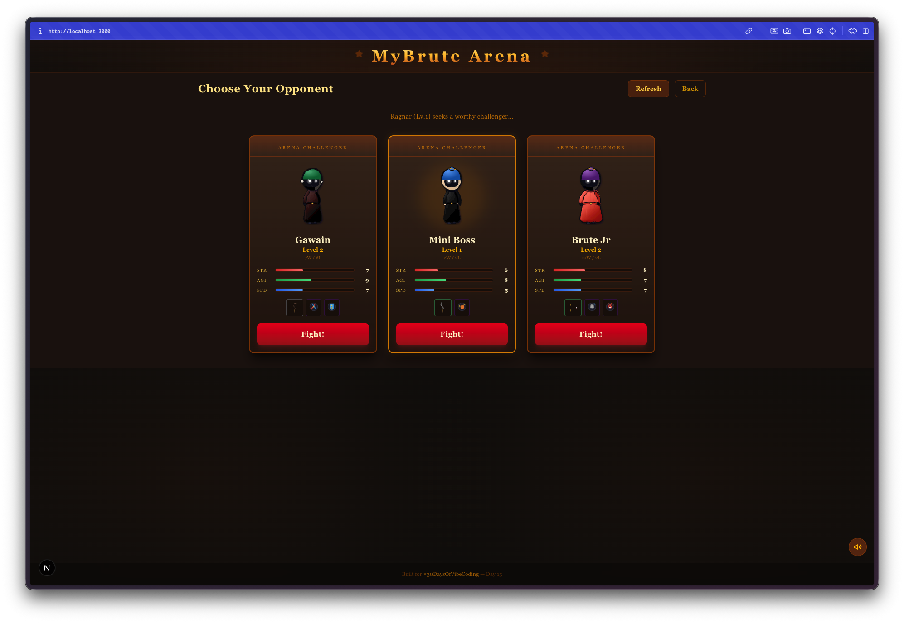

**Der Kampf ist komplett animiert.** Zwei Charaktere stehen sich in einer Arena mit Säulen, Fackeln und roten Bannern gegenüber. Lebensbalken oben, Schadenszahlen schweben hoch, Schnitt-Effekte bei Treffern. Ein Kampfprotokoll unten erzählt jede Aktion. Man drückt einfach "Next" um jeden Zug voranzubringen. Es ist auto-battled, aber man schaut Schritt für Schritt zu.

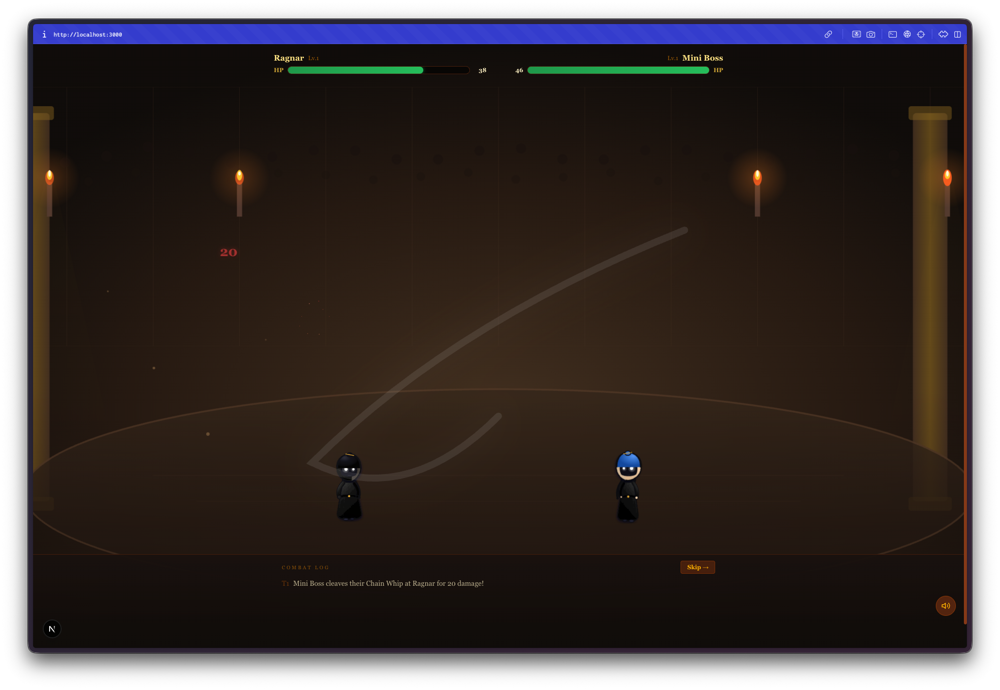

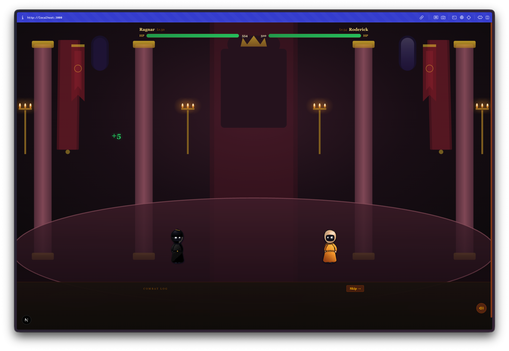

**Sieg gibt dir XP und Loot.** Der Ergebnis-Bildschirm zeigt gewonnenes XP mit einem animierten Fortschrittsbalken. Gewinne genug Kämpfe und du steigst im Level auf, schaltest Stat-Verbesserungen und neue Ausrüstung frei.

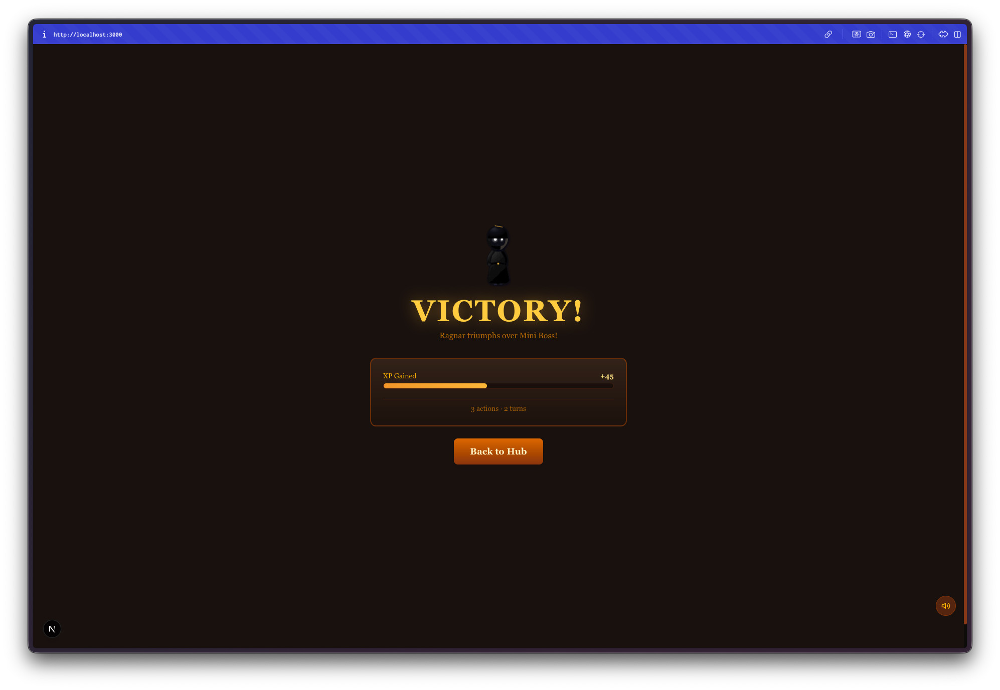

**Das Inventar-System ist überraschend robust.** Drei Tabs für Waffen, Haustiere und Fähigkeiten. Waffen haben Seltenheitsstufen (von gewöhnlich bis legendär, farblich codierte Ränder). Haustiere haben eigene Stats. Fähigkeiten sind passive und aktive Abilities, die man freischaltet während man sie sammelt. Das Ganze fühlt sich an wie ein richtiges RPG-Inventar.

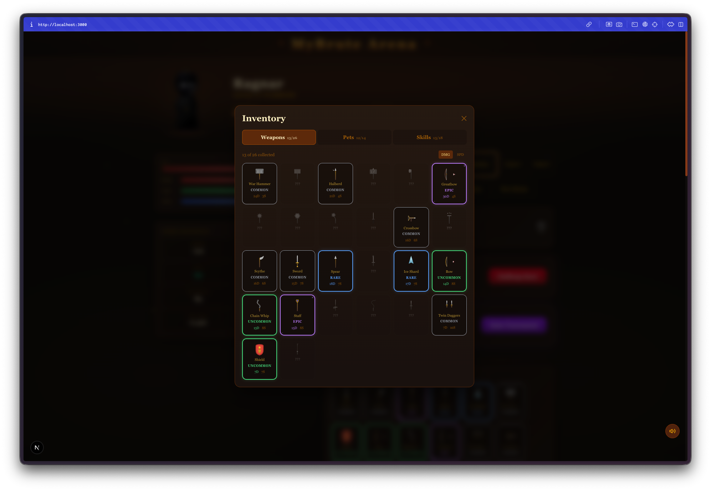

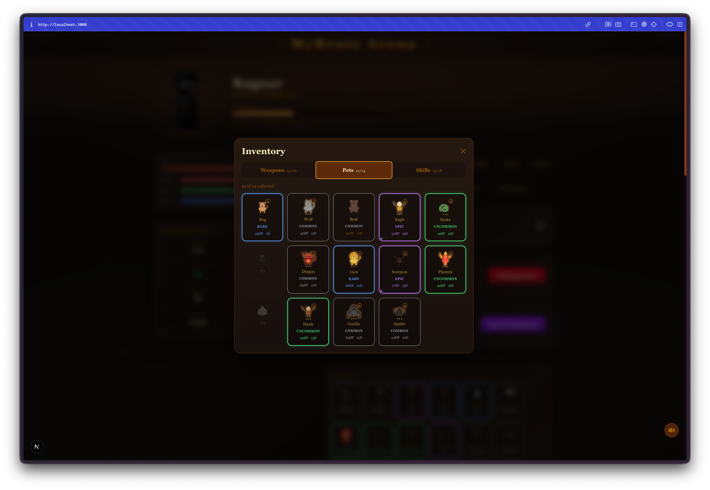

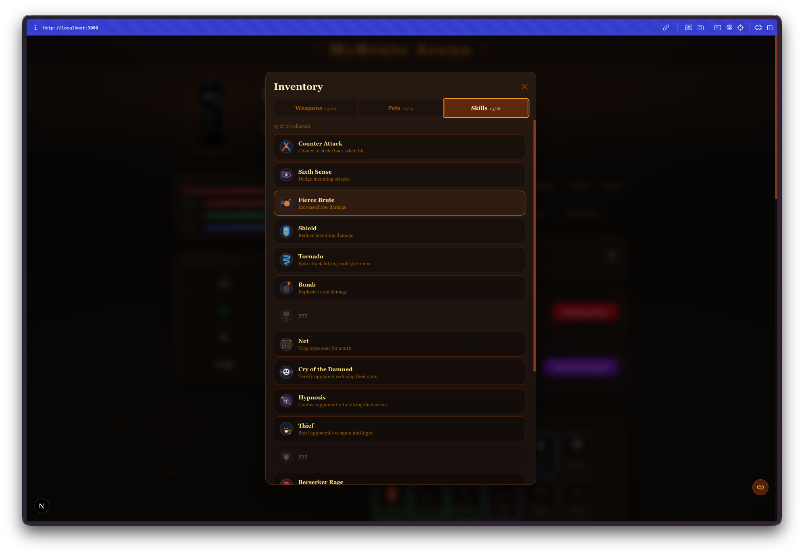

**Der Trainingsmodus lässt dich grinden.** Drück den Training-Button und dein Brute kämpft automatisch 100 Schlachten. Du bekommst einen Zusammenfassungs-Bildschirm mit dem gesamten gewonnenen XP, gewonnenen Leveln, Siegen und jedem Stück Loot das du eingesammelt hast. Eine nette Art, durch das Early Game zu kommen ohne sich durch jeden einzelnen Kampf zu klicken.

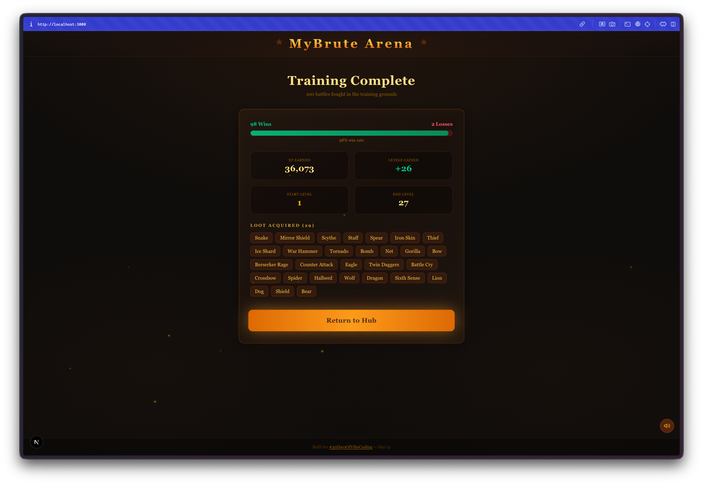

**Turniere laufen als Bracket-Elimination.** Vier Runden, steigende Schwierigkeit. Die Bracket-Oberfläche zeigt deinen Fortschritt durch jede Runde, deinen nächsten Gegner und einen klaren Kampf-Button. Gewinne das ganze Turnier und du bekommst Premium-Belohnungen.

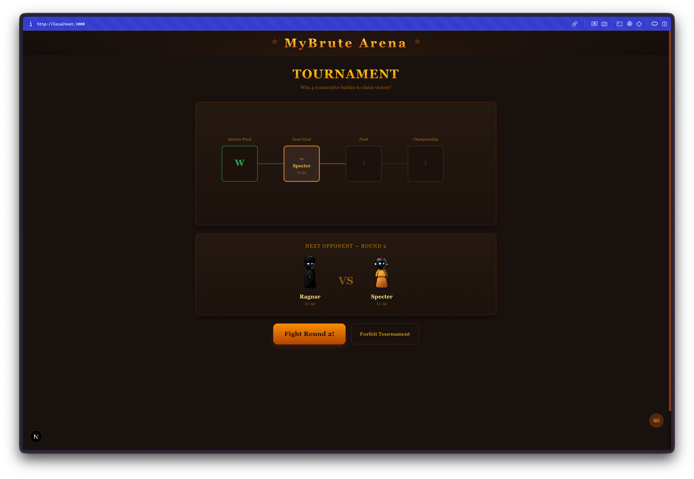

## Die Bug Reports

Die Charakter-Redesign-Iterationen waren der größte Zeitfresser. Die ersten Charakter-Stile sahen isoliert gut aus, waren aber in der Arena im Kampfmaßstab schlecht lesbar. Die finalen verhüllten Figuren funktionieren, aber es brauchte mehrere Runden Hin und Her um dahin zu kommen. Das ist einer dieser Fälle, wo KI-Artdirection schwieriger ist als es klingt. Man kann beschreiben was man will, aber "mach dass es bei 80 Pixeln Höhe in einer dunklen Arena gut aussieht" ist ein schwierigerer Prompt als man denkt.

Die Kampfbalance ist rau, wie man es von einem auto-generierten RPG erwarten würde. Manche Waffenkombinationen sind klar overpowered, manche Haustiere sind deutlich besser als andere. Aber für ein Spiel, bei dem es darum geht, zufälliges Chaos zu beobachten, trägt die Unausgewogenheit fast zum Spaß bei.

## Die Zahlen

- **27 Watchfire-Aufgaben** von der Kampf-Engine bis zum Prestige-System
- **Mehrere Charakter-Redesigns** mit Chibi-, Hollow-Knight- und fließenden-Umhang-Stilen
- **4 Arena-Umgebungen** inklusive eines Thronsaals
- **3 Inventar-Kategorien** mit Loot verschiedener Seltenheitsstufen
- **100 Auto-Kämpfe** pro Trainings-Session
- **20 Replay-Slots** zum Nachschauen vergangener Kämpfe

## Probier Es Aus



**[Betritt die Arena](https://vibe30-day15-mybrute.vercel.app)**

Erstelle einen Brute, such dir einen Kampf und schau wie weit du kommst.

## Fazit Tag 15

27 Aufgaben sind viel, und die Anzahl ineinandergreifender Systeme (Kampf, XP, Loot, Haustiere, Fähigkeiten, Turniere, Tägliches, Rivalen, Prestige, Replays, Erfolge) ist die Art von Sache, die ein kleines Team normalerweise ein paar Wochen brauchen würde um alles zu verdrahten. Dass alles funktioniert und tatsächlich Spaß macht, ist schon ziemlich wild.

Die Reise des Charakterdesigns war der interessanteste Teil. Ich bin durch mindestens vier verschiedene visuelle Stile gegangen, bevor ich einen gefunden habe der funktioniert. Es ist eine gute Erinnerung daran, dass KI-gestütztes Coding Logik und Systeme wirklich gut handhabt, aber Artdirection immer noch ein menschliches Auge und viel Iteration erfordert. Man kann nicht einfach "mach dass es cool aussieht" sagen und weggehen.

Halbzeit. Die Spiele werden immer komplexer, aber der Workflow wird flüssiger. Ich weiß wann ich auf mehr Features pushen soll und wann ich es als fertig bezeichne. Dieses Gespür ist vielleicht das Wertvollste, was ich aus dieser Challenge mitgenommen habe.

---

*Das ist Tag 15 von [30 Tage Vibe Coding](/series/30-days-of-vibe-coding/). Folge mir, während ich 30 Projekte in 30 Tagen mit KI-gestütztem Coding herausbringe.*
