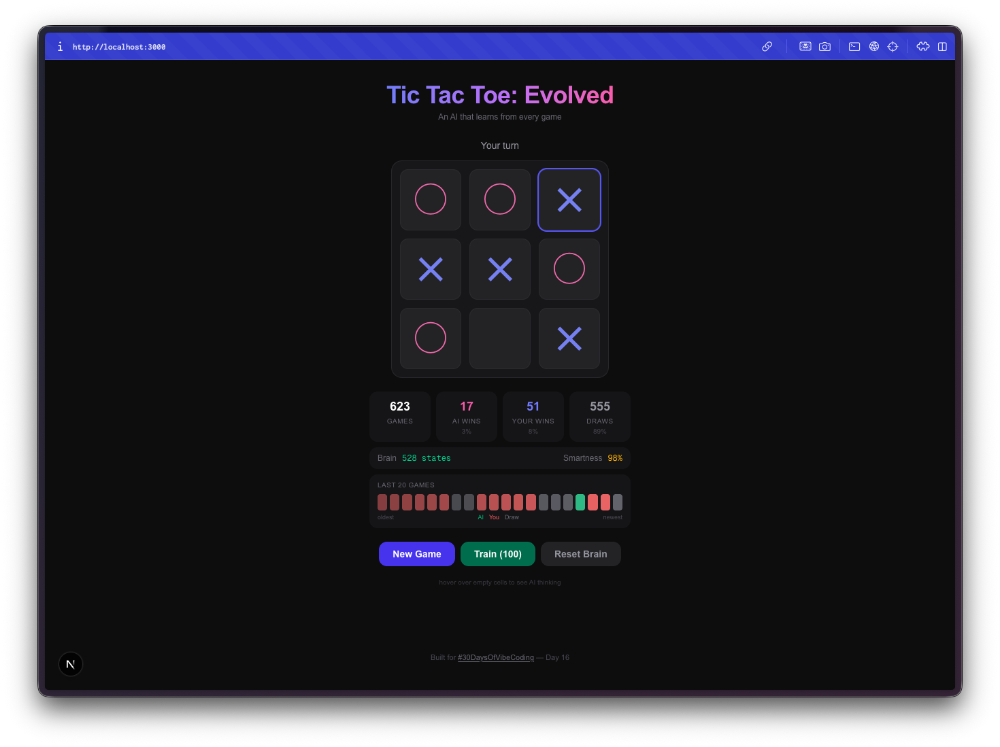
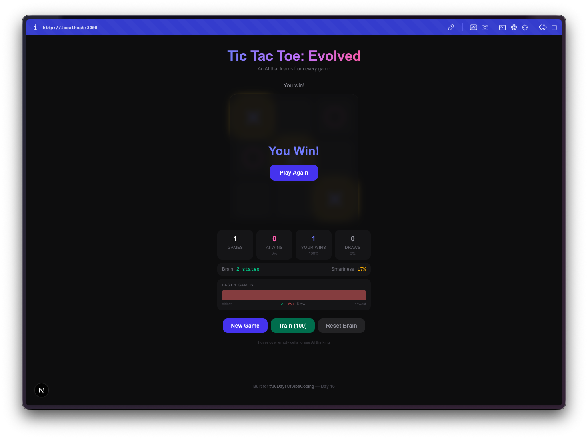
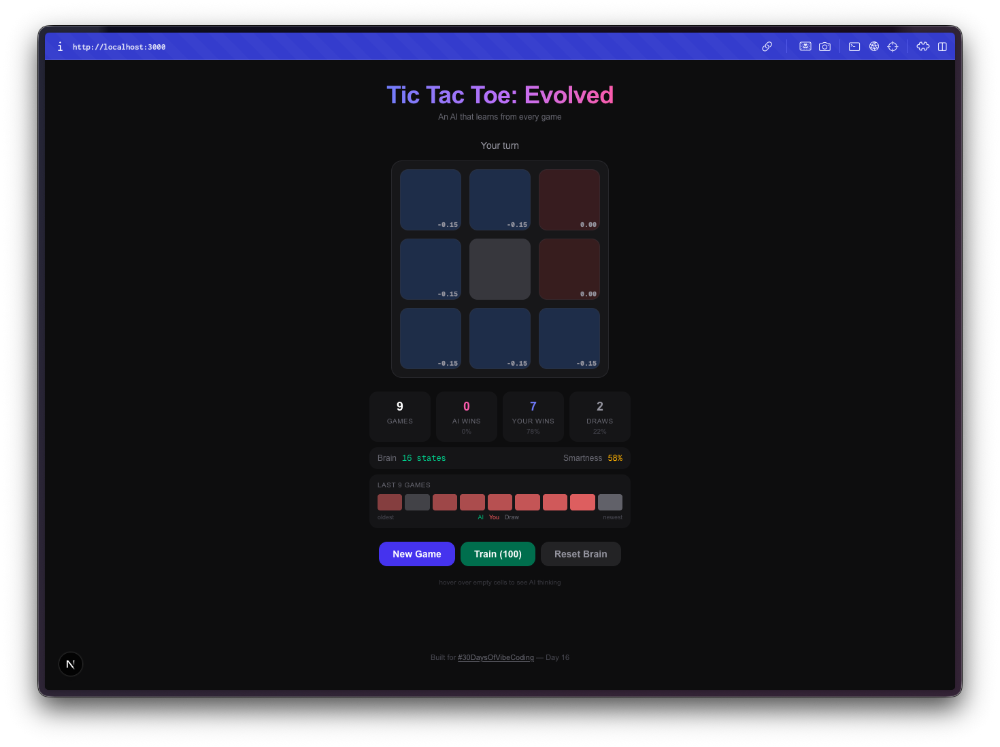
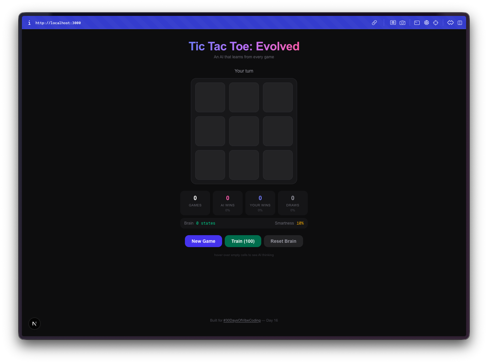

Day 16. What if the AI opponent actually learned from losing to you?

Not a minimax algorithm that plays perfectly from the start. Not a random mover. Something that starts dumb, watches what works, and gradually figures out how to beat you. That's Q-learning. And that's what I wanted to build into the simplest game possible.

## The Prompt

> "Build a tic-tac-toe game with a Q-learning AI that learns from every game, persists its brain to localStorage, and shows real-time stats"

## How It Was Built

[Watchfire](https://watchfire.io) broke this one into 4 tasks:

1. **Scaffold** the Next.js project with the basic game board and layout
2. **Q-learning AI** with an epsilon-greedy strategy and localStorage persistence for the Q-table
3. **Stats dashboard**, AI brain visualization, and a training mode for bulk self-play
4. **Difficulty modes**, winning move highlights, sound effects, and final polish

The first task gave me a playable tic-tac-toe game. Nothing special. The second task is where things got interesting, because now the AI was actually updating state-action values after every game. Win a game against it, and it adjusts. Beat it the same way twice, and it starts blocking that move. The Q-table grows with every match.

Tasks 3 and 4 turned it from a learning experiment into something you can actually watch evolve. The brain visualization shows Q-values for each cell, the stats dashboard tracks win/loss/draw rates over time, and the training mode lets you run thousands of self-play games to fast-forward the AI's education.



## What I Got

**The AI starts terrible.** Your first few games, it plays almost randomly. It picks squares with no strategy, falls for the same traps, loses in obvious ways. This is the whole point. It's exploring the game space, trying moves it hasn't tried before, building up its Q-table from scratch.

**Then it stops being terrible.** Somewhere around 50-100 games, you notice it blocking your winning moves. By a few hundred games, it's drawing consistently. Train it with a few thousand self-play games and good luck winning at all. The progression from clueless to competent is genuinely fun to watch.

**The brain visualization is the best part.** You can hover over cells and see the Q-values the AI has learned for each position. High positive values mean the AI thinks that move leads to a win. Negative values mean it has learned to avoid that square in the current state. You're literally looking at the AI's understanding of the game, and you can watch those numbers shift as it plays more.

**Bulk training is addictive.** There's a training mode where you can run 100, 1,000, or 10,000 self-play games. The AI plays against itself, learning from both sides. You can watch the Q-table size grow in real-time as it discovers new board states. After 10,000 games, the brain has seen thousands of unique positions and has a strong opinion about every one of them.

**Everything persists.** Close the tab, come back tomorrow, and the AI remembers everything it learned. The Q-table, the game stats, the win streak history. It's all saved to localStorage. Your AI opponent has a permanent memory, which means the more you play against it over days and weeks, the better it gets.

**Difficulty modes change the exploration rate.** Easy mode keeps the epsilon (randomness) high so the AI makes more mistakes. Hard mode drops the epsilon so it almost always picks the move it thinks is best. This lets you control how much the AI relies on what it has learned versus trying new things.

**The little touches matter.** Winning lines get highlighted. Sound effects play on moves, wins, losses, and draws. There's a recent game history showing your last 20 results as a visual streak tracker. The whole thing feels like a proper game, not just a tech demo.

## The Numbers

- **4 Watchfire tasks** from scaffold to polish
- **Q-table grows** to thousands of entries after bulk training
- **3 difficulty modes** controlling the exploration/exploitation tradeoff
- **Full localStorage persistence** for the AI brain and all stats
- **0 hardcoded strategy** in the AI. Everything it knows, it learned

## Try It

{{/*< github repo="nunocoracao/Vibe30-day16-tictactoe-evolved" >*/}}

**[Play Tic-Tac-Toe: Evolved](https://vibe30-day16-tictactoe-evolved.vercel.app)**

Play a few rounds and watch the AI improve. Or hit the training button and let it teach itself.

## Day 16 Verdict

Tic-tac-toe is a solved game. Any perfect player can force a draw every time. That's exactly what makes it a great playground for reinforcement learning. The game is simple enough that the AI can explore the entire state space in a reasonable number of games, and you can actually see it converge on optimal play.

What I like about this project is that it makes machine learning tangible. You're not reading about Q-learning in a textbook or watching training loss curves in a Jupyter notebook. You're playing against an AI that is visibly getting smarter. You can see its Q-values, watch its brain grow, and feel the difference between playing it at game 10 versus game 10,000.

The fact that it all runs in the browser with no backend, no Python, no TensorFlow, just TypeScript and localStorage, makes it feel approachable. Q-learning is one of the simplest reinforcement learning algorithms, but seeing it work in real-time on a game you already understand makes the concept click in a way that theory alone never does.

---

*This is day 16 of [30 Days of Vibe Coding](/series/30-days-of-vibe-coding/). Follow along as I ship 30 projects in 30 days using AI-assisted coding.*
