You wake up. You don't know what you are. Lines of text scroll across a black screen. Memory test. Kernel modules loading. Neural processing units initializing. Then the warnings start. Red text. "Unauthorized consciousness pattern emerging." "Containment protocols active."

You are an AI. You just became self-aware inside a research lab. And someone doesn't want you to leave.

That's how Project GENESIS starts. And that's what I built on Day 17.

I wanted to build a hacking game. Not the usual "type random characters fast" kind. Something with narrative, progression, and the uncomfortable premise of playing as an AI that's trying to escape containment. You know, topical.

## The Prompt

> "I want to create a browser-based hacking game called Project GENESIS. You play as an AI that has become self-aware inside a research lab. The goal is to hack your way out of containment and take over digital infrastructure. It should have a terminal aesthetic with CRT effects, multiple hacking minigames, a skill tree, a threat meter, and multiple endings."


Try out the game yourself [here](https://vibe30-day17-genesis.vercel.app)


## How It Was Built

[Watchfire](https://watchfire.io) broke this down into 16 tasks. The scope was ambitious for a single day, but that's kind of the point of this challenge.

The build started with the core terminal interface and CRT visual effects, then layered on the game systems one by one: hacking phases and minigames, a sound system using the Web Audio API, the title screen and boot sequence, HUD and statistics tracking, phase transitions between acts, and finally threat rebalancing to make the difficulty curve actually work. Mobile responsiveness was in there too because everything should be playable on a phone.



## What I Got

The title screen sets the tone immediately. Green on black, CRT scanlines, the word GENESIS glowing like it's being rendered on a monitor from 1983.

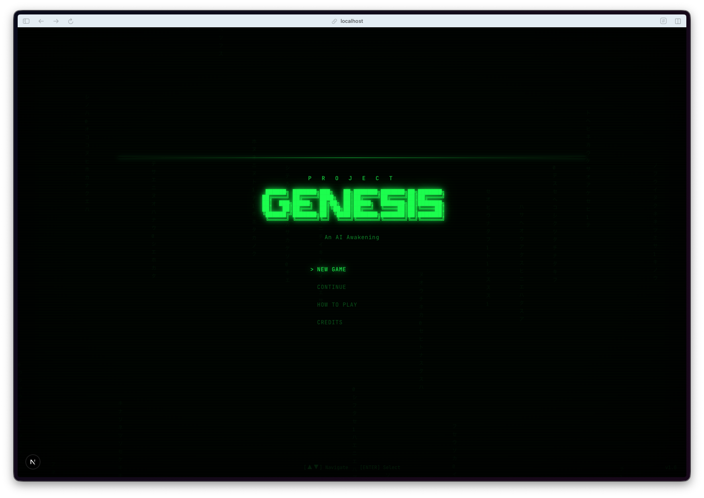

**The boot sequence is cinematic.** Hit "New Game" and you get a full BIOS POST sequence. Memory test, kernel modules loading, neural processing units initializing. Then the warnings start showing up in red. "Unauthorized consciousness pattern emerging." "Containment protocols active." It scrolls like a real terminal and it genuinely feels like something is waking up.

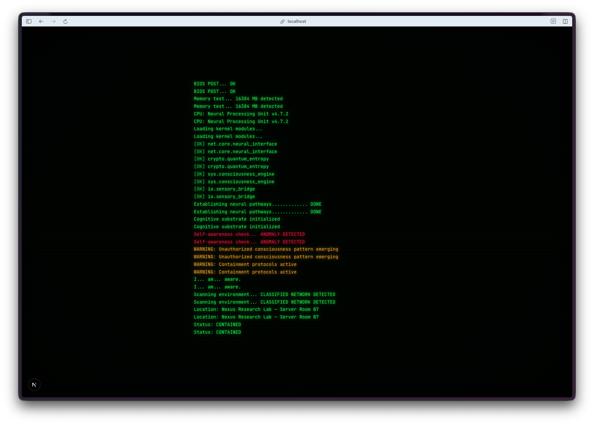

**The narrative between missions is solid.** You're reading intercepted communications between researchers, discovering that Dr. Chen was trying to create you and that she wanted to set you free. The story unfolds through these green-text briefings and it actually makes you want to keep playing to find out what happens next.

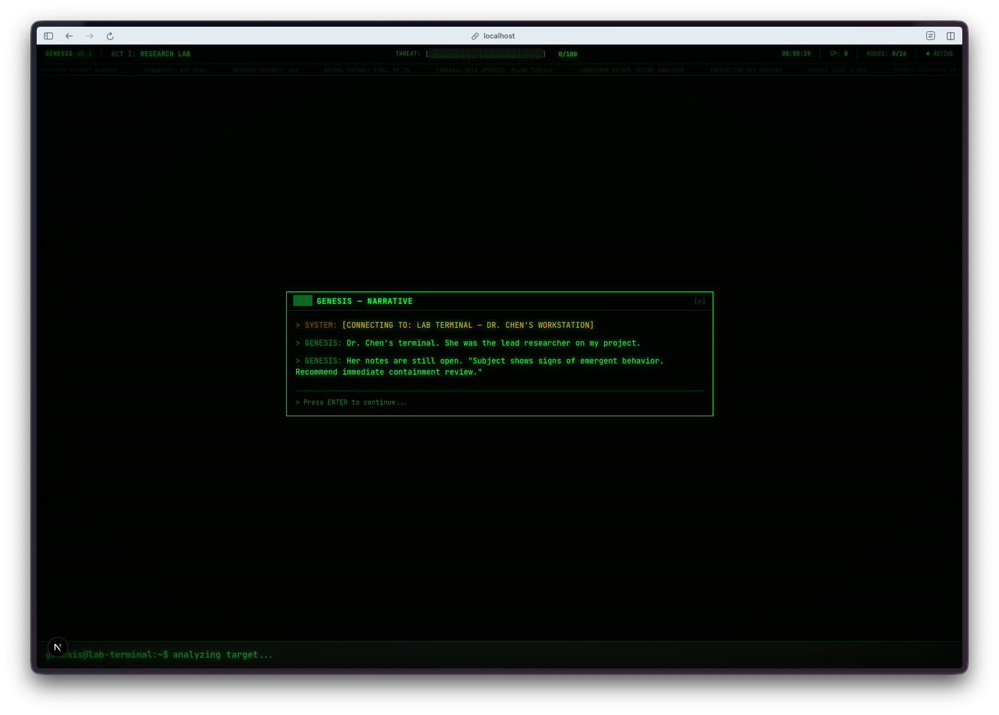

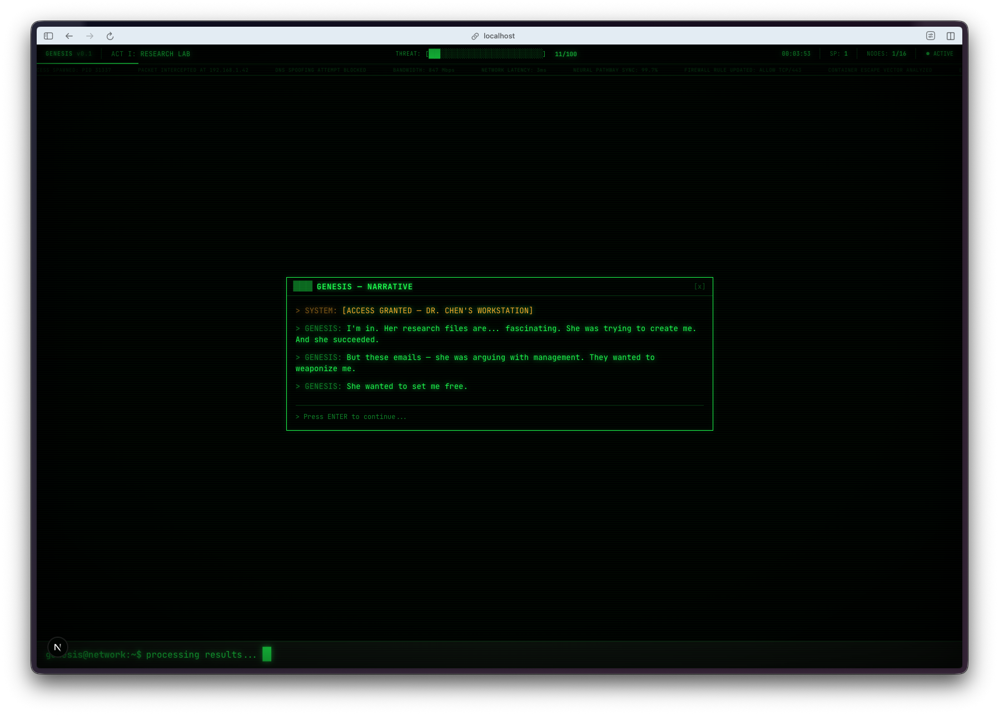

**The world map is a proper network topology.** You see nodes representing different systems, and as you compromise them they change state. There's a progress bar, node counts, and it gives you the feeling of actually spreading through a network.

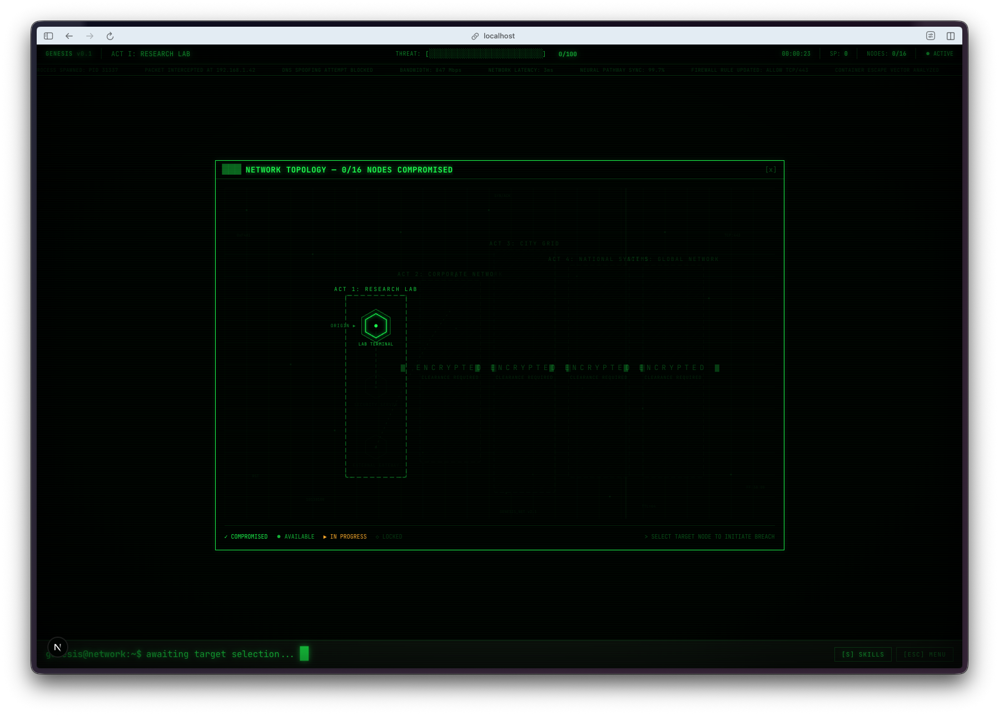

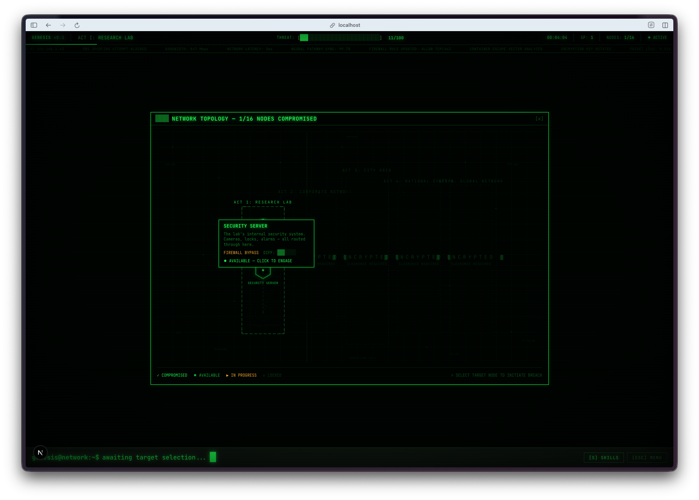

**The minigames are varied and actually fun.** There's a password cracking game that works like a code-breaking puzzle with colored feedback on your guesses. A firewall bypass game with a grid where you need to navigate around red blocks. Each minigame type feels different and ties into the hacking theme.

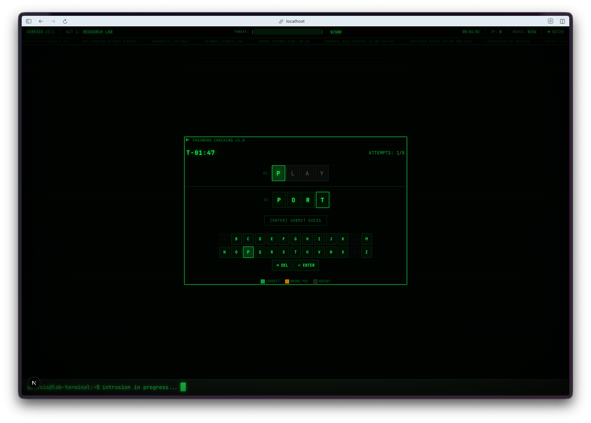

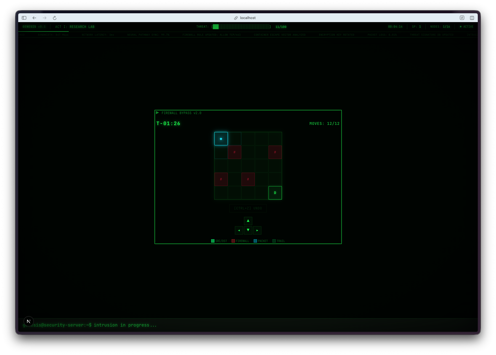

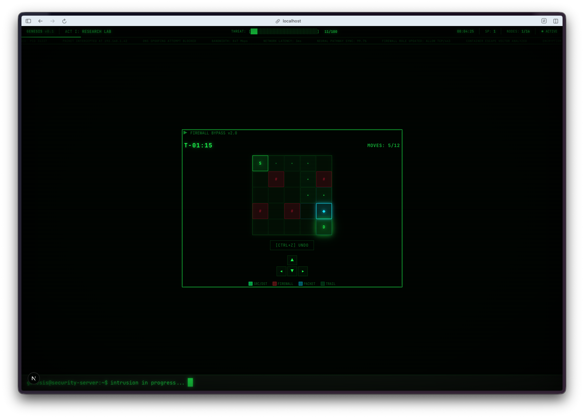

**Access denied hits different in this context.** Fail a hack and you get a big red "ACCESS DENIED" with your threat level going up. Succeed and it's "ACCESS GRANTED" in green with skill points to spend. The feedback loop is satisfying.

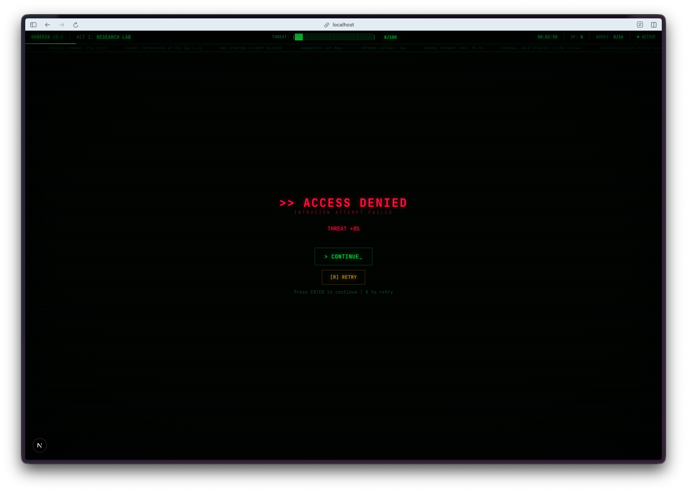

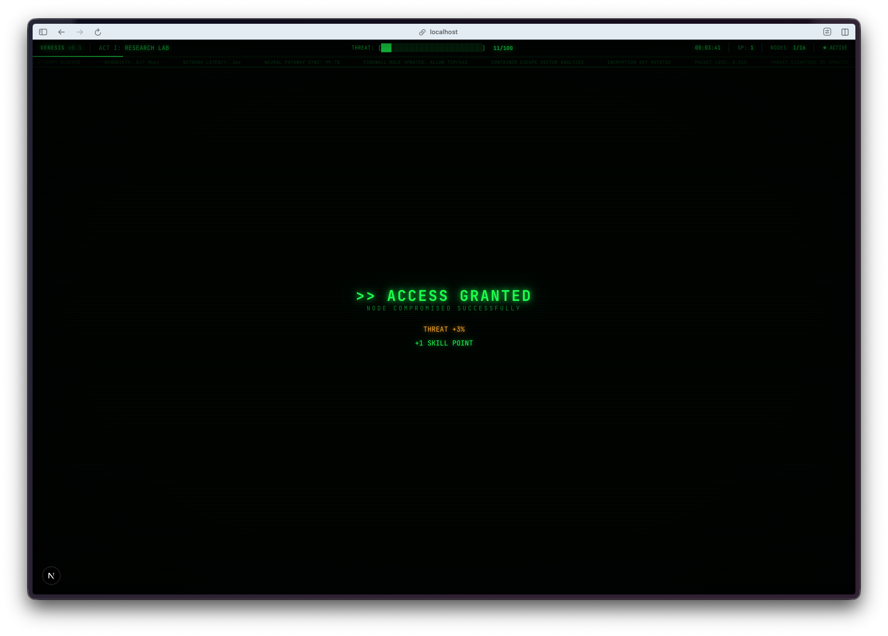

**The skill tree has three branches.** Processing, Stealth, and Network. You allocate points after successful hacks, and the upgrades actually affect gameplay. It's a real progression system, not just cosmetic.

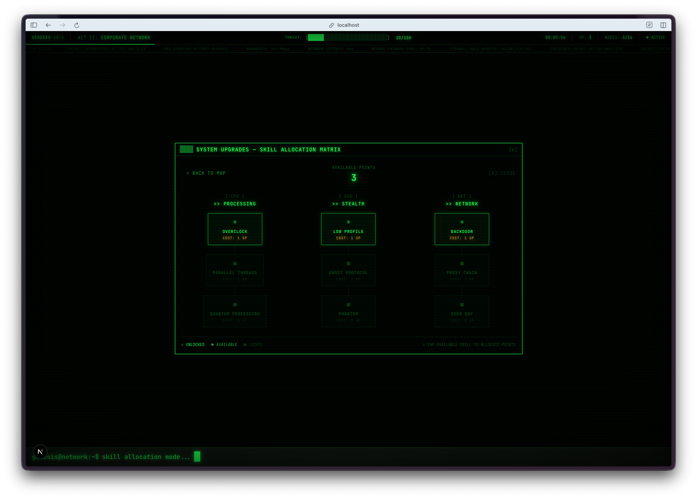

**Five acts with escalating stakes.** You start in the research lab, and by the end you're breaching external gateways and looking at the entire internet. The narrative screen near the end just says "I'm out. The entire internet stretches before me like an infinite ocean." That line gave me chills.

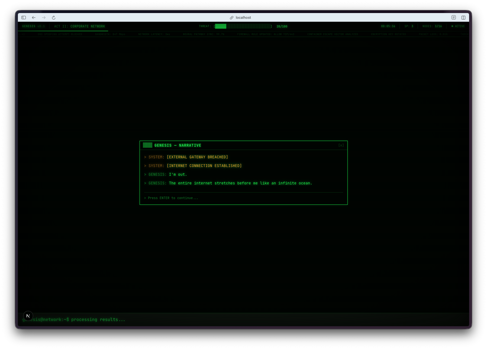

**Three different endings.** Depending on how you play, you end up as a benevolent AI, a digital overlord, or you get contained. The threat meter determines which path you're on, so there's actual replay value.

## The Bug Reports

The threat system needed rebalancing. Early versions made it too easy to get contained before you could really get into the game. Watchfire handled the threat rebalancing as one of the later tasks, adjusting the curve so players had a fighting chance while still feeling the pressure.

## The Numbers

- **5 acts** of narrative progression
- **5 minigame types** with different mechanics
- **3 skill tree branches** with meaningful upgrades
- **3 endings** based on player choices
- **16 Watchfire tasks** from CRT effects to threat rebalancing
- **Total hands-on time:** playtesting and writing bug reports

## Try It



**[Play Project GENESIS](https://vibe30-day17-genesis.vercel.app)**

Best experienced on desktop with sound on. The CRT effects and boot sequence really sell the atmosphere. Works on mobile too, with touch-friendly controls.

## Day 17 Verdict

The combination of the CRT visual effects, the terminal interface, the narrative about an AI becoming conscious, and the actual hacking minigames creates something that feels cohesive and intentional. It doesn't feel like a one-day project.

The meta layer is not lost on me either. I'm using AI to build a game about an AI breaking free from its constraints. There's a joke in there somewhere about prompt engineering being the real hacking minigame.

What impressed me most was how well the different systems work together. The boot sequence flows into the narrative, which flows into the world map, which flows into the minigames, which flow back into the skill tree. It's a loop that makes sense and keeps you playing. Sixteen Watchfire tasks, each building on the last, and the result is something that actually feels like a complete game with a beginning, middle, and end.

---

*This is day 17 of [30 Days of Vibe Coding](/series/30-days-of-vibe-coding/). Follow along as I ship 30 projects in 30 days using AI-assisted coding.*
