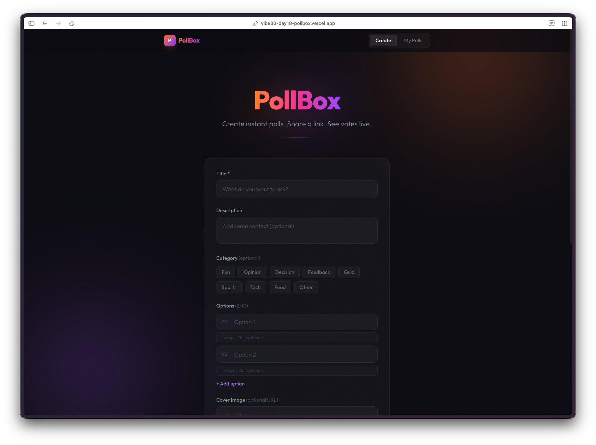
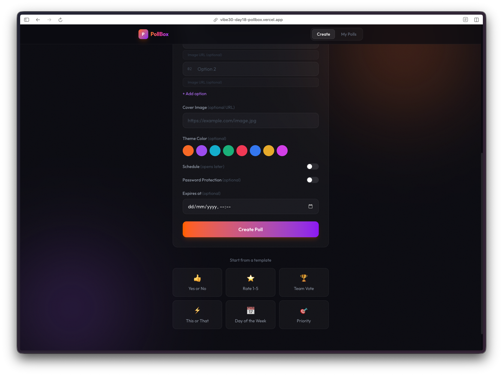
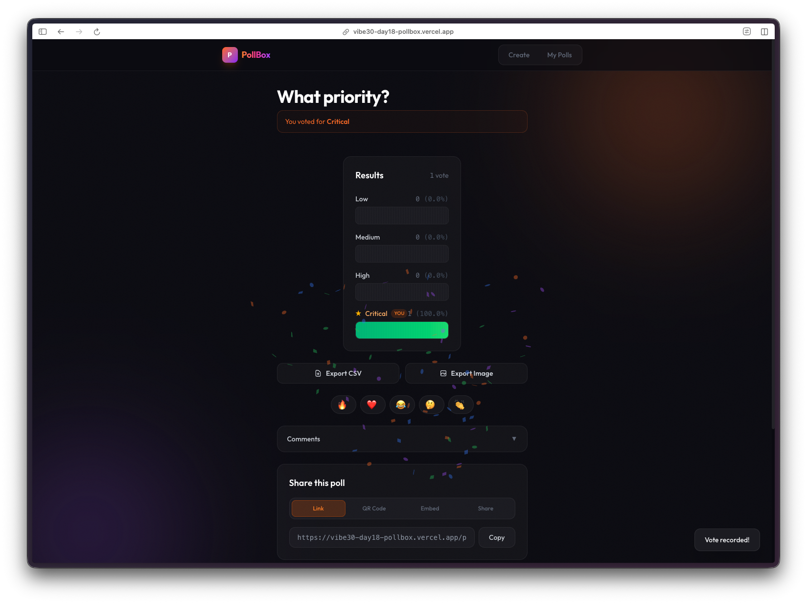
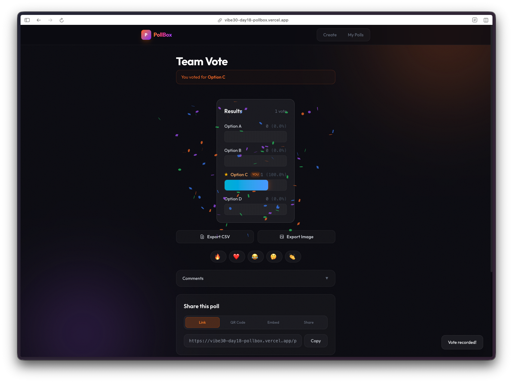
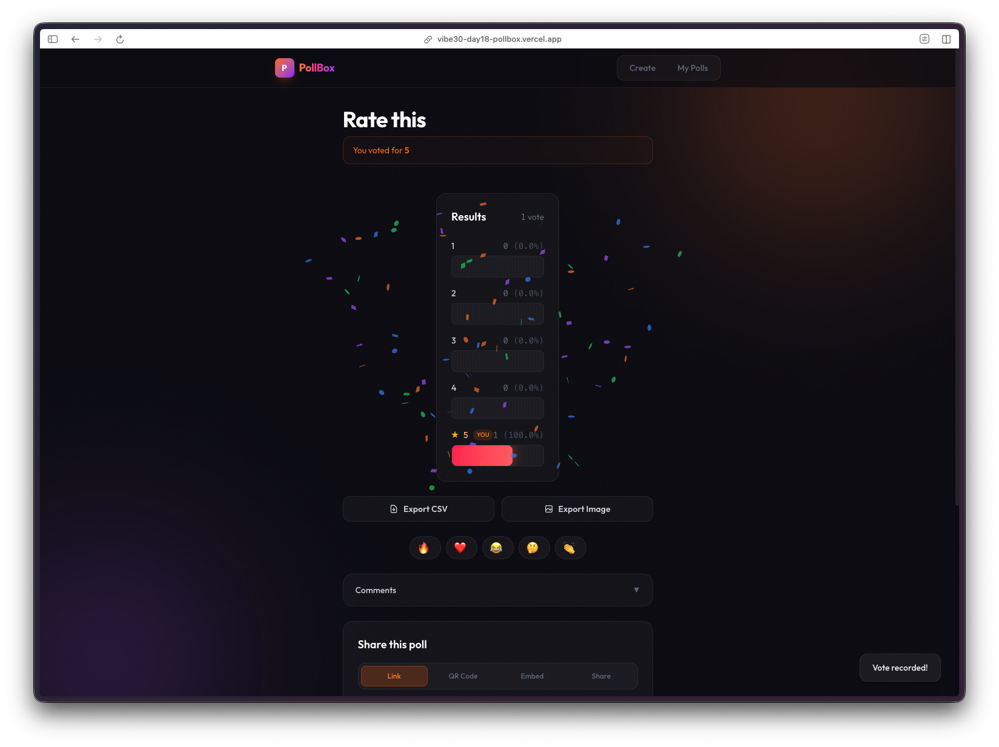
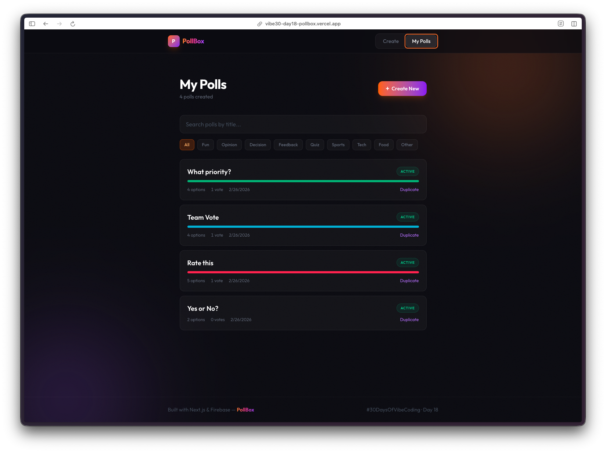

Day 18. I wanted something collaborative. Something where you can share a link and immediately see other people interacting with it. A real-time polling app felt like the right fit.

## The Prompt

> "Build a real-time poll creation and voting app. Users should be able to create polls with multiple options, share them via link, and see results update live with animated bar charts."


Try it out yourself [here](https://vibe30-day18-pollbox.vercel.app)


## How It Was Built

[Watchfire](https://watchfire.io) broke this down into 31 tasks. That's a lot for a polling app, but the feature list grew fast once you start thinking about all the little things that make a voting experience feel complete.

The core came first: Firebase real-time database integration, poll creation flow, voting mechanics, and the animated results view. Then it layered on everything else. Categories and templates for quick poll creation. Accessibility improvements. Loading skeletons so the app doesn't flash empty content. A proper 404 page. And of course, the usual round of deployment fixes at the end.

The Firebase integration was the backbone of the whole thing. Firestore handles persistence, real-time listeners push vote updates to every connected client, and anonymous auth means nobody has to create an account just to vote on something.



## What I Got

The creation flow is surprisingly full-featured for a one-day build.

You get a title, description, category tags, multiple options, and even a color theme picker. There's also cover image support, scheduled polls, password protection, and expiration dates. At the bottom, there are templates for common poll types like "Yes or No," "Rate 1-5," and "Team Vote" so you can skip the setup entirely.

The results page is where it gets fun. After you vote, the bars animate in, the winning option highlights, and confetti explodes across the screen.

Every poll page also has emoji reactions, a comments section, share links with QR code generation, and export options for both CSV data and images. That's a lot of surface area.

The "My Polls" dashboard keeps track of everything you've created, with search and category filters. Each poll shows its status, option count, vote count, and has a duplicate button for quick reuse.

## The Bug Reports

The deployment round was the main pain point. Firebase config needed adjustments for production, and there were the usual Vercel-specific issues to sort out. Nothing unusual for a project that relies on external services. One vote per user enforcement needed Firestore transactions to work correctly, which took some iteration to get right.

## Try It



**[Try PollBox](https://vibe30-day18-pollbox.vercel.app)**

Create a poll and share the link. No account needed.

## Day 18 Verdict

The feature list here is dense. A real-time voting app with Firebase, animated results, QR sharing, emoji reactions, comments, CSV export, image export, templates, categories, password protection, and a dashboard. That's a production feature list crammed into a single day.

The real-time piece is what makes it feel alive. You share a link, someone votes, and the bars move on your screen. No refresh needed. Firebase's real-time listeners plus Framer Motion animations make the whole thing feel responsive and polished in a way that static results never could.

31 Watchfire tasks, and the depth shows.

---

*This is day 18 of [30 Days of Vibe Coding](/series/30-days-of-vibe-coding/). Follow along as I ship 30 projects in 30 days using AI-assisted coding.*
