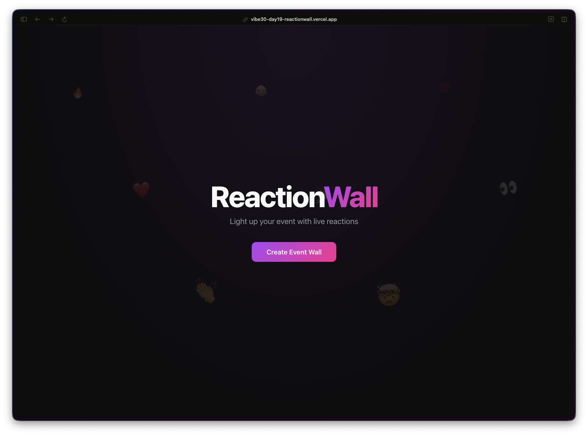
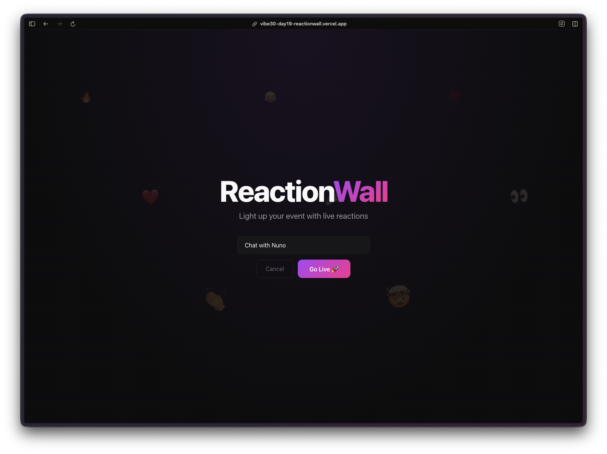
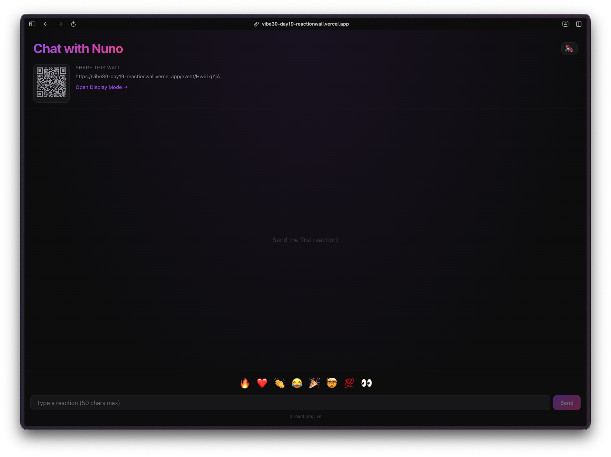
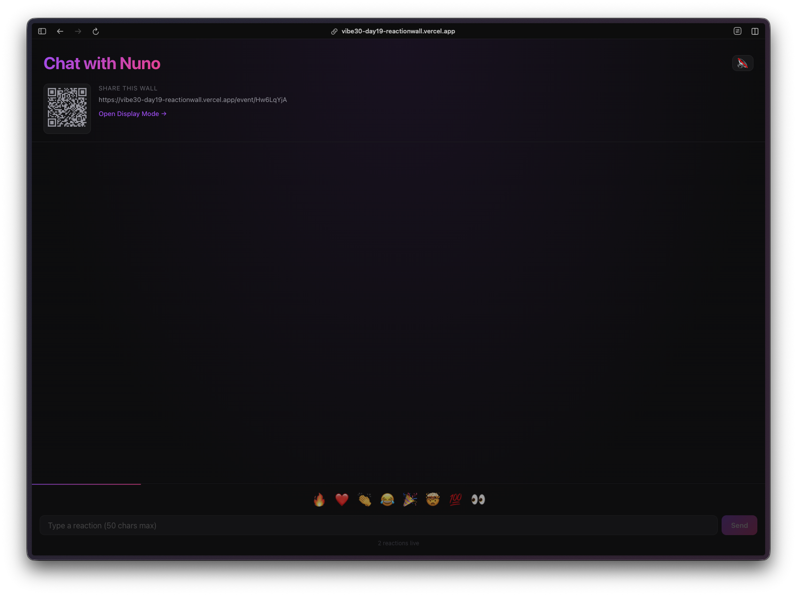
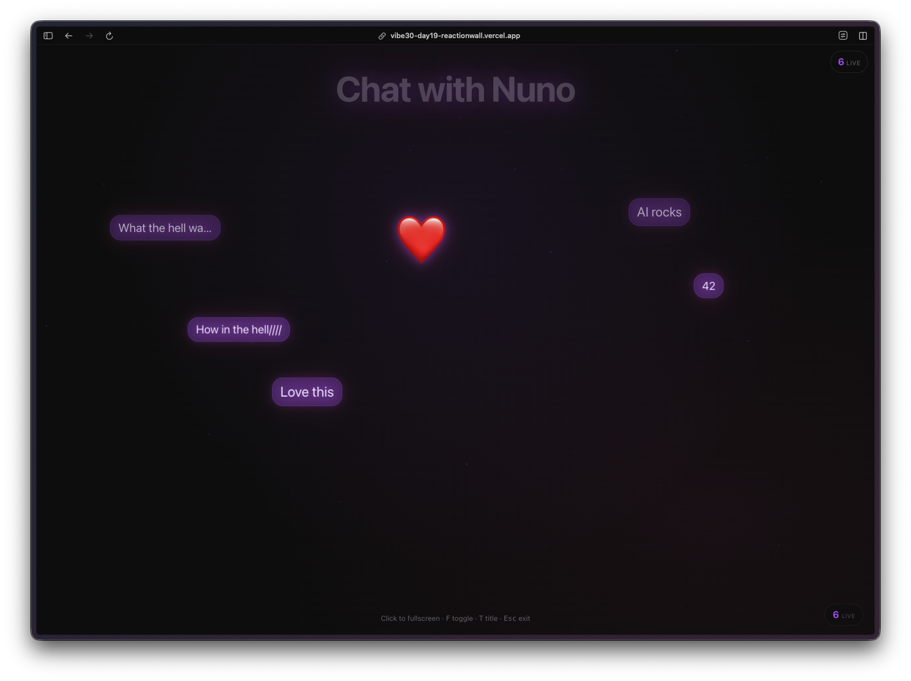

Día 19. Quería algo divertido e interactivo para eventos en vivo. De esos que pones en un proyector en un meetup y la gente manda reacciones desde sus móviles.

## El Prompt

> "Construye un muro de reacciones en vivo para eventos. Crea un evento, comparte un enlace o código QR, y las reacciones vuelan por la pantalla en tiempo real. Barra de emojis abajo, mensajes de texto también. Modo de proyección a pantalla completa. Firebase para sincronización en tiempo real."


Pruébalo tú mismo [aquí](https://vibe30-day19-reaction-wall.vercel.app)


## Cómo Se Construyó

[Watchfire](https://watchfire.io) dividió esto en 9 tareas. Las primeras eran la base: configurar Firebase Realtime Database, el flujo de creación de eventos y autenticación anónima para que nadie necesite registrarse. Después vino la barra de reacciones con emojis, las animaciones de emojis voladores usando Framer Motion, el modo de pantalla completa para proyectores, toggle de sonido y un paso final de pulido.

La parte de tiempo real era el desafío principal aquí. Cada reacción necesita aparecer instantáneamente en todas las pantallas que estén viendo ese evento. Firebase Realtime Database se encarga de eso de forma nativa, pero hay muchos matices para que la experiencia se sienta bien. Las reacciones usan una ventana deslizante de 30 segundos para que las antiguas desaparezcan, y hay limitación de frecuencia a 1 reacción por segundo para que las cosas no se salgan de control.



## Lo Que Obtuve

La página de inicio es limpia y oscura. Un botón para crear un muro de evento.

Le pones nombre a tu evento y le das a "Go Live." Esa es toda la configuración.

Una vez dentro, tienes un código QR y un enlace compartible en la esquina superior izquierda para que los asistentes puedan unirse al instante desde sus móviles. En la parte inferior de la pantalla hay una barra de emojis con 8 opciones más un campo de texto para mensajes personalizados de hasta 50 caracteres.

El modo de visualización es donde se pone divertido. Pantalla completa, fondo oscuro, reacciones volando con efectos de brillo. Los emojis tienen trayectorias aleatorias, tamaños variados y una animación de oscilación. Los mensajes de texto también flotan por la pantalla en burbujas moradas. Cuando la gente empieza a spamear reacciones, hay un efecto de explosión que se activa.

Hay detalles simpáticos que no pedí explícitamente. Feedback háptico en el móvil cuando mandas una reacción. Sonidos pop vía Web Audio API con toggle para desactivarlos. Un indicador de cooldown para que sepas cuándo puedes mandar otra reacción después del límite de frecuencia.

## La Tecnología

- React 19 con TypeScript y Vite
- Firebase Anonymous Auth más Realtime Database
- Framer Motion para todas las animaciones voladoras
- QRCode.react para los códigos QR compartibles

Framer Motion hace el trabajo pesado en el lado visual. Cada reacción tiene su propia animación con parámetros aleatorios para trayectoria, rotación y escala. El resultado es que ninguna reacción se ve igual cuando vuela por la pantalla.

## Pruébalo



**[Prueba ReactionWall](https://vibe30-day19-reaction-wall.vercel.app)**

Crea un evento, abre el enlace en tu móvil y empieza a mandarte reacciones a ti mismo. Es más satisfactorio de lo que debería.

## Veredicto del Día 19

Este es uno de esos proyectos donde el aspecto de tiempo real lo hace sentir vivo. Las apps estáticas están bien, pero hay algo en ver reacciones aparecer en el instante en que alguien toca su móvil que lo hace sentir como un producto real. Firebase se encargó de la capa de sincronización, Framer Motion se encargó de la capa de animación, y todo se juntó de una forma que realmente funciona para un evento en vivo.

El compartir por código QR, el modo de pantalla completa, el hecho de que nadie necesita instalar nada ni crear una cuenta. Para un meetup o una charla en una conferencia, esto cumple. No es production-grade, pero es suficiente para ponerlo en un proyector y animar al público.

---

*Este es el día 19 de [30 Días de Vibe Coding](/series/30-days-of-vibe-coding/). Sígueme mientras lanzo 30 proyectos en 30 días usando programación asistida por IA.*
