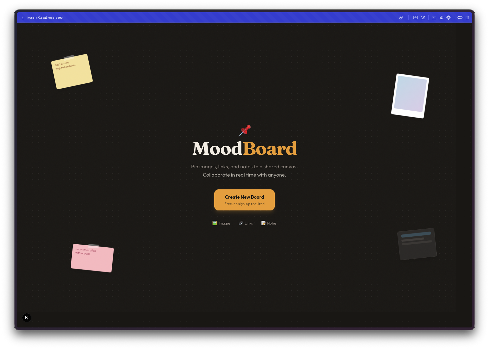
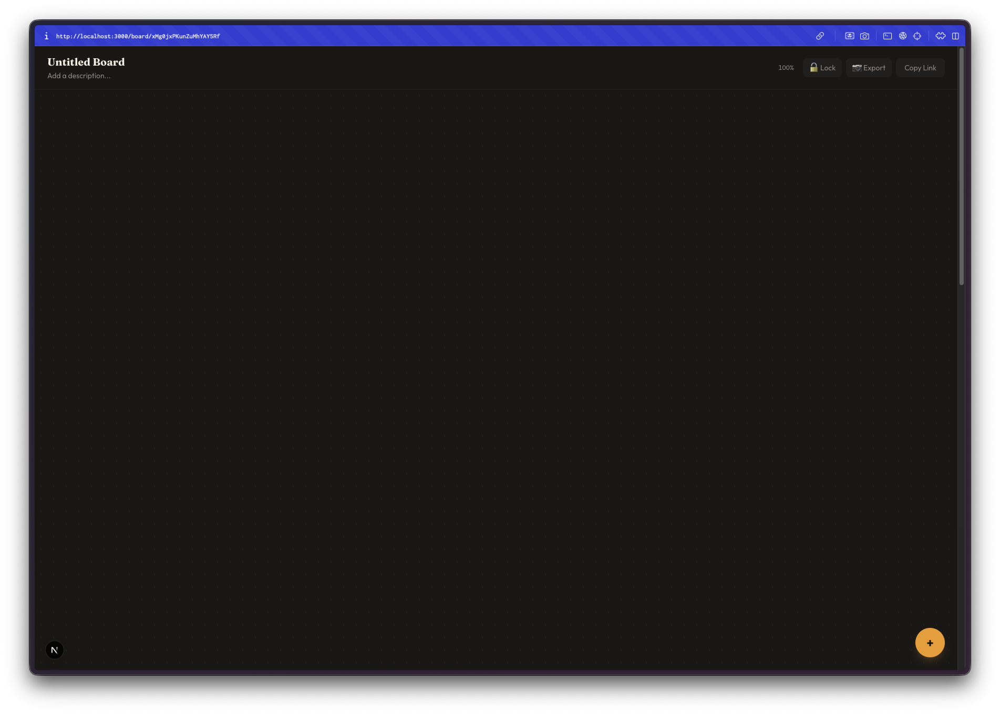
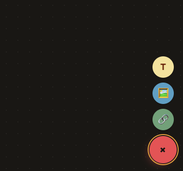
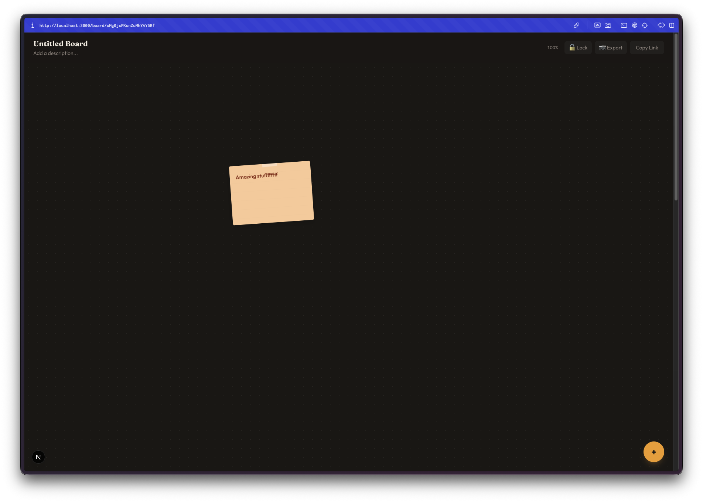
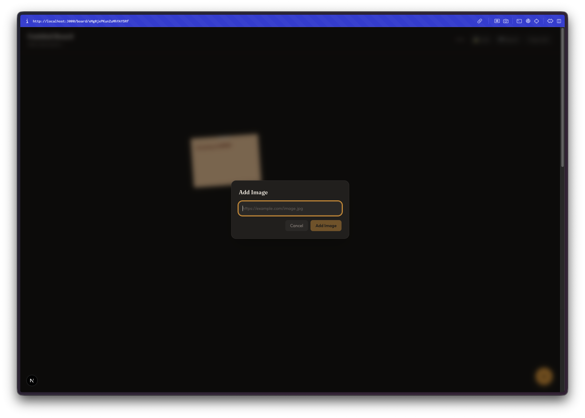
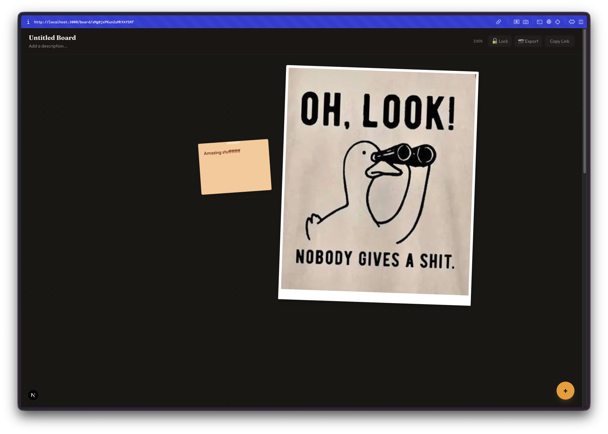
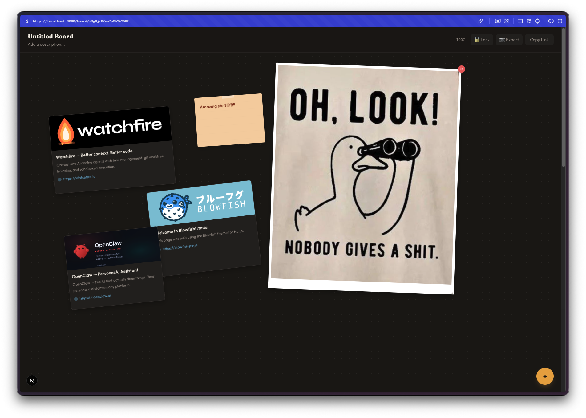

Day 20. I wanted a shared canvas where a group of people can throw images, links, and notes at a wall and just see what sticks. Literally.

## The Prompt

> "Build a collaborative mood board app. Anyone with the link can pin images, text notes, and links to a shared canvas. Real-time sync, anonymous auth, freeform layout."

That was the seed. [Watchfire](https://watchfire.io) broke it down into 7 tasks that took it from a basic Firebase backbone to a full collaborative pinboard.

## How It Was Built

Seven tasks, each one layering on a new piece:

1. Firebase real-time sync as the foundation
2. Three pin types: text sticky notes, image uploads, and link cards with OG previews
3. Drag-to-arrange pins on a freeform canvas
4. Pin color tagging so you can visually group things
5. Zoom and pan plus pin resizing for canvas control
6. Board lock so the creator can freeze a board to read-only, and export to PNG
7. Cursor presence so you can see where other people are hovering, plus a visual redesign pass

The progression made sense. You can't drag pins until they exist, and you can't worry about visual polish until the core interactions work.

## What I Got

This one clicked right away.

**The landing page sets the tone.** Big logo, scattered sample pins in the background, one button to create a board. No signup, no account, no friction. You click "Create New Board" and you're in.

**A fresh board is a blank canvas.** Dark background with a subtle dot grid. The toolbar is minimal, just options for lock, export, and copying the share URL in the top right. The floating action button in the bottom right opens up the pin type selector.

**Three pin types cover the basics.** Text for sticky notes, image for uploads, and link for URL cards. Hit the plus button, pick your type, and drop it on the canvas. Simple enough that anyone with the link can figure it out without instructions.

**Sticky notes look like actual sticky notes.** They have that slightly tilted, paper-like feel. You can type whatever you want, pick a color, and drag them wherever. The peach color on a dark canvas looks surprisingly good.

**Image upload is straightforward.** A modal pops up, you pick a file, and it uploads to Firebase Storage. The image appears as a pin on the canvas that you can drag and resize like everything else.

**Mix everything together and it starts to feel like an actual mood board.** Images, sticky notes, different sizes. You can drag things around to find arrangements that work. The freeform canvas means nothing is locked to a grid, so you get that organic collage feel.

**Link cards pull in OG metadata.** Paste a URL and it fetches the title, description, and preview image. The Watchfire card, the Blowfish card, the OpenClaw card all rendered nicely with their branding intact. These look way better than just pasting a raw URL.

## The Bug Reports

Real-time collaboration always has edge cases:

- Cursor presence occasionally flickered when multiple users were moving quickly
- Very large image uploads could make the canvas laggy until the image finished loading
- The PNG export sometimes missed pins that were far from the viewport center

Nothing that broke the experience, but the kind of polish issues you'd want to clean up before shipping this for real use.

## The Numbers

- **7 Watchfire tasks** from Firebase setup to visual redesign
- **Firebase stack:** Anonymous Auth, Firestore for real-time sync, Storage for image uploads
- **Next.js 15 + Tailwind CSS 4** on the frontend
- **html2canvas** for the PNG export feature
- **Three pin types:** text, image, link (with OG preview)
- **Collaboration features:** real-time sync, cursor presence, board lock

## Try It

{{/*< github repo="nunocoracao/Vibe30-day20-moodboard" >*/}}

**[Open MoodBoard](https://vibe30-day20-moodboard.vercel.app)**

Create a board and share the link. Anyone can pin to it.

## Day 20 Verdict

Two thirds of the challenge done. Day 10 was a Miro clone with no collaboration. Day 20 is a mood board with full real-time sync. That feels like progress.

The Firebase integration is what makes this one work. Anonymous auth means zero friction to join a board. Firestore real-time listeners mean pins appear instantly for everyone. Cursor presence means you can see that someone else is actually there with you. These are the features that turn a solo canvas into a shared space.

What surprised me most was the link cards. Pasting a URL and getting a nicely formatted card with the site's branding, description, and preview image made the boards feel immediately richer. That one feature turned it from "a place to put sticky notes" into something you'd actually use to collect and share references for a project.

Seven tasks was a tight scope for a real-time collaborative app. But each task built on the last one cleanly, and the final product feels cohesive. Not bad for day 20.

---

*This is day 20 of [30 Days of Vibe Coding](/series/30-days-of-vibe-coding/). Follow along as I ship 30 projects in 30 days using AI-assisted coding.*
