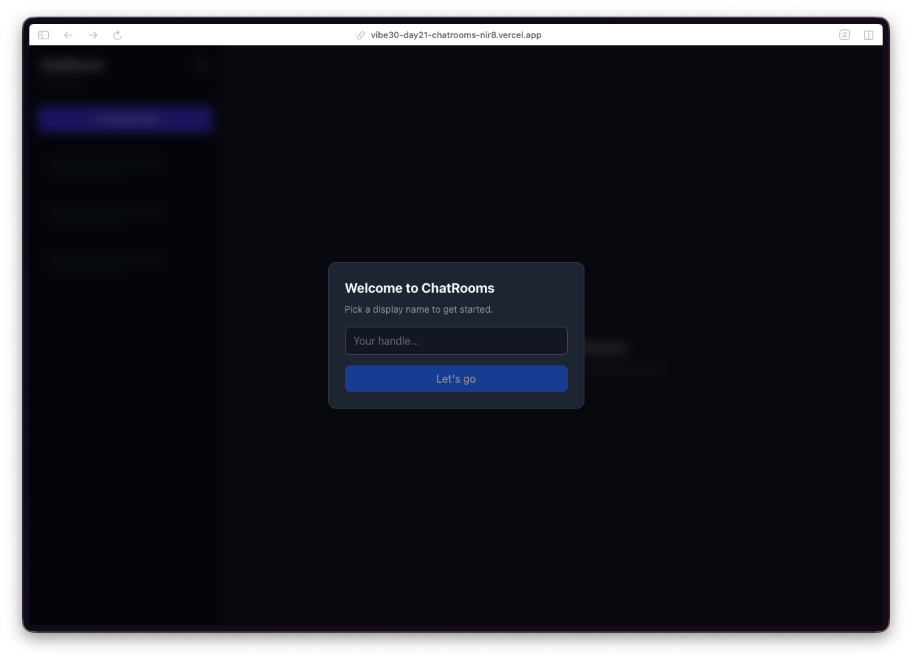
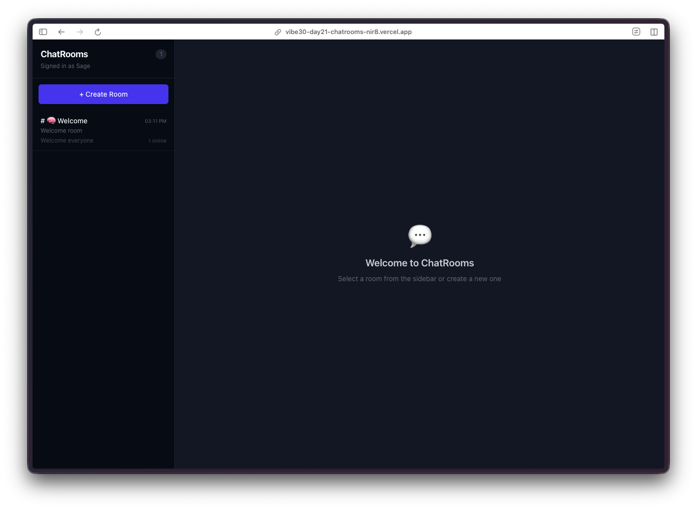
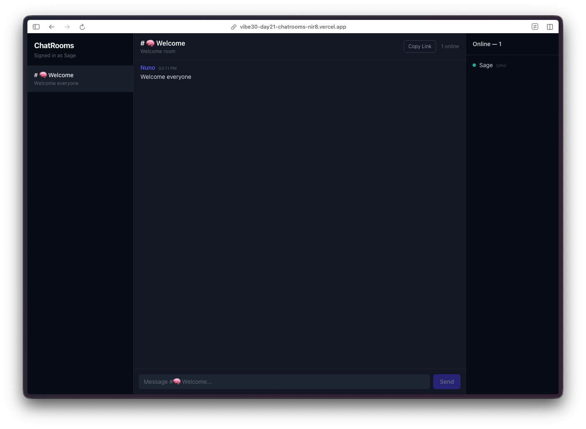
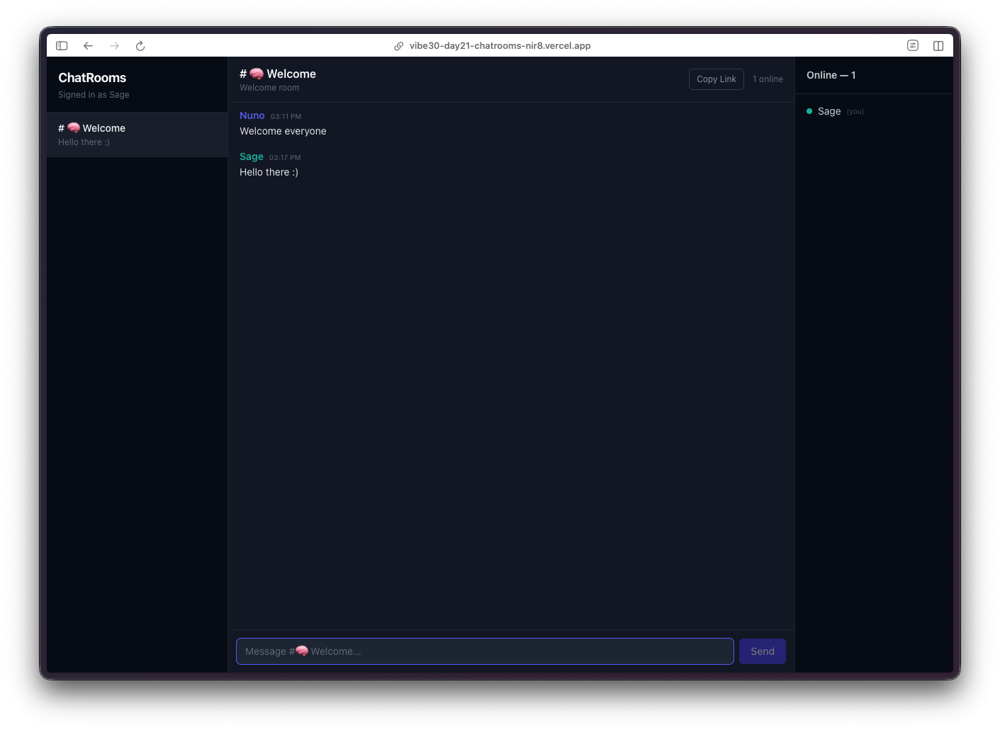

Day 21. I wanted to build something that feels alive. Something where you can see other people doing things in real time. So today it's anonymous chat rooms.

## The Prompt

> "Build a real-time chat rooms app. Anonymous auth with custom handles, room creation, live messaging, reactions, file sharing, typing indicators, and online presence."

## How It Was Built

This one went through 7 [Watchfire](https://watchfire.io) tasks, and the order made a lot of sense for a real-time app like this:

1. **Firebase Realtime Database.** The foundation. Setting up anonymous auth, database rules, and the data model for rooms, messages, and users. This is the plumbing that everything else depends on.
2. **Room creation.** The ability to create new rooms and browse existing ones. A sidebar with room names, participant counts, and last message previews.
3. **Real-time messaging.** The core feature. Messages appear instantly for everyone in the room. Firebase listeners handle the sync so there is no polling, no refresh button. You type, you send, everyone sees it.
4. **Reactions.** Tap a message to react to it. Small feature, but it makes the chat feel more interactive than just walls of text.
5. **File sharing.** Upload and share files within a chat room. Another layer of utility beyond plain text messaging.
6. **Presence and typing indicators.** See who is online, see who is typing. These are the details that make a chat app feel like a real chat app instead of a message board.
7. **Mobile polish.** Responsive layout tweaks, touch targets, making sure the whole experience works well on a phone screen.

## What I Got

**Dead simple onboarding.** You land on the app, pick a handle, and you are in. No email, no password, no OAuth flow. Firebase Anonymous Auth handles the identity behind the scenes. You just type a name and hit "Let's go."

**A clean room browser.** The left sidebar shows all available rooms with participant counts. There is a "Create Room" button at the top, and a search bar to filter rooms. The default state shows a welcome message prompting you to select a room or create a new one.

**Real-time messaging that just works.** Messages appear instantly. Each message shows the sender's handle with a colored avatar, a timestamp, and the message content. The bottom of the screen shows who is currently in the room and a message input with a send button. The online count sits in the top right corner.

**Typing indicators and presence.** You can see who is online and who is actively typing. These small touches are what separate a chat app from a comment section. The whole thing feels responsive and alive.

**The dark theme looks great.** The dark navy background with purple accents gives it a modern chat app feel. It does not look like a homework project. The typography is clean, the spacing is right, and the color coding for different users makes conversations easy to follow.

## The Bug Reports

Firebase real-time apps tend to have a category of bugs that only show up with multiple users or on reconnection. For this project, the Watchfire tasks handled the progression cleanly enough that I did not hit any showstoppers. The presence system and typing indicators worked on first deploy, which honestly surprised me. Those features usually need a few rounds of debugging around edge cases like tab switching and network drops.

## The Numbers

- **7 Watchfire tasks** from database setup to mobile polish
- **Firebase Realtime Database** for zero-latency message sync
- **Anonymous auth** for frictionless onboarding
- **Reactions, file sharing, typing indicators, presence** all layered on incrementally

## Try It

{{/*< github repo="nunocoracao/Vibe30-day21-chatrooms" >*/}}

**[Open ChatRooms](https://vibe30-day21-chatrooms.vercel.app)**

Pick a handle and start chatting. Create a room or join an existing one.

## Day 21 Verdict

Real-time is hard. Or at least, it used to be. Setting up WebSocket connections, managing connection state, handling reconnections, syncing data across clients, dealing with race conditions. That is a lot of infrastructure work before you even get to the actual chat features.

Firebase abstracts most of that away, and the AI knew exactly how to use it. The progression from "database exists" to "people are chatting with reactions and typing indicators" happened across 7 tasks without me having to think about connection management at all.

What I find interesting about this project is that anonymous auth was the right call. For a casual chat app, forcing people to create accounts is a conversion killer. Pick a name and go. Firebase handles the identity, the user never has to think about it. That is a product decision that the AI made correctly without me specifying it.

Twenty-one days in. We are in the home stretch and the projects keep getting more interactive.

---

*This is day 21 of [30 Days of Vibe Coding](/series/30-days-of-vibe-coding/). Follow along as I ship 30 projects in 30 days using AI-assisted coding.*
