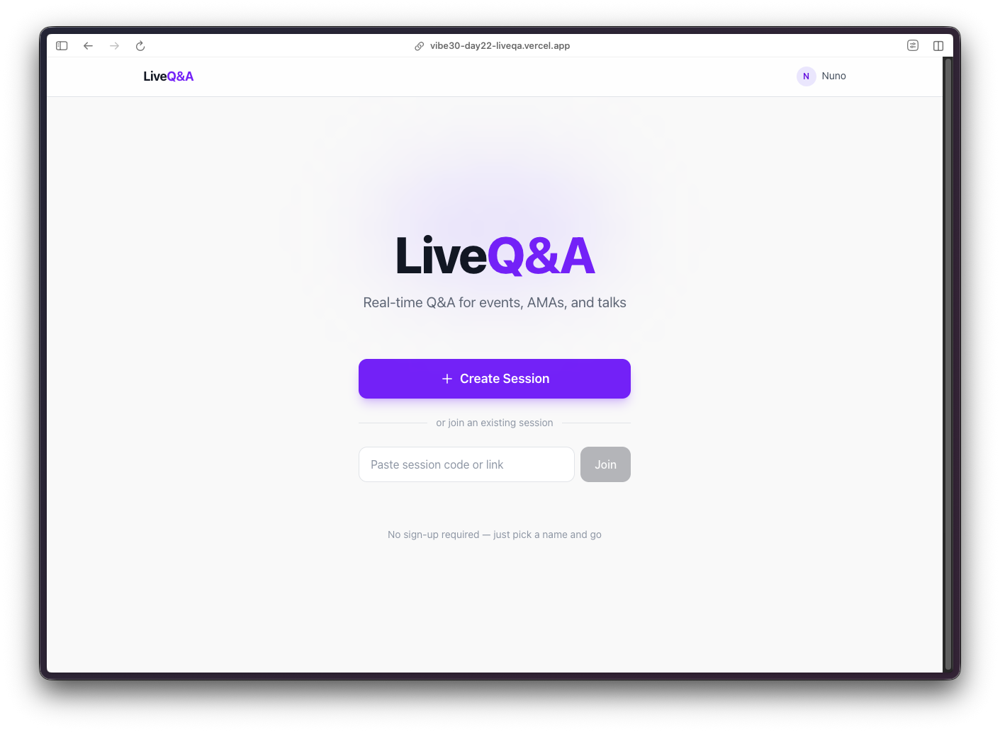
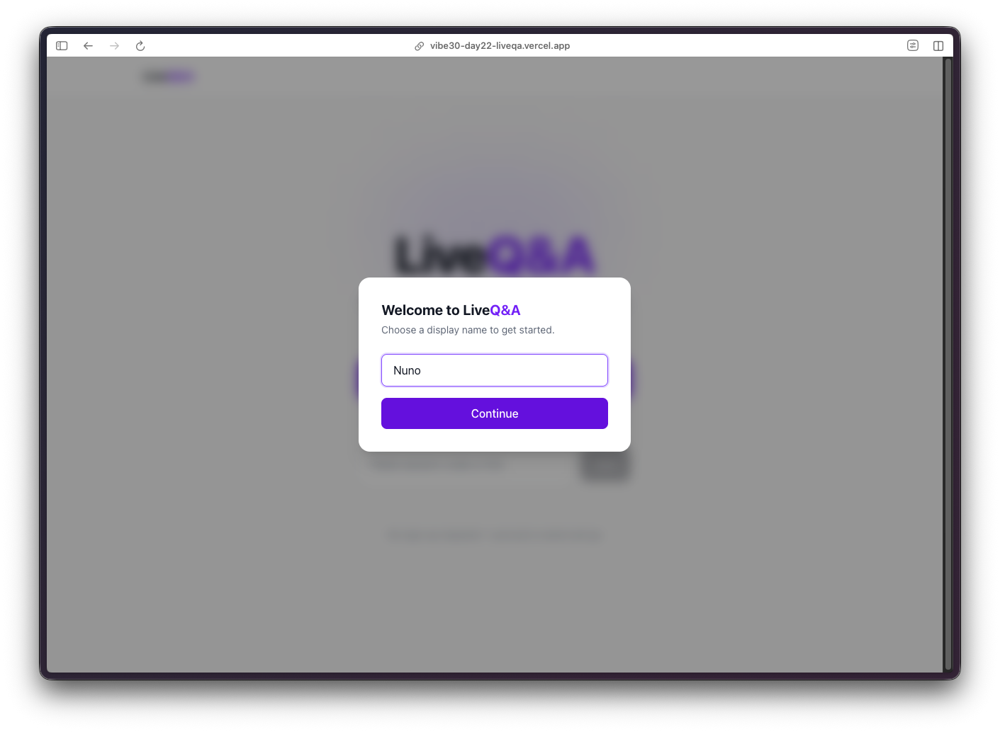
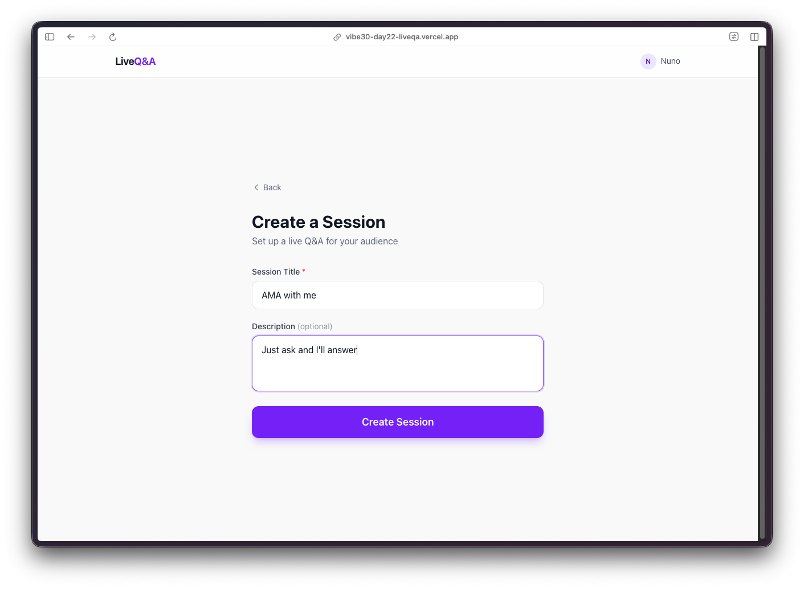
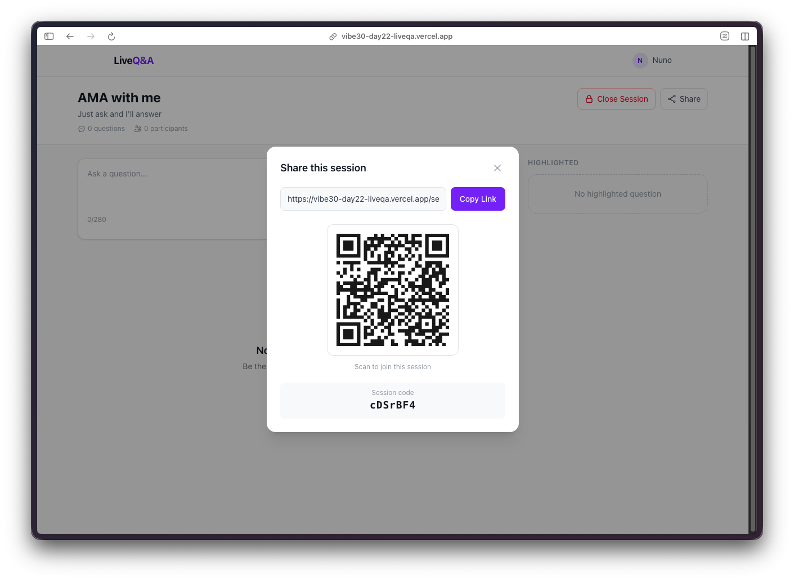
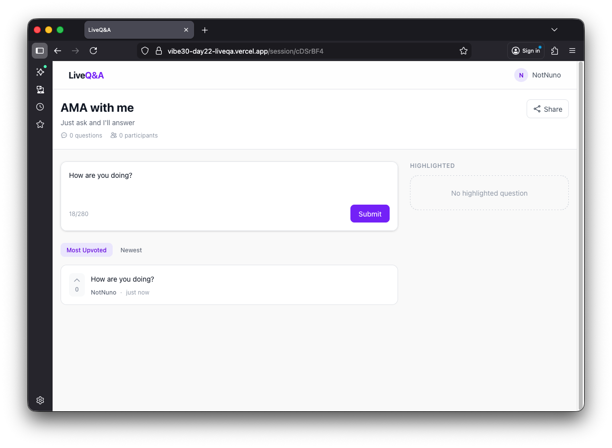
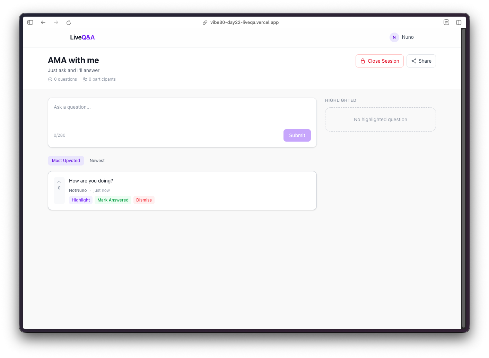
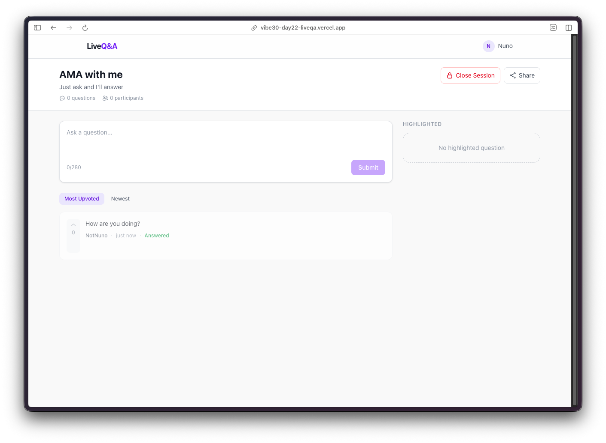
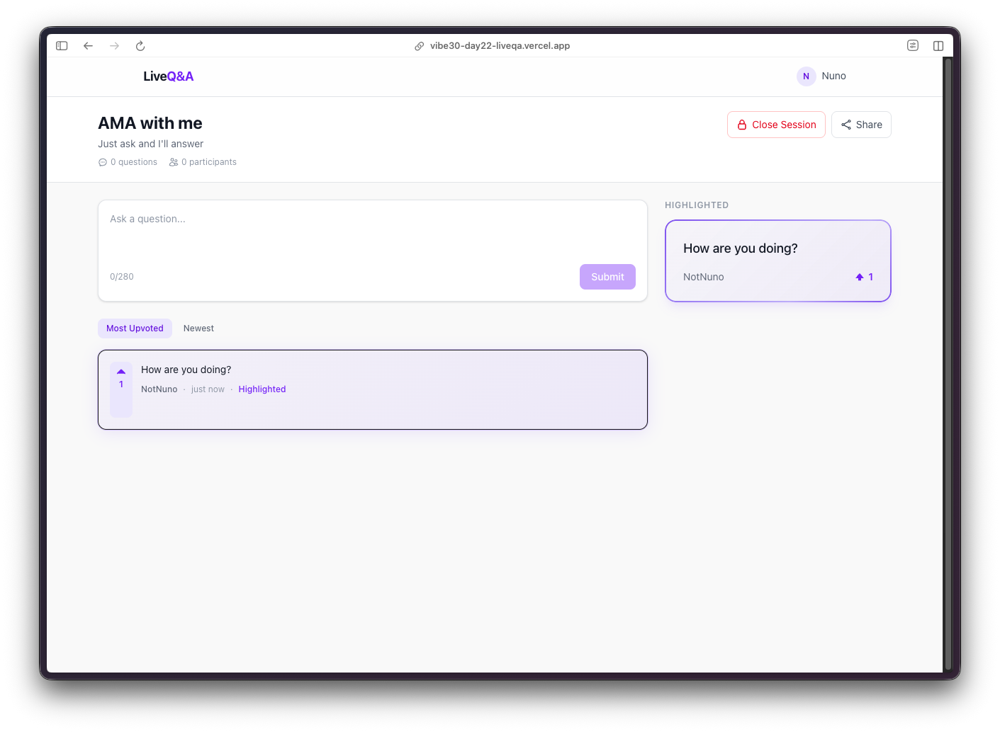

Day 22. I've been to enough events where the Q&A is a mess. People shouting over each other, the same question getting asked twice, the best questions buried under the loudest voices. Time to build something better.

## The Prompt

> "Build a live Q&A board where a host creates a session, the audience submits and upvotes questions in real-time, and the host can highlight, answer, dismiss, or close the session. Include a share modal with a QR code."

## How It Was Built

This one went through 7 [Watchfire](https://watchfire.io) tasks, building up from the database layer to the final polish:

1. **Firebase Firestore setup.** The data layer. Sessions and questions collections, anonymous auth so users can jump in without creating an account, and security rules to keep things locked down.
2. **Session creation.** A host fills in a title and description, hits create, and gets a unique session page. Simple form, nothing fancy.
3. **Question submission.** Audience members land on the session page and submit questions. 280-character limit to keep things focused. Questions appear in real-time for everyone in the session.
4. **Real-time upvoting.** One vote per user per question, enforced server-side. Vote counts update live across all connected clients. Sort by most upvoted or newest.
5. **Host controls.** The host gets extra buttons on each question: highlight, mark as answered, dismiss. Highlighted questions get promoted to a dedicated panel on the right side of the screen. The host can also close the session entirely.
6. **Share modal with QR code.** A share button opens a modal with the session link, a copy button, and a QR code generated with qrcode.react. Point your phone at the screen and you are in.
7. **UI polish.** Cleaning up the layout, refining the two-column design, making sure the highlighted question panel looks right on both desktop and mobile.



## What I Got

**Clean landing page.** Create a session or paste an existing session code to join one. Anonymous auth happens behind the scenes, so users just pick a display name and go.

**No sign-up friction.** First visit triggers a display name prompt. That is it. Firebase anonymous auth handles the rest. No emails, no passwords, no OAuth flows. For a live event tool, this is exactly right. You do not want people fumbling with account creation when the speaker just said "scan the QR code."

**Session creation is two fields.** Title and description. Hit the button and you are hosting a live Q&A. The simplicity here matters because the host is probably setting this up five minutes before their talk starts.

**The share modal does its job.** Session link with a copy button and a QR code right there. This is the workflow I was imagining: host creates the session, projects this modal on the big screen, audience scans the code, and questions start flowing in.

**Audience view stays focused.** Submit a question, see other questions, upvote the ones you want answered. The submit box is at the top, the question list below it, sorted by most upvoted by default. Everything updates in real-time through Firestore listeners.

**Host gets moderation tools.** Each question shows highlight, mark answered, and dismiss buttons. Only the host sees these. There is also a close session button in the header that locks the whole thing down. The right column shows highlighted questions, or a placeholder message if none are highlighted yet.

**Highlighting works well.** When the host highlights a question, it gets promoted to the right panel with the question text and the author's name displayed prominently. The question also gets a visual indicator in the main list so everyone can see it has been called out. On mobile, this highlighted section sits at the top of the page instead of in a side column.

## The Bug Reports

This one was surprisingly clean. The Firestore real-time listeners handled the tricky parts, so questions and votes appeared instantly without any polling or manual refresh logic. The anonymous auth flow was seamless. No bugs filed on this project.

## Try It

{{/*< github repo="nunocoracao/Vibe30-day22-liveqa" >*/}}

**[Try LiveQ&A](https://vibe30-day22-liveqa.vercel.app)**

Create a session and share the link. No account needed.

## Screenshots

## Day 22 Verdict

This is one of those projects where the real-time aspect makes or breaks it. If votes do not update instantly, if questions take a few seconds to appear, the whole thing feels broken. Firebase Firestore's real-time listeners handle that really well. You submit a question and it just appears for everyone. You upvote and the count ticks up across all screens. No WebSocket setup, no socket.io configuration, no pub/sub infrastructure. Just Firestore listeners doing their thing.

The host controls are what elevate this beyond a simple question list. Being able to highlight a question and have it show up prominently on everyone's screen turns this into an actual moderation tool. The dismiss button means the host can quietly remove off-topic or duplicate questions without making a scene.

Twenty-two days in and this is the second Firebase project this week. The pattern of anonymous auth plus Firestore listeners is proving to be a solid combo for anything that needs real-time collaboration without sign-up friction. It took 7 Watchfire tasks to go from nothing to a working live Q&A tool with moderation. Not bad for a day's work.

---

*This is day 22 of [30 Days of Vibe Coding](/series/30-days-of-vibe-coding/). Follow along as I ship 30 projects in 30 days using AI-assisted coding.*
